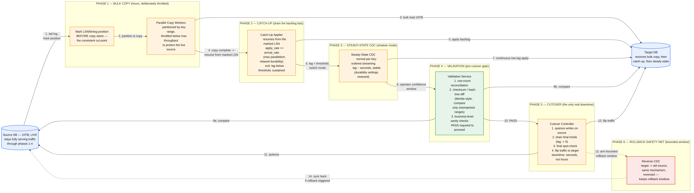

# Bulk Data Migration with Minimal Downtime — System Design

The central tension: move 10TB from a live, still-serving-production source into a new target, and make the actual customer-visible outage last seconds, not hours — by front-loading every bit of convergence work into phases that run while the source stays fully live, and leaving the downtime window sized only to "flip traffic," never to "move data." The whole design lives or dies on the handoffs between phases, not the phases themselves — get the boundary between bulk copy and catch-up wrong and you get silent data loss; get catch-up and steady-state confused and you either never converge or quietly erode durability; get the cutover trigger wrong and you either cut over unsafely or delay a safe cutover indefinitely.

This builds directly on the CDC pipeline design (log-based capture, the snapshot/streaming handoff, per-key ordering, idempotent apply) — the new problem here is a multi-hour *bulk* copy in front of it, and the operational discipline of a one-time, high-stakes cutover rather than an always-on steady state.

## Part 1 — Requirements, Capacity, and the Phase Structure

### Functional Requirements

1. Migrate a 10TB source database to a target while the source remains fully live and serving production writes throughout the copy.
2. After the bulk copy completes, drain the backlog of changes accumulated during the copy window, converging the target to near-real-time parity with the source.
3. Provide an explicit, measured signal for cutover readiness — not a fixed timer.
4. Execute cutover with a bounded, minimal downtime window: briefly quiesce the source, drain the last trickle of changes, flip application traffic to the target.
5. Provide a rollback path for a defined post-cutover window, in case an issue surfaces after traffic has already moved.
6. Validate correctness before cutover — row-level and content-level, not just "the copy job reported success."

### Non-Functional Requirements — and the framing decision stated up front

1. **Downtime is bounded by the cutover window alone, not by data volume.** This is the single decision that shapes the whole design, the same way "log-based capture, not polling" shaped the CDC pipeline: every phase before cutover exists specifically to shrink the amount of work left to do *during* the outage window down to "seconds." A design that tries to make the bulk copy itself fast enough to be "the downtime" has picked the wrong lever entirely.
2. **Source impact must be bounded and deliberate**, especially during the multi-hour bulk copy — this is a live production system, not a batch job with no other tenants.
3. **No data loss** — every write accepted by the source before the moment of cutover must land on the target.
4. **Measured, not guessed, phase transitions** — every phase boundary (copy→catch-up, catch-up→steady-state, steady-state→cutover) is gated on an observed condition (position markers, lag thresholds, validation results), never a fixed timer.
5. **Reversibility** — cutover should not be a true one-way door; a bounded rollback window converts a high-stakes, irreversible action into a bounded-risk one.

### Capacity Estimation

| Dimension | Value |
|---|---|
| Total dataset | 10TB |
| Deliberately throttled aggregate copy throughput | ~700MB/sec (chosen to protect the live source, well below theoretical max) |
| **Bulk copy duration** | 10TB / 700MB/s ≈ 14,300s ≈ **~4 hours** |
| Source change rate (large single production DB) | ~1,000 changes/sec average |
| Changes accumulated during the 4-hour copy | 1,000/s × 14,400s ≈ **~14.4M changes** |
| Target catch-up apply rate (deliberately maximized) | ~8,000 changes/sec sustained |
| Net drain rate during catch-up | 8,000 − 1,000 = **7,000/sec** (must be positive with real margin, or the backlog never shrinks) |
| **Catch-up duration to zero lag** | 14.4M / 7,000 ≈ 2,057s ≈ **~34 minutes** |
| Required source WAL/binlog retention window | copy (4h) + catch-up (~35min) + safety margin ≈ **~9–10 hours** |
| Approx. WAL volume to provision on the source | ~1,000 changes/s × ~2KB WAL bytes/change ≈ 2MB/s × 36,000s ≈ **~72GB** |
| Actual downtime window (cutover) | dominated by connection/DNS/load-balancer flip, not data movement — **~10–30 seconds** |

**The catch-up arithmetic is worth deriving explicitly, not asserting.** Catch-up only converges if apply rate exceeds arrival rate by a real margin — 8,000/sec against a 1,000/sec arrival rate gives a 7,000/sec net drain, which is what actually bounds the ~34-minute catch-up time. An apply rate too close to the arrival rate (say 1,200/sec) would technically still "work" but take an impractically long time to converge, and any transient dip below arrival rate makes the backlog grow instead of shrink — this is the same category of arithmetic as the KV store's quorum math: state the numbers, don't just assert "we'll catch up."

**The WAL/binlog retention number is a provisioning decision that has to be made *before* the migration starts, not discovered mid-flight.** This is the same hazard from the CDC pipeline design (a stuck consumer causes unbounded log growth on the source), now dramatically amplified: the "stuck consumer" here is a *planned* multi-hour bulk copy, so the retention requirement isn't a monitored edge case, it's a known, sizeable capacity request the DBA/infra team needs to provision ahead of time — ~72GB is a concrete number to hand them, not a vague "make sure retention is generous enough."


*Six phases, each existing to shrink the work left for the next. By the time cutover (Phase 5) opens, lag is already near zero — the only remaining work is draining a few seconds of trickle and flipping traffic.*

### Common First-Draft Mistakes

| # | First-draft approach | Why it fails | Fix |
|---|---|---|---|
| 1 | Copy everything, then start CDC "from now" | The cut point between copy and CDC is undefined — changes near the boundary are lost, or the entire copy must restart to fix it | Mark the LSN/binlog position *before* the copy starts, exactly as in basic CDC — but now sized for a multi-hour gap, not a momentary one |
| 2 | Run the bulk copy at maximum possible throughput | Starves the live source of I/O/CPU during business hours — a production incident before the migration even finishes | Deliberately throttle copy throughput as an explicit source-protection governor, not a performance afterthought |
| 3 | Use the same tuning/config for catch-up and steady-state | Catch-up settings left on indefinitely erode target durability guarantees; steady-state settings during catch-up may never converge | An explicit mode switch: maximize throughput (relaxed durability, more parallelism) only during the bounded catch-up phase, restore normal settings once lag clears |
| 4 | Decide cutover time on a fixed calendar timer ("migration's been running 5 hours, cut over now") | Could cut over while lag is still large, or delay a safe cutover long after it was already achievable | Gate cutover on a measured, sustained lag-below-threshold condition plus a passed validation gate — never a timer |
| 5 | Validate by comparing row counts only | Equal row counts can hide content-level corruption or divergence | Tiered validation: row counts (cheap, gross check) + checksum/hash-tree comparison (content-level) + business-level sanity checks for high-stakes tables |
| 6 | Treat cutover as a one-way door with no rollback plan | Any issue discovered after cutover becomes an unrecoverable incident | Run a bounded-window reverse CDC pipeline (target → old source) so cutover stays reversible for a defined window |

## Part 2 — API

### `POST /migrations`

```json
{
  "source": { "type": "postgres", "connectionRef": "..." },
  "target": { "type": "postgres", "connectionRef": "..." },
  "tables": ["public.orders", "public.order_items"],
  "throttle": { "maxCopyThroughputMBps": 700, "maxWorkers": 20 }
}
```

### `GET /migrations/{id}/status`

```json
{
  "phase": "catch_up",
  "sourceLsnAtCopyStart": "0/1A2B3C4",
  "bulkCopyProgressPct": 100,
  "backlogRemaining": 2_140_003,
  "lagSeconds": 41.2,
  "validationResult": null
}
```

`phase` is an explicit, first-class field with a fixed set of values (`bulk_copy | catch_up | steady_state | validating | cutover | completed | rolled_back`) — the operator driving a high-stakes migration needs to know exactly which phase is active and what its exit condition is, not infer it from raw metrics.

### `POST /migrations/{id}/validate`

Triggers the pre-cutover validation pass (Part 5, Hard Problem D); returns a per-table report of row-count and checksum comparison results. Cutover is blocked until this returns a pass.

### `POST /migrations/{id}/cutover`

Requires `validationResult: passed` and `lagSeconds` below the configured threshold, sustained across several consecutive checks (to avoid triggering on a transient dip). Executes: quiesce source writes → drain remaining lag to zero → final spot-check → flip traffic → arm the rollback window.

### `POST /migrations/{id}/rollback`

Available only within the configured post-cutover window; flips traffic back using the reverse CDC pipeline armed at cutover time (Part 5, Hard Problem E).

## Part 3 — Data Model

**Migration job record** — the durable state machine backing the API above: current phase, `sourceLsnAtCopyStart` (the position marked before bulk copy began — the single most important field in the whole record), per-table copy progress, validation results, phase transition timestamps.

**Bulk copy partition plan** — the 10TB is partitioned by key range per table, each partition assigned to one of the throttled parallel copy workers and tracked independently. A partition that fails mid-copy is retried on its own, not by restarting the entire migration — a first draft that treats the bulk copy as one atomic all-or-nothing job turns a single transient failure on 0.01% of the data into a multi-hour do-over.

**Change-event envelope** — identical to the base CDC pipeline design: `{op, before, after, source: {lsn, txId, commitTimestamp}}`. Catch-up and steady-state both consume this same stream; only the apply-side tuning differs between them (Part 5, Hard Problem B).

**Validation record** — per table: row counts (source vs. target), a hash-tree comparison result (root hash match/mismatch, and which key ranges diverged if any), and any business-level sanity check results. This is the artifact that gates the `cutover` call, not a side log nobody reads before pulling the trigger.

## Part 4 — Major Components

- **Position Marker** — records the source LSN/binlog position at the instant the bulk copy begins; every later phase's correctness depends on this being captured *before*, not during or after, the copy starts.
- **Parallel Copy Workers** — partitioned, throttled bulk-load workers; throttling is a deliberate source-protection decision, not a performance ceiling to fight against.
- **Catch-Up Applier** — a distinct, deliberately aggressive apply-mode consumer of the CDC stream from the marked position, tuned to maximize drain rate for a bounded period.
- **Steady-State CDC** — the same low-latency, per-key-ordered streaming design from the base CDC pipeline, now used as a "shadow mode" to hold near-zero lag while the operator validates and picks a cutover moment.
- **Validation Service** — tiered row-count and hash-tree comparison, gating cutover.
- **Cutover Controller** — the only component that ever touches source write availability; quiesces writes, confirms zero lag, runs a final spot-check, and flips traffic.
- **Reverse CDC (rollback safety net)** — armed at the moment of cutover, replicates target → old source for a bounded window, converting cutover from an irreversible action into a bounded-risk one.

## Part 5 — Hard Problems (the phase handoffs)

### A. Bulk copy → catch-up: the boundary has to be exact, and it's now hours wide

The mechanism is the same as basic CDC's snapshot/streaming handoff — mark the log position before copying starts, snapshot at a consistent point, resume streaming from the marked position — but the gap between "position marked" and "copy finished" is now **hours**, not seconds. Two consequences follow directly from that scale change. First, source log retention has to be sized for the *entire* copy duration as a known, provisioned capacity request (Part 1's ~72GB estimate), not treated as a monitored edge case the way it was in steady-state CDC — at 10TB/multi-hour scale, this is a planning input, not a safety net. Second, the "idempotent upsert makes overlap harmless" argument from basic CDC is still true but no longer free: if the marked position and the copy's actual consistent cut point don't precisely agree, catch-up ends up re-applying a much larger overlap window at 10TB scale, which eats directly into the catch-up phase's own throughput budget (Part 1's arithmetic) rather than being a rounding error. Precision at this boundary isn't just about correctness in the abstract — it determines how expensive Phase 2 actually is.

### B. Catch-up → steady-state: a genuine mode switch, not a relabeling

The mistake to name explicitly: treating catch-up and steady-state as the same code path with different names. Catch-up deliberately runs hotter — larger batches, more parallelism, and often relaxed durability settings on the target (e.g., delayed fsync) — because it's draining a large, bounded, one-time backlog and the resource cost is temporary and worth it. Running those same settings indefinitely in steady-state either wastes resources permanently or, worse, quietly erodes the target's durability guarantees for the rest of its life. The transition itself needs a real behavioral flip (throttle back down, restore normal durability) triggered by a measured, **sustained** lag-below-threshold condition — sustained specifically to avoid flapping the mode switch on a single transient dip in lag that immediately spikes back up.

### C. Steady-state → cutover: this is where "minimal downtime" actually gets delivered

By the time this handoff is reached, lag is already small and stable — all the heavy convergence work happened in Phases 1 and 2, while the source stayed fully live. The only work left for the actual outage window is: quiesce writes, drain the last few seconds of trickle to zero, run a final spot-check, and flip traffic. That's the entire answer to "how do you achieve minimal downtime" in one sentence: downtime is minimized by front-loading every bit of convergence work into phases that never touch write availability, leaving the outage window sized to "how long does a connection-string/DNS/load-balancer flip take," not "how long does it take to move 10TB." The decision of *when* to pull the trigger combines two independent conditions that both have to hold — a chosen low-traffic calendar window, and the measured lag/validation gate — and it should require explicit operator confirmation rather than firing automatically, given the cost of getting it wrong.

### D. Validation — proving correctness before cutover, not discovering its absence after

Row-count equality alone is a weak signal — two tables can have identical counts and divergent content. The right approach is tiered: a cheap row-count pass across every table catches gross corruption or missing partitions immediately; a checksum/hash-tree comparison — the same Merkle-tree principle from the KV store's anti-entropy design, applied here as a one-time gate instead of a continuous background process — compares hash roots per key range and only descends into ranges that actually mismatch, avoiding a full pairwise row comparison at 10TB scale; and business-level sanity checks (e.g., "sum of account balances matches source to the cent") catch the class of error that's structurally valid but semantically wrong. This tiered validation result is what the cutover API call is actually gated on — not a job-completion flag from the copy or catch-up phases, which only tell you the process ran, not that the data is correct.

### E. Rollback — making a high-stakes action bounded-risk instead of irreversible

Arming a reverse CDC pipeline (target → old source) at the moment of cutover means a problem discovered shortly afterward can be undone by flipping traffic back, with the old source already caught up to whatever happened on the new target during the interim — because it's the same mechanism already proven safe in the forward direction, just pointed the other way. This costs running a second CDC pipeline for a bounded window post-cutover, which is a small, known price for converting the single highest-stakes moment in the whole migration from "irreversible" to "reversible within a defined window" — exactly the kind of operational maturity point that separates a staff-level answer from "and then we just switch over and hope."

## Part 6 — How to Run This in the Interview

| Time | Step |
|---|---|
| 0–5 min | Clarify requirements. State the framing decision immediately: downtime is bounded by the cutover window, not data volume — every earlier phase exists to make that true. |
| 5–12 min | Capacity estimate. Derive the catch-up convergence arithmetic (apply rate vs. arrival rate) and the source log retention sizing explicitly — both are numbers to compute, not assert. |
| 12–20 min | Phase 1: bulk copy. Mark-position-before-copy, partitioned/throttled workers, and why throttling is deliberate, not a limitation to apologize for. |
| 20–28 min | Phase 2: catch-up. The mode-switch argument — why catch-up tuning must differ from steady-state, and the measured, sustained exit condition. |
| 28–36 min | Phase 4/5: validation and cutover. Tiered validation gating the cutover call; the one-sentence answer for how minimal downtime is actually achieved. |
| 36–43 min | Phase 6: rollback. The reverse-CDC safety net, and why it converts cutover into a bounded-risk action. |
| 43–45 min | Wrap-up. What's explicitly out of scope (e.g., zero-downtime schema changes on the target, cross-engine type mapping for heterogeneous migrations) and why bounding scope here is itself a signal. |

### Staff/Principal Signal Checklist

1. States the framing decision explicitly and early: minimal downtime comes from front-loading convergence work, not from making the bulk copy itself fast.
2. Derives the catch-up convergence arithmetic (apply rate must exceed arrival rate by a real margin) instead of asserting "we'll catch up."
3. Sizes source log retention as a concrete, pre-provisioned capacity number for the full copy duration, not a vague "keep retention generous."
4. Treats catch-up and steady-state as genuinely different operating modes with different tuning, gated by a measured and *sustained* exit condition — not the same process with a different label.
5. Names tiered, content-level validation (not just row counts) as the actual gate on the cutover decision.
6. Designs cutover as reversible via a bounded-window reverse pipeline, rather than presenting it as an unavoidable one-way door.

## Appendix — Mermaid Source

```mermaid
flowchart LR
    SourceDB[("Source DB — 10TB, LIVE
    stays fully serving traffic
    through phases 1-4")]
    TargetDB[("Target DB
    receives bulk copy, then
    catch-up, then steady-state")]

    subgraph PHASE1["PHASE 1 — BULK COPY (hours, deliberately throttled)"]
        direction TB
        Marker["Mark LSN/binlog position
        BEFORE copy starts —
        the consistent cut point"]
        CopyWorkers["Parallel Copy Workers
        partitioned by key range,
        throttled below max throughput
        to protect the live source"]
    end

    subgraph PHASE2["PHASE 2 — CATCH-UP (drain the backlog fast)"]
        direction TB
        CatchUpApplier["Catch-Up Applier
        resumes from the marked LSN
        apply_rate >> arrival_rate
        (max parallelism, relaxed durability)
        exit: lag below threshold, sustained"]
    end

    subgraph PHASE3["PHASE 3 — STEADY-STATE CDC (shadow mode)"]
        direction TB
        SteadyCDC["Steady-State CDC
        normal per-key-ordered streaming
        lag ~ seconds, stable
        (durability settings restored)"]
    end

    subgraph PHASE4["PHASE 4 — VALIDATION (pre-cutover gate)"]
        direction TB
        Validator["Validation Service
        1. row-count reconciliation
        2. checksum / hash-tree diff
           (Merkle-style, compare
           only mismatched ranges)
        3. business-level sanity checks
        PASS required to proceed"]
    end

    subgraph PHASE5["PHASE 5 — CUTOVER (the only real downtime)"]
        direction TB
        CutoverCtrl["Cutover Controller
        1. quiesce writes on source
        2. drain final trickle (lag -> 0)
        3. final spot-check
        4. flip traffic to target
        downtime: seconds, not hours"]
    end

    subgraph PHASE6["PHASE 6 — ROLLBACK SAFETY NET (bounded window)"]
        direction TB
        ReverseCDC["Reverse CDC
        target -> old source,
        same mechanism, reversed —
        keeps rollback lossless"]
    end

    SourceDB -- "1. tail log,
    mark position" --> Marker
    Marker -- "2. partition & copy" --> CopyWorkers
    CopyWorkers -- "3. bulk load 10TB" --> TargetDB
    CopyWorkers -- "4. copy complete ->
    resume from marked LSN" --> CatchUpApplier
    CatchUpApplier -- "5. apply backlog" --> TargetDB
    CatchUpApplier -- "6. lag < threshold,
    switch mode" --> SteadyCDC
    SteadyCDC -- "7. continuous low-lag apply" --> TargetDB
    SteadyCDC -- "8. operator confidence
    window" --> Validator
    Validator -- "9a. compare" --> SourceDB
    Validator -- "9b. compare" --> TargetDB
    Validator -- "10. PASS" --> CutoverCtrl
    CutoverCtrl -- "11. quiesce" --> SourceDB
    CutoverCtrl -- "12. flip traffic" --> TargetDB
    CutoverCtrl -. "13. arm bounded
    rollback window" .-> ReverseCDC
    ReverseCDC -. "14. sync back
    if rollback triggered" .-> SourceDB

    classDef source fill:#e8f0fe,stroke:#4285f4,stroke-width:2px,color:#1a1a1a;
    classDef service fill:#fff3e0,stroke:#f9a825,stroke-width:2px,color:#1a1a1a;
    classDef store fill:#e6f4ea,stroke:#34a853,stroke-width:2px,color:#1a1a1a;
    classDef stream fill:#fce8e6,stroke:#ea4335,stroke-width:2px,color:#1a1a1a;

    class SourceDB,TargetDB source;
    class Marker,CopyWorkers,CatchUpApplier,SteadyCDC,CutoverCtrl service;
    class Validator store;
    class ReverseCDC stream;
```


