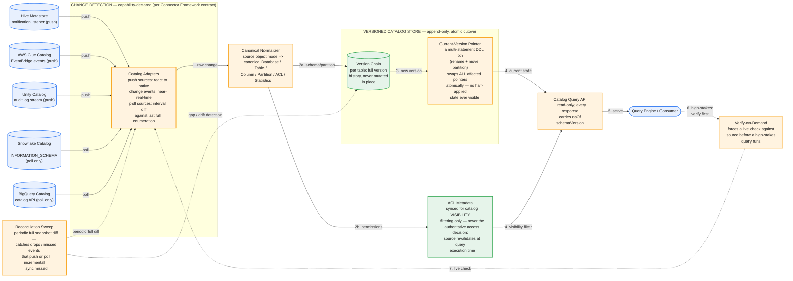

# Metadata / Catalog Sync Service — System Design

## Syncing schema, not data (Hive Metastore, Glue, Unity Catalog, Snowflake, BigQuery)

The instinct is to treat this as CDC-lite: no row data moves, so it should be simpler than every replication design that came before it. That instinct is backwards. Data replication tolerates lag — a read that's two seconds stale returns an old but *valid* row. Catalog replication does not tolerate the equivalent lag the same way: a query planner that references a column the source dropped four seconds ago doesn't get a stale-but-valid answer, it gets a hard failure, or worse, a silently wrong one if the dropped column's name got reused for something else. The absence of data movement doesn't make this easier — it removes the one thing (a continuous byte stream you can measure lag against) that made staleness legible in every prior design, while making staleness *more* costly. This design centers on two things: how you detect a catalog change when there's no data log to tail, and why the consistency bar here is tighter than anything in the CDC pipeline or bulk migration designs.

---

## Part 1: Requirements

### Functional Requirements

1. Mirror catalog structure — databases, tables, columns with types, partition keys, table properties — from five source catalog systems (Hive Metastore, AWS Glue, Unity Catalog, Snowflake, BigQuery) into one canonical, queryable catalog.
2. Mirror table and column statistics (row counts, size, last-analyzed timestamp) for query planning, held to a looser freshness bar than schema.
3. Mirror permission/ACL metadata for catalog *visibility* — who can discover that a table exists and see its shape — without making the mirror the authority for actual data access.
4. Every read from the mirrored catalog returns an explicit `asOf` timestamp and `schemaVersion`, so a consumer always knows how fresh what it's looking at is.
5. A consumer about to run an expensive or correctness-sensitive query can force a live, synchronous check against the source before proceeding.
6. Zero data movement — only structural and statistical metadata crosses the boundary; the underlying tables, files, and rows never leave the source's storage system.

### Non-Functional Requirements

1. **Freshness, not just consistency.** Target: a committed DDL change is reflected in the mirrored catalog within single-digit seconds for push-capable sources; the target for poll-only sources is bounded by their poll interval, and that bound is a visible, documented number per source type — never left implicit.
2. **Atomic visibility of multi-statement changes.** A rename-plus-partition-move must never be observable in a half-applied state — consumers see either the fully-old or fully-new shape, never an intermediate one.
3. **The mirror is never the authority for access control.** It can hide a table's existence from someone with no discovery permission; it must never be the thing a query engine trusts to decide whether a specific read is allowed.
4. **No source catalog API gets hammered.** Poll-only sources (Snowflake, BigQuery) have real rate limits; polling has to be capability-aware, not a fixed global interval applied everywhere.

**Decision stated up front:** schema and statistics are two different consistency tiers inside the same pipeline. Schema changes are versioned, append-only, and atomically cut over — because being wrong here is a hard failure. Statistics are overwritten in place on a looser cadence — because being briefly wrong here just means a query planner makes a slightly worse cost estimate, not a query that errors out.

### Capacity Estimation

| Dimension | Estimate |
|---|---|
| Source catalogs (databases) mirrored | ~5,000 |
| Total tables across all catalogs | ~500,000 (~100 tables/catalog avg) |
| Fleet-wide DDL events | ~50-100/min (vs. millions/sec of DML in the CDC pipeline design — three to four orders of magnitude less volume) |
| Partition metadata entries (heavily partitioned tables dominate) | ~5,000,000 |
| Total catalog metadata storage | ~10-15GB (schema + partition + ACL metadata; statistics excluded, refreshed not accumulated) |
| Target freshness (push sources: Glue, Unity Catalog, Hive Metastore) | < 10 seconds from commit |
| Target freshness (poll sources: Snowflake, BigQuery) | bounded by poll interval, typically 30-60 seconds |

**The number that matters:** DDL volume is ~50-100 events/minute fleet-wide — call it roughly one every second. That's a workload almost any naive design could handle on throughput alone. The entire difficulty in this system has nothing to do with volume and everything to do with the fact that each of those ~100 events/minute has to land atomically, correctly-attributed to the right source dialect, and within single-digit seconds, or a downstream query breaks in a way a customer notices immediately. This is a low-throughput, zero-tolerance-for-sloppiness problem — the opposite failure mode from every high-volume design earlier in this series.


*Push-capable sources (Hive Metastore, Glue, Unity Catalog) feed change events near-real-time; poll-only sources (Snowflake, BigQuery) are diffed on interval. Both paths converge on one canonical normalizer, and schema changes land in an append-only version chain with atomic pointer cutover — while ACL metadata explicitly stays advisory, not authoritative.*

### Common First-Draft Mistakes

| Mistake | Why it's wrong |
|---|---|
| Treating this as CDC-lite and reusing the same eventual-consistency tolerance | Schema staleness causes hard query failures, not stale-but-valid reads; the consistency bar is fundamentally tighter, not looser, than data replication |
| Polling every source on one fixed global interval | Wastes API quota on push-capable sources (Glue/Unity Catalog/HMS all support native change events) and adds needless multi-second lag where near-real-time was available for free |
| Assuming every source has the same object model | Not every source has "partitions" the same way; ACL models differ fundamentally (Unity Catalog grants vs. Glue's IAM-based resource policies) — normalizing too aggressively loses information some consumers need |
| Mutating catalog entries in place | Breaks atomic multi-statement visibility (a rename mid-flight becomes observable as neither old nor new) and destroys the ability to answer "what did this look like at query time T" for debugging |
| Mirroring permissions and treating the mirror as authoritative | Creates a second, potentially stale source of truth for a security-critical decision — a permission revoked at the source five seconds ago must not still be honored by a stale mirror |
| Incremental-only sync, no reconciliation sweep | Webhook delivery failures and listener downtime silently accumulate drift over months; nothing catches a missed drop event without a periodic full-diff safety net |

---

## Part 2: API

### Read the current catalog state

```
GET /catalogs/{catalogId}/tables/{tableId}
```

```json
{
  "tableId": "unity://main.sales.orders",
  "catalogSource": "unity-catalog",
  "schemaVersion": 7,
  "asOf": "2026-09-13T10:15:02Z",
  "columns": [
    { "name": "order_id", "type": "int64", "nullable": false },
    { "name": "status", "type": "string", "nullable": true }
  ],
  "partitionKeys": ["order_date"],
  "properties": { "format": "delta", "location": "abfss://..." },
  "statistics": {
    "rowCount": 48213092,
    "sizeBytes": 91823741029,
    "lastAnalyzed": "2026-09-13T09:40:00Z"
  },
  "acl": { "discoverable": true, "visibilityScope": "org-restricted" }
}
```

`asOf` and `schemaVersion` are not optional decoration — every consumer-facing response carries them, so a caller always knows exactly how fresh what it's looking at is, and can decide for itself whether that's good enough for what it's about to do.

### Force a live check before a high-stakes query

```
POST /catalogs/{catalogId}/tables/{tableId}/verify
```

```json
{
  "tableId": "unity://main.sales.orders",
  "mirroredSchemaVersion": 7,
  "liveSchemaVersion": 7,
  "drift": false,
  "verifiedAt": "2026-09-13T10:15:41Z"
}
```

This is the escape hatch for the case the freshness SLA doesn't cover: a caller about to run a job expensive or consequential enough that even a 10-second staleness window is unacceptable pays the cost of one synchronous source round-trip to know for certain.

### Subscribe to schema changes

```
POST /catalogs/{catalogId}/tables/{tableId}/subscribe
{ "webhookUrl": "https://consumer.example.com/hooks/catalog-change" }
```

Delivers the same versioned event the internal pipeline produces — consumers who want push notification of catalog drift don't have to poll the read API themselves.

### Adapter capability declaration (internal, per source type)

```json
{
  "catalogSourceType": "snowflake",
  "supportsPushNotifications": false,
  "supportsPartitionLevelStats": true,
  "supportsColumnLevelACL": false,
  "maxPollRate": "1 req / 5 sec per catalog",
  "reconciliationSweepRequired": true
}
```

This is the same capability-declarative pattern as the connector framework's `Capabilities` object, applied here to catalog behavior instead of data-extraction behavior — a source that can't push has to be diffed, and every downstream freshness guarantee for that source is honest about being poll-bounded rather than pretending otherwise.

---

## Part 3: Data Model

### Catalog version entry (append-only)

```
versionId (PK)
tableId
schemaVersionNumber
columns[] (name, type, nullable, ordinalPosition)
partitionKeys[]
properties{}
sourceCommitTimestamp
capturedAt
supersedes (versionId of the prior version, or null)
```

Never mutated. A new structural change is a new row, never an edit to an existing one — the same append-only, never-destructively-mutated principle used for the schema registry in the CDC/schema-evolution design and the manifest structure in the KV store design, now applied to whole-table catalog snapshots instead of individual columns.

### Current-version pointer

```
tableId (PK)
currentVersionId (FK -> catalog version entry)
lastCutoverAt
```

**Load-bearing decision:** a multi-statement DDL transaction (rename a table and move a partition in the same source transaction) produces multiple new version entries, but the pointer swap for every affected table happens as one atomic write. A consumer reading between the old commit and the new one sees either all-old or all-new pointers — never a state where the rename succeeded but the partition move hasn't landed yet. This is the single mechanism that makes "atomic visibility of multi-statement changes" (NFR #2) true rather than aspirational.

### Statistics entry (separate tier, mutable)

```
tableId (PK)
rowCount
sizeBytes
lastAnalyzed
```

Overwritten in place, no version history. Statistics don't need append-only treatment because being briefly stale here degrades a query plan, not the correctness of a query result — this is a deliberately different consistency tier from the schema entries above it, living in the same pipeline.

### ACL metadata entry

```
tableId (PK)
discoverable (bool)
visibilityScope (enum)
lastSyncedFromSource
```

Explicitly labeled advisory. This table answers "should this table's existence and shape be visible in the mirrored catalog at all" — it never answers "is this specific query, from this specific principal, allowed to read this data." That second question is always deferred to the source system or the executing query engine at the moment the query actually runs.

---

## Part 4: Major Components

**Catalog Adapters.** One per source type, each declaring its own capability object. Hive Metastore, Glue, and Unity Catalog all expose native change notification (a Thrift-based notification listener, EventBridge events, and an audit log stream respectively) and adapters for those sources react to events near-real-time. Snowflake and BigQuery expose no catalog-level push primitive — their adapters poll `INFORMATION_SCHEMA`/the catalog API on an interval and diff against the last full enumeration, which is also how they detect drops (a table that no longer appears in the enumeration is inferred dropped, the same inference problem the connector framework's poll-based data connectors face, just applied to catalog objects instead of rows).

**Canonical Normalizer.** Maps every source's native catalog object model into one shared shape — Database, Table, Column, Partition, ACL, Statistics. Deliberately does *not* over-normalize: Unity Catalog's grant model and Glue's IAM-resource-policy model are different enough in kind that flattening them into one generic "permission" concept would lose information some consumers need, so the canonical ACL entry captures visibility (a normalizable concept) and leaves enforcement detail to the source.

**Versioned Catalog Store.** Holds the append-only version chain and the current-version pointers. The only place multi-statement atomicity is implemented — one write, many pointers, all-or-nothing.

**Reconciliation Sweep.** A periodic full-catalog enumeration and diff against the versioned store's current state, for every source regardless of push/poll capability — because push delivery can fail silently (a dropped webhook, a listener that was down for ten minutes) in ways that leave no local signal that anything was missed. This is the same anti-entropy role Merkle-tree comparison plays in the KV store design and the pre-cutover validation gate plays in the bulk migration design: a slower, exhaustive backstop underneath a fast, incremental primary path.

**Catalog Query API / Subscription API.** Read-only. Every response is versioned and timestamped; the subscription path exists so consumers don't have to poll a read API to learn about changes they specifically care about.

---

## Part 5: Hard Problems

### 1. Detecting a change with no log to tail

Data replication has a canonical answer to "how do I know something changed": tail the write-ahead log. Catalog metadata mostly doesn't have an equivalent universal primitive. Hive Metastore has a Thrift-based notification listener that fires on DDL operations. AWS Glue emits EventBridge events on catalog mutations. Unity Catalog exposes an audit log stream that includes schema-changing operations. Snowflake and BigQuery expose neither — the only way to know a table's schema changed is to ask the catalog API what the schema is right now and compare it to what you saw last time.

The design doesn't pretend these are the same mechanism wearing different clothes. Each adapter declares, honestly, whether it's push- or poll-based, and every freshness guarantee downstream is conditioned on that declaration — a push-capable source gets a single-digit-second SLA because it's structurally possible; a poll-only source gets an SLA bounded by its poll interval because pretending otherwise would be a guarantee the system can't keep. This is the same capability-declarative principle as the connector framework, applied one layer up the stack — this time to whether change *detection itself* is push or pull, not just extraction rate.

### 2. Why catalog staleness is a harder problem than data staleness, not an easier one

The entire framing mistake a first draft makes is assuming "no data moves" implies "lower stakes." It's the opposite. A stale row in a data-replication pipeline is still a row — a query against it returns an old-but-internally-consistent answer, and most consumers of eventually-consistent replicas are built to tolerate that. A stale *schema* isn't a stale answer, it's frequently no answer at all: a query planner that references a column dropped ten seconds ago fails immediately, visibly, and often expensively if the query had already started scanning terabytes before hitting the missing-column error. Worse, some staleness failure modes aren't visible at all — if a dropped column's name gets reused by a new column of a different type in the same source transaction window, a stale mirror doesn't error, it silently returns type-mismatched results.

This is why the freshness SLA here (single-digit seconds for push sources) is tighter than the "eventually consistent, seconds-to-minutes is fine" tolerance baked into the CDC pipeline and bulk migration designs earlier in this series, and why the verify-on-demand escape hatch exists at all: for the subset of queries expensive or consequential enough that even that tight SLA isn't good enough, the system offers a synchronous, source-of-truth check rather than asking the caller to simply trust the mirror.

### 3. Atomic visibility of multi-statement DDL

A single source transaction can rename a table and move one of its partitions in the same commit. If the mirror applies these as two independent, sequential updates, there's a window — however short — where a consumer reading the mirror sees the new table name but the old partition layout, a combination that never existed at the source and that no query plan was built to expect. The fix is structural, not a smaller polling interval: every table's "current state" is a pointer, not a value, and a multi-statement source transaction produces new version entries for every affected table but flips all of their pointers in a single atomic write. There is no instant in time where a reader can observe partial application, because partial application was never given a chance to become visible — the old pointers and the new pointers are the only two states that exist, and there's no path between them that passes through anything else.

### 4. Detecting drops when the only signal is absence

For push-capable sources, a drop is an explicit event — Hive Metastore's notification listener fires a `DROP_TABLE` event, Glue emits a corresponding EventBridge event. For poll-only sources, there is no drop event at all; the only signal is that a table which appeared in the last enumeration doesn't appear in this one. That's a weaker signal than it looks — a transient API error, a partial page in a paginated catalog listing, or a permissions change on the polling credential can all produce the same "it's not in this response" symptom as an actual drop, and treating every disappearance as an authoritative delete risks marking a table dropped because of a blip.

The design handles this with a confirm-on-next-poll rule for poll-based sources specifically: a table missing from one enumeration is marked tentatively-dropped, not dropped, and only promoted to an actual drop event if it's still missing on the subsequent poll. This trades a small amount of additional latency on true drops (one extra poll interval) for eliminating false-positive drops caused by transient enumeration gaps — an acceptable trade given that a false drop (a table a consumer relies on suddenly reported as gone) is a far more disruptive failure than a slightly delayed true one.

### 5. ACL metadata: sync for visibility, never for enforcement

Mirroring a table's schema is close to harmless if it's wrong for a few seconds. Mirroring permission metadata and treating it as authoritative is not — a permission revoked at the source (an employee offboarded, a compromised credential rotated out) that the mirror hasn't caught up on yet becomes a live security gap the moment any consumer trusts the mirror's ACL entry as the actual access decision. The design draws a hard line: the mirrored `acl` entry answers exactly one question — should this table's existence and shape be visible in catalog search and discovery — and answers nothing else. The moment a query actually needs to read data, the engine executing it is required to check against the source (or the source's live permission system) directly; the mirror is never consulted as the final word.

This does mean the mirror can be *more* restrictive than reality for a brief window (a newly granted permission takes a few seconds to propagate into "discoverable") but never *less* restrictive in a way that grants access — asymmetric staleness tolerance, deliberately, because the failure directions aren't equally bad: a table briefly missing from search results is an inconvenience, and a table briefly visible to someone who shouldn't see even its existence is not.

### 6. Two consistency tiers in one pipeline

Schema and statistics flow through the same adapters and the same normalizer, but land in structurally different stores with different guarantees — schema in the append-only, atomically-cut-over version chain; statistics overwritten in place with no version history and a looser refresh cadence. Building one uniform consistency model for both would either over-engineer statistics sync (versioning row-count history nobody needs) or under-engineer schema sync (accepting the kind of brief inconsistency that's fine for a cost estimate but not for a column reference). Recognizing that these are two different correctness problems wearing the same pipeline is what keeps the system from solving the wrong one twice.

---

## Part 6: Interview Execution

### Timed run-through (40 min)

| Time | What to cover |
|---|---|
| 0-5 min | Lead with the reframe: "no data moves" doesn't mean "lower stakes" — it inverts the staleness tolerance versus every prior data-replication design. State that before anything else. |
| 5-12 min | Requirements + capacity table. Emphasize the low-throughput/zero-tolerance framing (~1 DDL event/sec fleet-wide, but each one has a hard single-digit-second SLA) — this is a different shape of hard problem than the earlier high-volume designs. |
| 12-20 min | Change detection: push vs. poll per source, and why pretending they're the same primitive is the first-draft mistake. Reference the connector framework's capability-declarative pattern explicitly if this is a follow-up round. |
| 20-30 min | Atomic multi-statement visibility (hard problem #3) — walk the pointer-swap mechanism concretely with the rename+partition-move example. This is usually the deepest follow-up an interviewer goes on. |
| 30-36 min | ACL sync-for-visibility-not-enforcement (#5) — the asymmetric staleness tolerance (safe to be too restrictive, never safe to be too permissive) is a strong, non-obvious point to make unprompted. |
| 36-40 min | Reconciliation sweep and the confirm-on-next-poll drop rule — the safety-net pattern reused from the KV store's Merkle-tree anti-entropy and the bulk migration's pre-cutover validation gate. |

### Staff/Principal Signal Checklist

1. Opens by inverting the "no data movement = simpler" assumption — names the tighter staleness tolerance as the actual crux before being asked.
2. Treats schema and statistics as two distinct consistency tiers deliberately, not as an oversight to be unified later.
3. Explains the atomic pointer-swap mechanism precisely enough to show why partial multi-statement visibility is structurally impossible, not just unlikely.
4. States the ACL asymmetry explicitly: safe to be too restrictive, never safe to be too permissive — and never lets the mirror become an access-control authority.
5. Distinguishes push-capable from poll-only sources honestly in the freshness SLA, rather than promising one number across a fleet that can't uniformly deliver it.
6. Reuses and names prior mechanisms (capability-declarative adapters, append-only version chains, anti-entropy reconciliation sweeps) explicitly as cross-design patterns rather than re-deriving each from scratch.

---

## Appendix: Mermaid Source


