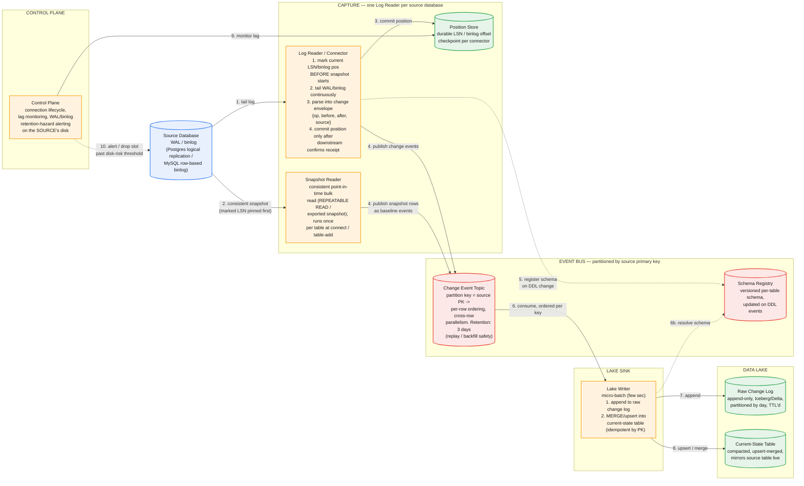

# Change Data Capture Pipeline — System Design

The central tension: replicate a source OLTP database into a data lake with single-digit-second latency, without adding meaningful load to the production system you're reading from, and without ever losing or duplicating a change even when the connector, the message bus, or the lake sink crashes independently. Every hard decision below traces back to one foundational choice: capture changes by tailing the database's own write-ahead log, never by polling tables — get that wrong and every downstream guarantee (completeness, ordering, low source impact) becomes unreachable, not just harder.

This is worth taking seriously as a category, not just a problem: if the company asking is a CDC/replication product itself (Fivetran, Debezium/Confluent, Estuary, Airbyte, Qlik Replicate, AWS DMS, Striim, and similar all live here), this is literally their product surface — expect the interviewer to push past the textbook answer into the specific failure modes below, because they've debugged all of them in production.

## Part 1 — Requirements, Capacity, and the Core Decision

### Functional Requirements

1. Capture every insert/update/delete on source tables, in commit order, without querying the source tables directly on a polling interval.
2. Deliver an initial full snapshot of existing data, then transition to streaming changes, with no gap and no permanent duplication at the handoff point.
3. Land data in the lake in a queryable format reflecting current source state (upserts/deletes applied) — not only a raw change log, though the raw log is retained too for replay/audit.
4. Handle source schema evolution (added/dropped/renamed columns, type changes) without breaking the pipeline.
5. Effectively-once delivery into the lake — no duplicate rows, no lost changes, even across connector restarts.
6. Multi-table, multi-database support at product scale — thousands of independent pipelines, not one bespoke pipeline per customer.

### Non-Functional Requirements — and the decision stated up front

1. **Log-based capture, not polling.** This is the single decision that shapes everything else, the same way "AP over CP" shaped the KV store design. Reading the database's WAL/binlog instead of querying tables on an interval is what makes near-real-time latency, delete visibility, and low source impact simultaneously possible — a candidate who reaches for polling first hasn't picked a design, they've picked the thing that fails on all three.
2. **Near-real-time latency.** End-to-end lag from a committed source transaction to it being queryable in the lake: single-digit to low tens of seconds, not the hour-plus latency of batch ETL.
3. **Minimal source impact.** The pipeline must not compete with production traffic on the source database for meaningful read capacity.
4. **Per-key ordering.** Changes to a given row must apply downstream in commit order; out-of-order application of an update and a delete for the same row corrupts the materialized result.
5. **Fault tolerance with durable resumability.** Any component (connector, bus, sink) can crash and resume from a durable checkpoint with no data loss.
6. **Backpressure handling with a hard failure mode named explicitly.** If the pipeline falls behind, the source database's own retained log grows — and if that's not bounded and monitored, it becomes a disk-fill risk on the *customer's* production system, not just a pipeline problem.

### Capacity Estimation

| Dimension | Value |
|---|---|
| Active pipelines (tenants) | 5,000, each replicating one source database |
| Avg change rate per source DB | 100/sec blended (heavy skew: top ~1% of tenants dominate volume) |
| Fleet-wide average change rate | ~500K changes/sec |
| Fleet-wide peak change rate | ~2M changes/sec |
| Avg change-event size (before/after image + metadata) | ~1KB |
| Fleet-wide average ingest throughput | 500K/sec × 1KB ≈ 500MB/sec ≈ **~43TB/day raw change volume** |
| Event-bus retention (replay/backfill safety window) | 3 days |
| Event-bus storage before replication | 43TB × 3 ≈ ~130TB |
| Event-bus storage with replication factor 3 | **~390TB** |
| Connector processes needed | **~5,000 minimum — one per source database** |

**The number that matters here isn't raw change volume — it's source-database count.** A single database's WAL or binlog is one ordered, inherently serial stream; you cannot parallelize reading it without extra machinery, because the log's own ordering guarantee *is* the ordering guarantee the whole pipeline depends on. So connector count scales 1:1 with the number of source databases onboarded, not with total fleet throughput — a fleet-wide spike in change volume doesn't need more connectors, it needs the *existing* connectors and the downstream bus/sink to handle more volume per source. This is the same shape of insight as the KV store's "throughput drives node count, not storage" — the naive sizing dimension (aggregate volume) isn't the one that actually constrains the architecture (per-source serialization).


*One Log Reader tails each source database's WAL/binlog; a Snapshot Reader handles the initial bulk load, coordinated on log position to avoid a gap. Both publish into a primary-key-partitioned event bus, which a Lake Writer consumes to append the raw change log and upsert the current-state table. The Control Plane watches replication lag and the source's own log-retention disk risk.*

### Common First-Draft Mistakes

| # | First-draft approach | Why it fails | Fix |
|---|---|---|---|
| 1 | Poll the source table (`WHERE updated_at > last_poll`) | Misses hard deletes entirely; misses intermediate states between polls; adds continuous competing read load to production | Tail the database's own WAL/binlog — the same mechanism it already uses for standby replication |
| 2 | Snapshot first, then start streaming "from now" | A race: changes committed during the snapshot can be silently missed | Mark the log position *before* the snapshot starts, snapshot at a consistent point, stream from the marked position — overlap is resolved by idempotent upsert, not avoided by timing luck |
| 3 | Claim "exactly-once" delivery across connector → bus → sink | True exactly-once across three independently-failing systems isn't achievable without distributed transactions across all three | Idempotent, position-tracked writes at each hop — effectively-once via at-least-once delivery plus idempotent apply |
| 4 | Treat backpressure purely as an internal buffering problem | If the connector falls behind, the source DB retains WAL/binlog it hasn't consumed — that's disk on the *customer's* production system filling up | Monitor replication slot/binlog lag explicitly; alert well before disk risk; drop the slot and force a re-snapshot past a hard threshold rather than risk the customer's outage |
| 5 | Global ordering across all rows/tables | Forces an effectively single-threaded write path — can't remotely keep up with real change rates | Partition the event bus and sink by source primary key: per-row ordering guaranteed, cross-row parallelism unlocked |
| 6 | No plan for source schema changes (column added/dropped/type changed) | Connector or sink breaks the moment the source schema drifts, which happens constantly in a live production database | Versioned schema registry, updated from DDL events the log stream itself emits |

## Part 2 — API

### `POST /connections`

```json
{
  "sourceType": "postgres",
  "connectionConfig": { "host": "...", "port": 5432, "database": "orders", "credentialsRef": "vault://..." },
  "tables": ["public.orders", "public.order_items"],
  "destination": { "lakeFormat": "iceberg", "path": "s3://lake/orders/" },
  "snapshotMode": "initial"
}
```

### `GET /connections/{id}/status`

```json
{
  "state": "streaming",
  "lastCommittedLSN": "0/1A2B3C4",
  "replicationLagSeconds": 4.2,
  "rowsSnapshotted": 128_403_112,
  "errorDetail": null
}
```

`replicationLagSeconds` and `lastCommittedLSN` are exposed as headline status fields, not buried diagnostics — a CDC product's customers care about lag more than almost anything else it reports, and a first draft that treats this as an internal metric rather than a first-class API field has misjudged what the product actually sells.

### `PUT /connections/{id}/tables` — add or remove tables from a live connection

Adding a table to an already-streaming connection must trigger a **scoped** re-snapshot of only that table, coordinated with the log position exactly as in the initial bootstrap (Part 3) — not a full-database re-snapshot. A first draft that re-snapshots everything on every table addition wastes enormous source-side resources and re-imposes load on a system that's already been running cleanly.

### `POST /connections/{id}/pause` / `/resume`

### Internal wire format — the change-event envelope

```json
{
  "op": "u",
  "before": { "id": 42, "status": "pending" },
  "after":  { "id": 42, "status": "shipped" },
  "source": { "db": "orders", "table": "orders", "lsn": "0/1A2B3C4", "txId": 88213, "commitTimestamp": "2026-09-13T14:02:11.402Z" },
  "ts_ms": 1757775731402
}
```

This mirrors Debezium's actual event envelope — worth naming as prior art rather than inventing an equivalent shape from scratch. `op` is one of create/update/delete/read-snapshot; `before`/`after` let downstream consumers reconstruct exactly what changed, not just the new state.

## Part 3 — Data Model

**Log-based capture, mechanically.** Postgres exposes logical replication via a replication slot and a logical decoding plugin (`pgoutput`); MySQL exposes a row-based binlog readable via a protocol client that presents itself as a replica. Either way, the connector is tailing a stream the database *already writes for its own durability and replication purposes* — this is why it adds near-zero incremental query load to the source, unlike any polling approach.

**Replication slot / log retention — the hazard baked into the durability guarantee.** A Postgres replication slot causes the database to retain WAL segments until the connector's slot confirms it has consumed them. This is exactly the mechanism that makes "the connector can resume with zero data loss after any outage" true — and exactly the mechanism that turns a stuck or slow connector into unbounded WAL growth on the *source's* disk. There is no way to get the durability guarantee without also taking on this hazard; the correct response is monitoring and a hard cutoff (Part 5, Hard Problem 4), not avoiding replication slots.

**The snapshot/streaming handoff, in the order that makes it correct:**

1. **Mark the current LSN** (or binlog position) — this pins a point the source guarantees to retain from, before anything else happens.
2. **Take the snapshot** at a consistent point-in-time (a `REPEATABLE READ` transaction, or Postgres's exported-snapshot mechanism) — this gives a frozen, self-consistent view of the table as of a specific instant.
3. **Begin streaming from the LSN marked in step 1**, not from "now."

Any change that committed *during* the snapshot gets replayed by the streaming phase and naturally overwrites the snapshotted row via idempotent upsert-by-primary-key — a brief, harmless re-application, never a gap. Reverse the order of these three steps — snapshot first, mark position after — and a change committed in between is silently missed with no mechanism to ever recover it.

**Sink data model — two layers, not one**, matching the requirement to expose both history and current state:

- **Raw change log** — append-only, partitioned by day, one row per captured change event, retained on a TTL (matches the event-bus retention window, or longer for audit). Never mutated once written.
- **Current-state table** — continuously upserted via `MERGE INTO` keyed by source primary key, periodically compacted, mirrors the live source table.

This is structurally the same split as the document-version-history design's block-store-vs-manifest separation: the append-only layer is the durable source of truth, and the derived, mutable layer is a rebuildable projection over it — if the current-state table were ever corrupted, it can be fully rebuilt by replaying the raw change log from the beginning.

**Partitioning for ordered parallelism.** The event bus (and the sink's write path) is partitioned by source primary key. All changes to the same row land in the same partition and are therefore processed in commit order relative to each other; changes to different rows land in different partitions and process fully in parallel. This is what makes per-key ordering (a hard requirement) compatible with real throughput (also a hard requirement) — global ordering would sacrifice the second to get the first for free, which nothing in the requirements actually needs.

## Part 4 — Major Components

- **Log Reader / Connector** — one per source database; tails the native WAL/binlog, parses into the canonical change-event envelope, durably commits its log position only after downstream confirms receipt.
- **Snapshot Reader** — performs the initial (or table-scoped) consistent bulk load, coordinated with the Log Reader's position-marking to close the handoff race.
- **Event Bus** — durable, primary-key-partitioned buffer between capture and the lake sink; absorbs backpressure and lets source-side and sink-side components restart independently without either blocking the other.
- **Schema Registry** — versioned per-table schema, updated whenever the connector observes a DDL event in the log stream (both Postgres and MySQL emit DDL changes into their logical/binlog streams, not just DML).
- **Lake Writer** — consumes the event bus, appends to the raw change log, and performs a micro-batched (every few seconds) idempotent `MERGE`/upsert into the current-state table.
- **Position Store** — durable checkpoint of source LSN consumed, bus offset committed, and lake write watermark — the mechanism that makes crash-and-resume-without-loss-or-duplication possible.
- **Control Plane** — connection lifecycle (create/pause/resume/add-table), lag monitoring, and the WAL/binlog retention-hazard alerting that protects the *customer's* source database, not just this pipeline's own health.

## Part 5 — Hard Problems

### 1. Log-based capture instead of polling — the mechanics and why each polling failure mode is fundamental, not incidental

Polling `WHERE updated_at > last_poll` fails in three distinct ways, not one: hard deletes leave no row to find, so they're invisible entirely; two updates to the same row between polls collapse into one observed state, silently losing intermediate history if anything downstream needed it; and the poll query itself is continuous competing load against the production workload the source database exists to serve. Reading the WAL/binlog fixes all three simultaneously because it isn't querying the table at all — it's tailing a durability log the database already maintains, on which deletes are explicit entries, every intermediate state is a distinct log record, and the added cost is the cost of an extra replication client (the same mechanism used for standby replicas, which databases are built to serve cheaply).

### 2. The snapshot/streaming handoff race, and why the specific ordering is load-bearing

Detailed mechanically in Part 3. The interview-worthy point: getting the order of "mark position" and "take snapshot" backwards doesn't produce a slower or uglier pipeline — it produces one with a silent, permanent data-loss window with no mechanism to detect or recover from it, because nothing downstream ever receives the missed change or an error indicating it was missed. This is a correctness bug, not a performance one, and it's exactly the kind of subtlety a product built around this problem will probe directly.

### 3. What "effectively-once" actually means across three independently-failing systems

True exactly-once delivery across a source log, a message bus, and a lake sink would require a distributed transaction spanning all three — not practically achievable at this throughput. What's actually built: idempotent, position-tracked writes at every hop. The connector never advances its committed position past what downstream has durably accepted. The lake sink's upsert is idempotent by primary key, so replaying the same change event after a crash-and-resume — which *will* happen, because the honest guarantee between hops is at-least-once, not exactly-once — produces the identical end state rather than a duplicate row. Stating this precisely (effectively-once via idempotent replay of at-least-once delivery, not literal single delivery) is what separates someone who has actually operated one of these pipelines from someone repeating "exactly-once" as an unexamined term.

### 4. The source-side retention hazard — a failure mode on someone else's system

If the connector falls behind or goes down, the source database retains WAL/binlog segments the connector hasn't consumed — that retention is precisely what makes zero-data-loss resumption possible. But retained log is disk consumption on the *customer's production database*, and if it fills their disk, the CDC pipeline has caused an outage on a system it doesn't own, which is a categorically worse failure than losing its own data. The design has to treat this as a monitored, alertable threshold with a deliberate, ugly fallback: past a hard limit, drop the replication slot — sacrificing continuity and forcing a full re-snapshot — rather than let the source's disk fill. A design that only reasons about "what happens if my pipeline loses data" and never reasons about "what happens to the system I'm reading from if I fall behind" is missing half of this problem's actual failure surface.

### 5. Per-key ordering vs. global ordering — the same principle as quorum reads and atomic rate-limit checks, applied here

Global total ordering across every row in every table would serialize the entire write path — it cannot keep pace with real change rates, full stop. The fix is recognizing that correctness only requires ordering *per key*: partitioning the event bus and the sink's write path by source primary key guarantees changes to the same row are applied in commit order while changes to different rows proceed fully in parallel. Partitioning by anything else — arrival time, round-robin, a hash that doesn't align with the primary key — silently breaks per-row ordering under concurrent updates to the same row, producing a materialized table that can end up "resurrected" (a delete arriving before the update it should have followed) with no error raised anywhere.

## Part 6 — How to Run This in the Interview

| Time | Step |
|---|---|
| 0–5 min | Clarify requirements. State log-based capture as the foundational decision immediately — don't let "how do we detect changes" stay unresolved past the first few minutes. |
| 5–10 min | Capacity estimate. Show that connector count is bound by source-database count, not aggregate change volume — name this as the non-obvious constraint. |
| 10–18 min | API. Connection lifecycle, and the change-event envelope as the core data contract — cite Debezium's envelope shape as prior art. |
| 18–28 min | Data model. The snapshot/streaming handoff ordering, in the correct sequence, and why reversing it causes silent data loss, not just a race "in theory." |
| 28–36 min | Delivery guarantees. State "effectively-once via idempotent replay" precisely — don't let "exactly-once" stand unexamined. |
| 36–43 min | Failure handling. The source-side WAL/binlog retention hazard as a risk to the customer's system; per-key partitioning for ordered parallelism. |
| 43–45 min | Wrap-up. What's out of scope for v1 (e.g., cross-database transactional consistency, complex DDL like column type narrowing) and why — schema evolution handling alone is a deep enough problem to bound explicitly rather than hand-wave. |

### Staff/Principal Signal Checklist

1. States log-based capture as the foundational decision early, and explains why polling fails on three distinct axes (deletes, intermediate states, source load) — not just "it's less efficient."
2. Gets the snapshot/streaming handoff ordering right (mark position → snapshot → stream) and explains why the order itself is what prevents silent data loss.
3. States the actual achievable delivery guarantee precisely — effectively-once via idempotent replay of at-least-once delivery — rather than asserting "exactly-once" as an unexamined term.
4. Names the source-side WAL/binlog retention hazard as a risk to the customer's production system, not only an internal pipeline concern.
5. Separates per-key ordering (required, and cheap to guarantee via partitioning) from global ordering (unnecessary, and a throughput killer) and uses that distinction to justify the partitioning scheme.
6. Identifies that connector count scales with source-database count, not aggregate change volume, because a single WAL/binlog stream is inherently serial per source.

## Appendix — Mermaid Source


