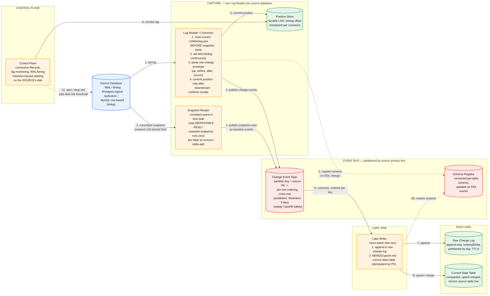
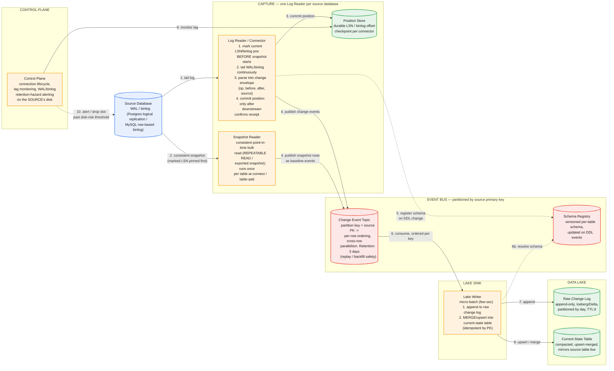

# Change Data Capture Pipeline — System Design

The central tension: replicate a source OLTP database into a data lake with single-digit-second latency, without adding meaningful load to the production system you're reading from, and without ever losing or duplicating a change even when the connector, the message bus, or the lake sink crashes independently. Every hard decision below traces back to one foundational choice: capture changes by tailing the database's own write-ahead log, never by polling tables — get that wrong and every downstream guarantee (completeness, ordering, low source impact) becomes unreachable, not just harder.

This is worth taking seriously as a category, not just a problem: if the company asking is a CDC/replication product itself (Fivetran, Debezium/Confluent, Estuary, Airbyte, Qlik Replicate, AWS DMS, Striim, and similar all live here), this is literally their product surface — expect the interviewer to push past the textbook answer into the specific failure modes below, because they've debugged all of them in production.

## Part 1 — Requirements, Capacity, and the Core Decision

### Functional Requirements

1. Capture every insert/update/delete on source tables, in commit order, without querying the source tables directly on a polling interval.
2. Deliver an initial full snapshot of existing data, then transition to streaming changes, with no gap and no permanent duplication at the handoff point.
3. Land data in the lake in a queryable format reflecting current source state (upserts/deletes applied) — not only a raw change log, though the raw log is retained too for replay/audit.
4. Handle source schema evolution (added/dropped/renamed columns, type changes) without breaking the pipeline.
5. Effectively-once delivery into the lake — no duplicate rows, no lost changes, even across connector restarts.
6. Multi-table, multi-database support at product scale — thousands of independent pipelines, not one bespoke pipeline per customer.

### Non-Functional Requirements — and the decision stated up front

1. **Log-based capture, not polling.** This is the single decision that shapes everything else, the same way "AP over CP" shaped the KV store design. Reading the database's WAL/binlog instead of querying tables on an interval is what makes near-real-time latency, delete visibility, and low source impact simultaneously possible — a candidate who reaches for polling first hasn't picked a design, they've picked the thing that fails on all three.
2. **Near-real-time latency.** End-to-end lag from a committed source transaction to it being queryable in the lake: single-digit to low tens of seconds, not the hour-plus latency of batch ETL.
3. **Minimal source impact.** The pipeline must not compete with production traffic on the source database for meaningful read capacity.
4. **Per-key ordering.** Changes to a given row must apply downstream in commit order; out-of-order application of an update and a delete for the same row corrupts the materialized result.
5. **Fault tolerance with durable resumability.** Any component (connector, bus, sink) can crash and resume from a durable checkpoint with no data loss.
6. **Backpressure handling with a hard failure mode named explicitly.** If the pipeline falls behind, the source database's own retained log grows — and if that's not bounded and monitored, it becomes a disk-fill risk on the *customer's* production system, not just a pipeline problem.

### Capacity Estimation

| Dimension | Value |
|---|---|
| Active pipelines (tenants) | 5,000, each replicating one source database |
| Avg change rate per source DB | 100/sec blended (heavy skew: top ~1% of tenants dominate volume) |
| Fleet-wide average change rate | ~500K changes/sec |
| Fleet-wide peak change rate | ~2M changes/sec |
| Avg change-event size (before/after image + metadata) | ~1KB |
| Fleet-wide average ingest throughput | 500K/sec × 1KB ≈ 500MB/sec ≈ **~43TB/day raw change volume** |
| Event-bus retention (replay/backfill safety window) | 3 days |
| Event-bus storage before replication | 43TB × 3 ≈ ~130TB |
| Event-bus storage with replication factor 3 | **~390TB** |
| Connector processes needed | **~5,000 minimum — one per source database** |

**The number that matters here isn't raw change volume — it's source-database count.** A single database's WAL or binlog is one ordered, inherently serial stream; you cannot parallelize reading it without extra machinery, because the log's own ordering guarantee *is* the ordering guarantee the whole pipeline depends on. So connector count scales 1:1 with the number of source databases onboarded, not with total fleet throughput — a fleet-wide spike in change volume doesn't need more connectors, it needs the *existing* connectors and the downstream bus/sink to handle more volume per source. This is the same shape of insight as the KV store's "throughput drives node count, not storage" — the naive sizing dimension (aggregate volume) isn't the one that actually constrains the architecture (per-source serialization).


*One Log Reader tails each source database's WAL/binlog; a Snapshot Reader handles the initial bulk load, coordinated on log position to avoid a gap. Both publish into a primary-key-partitioned event bus, which a Lake Writer consumes to append the raw change log and upsert the current-state table. The Control Plane watches replication lag and the source's own log-retention disk risk.*

### Common First-Draft Mistakes

| # | First-draft approach | Why it fails | Fix |
|---|---|---|---|
| 1 | Poll the source table (`WHERE updated_at > last_poll`) | Misses hard deletes entirely; misses intermediate states between polls; adds continuous competing read load to production | Tail the database's own WAL/binlog — the same mechanism it already uses for standby replication |
| 2 | Snapshot first, then start streaming "from now" | A race: changes committed during the snapshot can be silently missed | Mark the log position *before* the snapshot starts, snapshot at a consistent point, stream from the marked position — overlap is resolved by idempotent upsert, not avoided by timing luck |
| 3 | Claim "exactly-once" delivery across connector → bus → sink | True exactly-once across three independently-failing systems isn't achievable without distributed transactions across all three | Idempotent, position-tracked writes at each hop — effectively-once via at-least-once delivery plus idempotent apply |
| 4 | Treat backpressure purely as an internal buffering problem | If the connector falls behind, the source DB retains WAL/binlog it hasn't consumed — that's disk on the *customer's* production system filling up | Monitor replication slot/binlog lag explicitly; alert well before disk risk; drop the slot and force a re-snapshot past a hard threshold rather than risk the customer's outage |
| 5 | Global ordering across all rows/tables | Forces an effectively single-threaded write path — can't remotely keep up with real change rates | Partition the event bus and sink by source primary key: per-row ordering guaranteed, cross-row parallelism unlocked |
| 6 | No plan for source schema changes (column added/dropped/type changed) | Connector or sink breaks the moment the source schema drifts, which happens constantly in a live production database | Versioned schema registry, updated from DDL events the log stream itself emits |
| 7 | Publish the entire initial snapshot as one giant batched message per page | Breaks per-key partitioning (a batch spans many unrelated keys), breaks reconciliation ordering with concurrent live updates, and forces the consumer to re-explode the batch into rows anyway before it can MERGE | One event per row, even during snapshot — batching only happens at the source-read (paginated query) and producer-transport (wire-level) layers, never at the logical message level |
| 8 | Assume one Kafka topic per table at fleet scale, matching Debezium's default | 5,000 databases × tens of tables each produces 100,000+ topics — past what a Kafka cluster (and well past what Event Hubs, capped at 32-1024 partitions per Hub) can operate comfortably | One topic per source database, tables disambiguated by the `source.table` field — trading per-table consumer selectivity for staying inside real operational limits |

## Part 2 — API

### `POST /connections`

```json
{
  "sourceType": "postgres",
  "connectionConfig": { "host": "...", "port": 5432, "database": "orders", "credentialsRef": "vault://..." },
  "tables": ["public.orders", "public.order_items"],
  "destination": { "lakeFormat": "iceberg", "path": "s3://lake/orders/" },
  "snapshotMode": "initial"
}
```

**What actually happens on this call, end to end.** This is worth walking mechanically, because "create a connection" hides two separate bindings that are easy to conflate:

1. Using the supplied credentials, a one-time SQL (not replication) connection to the source runs the provisioning DDL: `SELECT pg_create_logical_replication_slot('cdc_slot_<connectionId>', 'pgoutput')` and `CREATE PUBLICATION cdc_pub FOR TABLE orders, order_items`. The slot name is deterministically derived from `connectionId` — that name, not any notion of "a registered Log Reader," is the actual identity the source database tracks.
2. The Control Plane schedules a Log Reader worker to own this connection — an orchestration decision (which physical process/container runs this pipeline) that lives entirely in the Control Plane's own bookkeeping, separate from anything the source database knows about.
3. That worker opens an *outbound* replication-protocol connection to the source and issues `START_REPLICATION SLOT cdc_slot_<connectionId> LOGICAL <startLSN>`. This is the only place a "connection" between the WAL and a Log Reader actually exists — as a live socket the Log Reader initiated, not something the source pushed toward a pre-registered subscriber.

The reason this matters operationally: the source database never needs to know or care which specific process, container, or machine is on the other end of that socket. If the Log Reader crashes and Kubernetes reschedules it onto a different node entirely, the new instance just reconnects to the same named slot (`cdc_slot_<connectionId>`, static config) and resumes from the last LSN in the Position Store (below) — nothing about the design was ever bound to a specific running process, only to the connection's stable identity (the slot name) and its tracked position.

### `GET /connections/{id}/status`

The connection's lifecycle moves through a small state machine:

```
initializing → snapshotting → streaming
                                  ↕
                                paused
                                  ↓
                                failed
```

**During the initial bulk load:**

```json
{
  "state": "snapshotting",
  "lastCommittedLSN": null,
  "replicationLagSeconds": null,
  "rowsSnapshotted": 4_812_003,
  "errorDetail": null
}
```

`rowsSnapshotted` is a live progress counter from the Snapshot Reader's paginated scan. `lastCommittedLSN` and `replicationLagSeconds` are `null` on purpose, not zero — streaming hasn't started, so "lag" isn't yet a meaningful concept.

**Once caught up and streaming:**

```json
{
  "state": "streaming",
  "lastCommittedLSN": "0/1A2B3C4",
  "replicationLagSeconds": 4.2,
  "rowsSnapshotted": 128_403_112,
  "errorDetail": null
}
```

`replicationLagSeconds` and `lastCommittedLSN` are exposed as headline status fields, not buried diagnostics — a CDC product's customers care about lag more than almost anything else it reports, and a first draft that treats this as an internal metric rather than a first-class API field has misjudged what the product actually sells.

**On a real failure, tying directly to the source-side retention hazard (Hard Problem 4):**

```json
{
  "state": "failed",
  "lastCommittedLSN": "0/1A2B3C4",
  "replicationLagSeconds": 41203.7,
  "rowsSnapshotted": 128_403_112,
  "errorDetail": "Replication slot dropped: WAL retention exceeded 200GB threshold on source. Full re-snapshot required."
}
```

**Where each field actually comes from, and why this all lives in the Control Plane, not the data path.** This entire endpoint is served by the Control Plane — the one component in the design that isn't part of the per-connector data path (Log Reader, Snapshot Reader, Event Bus, Lake Writer). It never touches the source database live and never queries Kafka on the hot path:

- `lastCommittedLSN` is read straight from the Position Store — the same durable checkpoint the Log Reader itself writes after every downstream-confirmed batch.
- `replicationLagSeconds` is computed as `now() − commitTimestamp of the most recently fully-processed event`, which the Control Plane derives by periodically polling the Position Store. This is, deliberately, the one place in the whole design where interval-based polling is the correct tool — the data plane is push-based end to end (see Part 3), but the control plane only needs eventually-fresh status, not real-time correctness, so polling here costs nothing the design cares about.
- `rowsSnapshotted` comes from the Snapshot Reader's own progress counter.
- `errorDetail` comes from the Control Plane's own health-check loop — concretely, its periodic check of the source's replication slot retention state, the exact same monitoring path that triggers the alert/slot-drop action in Hard Problem 4. The customer-facing status field and the internal safety mechanism are the same signal, surfaced to two different audiences.

Note also that the Control Plane doesn't scale the way the data plane does: every data-plane component is 1:1 with source-database count (5,000 Log Readers), but the Control Plane is a small, shared service reading each connection's own Position Store row — the same "scales with source count, not aggregate volume" principle from Part 1, applied to a component that deliberately sits outside it.

### `PUT /connections/{id}/tables` — add or remove tables from a live connection

Adding a table to an already-streaming connection must trigger a **scoped** re-snapshot of only that table, coordinated with the log position exactly as in the initial bootstrap (Part 3) — not a full-database re-snapshot. A first draft that re-snapshots everything on every table addition wastes enormous source-side resources and re-imposes load on a system that's already been running cleanly.

### `POST /connections/{id}/pause` / `/resume`

### Internal wire format — the change-event envelope

```json
{
  "op": "u",
  "before": { "id": 42, "status": "pending" },
  "after":  { "id": 42, "status": "shipped" },
  "source": { "db": "orders", "table": "orders", "lsn": "0/1A2B3C4", "txId": 88213, "commitTimestamp": "2026-09-13T14:02:11.402Z" },
  "ts_ms": 1757775731402
}
```

This mirrors Debezium's actual event envelope — worth naming as prior art rather than inventing an equivalent shape from scratch. `op` is one of create/update/delete/read-snapshot; `before`/`after` let downstream consumers reconstruct exactly what changed, not just the new state.

**Why normalize into one canonical envelope at all, instead of passing through each source's native format.** Postgres's `pgoutput` plugin emits a `Relation` message plus an `Update` message with `oldTuple`/`newTuple` fields resolved against column position numbers from an earlier schema message. MySQL's row-based binlog emits a `Table_map` event plus an `Update_rows` event using `WHERE`/`SET` blocks and ordinal `@1`, `@2` column references. These aren't two dialects of the same format — they're structurally different protocols with different message boundaries and different ways of referencing columns. If the Lake Writer, the Schema Registry, and the MERGE logic all had to understand both formats natively, that dual-parsing burden would live in every downstream component, and it multiplies again with every new source type the connector framework onboards (Oracle, SAP, Snowflake, BigQuery). Converting to one canonical envelope collapses that: the Log Reader is the only component that ever has to know a source's native wire format, and every downstream consumer is written once, against one shape. This is the identical principle as the connector framework's one-SPI-many-implementations design, applied at the per-event message level instead of the connector-interface level — and it costs something worth naming if asked: canonicalization is lossy toward whatever's the lowest-common-denominator shape a given source can actually provide (some sources don't give clean before-images for updates, for instance), which is the same tension the connector framework's capability-declarative design solves by making "what this source can provide" explicit rather than assumed uniform.

**One example of each op type, continuing the same `orders` table:**

`r` — read (snapshot only, not a real-time change):
```json
{
  "op": "r",
  "before": null,
  "after": { "id": 17, "status": "delivered", "customer_id": 88 },
  "source": { "db": "orders", "table": "orders", "lsn": "0/1A2B300", "txId": null,
              "commitTimestamp": null, "snapshot": true },
  "ts_ms": 1757775700000
}
```
`before` is always `null` for a snapshot read — there's no "previous state," it's a baseline observation. `txId`/`commitTimestamp` are meaningless here too, since this row came from a bulk scan, not a committed transaction.

`c` — create (a genuinely new row):
```json
{
  "op": "c",
  "before": null,
  "after": { "id": 99, "status": "pending", "customer_id": 777 },
  "source": { "db": "orders", "table": "orders", "lsn": "0/1A2B3D0", "txId": 88214,
              "commitTimestamp": "2026-09-13T14:05:02.100Z" },
  "ts_ms": 1757775902100
}
```

`u` — update:
```json
{
  "op": "u",
  "before": { "id": 42, "status": "pending", "customer_id": 503 },
  "after":  { "id": 42, "status": "shipped", "customer_id": 503 },
  "source": { "db": "orders", "table": "orders", "lsn": "0/1A2B3C5", "txId": 88213,
              "commitTimestamp": "2026-09-13T14:02:11.402Z" },
  "ts_ms": 1757775731402
}
```
Both `before` and `after` are populated — the only op type where that's true, which is exactly why the raw change log is the only place "what did this row look like right before this change" can be answered.

`d` — delete:
```json
{
  "op": "d",
  "before": { "id": 41, "status": "pending", "customer_id": 502 },
  "after": null,
  "source": { "db": "orders", "table": "orders", "lsn": "0/1A2B3E2", "txId": 88215,
              "commitTimestamp": "2026-09-13T14:07:45.900Z" },
  "ts_ms": 1757776065900
}
```
`before` carries the last known content — the only reason a delete is reconstructable from the raw log later, which is exactly the information current-state loses forever the instant it applies this event.

**How each op lands downstream:**

| op | raw_change_log | current_state.orders |
|---|---|---|
| `r` | appended as-is | `INSERT` (first population) |
| `c` | appended as-is | `INSERT` |
| `u` | appended as-is | `UPDATE` (guarded by `lsn >`) |
| `d` | appended as-is | `DELETE` |

The raw log treats all four identically — pure append, no branching. All op-specific behavior lives in the current-state MERGE's `WHEN MATCHED`/`WHEN NOT MATCHED` branches, which is exactly the asymmetry that makes raw_change_log a complete historical record and current_state a lossy, op-aware projection of it.

## Part 3 — Data Model

**Log-based capture, mechanically — the connection is push-based end to end, not periodic.** Postgres exposes logical replication via a replication slot and a logical decoding plugin (`pgoutput`); MySQL exposes a row-based binlog readable via a protocol client that presents itself as a replica. Either way, the connector is tailing a stream the database *already writes for its own durability and replication purposes* — this is why it adds near-zero incremental query load to the source, unlike any polling approach.

Concretely: after `START_REPLICATION SLOT cdc_slot_orders LOGICAL 0/1A2B3C4` is issued over a replication-protocol connection (not a normal SQL session), the socket sits open indefinitely. The instant a transaction commits at the source — `UPDATE orders SET status = 'shipped' WHERE id = 42; COMMIT;` — Postgres's `walsender` backend process notices the newly flushed WAL and immediately writes the corresponding decoded output onto that open socket. There is no polling loop on either side; the Log Reader is blocked on a socket read and wakes the instant bytes arrive. The decoded bytes look conceptually like:

```
Relation msg: { relId: 16401, schema: "public", table: "orders", columns: [id, status, ...] }
Update msg:   { relId: 16401, oldTuple: {id:42, status:"pending"}, newTuple: {id:42, status:"shipped"}, lsn: 0/1A2B3C5 }
```

which the connector parses into the canonical envelope shown in Part 2.

**The one place genuine interval-based behavior appears in this otherwise fully push-based path:** Postgres's `walsender` periodically (default every 10s, `wal_sender_timeout`-driven) sends a keepalive asking "are you alive, and what's your position?" The Log Reader must reply with a `Standby status update` carrying the LSN it has durably flushed *downstream* — never before that confirmation — and missing enough of these causes Postgres to assume the connection is dead and drop it. Independent of that reply, the connector also durably records its own "last confirmed" LSN in the Position Store, which is the value it actually resumes from on restart, not Postgres's own bookkeeping alone.

**Crash/reconnect, concretely:** if the connector dies right after Kafka acknowledged LSN `0/1A2B3C5` but before sending the standby feedback, it simply reconnects with `START_REPLICATION SLOT cdc_slot_orders LOGICAL 0/1A2B3C5` — Postgres replays from exactly that point since the slot retained everything after it. At worst, if the crash happened before the Kafka ack was durable, that one event gets redelivered and re-applied idempotently downstream, which is precisely the "effectively-once via idempotent replay" framing in Hard Problem 3.

**The real binding is a slot name, not a process identity.** The source database doesn't know or care which specific machine or container is on the other end of the replication socket — it only knows "someone opened a connection asking for slot `cdc_slot_<connectionId>`." That slot name is static config derived once from `connectionId`; the position that matters is tracked in the Position Store, also keyed by `connectionId`. Neither cares which physical worker is currently running the Log Reader, which is exactly what makes crash-and-reschedule-anywhere (a pod dying and Kubernetes placing its replacement on a different node) a non-event — nothing about the design was ever bound to a specific running process.

### WAL, binlog, and LSN — concrete artifacts

**Postgres WAL files** live in `$PGDATA/pg_wal/`, named as 24-character hex segments, typically 16MB each: `000000010000000000000001`, `000000010000000000000002`, and so on. The files are binary; to inspect one directly (an offline tool, not what the connector uses live) you'd use `pg_waldump`:

```
$ pg_waldump 000000010000000000000001
rmgr: Heap    len (rec/tot): 54/54, tx: 88213, lsn: 0/1A2B3C5, prev 0/1A2B380,
  desc: HOT_UPDATE off 12 xmax 88213 flags 0x00 ; new off 13 xmax 0
```

`tx: 88213` matches the `txId` in the change envelope; `lsn: 0/1A2B3C5` matches the LSN. The Log Reader doesn't use `pg_waldump` in production — it receives an equivalent decoded stream live, over the replication connection, via the `pgoutput` plugin — but this is exactly what that plugin decodes under the hood.

**MySQL binlog files** are named sequentially (`mysql-bin.000042`, tracked in a `mysql-bin.index` file), also binary. Decoded via `mysqlbinlog`:

```
$ mysqlbinlog --base64-output=decode-rows -v mysql-bin.000042
# at 154
#260913 14:02:11 server id 1  end_log_pos 231  Table_map: `orders`.`orders` mapped to number 42
# at 231
#260913 14:02:11 server id 1  end_log_pos 312  Update_rows: table id 42 flags: STMT_END_F
### UPDATE `orders`.`orders`
### WHERE
###   @1=42 /* id */
###   @2='pending' /* status */
### SET
###   @1=42 /* id */
###   @2='shipped' /* status */
```

`# at 154` is the byte offset — MySQL's equivalent of an LSN, giving a position like `mysql-bin.000042:154` (or, in modern setups, a GTID). The `WHERE`/`SET` blocks are literally where the envelope's `before`/`after` fields come from — MySQL's row-based binlog captures both images directly, no separate lookup needed.

**WAL** (write-ahead log) is Postgres's durability mechanism: every change is written to this sequential log before being applied to data files, so crash recovery means replaying it. **binlog** is MySQL's replication-oriented equivalent — historically built for replica sync rather than crash recovery (MySQL uses a separate redo log for that), but functionally identical for CDC purposes: an ordered, append-only record of every change in commit order. **LSN** (Log Sequence Number) is the address of a position within the WAL — `0/1A2B3C4` in Postgres, formatted as two hex numbers — monotonically increasing, which is exactly what makes `src.lsn > target.lsn` a meaningful, safe comparison in the current-state MERGE below.

**Replication slot / log retention — the hazard baked into the durability guarantee.** A Postgres replication slot causes the database to retain WAL segments until the connector's slot confirms it has consumed them. This is exactly the mechanism that makes "the connector can resume with zero data loss after any outage" true — and exactly the mechanism that turns a stuck or slow connector into unbounded WAL growth on the *source's* disk. There is no way to get the durability guarantee without also taking on this hazard; the correct response is monitoring and a hard cutoff (Part 5, Hard Problem 4), not avoiding replication slots.

**The snapshot/streaming handoff, in the order that makes it correct:**

1. **Mark the current LSN** (or binlog position) — this pins a point the source guarantees to retain from, before anything else happens.
2. **Take the snapshot** at a consistent point-in-time (a `REPEATABLE READ` transaction, or Postgres's exported-snapshot mechanism) — this gives a frozen, self-consistent view of the table as of a specific instant.
3. **Begin streaming from the LSN marked in step 1**, not from "now."

**What the snapshot actually moves — data, not just schema.** The streaming path only ever sees changes from the marked LSN forward; it says nothing about the millions of rows that already existed before the connector was ever turned on. Schema comes along too (the connector registers the table's current schema version before or during the snapshot, and every snapshot row is tagged with it), but that's a few KB of metadata riding alongside what's actually being moved — potentially terabytes of row data. Mechanically: the snapshot reads via keyset pagination on the primary key (`WHERE id > :lastSeenId ORDER BY id LIMIT 10000`), not `OFFSET`-based paging, since offset pagination slows down as it progresses and can skip or duplicate rows under concurrent writes. Each row read is published as an `op: "r"` event — one event per row, not one event per page — into the same topic, same partitioning, same envelope as any live change.

**Why the initial load stays one-event-per-row even though the read and the network transport are both batched.** Two layers are batched — reading from the source happens in pages of 10,000 rows, and the Kafka/Event Hub producer client groups many individual messages into one physical network request purely for throughput (`linger.ms`, `batch.size`) — but neither changes the logical message model. Bundling an entire 10,000-row page into one JSON array message would break three things at once: there'd be no single meaningful partition key for a message spanning thousands of unrelated primary keys, which breaks per-key ordering; a snapshot row and a concurrent live update for the same key couldn't co-locate in the same partition for correct reconciliation; and the Lake Writer's MERGE logic operates per row anyway, so a batched message would just get exploded back into individual rows downstream, gaining nothing while losing fine-grained retry/resume granularity.

**Handling an update to a row while the snapshot is still reading it — two independent safety nets, not one.** Say order 42 is `pending → shipped` at LSN `0/1A2B3C5` (L1), and the snapshot's LSN was marked earlier at `0/1A2B300` (L0, so L1 > L0).

*Safety net 1 — MVCC isolation makes the snapshot's view deterministic regardless of physical scan timing.* The snapshot transaction (`REPEATABLE READ` / exported snapshot) sees data exactly as it existed at L0, no matter when its cursor physically reaches row 42. If the update commits after L0 but before the cursor gets there, the snapshot still reads `pending` — it's reading a frozen photograph, not racing the update.

*Safety net 2 — delivery order guarantees the streamed version arrives at or after the snapshot version, for the same key.* Because the same connector process fully completes and publishes the entire snapshot before it starts publishing anything from the streaming path, and both events for order 42 land in the same partition, Kafka's per-partition producer-order guarantee means the streamed `u` event can never arrive before 42's own snapshot `r` event.

Walking it through: the snapshot publishes `{op:"r", after:{status:"pending"}, source:{lsn:"0/1A2B300"}}`; once the snapshot fully completes, streaming picks up and publishes `{op:"u", before:{status:"pending"}, after:{status:"shipped"}, source:{lsn:"0/1A2B3C5"}}`. Processed in that order: `WHEN NOT MATCHED THEN INSERT` lands the row as `pending`, then `WHEN MATCHED AND src.lsn (L1) > target.lsn (L0)` fires the update to `shipped`. Final state is correct.

**This converges even without trusting safety net 2** — worth stating explicitly, since it shows the design isn't fragile under a weaker assumption. If the `u` event somehow landed first: `INSERT` lands the row as `shipped, lsn=L1`; the later `r` event then fails its guard (`L0 > L1` is false) and becomes a silent no-op. Same correct final state, either arrival order — because the LSN guard makes the pipeline's correctness independent of arrival order between the snapshot and streaming paths, a stronger property than "we sequenced things carefully so races can't happen."

**The delete-during-snapshot edge case, and its one real limit.** Same mechanics: the snapshot still reads the old row per MVCC isolation, and streaming eventually delivers `{op:"d", ...}` at a higher LSN. As long as safety net 2 holds (same connector process, snapshot-then-stream ordering, same partition), the guarded `DELETE` branch fires correctly regardless of exact timing. This reasoning depends on the snapshot fully completing before streaming begins publishing — in more advanced "incremental/concurrent snapshot" modes some CDC tools support for very large tables, where snapshotting and streaming genuinely run at the same time, delivery order alone can't be trusted, and an explicit low/high watermark mechanism (Debezium's term) is needed to resolve the ambiguity instead. Worth naming if an interviewer pushes into "what if snapshot and streaming are truly concurrent" territory — it's a real, harder variant of the same problem, not covered by the guard alone.

**Sink data model — two layers, not one**, matching the requirement to expose both history and current state:

- **Raw change log** — append-only, partitioned by day (and by table — see below), one row per captured change event, including every snapshot `r` event. Never mutated once written.
- **Current-state table** — continuously upserted via `MERGE INTO` keyed by source primary key, periodically compacted, mirrors the live source table.

**Why the raw log has to exist even though current-state also does — current-state is a lossy projection, not a redundant copy.** Order 42 going `pending → shipped → delivered` leaves current-state showing only `delivered`; the intermediate `shipped` state is gone, overwritten, not retained. A deleted row isn't even a tombstone in current-state — it's simply absent. The raw log is the only place several real requirements can be satisfied: **rebuildability** (current-state can always be rebuilt by replaying the raw log from the start; the reverse is impossible, since history doesn't exist in a table that only keeps the latest value); **audit and point-in-time queries** ("what was order 42's status at 2pm yesterday" is a raw-log query); **backfilling new consumers** (a new team can replay history instead of forcing a fresh, expensive re-snapshot from the source); **reprocessing after a downstream bug** (replay just the affected time window without touching the source); and **outliving the event bus's retention** (the bus only keeps 3 days for replay safety — the lake's raw log is the permanent extension of that history).

**Storage type for both layers: Iceberg or Delta Lake tables on the lake's object storage, not a separate database.** Both are Parquet data files plus a transaction log (`_delta_log/` for Delta, manifest files for Iceberg) — queried through a compute engine (Spark, Trino, or a SQL-over-lake endpoint), with no database server underneath and no in-place row mutation possible at the file level. This matters as an explicit tradeoff: current-state is excellent for analytical scans and joins, but it is *not* a low-latency point-lookup serving store the way the source OLTP database was. A consumer needing "look up order 42's status in under 10ms" needs an actual serving-layer database — a cache or a proper KV store — which is exactly the problem the KV store design in this series solves; naming that connection explicitly shows these designs as pieces of one coherent system rather than isolated exercises.

**Raw log storage specifics.** Physical layout is day-partitioned and, unlike the Kafka topic-per-source-database decision below (a Kafka-specific constraint on topic/partition counts), the raw log is cleanest **per source table**, matching current-state 1:1 (`raw_change_log.orders`, `raw_change_log.order_items`, ...) — a lakehouse doesn't have anywhere near as tight a table-count ceiling as Kafka has on topics, so there's no reason to force heterogeneous rows from multiple tables into one loosely-typed table just to avoid creating more lake tables. Each table's `before`/`after` stay properly typed structs matching that table's own schema, letting Iceberg/Delta's native schema evolution handle new columns (old rows simply don't have them, null-filled) rather than needing a generic JSON-blob representation. Writes are pure append — no MERGE, no LSN guard needed, since there's nothing to reconcile against; the table format's transaction log exists here only to let multiple concurrent Lake Writer instances append to the same day-partition without corrupting each other. Retention is deliberately longer than the event bus's 3-day window — commonly indefinite, or a long TTL driven by audit/compliance needs — with cost managed through storage tiering (old day-partitions moved to cold storage) rather than deletion. Rough sizing: the ~43TB/day raw event volume from the capacity table shrinks 3-10x when stored columnar in compressed Parquet, so real stored volume is closer to 5-15TB/day before tiering — the number that makes tiering a real decision rather than a footnote.

**How the "upsert" into current-state actually works, given Parquet itself can't do upserts at all.** Parquet is a write-once, immutable, columnar format — there's no operation to modify bytes in an existing file. A Parquet file's actual content is organized by column, not by row: for three rows `(40,shipped)`, `(41,pending)`, `(42,pending)`, a row group stores `id: [40,41,42]` and `status: ["shipped","pending","pending"]` as separate contiguous column chunks, with per-column-chunk min/max statistics in the file's footer (`id: min=40 max=42`) that let a query engine skip whole files without opening them. The "upsert" is entirely simulated by the table format layer on top:

*Copy-on-write* (Delta's default): to change order 42's status, the engine finds the file containing it via footer stats, rewrites the **entire file** in memory with the one row changed, and commits a transaction-log entry — *remove* the old file, *add* the new one — atomically. Cheap to read, expensive to write on every small change.

*Merge-on-read* (Iceberg's row-level deletes, or Delta's deletion vectors) — almost certainly what a table MERGing every few seconds actually uses in practice: instead of rewriting the whole file, the engine writes a tiny **deletion marker** (`{"file": "part-0001.parquet", "deletedRowPositions": [2]}`, flagging row 42's old entry as superseded) plus a small new file containing just `{id:42, status:"shipped", lsn:"0/1A2B3C5"}`. One transaction-log entry commits both atomically — the deletion marker and the replacement always appear together or not at all, which is exactly what gives atomic visibility (no reader ever sees the delete applied without the replacement). A query then reconciles at read time: base file, minus flagged positions, plus whatever the small delta files add.

**What `current_state.orders`'s physical content looks like after this,** concretely — three separate files on disk for what's logically one table:

```
part-0001.parquet                    (base file: rows 40, 41, and the ORIGINAL "pending" row for 42)
part-0001.parquet.deletionvector     ({"deletedRowPositions": [2]})   <- marks the old row-42 entry gone
part-0002.parquet                    (just the new row: {id:42, status:"shipped", lsn:"0/1A2B3C5"})
```

with the transaction log entry tying them together:

```json
{"add": {"path": "part-0002.parquet", "size": 812, "dataChange": true}}
{"add": {"path": "part-0001.parquet.deletionvector", "size": 40}}
```

A reader scans `part-0001.parquet`, skips position 2, reads `part-0002.parquet`, and the union is the correct logical three-row table.

**Why this needs periodic compaction, unprompted.** Every MERGE under this scheme adds another delete-marker-plus-small-file pair. After thousands of MERGEs, a single point lookup for order 42 means opening a base file plus a long chain of small deltas and their deletion vectors — the exact cost compaction exists to eliminate by periodically rewriting everything back into one clean file. This is a pure performance operation, unrelated to correctness — the same tradeoff pattern as an LSM-tree's compaction in the KV store design, applied here at the table-file level instead of the storage-engine level.

**Partitioning for ordered parallelism, and the topic/partition design that goes with it.**

*Topic granularity: one topic per source database, not per table.* Debezium's actual default is one Kafka topic per table, which gives clean per-table consumer subscription but doesn't survive fleet scale: 5,000 source databases × 20-30 tables each is 100,000+ topics, before multiplying by partitions per topic — past what a Kafka cluster (tens of thousands of partitions starts requiring real operational tuning even in KRaft mode) or Azure Event Hubs (a hard 32-partitions-per-Hub cap on Standard tier; low hundreds to ~1024 on Premium/Dedicated, at real cost) can comfortably run. The design that matches this doc's own "connector count scales with source-database count" conclusion is **one topic per source database**, tables multiplexed together and disambiguated by the `source.table` field already in the envelope. The cost, stated plainly: a consumer that only wants `order_items` still has to consume past `orders` traffic on the same topic — a real tradeoff traded for staying inside operational partition-count limits.

*Partition key: `{table}:{primaryKeyValue}`, not the bare primary key* — for order 42, `"orders:42"`. The correctness requirement (per-key ordering) is already satisfied by a bare primary key alone, so the table prefix isn't a correctness fix — it's a load-distribution fix. Most OLTP tables use auto-increment keys starting at 1, so `orders.id=1`, `order_items.id=1`, `customers.id=1`, and `payments.id=1` all exist simultaneously once multiple tables are multiplexed into one topic; a bare-PK partition key would hash all four to the *identical* partition, systematically, every time, producing hot partitions correlated with table boundaries. Prefixing with the table name makes those keys hash independently, restoring even distribution — and, as a secondary benefit, makes any manual inspection of a partition's contents self-describing instead of requiring a cross-reference into the payload's `source.table` field.

*Partition count, sized from the capacity table's own numbers.* A practical per-partition throughput ceiling in Kafka is commonly cited around 5-10MB/s. At ~1KB/event, a typical tenant (~100 events/sec ≈ 100KB/s) needs one partition for pure throughput but is provisioned with **6-12 partitions** for consumer parallelism and growth headroom. The heavy top ~1% of tenants — roughly 8,000 events/sec ≈ 8MB/s each, back-of-envelope from the fleet-wide ~500K/sec average concentrated in ~50 tenants — need **tiered provisioning, 24-50+ partitions**, sized per-tenant against observed volume rather than the fleet default.

*The repartitioning gotcha, worth having ready.* Increasing a topic's partition count later changes the hash-mod arithmetic, so the same key can start landing on a *different* partition going forward — silently breaking "all changes to this row are ordered relative to each other" for any consumer that assumed that held permanently. Partition count has to be decided conservatively up front; a later increase is a coordinated breaking change, not a routine scaling knob.

*Fleet-wide total, and why it pushes toward sharded clusters.* 5,000 topics at a blended ~10-15 partitions is 50,000-75,000 partitions fleet-wide — inside the range where a single Kafka cluster needs real tuning, and entirely outside what one Event Hubs namespace can do given the per-Hub cap. The honest design at this scale is **sharding tenants across multiple Kafka clusters or Event Hubs namespaces**, keyed by tenant/pipeline ID — the same isolation principle as the multi-tenant ingestion design's shard router, one layer down at the message-bus level.

*If the bus is actually Event Hubs (the likely real answer in a Fabric context):* it exposes a Kafka-compatible protocol endpoint, so the Log Reader's produce path barely changes, but capacity is bought in throughput units (1 TU ≈ 1MB/s or 1,000 events/sec) alongside the partition cap — a heavy tenant's Event Hub needs both enough partitions *and* enough purchased TUs, under-provisioning either one throttles independently, mirroring the multi-tenant ingestion design's logical-quota-vs-physical-capacity split.

### Schema Registry — mechanics and storage

**What it is and why it's needed.** A centralized service that stores and versions the *shape* of data flowing through the pipeline — field names, types, nullability — separately from the data itself, so every producer and consumer agrees on how to interpret a message without the full schema riding along on every event. A source database's schema isn't static; columns get added, dropped, renamed, retyped in a live production system routinely, and every consumer needs an explicit, queryable answer to "which shape is this specific event in," rather than having to guess.

**Mechanically:** both Postgres and MySQL emit DDL into the same log stream as regular DML. When someone runs `ALTER TABLE orders ADD COLUMN estimated_delivery_date DATE;`, the Log Reader sees this DDL event in the stream it's already tailing and registers a new schema version — `orders` moves from version 1 to version 2. Every event produced after that point carries `schemaVersion: 2` and includes the new field; every event produced before stays tagged `schemaVersion: 1`, so a consumer replaying the raw log from the beginning knows exactly which shape applied to which historical event, rather than the system silently reinterpreting old data under the new schema.

**Prior art worth citing by name:** Confluent Schema Registry is the canonical implementation. It stores Avro/Protobuf/JSON schemas per topic, and rather than every message carrying its full schema, each carries a small schema ID, with consumers looking the actual schema up once and caching it. It also enforces compatibility rules at registration time (adding a nullable column is auto-allowed; dropping a column or narrowing a type is flagged or rejected, per the configured compatibility mode). This registry, as described here, is the lightweight version of the idea — the schema-evolution design in this series is what a production-grade version of the same component looks like once ADD/DROP/RENAME/TYPE-CHANGE are all taken seriously (append-only version history, a compatibility checker that blocks unsafe changes, deprecate-not-delete handling of drops, DDL-text-parsing to correctly detect renames instead of misreading them as drop+add).

**Retention: effectively forever, never expire.** Every version has to stay resolvable permanently, because the raw change log (which itself never expires on any short TTL) can contain events tagged with a schema version from years ago, and rebuilding current-state from that log requires being able to look up what shape that version actually was, at any point in the future. The storage cost of keeping every version forever is trivial — schemas are a few KB each, at maybe 50-100 DDL events/minute fleet-wide (this doc's schema-evolution companion's own capacity numbers) — hundreds of MB to a few GB, ever.

**Storage backend: a Kafka compacted topic, not a wide-column store like Cassandra.** This is literally how Confluent Schema Registry works — a special internal Kafka topic (`_schemas`) with log compaction enabled, not time-based retention. Compaction guarantees the latest value per key forever; since each schema version is a distinct, immutable key (`orders-v1`, `orders-v2`, ...) never updated after being written, compaction here isn't discarding anything, it's just giving a durable, replicated store without standing up a new system alongside the event bus already in place. Cassandra's actual strengths — high write throughput, multi-region active-active writes, tunable consistency for heavy concurrent mutation — don't apply to a workload registering ~50-100 schemas a minute; reaching for it here would be sizing a tool to scale characteristics the problem doesn't have.

**The read path has to be cache-first, regardless of backend.** Every change event — up to 2M/sec at peak fleet-wide — potentially needs a schema lookup to know how to interpret its fields. No backing store should be hit per event at that volume. Each consumer caches `schemaId → schema` mappings in memory indefinitely, since a given schema ID's contents never change once assigned, and only calls the registry service on a genuine cache miss — which happens roughly as often as DDL actually happens, not as often as events flow.

## Part 4 — Major Components

- **Log Reader / Connector** — one per source database; tails the native WAL/binlog over a persistent, push-based replication-protocol connection (never a polling loop), parses into the canonical change-event envelope, durably commits its log position only after downstream confirms receipt. The connection identity that survives a crash-and-reschedule is the replication slot's name (derived from `connectionId`), never a specific running process.
- **Snapshot Reader** — performs the initial (or table-scoped) consistent bulk load via keyset-paginated reads inside a `REPEATABLE READ`/exported-snapshot transaction, coordinated with the Log Reader's position-marking to close the handoff race. Publishes one `op:"r"` event per row into the same topic and envelope as live changes — never a batched multi-row message.
- **Event Bus** — durable, partitioned by `{table}:{primaryKeyValue}`, one topic per source database (not per table, at this fleet's scale); absorbs backpressure and lets source-side and sink-side components restart independently.
- **Schema Registry** — versioned per-table schema, updated whenever the connector observes a DDL event in the log stream; backed by a log-compacted Kafka topic with effectively-infinite retention, read through a client-side cache rather than hit per event.
- **Lake Writer** — consumes the event bus, appends every event (including snapshot reads) to the raw change log, and performs a micro-batched (every few seconds) idempotent `MERGE`/upsert into the current-state table, guarded by `src.lsn > target.lsn` so redelivery and snapshot/streaming overlap both resolve to the correct final state regardless of arrival order.
- **Position Store** — durable checkpoint of source LSN consumed, bus offset committed, and lake write watermark, keyed by `connectionId`. **Storage shape: a managed key-value store (DynamoDB, or Azure Cosmos DB in this team's actual stack), not Cassandra.** The access pattern is a single-writer-per-key point lookup/write of a tiny document — each connection's own Log Reader is the only process that ever writes its row, there's no concurrent-writer conflict to resolve, and fleet-wide write volume (tens of thousands of tiny writes/sec) is well inside a managed KV store's sweet spot rather than needing Cassandra's high-throughput multi-writer strengths. Note this can't just be Kafka's own consumer-offset mechanism — offsets only track position *within* Kafka, and this store has to correlate three independent position spaces (source LSN, bus offset, lake watermark) that Kafka has no concept of. Structurally, this is the exact same small-document, single-writer-per-key problem the KV store design in this series solves, just running at a far smaller scale.
- **Control Plane** — connection lifecycle (create/pause/resume/add-table), lag monitoring, and the WAL/binlog retention-hazard alerting that protects the *customer's* source database, not just this pipeline's own health. Structurally separate from the data plane: it never touches a row of data, only reads the Position Store and each connection's health state to serve `GET /connections/{id}/status`, and it's the one place in the design where periodic polling (of the Position Store, of the source's replication slot retention) is the correct tool rather than a compromise — it needs eventually-fresh status, not the push-based real-time guarantees the data plane requires.

## Part 5 — Hard Problems

### 1. Log-based capture instead of polling — the mechanics and why each polling failure mode is fundamental, not incidental

Polling `WHERE updated_at > last_poll` fails in three distinct ways, not one: hard deletes leave no row to find, so they're invisible entirely; two updates to the same row between polls collapse into one observed state, silently losing intermediate history if anything downstream needed it; and the poll query itself is continuous competing load against the production workload the source database exists to serve. Reading the WAL/binlog fixes all three simultaneously because it isn't querying the table at all — it's tailing a durability log the database already maintains, on which deletes are explicit entries, every intermediate state is a distinct log record, and the added cost is the cost of an extra replication client (the same mechanism used for standby replicas, which databases are built to serve cheaply). Concretely, this connection is a persistent, push-based socket (`START_REPLICATION SLOT ... LOGICAL <lsn>`) — the source's `walsender` process writes decoded WAL data onto it the instant a transaction commits, with no interval-driven request cycle on either end; the only genuinely periodic behavior in this path is the keepalive/feedback heartbeat that keeps the connection alive, not the data delivery itself.

### 2. The snapshot/streaming handoff race, and why the specific ordering is load-bearing

Detailed mechanically in Part 3. The interview-worthy point: getting the order of "mark position" and "take snapshot" backwards doesn't produce a slower or uglier pipeline — it produces one with a silent, permanent data-loss window with no mechanism to detect or recover from it, because nothing downstream ever receives the missed change or an error indicating it was missed. This is a correctness bug, not a performance one, and it's exactly the kind of subtlety a product built around this problem will probe directly — including the follow-up of what happens if a row is updated *while* the snapshot is reading it, which resolves cleanly via two independent mechanisms: the snapshot transaction's MVCC isolation makes its view deterministic regardless of physical scan timing, and the same-connector, snapshot-then-stream publish ordering guarantees the streamed version of any row always arrives at or after that row's own snapshot event in the same partition. The current-state MERGE's `lsn >` guard then makes the final state correct even if that delivery-order guarantee were somehow violated — a belt-and-suspenders property worth stating explicitly, since it shows the design doesn't depend on getting timing exactly right, only on the LSN comparison being monotonic.

### 3. What "effectively-once" actually means across three independently-failing systems

True exactly-once delivery across a source log, a message bus, and a lake sink would require a distributed transaction spanning all three — not practically achievable at this throughput. What's actually built: idempotent, position-tracked writes at every hop. The connector never advances its committed position past what downstream has durably accepted. The lake sink's upsert is idempotent by primary key, so replaying the same change event after a crash-and-resume — which *will* happen, because the honest guarantee between hops is at-least-once, not exactly-once — produces the identical end state rather than a duplicate row. Stating this precisely (effectively-once via idempotent replay of at-least-once delivery, not literal single delivery) is what separates someone who has actually operated one of these pipelines from someone repeating "exactly-once" as an unexamined term.

### 4. The source-side retention hazard — a failure mode on someone else's system

If the connector falls behind or goes down, the source database retains WAL/binlog segments the connector hasn't consumed — that retention is precisely what makes zero-data-loss resumption possible. But retained log is disk consumption on the *customer's production database*, and if it fills their disk, the CDC pipeline has caused an outage on a system it doesn't own, which is a categorically worse failure than losing its own data. The design has to treat this as a monitored, alertable threshold with a deliberate, ugly fallback: past a hard limit, drop the replication slot — sacrificing continuity and forcing a full re-snapshot — rather than let the source's disk fill. This is the same signal the Control Plane surfaces on the status API's `errorDetail` field — the customer-facing view and the internal safety trigger are one and the same monitoring loop. A design that only reasons about "what happens if my pipeline loses data" and never reasons about "what happens to the system I'm reading from if I fall behind" is missing half of this problem's actual failure surface.

### 5. Per-key ordering vs. global ordering — the same principle as quorum reads and atomic rate-limit checks, applied here

Global total ordering across every row in every table would serialize the entire write path — it cannot keep pace with real change rates, full stop. The fix is recognizing that correctness only requires ordering *per key*: partitioning the event bus and the sink's write path by `{table}:{primaryKeyValue}` guarantees changes to the same row are applied in commit order while changes to different rows proceed fully in parallel. The table-name prefix specifically (rather than the bare primary key) isn't a correctness requirement — a bare key already satisfies per-row ordering — it's a load-distribution fix: auto-increment primary keys mean `orders.id=1`, `order_items.id=1`, and every other multiplexed table's `id=1` would otherwise hash to the identical partition, systematically, the moment multiple tables share one topic. Partitioning by anything that ignores this — arrival time, round-robin, or a bare key across multiplexed tables — either breaks per-row ordering outright or produces correlated hot partitions with no error raised anywhere.

## Part 6 — How to Run This in the Interview

| Time | Step |
|---|---|
| 0–5 min | Clarify requirements. State log-based capture as the foundational decision immediately — don't let "how do we detect changes" stay unresolved past the first few minutes. |
| 5–10 min | Capacity estimate. Show that connector count is bound by source-database count, not aggregate change volume — name this as the non-obvious constraint. |
| 10–18 min | API. Connection lifecycle, and the change-event envelope as the core data contract — cite Debezium's envelope shape as prior art, and be ready to explain *why* canonicalization is worth the lossiness it costs. |
| 18–28 min | Data model. The snapshot/streaming handoff ordering, in the correct sequence, why reversing it causes silent data loss, and how a concurrent update to a row mid-snapshot resolves via MVCC isolation plus the LSN-guarded MERGE. |
| 28–36 min | Delivery guarantees. State "effectively-once via idempotent replay" precisely — don't let "exactly-once" stand unexamined. |
| 36–43 min | Failure handling and topic/partition design. The source-side WAL/binlog retention hazard as a risk to the customer's system; per-key partitioning with the table-prefix hot-partition fix; topic-per-database vs. topic-per-table as an explicit operational tradeoff at fleet scale. |
| 43–45 min | Wrap-up. What's out of scope for v1 (e.g., cross-database transactional consistency, complex DDL like column type narrowing, concurrent/incremental snapshotting) and why — schema evolution handling alone is a deep enough problem to bound explicitly rather than hand-wave. |

### Staff/Principal Signal Checklist

1. States log-based capture as the foundational decision early, and explains why polling fails on three distinct axes (deletes, intermediate states, source load) — not just "it's less efficient."
2. Gets the snapshot/streaming handoff ordering right (mark position → snapshot → stream) and can explain the two independent mechanisms (MVCC isolation, same-producer delivery order) that make a concurrent update during snapshot resolve correctly regardless of timing.
3. States the actual achievable delivery guarantee precisely — effectively-once via idempotent replay of at-least-once delivery — rather than asserting "exactly-once" as an unexamined term.
4. Names the source-side WAL/binlog retention hazard as a risk to the customer's production system, not only an internal pipeline concern, and connects it explicitly to what the status API surfaces.
5. Separates per-key ordering (required, cheap via partitioning) from global ordering (unnecessary, a throughput killer), and can explain why the partition key needs a table prefix as a load-distribution fix even though a bare key already satisfies correctness.
6. Identifies that connector count scales with source-database count, not aggregate change volume, and extends the same reasoning to topic design — one topic per source database, not per table, as a deliberate operational tradeoff at fleet scale rather than Debezium's textbook default.
7. Can justify storage choices by access pattern rather than familiarity — a Kafka-compacted topic for the schema registry, a managed KV store (not Cassandra) for the Position Store, Iceberg/Delta (not an OLTP database) for current-state — in each case naming what the workload actually needs rather than reaching for the most powerful-sounding option.

## Appendix — Mermaid Source


