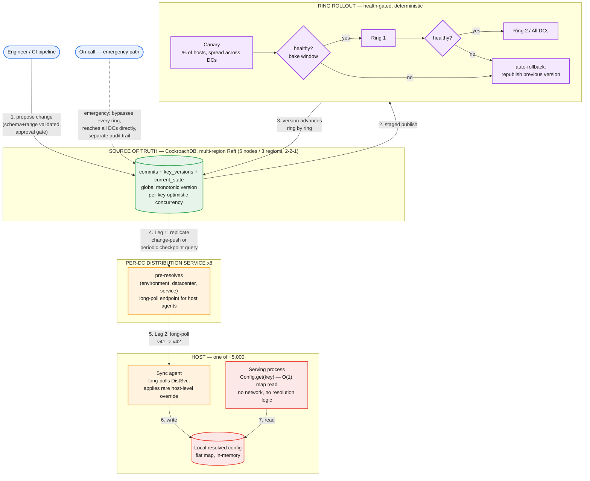

# Global Config Distribution System — System Design

**Domain:** Fleet-wide configuration/feature-flag propagation, low write volume, extreme read fan-out, safety-critical
**Core tension:** propagation to thousands of hosts has to be fast (sub-second) and a bad value has to be contained to a small blast radius before anyone notices — and naive designs optimize one at the direct expense of the other.

---

## Part 1: Requirements, Scale, and the Corrected Flow

### Functional requirements

1. Thousands of hosts across every datacenter can read the current value of any config key they depend on (feature flags, timeouts, rate limits, kill switches).
2. A change published by an engineer (or an automated system) reaches the fleet in a few seconds under normal operation.
3. A single key can hold different values for different scopes at once — global default, environment, datacenter, service, or a single host — resolved by a fixed, deterministic precedence order.
4. Full audit history: what changed, when, by whom, and the ability to revert to any prior state.
5. A human-triggered emergency override that reaches every host immediately, bypassing normal staging, for active incident mitigation.

### Non-functional requirements

- **Blast radius containment is the central constraint** — a bad value must be provably limited to a small, bounded slice of the fleet, for a bounded time, before it can spread further.
- **The hot path (a service handling a real request) never makes a network call for config** — a config check has to be as cheap as a local variable read.
- **The system that lets you *fix* a bad rollout must not itself be a single point of failure** — its own availability bar is at least as high as anything it configures.
- **Low write volume, high read fan-out** — writes: a handful per minute, fleet-wide, even during active work. Reads: every host, continuously.

### Capacity estimation

- **Fleet:** ~5,000 hosts across 8 datacenters.
- **Distinct config keys, company-wide:** ~3,000. A single service typically depends on ~50-100 of them (its declared manifest) — not the whole namespace.
- **Write rate:** ~2-5 commits/minute company-wide, peak. Each commit touches 1-3 keys on average. This is **not** a throughput problem — it's a correctness-under-rare-collision problem.
- **Read/connection load:** 5,000 hosts spread across 8 per-DC distribution services → ~625 concurrently-held long-poll connections per distribution service. Trivial for a modern service (tens of thousands of idle held connections is a non-event).
- **Storage:** `current_state` holds one row per (key, scope) combination — most keys have 1-3 rows (global + a couple of overrides) → **~9,000 rows total**, negligible. The append-only `key_versions` history grows at roughly 10 rows/minute → **~5M rows/year**, at ~200 bytes/row (including the JSON value) → **~1GB/year**. This is why compaction is a policy decision, not a scaling emergency — the natural growth rate is trivially small.
- **Propagation target:** sub-second within an already-vetted ring (bounded by same-DC long-poll round trip, single-digit ms), deliberately staged (minutes, by design) *across* rings.

### The corrected flow

**What corrects the common first-draft mistakes on this problem:**

| Common first draft | Why it's wrong | Fix |
|---|---|---|
| Client/API-server/load-balancer pattern: hosts call a "config API" per request | Makes every user request depend on a remote service being up and fast; at fleet QPS this also hammers the config service with traffic proportional to *user* traffic, not config *change* traffic | Config lives in each host's local memory, kept warm by a background sync agent; the request path never touches the network for config |
| Fixed-interval batch polling to hit "a few seconds" propagation | Batch interval and propagation latency are the same knob — shrinking it enough to hit a few seconds means polling at a rate that doesn't scale with fleet size | Long-poll with a version number: hold the connection open, reply the instant something newer exists — near-real-time without a fixed poll cost |
| Publish a new value to every datacenter simultaneously | Fast-and-global is exactly what turns a typo into a global outage | Ring-ordered rollout: canary slice first, health-gated bake window, then ring 1, then the rest — automatic rollback on regression |
| Canary defined as "one whole datacenter" | A region-specific failure mode (e.g. a locale-formatting bug) can be invisible in a canary DC that doesn't see that traffic shape — it sails through, then breaks everywhere else | Canary is a **percentage of hosts spread across every datacenter** (coverage/diversity), separately from **how much of the fleet is exposed at once** (exposure fraction) — two different axes, not one |
| One version number per key, checked independently | Breaks multi-key atomic changes — a reader can observe key A updated and key B not yet, if they were meant to change together | One global monotonic version for the whole namespace; a commit spanning several keys is one atomic unit, all-or-nothing |
| Global-only optimistic concurrency (CAS on one counter) | Two engineers touching completely unrelated keys spuriously conflict with each other just because the global counter moved | Per-key preconditions inside one atomic commit: "I expect key A at v40, key B at v41" — only a genuine overlap on the *same* key conflicts |
| Consensus cluster confined to one region | The safety mechanism (including the emergency kill switch) goes down in exactly the regional event it exists to help mitigate | Multi-region quorum (e.g. 5 nodes, 2-2-1 split across 3 regions) — losing any one region still leaves a majority to keep accepting writes |
| Storage layer chosen as "a KV store" by reflex | This problem needs joins, range queries, and referential integrity for audit (who approved what, when) — a bare KV interface fights that | A relational, SQL-capable, consensus-backed store (e.g. CockroachDB: Postgres wire-compatible + built-in multi-region Raft) fits the actual read pattern |
| Resolving scope precedence (global/env/DC/service/host) on every request | Puts branching logic on the hot path for something that's identical across every host sharing that scope combination | Pre-resolve once per (environment, datacenter, service) combination at the distribution-service tier; the host only layers on a rare host-specific override before caching a flat, already-resolved map |
| Host's long-poll checked directly against the database | Fans out database load with fleet size (thousands of hosts) instead of change volume — reintroduces the exact hot-path-touches-network problem the local-cache design was meant to fix | Host long-polls terminate entirely at the distribution service's in-memory state; only the distribution service's own low-cardinality sync against the database (Leg 1, see Part 4) ever issues a query |
| Distribution service tracks a separate last-known-version per key | Query cost scales with how many keys you're watching (a manifest of 50-100, or thousands company-wide), not with how many actually changed; also loses the atomicity signal when one commit touches several keys at once | One global monotonic checkpoint per distribution service; a single indexed range scan (`version > $checkpoint`) returns every changed row since then, however many distinct keys or commits are represented |

---

## Part 2: API

**Host sync (Leg 2) — the only endpoint anywhere near a serving host's critical path**

```
GET /v1/sync?environment={env}&datacenter={dc}&service={service}&host={hostId}&sinceVersion={version}
```

Long-poll: held open server-side until either (a) the resolved snapshot for this (environment, datacenter, service) combination has changed since `sinceVersion`, or (b) a bounded hold timeout elapses (e.g. 30s) with no change.

Response on change:
```json
{ "version": 106, "values": { "Bing.Shopping.PDPInsights.Enabled": true, "...": "..." } }
```
Response on hold-timeout with nothing new: `204 No Content` — the client immediately reopens the long-poll. The bounded timeout exists because several intermediate proxies/load balancers silently kill connections they consider unbounded-lifetime.

`hostId`, `environment`, `datacenter`, and `service` are all self-declared by the caller, not verified against an inventory — this is the same trust gap flagged in Part 6 (no RBAC/authorization model defined yet); a spoofed `hostId` could currently pull whichever host-level override it likes. Even this endpoint isn't on the request-handling hot path itself — it only feeds the host's local in-memory cache, which serving code reads synchronously with zero network involved.

**Publish a change — control-plane write path**

```
POST /v1/config/commits
```
```json
{
  "author": "dave",
  "commit_message": "raise retries + rate limit together for peak traffic",
  "changes": [
    { "key_path": "Bing.Ranking.MaxRetries", "scope_type": "global", "expected_version": 100, "value": 5 },
    { "key_path": "Bing.Shopping.RateLimit.CapacityPerSec", "scope_type": "global", "expected_version": 100, "value": 20 }
  ]
}
```
`expected_version` per key is the per-key optimistic-concurrency precondition from Part 5 (Hard Problem 1) — the request commits atomically only if every listed precondition still holds; a stale precondition on *any* key fails the *entire* request with `409 Conflict` naming which key(s) moved. Response on success: `{ "version": 103 }` — the new global version this commit was assigned. This endpoint only writes to the source of truth; it does not itself expose anything to a host — exposure happens only as the ring-rollout controller advances that version (next endpoint).

**Advance or roll back a commit through the rings**

```
POST /v1/config/commits/{version}/promote     -- advance to the next ring
POST /v1/config/commits/{version}/rollback    -- trigger the automatic-rollback path
```
`promote` is called by the health-gate automation (or a human override) once the current ring's bake window passes without regression. It advances `rollout_state.stage` and bumps `exposure_percentage` (e.g. 1% → 25% → 100%) — only the *final* promote call, the one reaching `stage='all'`, actually copies the value into `current_state`. Every earlier promote only moves the gate, never the ground truth.

`rollback` behaves differently depending on how far the commit got. Still mid-rollout (`current_state` untouched): flip `stage='rolled_back'` and stop — nothing to revert, since nothing outside the cohort hash was ever exposed. Already fully promoted (`stage='all'`): rollback instead re-publishes the previous value as a brand-new forward commit — never a rewind — consistent with the `is_rollback` / `rollback_of` columns in Part 3's schema. Neither call is host-facing — both are internal to the rollout controller and on-call tooling.

**Emergency override — bypasses everything above**

```
POST /v1/config/emergency-override
```
```json
{
  "key_path": "Bing.Ranking.BackendTimeoutMs",
  "scope_type": "global",
  "value": 500,
  "invoked_by": "oncall-alice",
  "justification": "SEV2-4471: reverting timeout bump, causing cascading retries"
}
```
Writes directly to `current_state` / `key_versions` at a new global version, skipping canary/ring entirely, tagged with an `is_emergency` flag (alongside the existing `is_rollback` column) so audit and post-incident review find it immediately. Who is authorized to call this, and rate-limiting against accidental repeated triggers, is still the open item from Part 6 — this defines the endpoint's shape, not the authorization model behind it.

**Audit / history query — read-only, off the propagation path entirely**

```
GET /v1/config/keys/{key_path}/history?scope_type=global&scope_value=
```
Reads directly from the append-only `key_versions` (+ `commits` for author/approval metadata) — never from the distribution service or any host. This is what a rollback UI or a compliance review hits, and an unoptimized relational query is fine here since it's low-volume and off any latency-sensitive path.

---

## Part 3: Data Model

```sql
-- one row per publish event
CREATE TABLE commits (
    version           BIGINT PRIMARY KEY,        -- global monotonic version
    committed_at      TIMESTAMPTZ NOT NULL,
    author            TEXT NOT NULL,
    approved_by       TEXT,                       -- required unless change is within a pre-approved safe range
    commit_message    TEXT,
    is_rollback       BOOLEAN NOT NULL DEFAULT false,
    rollback_of       BIGINT REFERENCES commits(version)
);

-- append-only diff log: one row per (key, scope) touched by a commit
CREATE TABLE key_versions (
    version           BIGINT NOT NULL REFERENCES commits(version),
    key_path          TEXT NOT NULL,              -- e.g. 'Bing.Ranking.BackendTimeoutMs'
    scope_type        TEXT NOT NULL DEFAULT 'global',  -- global | environment | datacenter | service | host
    scope_value       TEXT,                       -- 'canary', 'singapore', 'shopping-ranker', NULL for global
    value             JSONB NOT NULL,
    schema_version    INT NOT NULL,
    PRIMARY KEY (version, key_path, scope_type, scope_value)
);
CREATE INDEX idx_key_history ON key_versions (key_path, version DESC);

-- materialized "what's true right now" per (key, scope) — the only table mutated in place
CREATE TABLE current_state (
    key_path              TEXT NOT NULL,
    scope_type            TEXT NOT NULL,
    scope_value           TEXT,
    current_value         JSONB NOT NULL,
    last_changed_version  BIGINT NOT NULL REFERENCES commits(version),
    schema_version         INT NOT NULL,
    PRIMARY KEY (key_path, scope_type, scope_value)
);
```

```sql
-- tracks gradual exposure of a commit still working through the rings;
-- current_state is NOT touched until this reaches stage='all'
CREATE TABLE rollout_state (
    version              BIGINT PRIMARY KEY REFERENCES commits(version),
    stage                TEXT NOT NULL DEFAULT 'canary',  -- canary | ring_1 | ring_2 | all | rolled_back
    exposure_percentage  SMALLINT NOT NULL DEFAULT 1,     -- 0-100
    stage_started_at     TIMESTAMPTZ NOT NULL DEFAULT now(),
    health_status        TEXT NOT NULL DEFAULT 'pending', -- pending | healthy | failed
    updated_at           TIMESTAMPTZ NOT NULL DEFAULT now()
);
```

A commit writes `commits` + `key_versions` immediately, but `current_state` keeps the old, stable value until the rollout finishes — otherwise "gradual exposure" would be a lie the moment the commit lands. Membership in the currently-exposed cohort is **computed, not stored per host** — no row per host per rollout, which would reintroduce exactly the per-host database load this design has avoided everywhere else:

```
is_exposed(host_id, version) = stableHash(host_id, version) % 100 < rollout_state[version].exposure_percentage
```

Hashing on `host_id` is independent of datacenter, so a random 5% cohort naturally spans every DC and traffic shape — this is what actually delivers "percentage + diversity," not "one whole datacenter," from Part 1's corrected flow.

Leg 1 (Part 4) now fetches three things, not one: `current_state` changes since checkpoint (the shared, ring-oblivious truth); `rollout_state` rows with `updated_at > checkpoint` (which commits are gating, at what stage/percentage); and, once per newly-seen active rollout, a one-time targeted lookup of its candidate value from `key_versions WHERE version = <that commit>` — immutable once fetched, so it's cached rather than re-pulled on every poll, and dropped once the rollout resolves. `current_state` itself never needs a ring-related column.

**Worked example — extending the same 4-key table, two more commits, showing `rollout_state` mutated in place over time (like `current_state`, not append-only like `key_versions`):**

*v107 — re-bumping `BackendTimeoutMs` global to 800 (rollout succeeds):*

| version | stage | exposure_percentage | health_status | point in time |
|---|---|---|---|---|
| 107 | canary | 1 | pending | t0 — just committed |
| 107 | canary | 1 | healthy | t0+5min — bake window passed |
| 107 | ring_1 | 25 | healthy | t0+6min — promoted |
| 107 | ring_1 | 25 | healthy | t0+15min — bake window passed |
| 107 | ring_2 | 75 | healthy | t0+16min — promoted |
| 107 | all | 100 | healthy | t0+30min — fully promoted |

Only the last row actually changes `current_state` (`BackendTimeoutMs / global → 800, last_changed_version=107`). Every row before that, `current_state` still shows `500` (left over from v104's rollback of the original v101 bump) — a host outside the current exposure cohort keeps resolving to `500` even though v107 already exists in the system.

*v108 — dropping `RateLimit.CapacityPerSec` global to 5, too aggressive (rollout aborts):*

| version | stage | exposure_percentage | health_status | point in time |
|---|---|---|---|---|
| 108 | canary | 1 | pending | t0 — just committed |
| 108 | canary | 1 | failed | t0+3min — error rate spiked in the 1% cohort |
| 108 | rolled_back | 1 | failed | t0+3min — auto-rollback fires |

`current_state` is never touched here — `RateLimit.CapacityPerSec / global` stays at `20` (its v103 value) throughout, for every host, including the 1% briefly exposed to `5` during canary. Nothing to revert, because nothing outside that 1% hash cohort was ever exposed, and even that 1% reverts as soon as their sync agent's next long-poll picks up the `rolled_back` stage and drops the overlay entry — the "mid-rollout rollback is free" case from Part 2.

Concretely, at v107's `ring_1` row (25% exposure): a host with `stableHash(host_id, 107) % 100 = 18` is exposed and resolves `800`; a host with `stableHash(host_id, 107) % 100 = 61` isn't, and resolves `500` from the shared `current_state`-based base map — same combo, same manifest, genuinely different resolved value, exactly the tension named in Hard Problem 6.

**Worked example — 4 keys, 7 commits, showing why the version is global per-commit rather than per-key:**

`commits`

| version | author | commit_message | is_rollback | rollback_of |
|---|---|---|---|---|
| 100 | deploy-bot | initial defaults for 4 keys | false | — |
| 101 | alice | bump backend timeout 500→800ms | false | — |
| 102 | carol | enable PDP insights, Singapore only | false | — |
| 103 | dave | raise retries + rate limit together for peak traffic | false | — |
| 104 | alice | rollback timeout bump — regressed p99 | true | 101 |
| 105 | carol | override rate limit for shopping-ranker service | false | — |
| 106 | dave | enable PDP insights globally | false | — |

`key_versions` (append-only — this is the table that proves version is per-commit, not per-key)

| version | key_path | scope | value |
|---|---|---|---|
| 100 | BackendTimeoutMs | global | 500 |
| 100 | PDPInsights.Enabled | global | false |
| 100 | MaxRetries | global | 3 |
| 100 | RateLimit.CapacityPerSec | global | 10 |
| 101 | BackendTimeoutMs | global | 800 |
| 102 | PDPInsights.Enabled | datacenter:singapore | true |
| 103 | MaxRetries | global | 5 |
| 103 | RateLimit.CapacityPerSec | global | 20 |
| 104 | BackendTimeoutMs | global | 500 |
| 105 | RateLimit.CapacityPerSec | service:shopping-ranker | 50 |
| 106 | PDPInsights.Enabled | global | true |

`current_state` (materialized, mutated in place — this is what actually gets read)

| key_path | scope | current_value | last_changed_version |
|---|---|---|---|
| BackendTimeoutMs | global | 500 | 104 |
| PDPInsights.Enabled | global | true | 106 |
| PDPInsights.Enabled | datacenter:singapore | true | 102 |
| MaxRetries | global | 5 | 103 |
| RateLimit.CapacityPerSec | global | 20 | 103 |
| RateLimit.CapacityPerSec | service:shopping-ranker | 50 | 105 |

**What this proves:** the version counter is global and monotonic per *commit*, not per key. v100 produced 4 rows (one commit touching all 4 keys at once). v101/102/104/105/106 each produced exactly 1 row (single-key commits). v103 produced 2 rows sharing one version number — that shared number is what makes the multi-key change atomic; a reader can never observe retries updated without the rate limit also updated in the same read. Looked at in isolation, any single key's version history has gaps (`BackendTimeoutMs` only ever appears at 100, 101, 104) because most commits don't touch it — the global counter still advances on those other commits, it just doesn't produce a row for a key that wasn't part of them. A distribution service asking "I have v99, what's new" gets all 11 rows back in one indexed scan; asking again at "I have v103" gets only rows 104/105/106 — small diffs, never a full re-fetch, and never a per-key lookup.

---

## Part 4: Major Components

**Source of truth.** CockroachDB (or equivalent Postgres-compatible, Raft-backed store), 5 nodes across 3 regions (2-2-1), so no single region holds a majority. Single-writer semantics per key via per-key optimistic concurrency (compare-and-swap on `last_changed_version`, scoped to only the keys a commit touches). Schema/range validation runs before a version number is ever assigned.

**Per-DC distribution service (×8).** Replicates from the source of truth via a single in-memory checkpoint (never a per-key checkpoint — see below). Pre-resolves the (environment, datacenter, service) scope combinations it serves into flat, ready-to-hand-off maps — this is where almost all precedence-resolution compute is amortized, not on individual hosts. Serves long-polls from every host agent in its datacenter entirely from memory.

### How a change actually reaches a host — the two-leg sync flow

Propagation happens over two legs with very different cost profiles. Conflating them is the easiest way to accidentally put database load on a path that scales with fleet size instead of change volume.

**Leg 1 — source of truth → distribution service (low cardinality, the only leg that touches the database).** Each of the 8 distribution services keeps exactly one number in memory: its own `last_known_version` checkpoint — not one per key. It either polls on a short interval with a single query per distribution service:

```sql
SELECT version, key_path, scope_type, scope_value, value
FROM key_versions
WHERE version > $last_known_version
ORDER BY version;
```

(one indexed range scan, 8 queries total company-wide per interval, regardless of fleet size or key count) — or, better, subscribes to native change-push (CockroachDB changefeeds, or Azure SQL Change Data Capture / Change Tracking over the transaction log) and skips polling on this leg entirely. Either way, a commit touching multiple keys (v103 above) arrives as multiple rows sharing one version number in a single response, which is how the distribution service knows to apply them together.

**Leg 2 — distribution service → host sync agent (high cardinality, never touches the database).** Pure in-memory pub-sub inside the distribution service process:

1. Host's sync agent long-polls with its own last-known version (say 102).
2. If the distribution service's checkpoint is already ahead of 102, it replies immediately with the current resolved snapshot for that host's (environment, datacenter, service) combination — no DB call, served from memory.
3. If not, the connection is parked in an in-memory waiter list keyed by scope combination.
4. When Leg 1 delivers a new version, the distribution service re-resolves only the affected scope combinations, diffs old-resolved vs. new-resolved output per combination, and wakes only the waiters whose *resolved output* actually changed — not every waiter just because the global counter moved. Concretely: a Singapore host already resolved `PDPInsights.Enabled=true` from its v102 datacenter override; when v106 later sets the *global* value to `true` too, Singapore's resolved output is unchanged and that waiter isn't woken. A host with no datacenter override, previously resolved to `false` from the v100 global default, does see its output flip and is woken with the new value and checkpoint 106.
5. Host applies the new flat map to local memory and immediately reopens a long-poll at its new checkpoint.
6. The serving process's `Config.get(key)` call is a plain in-memory read, already reflecting the change — no network, no resolution logic, on the request path.

Total propagation latency is roughly Leg-1 pickup (near-zero with change-push, otherwise bounded by the poll interval) plus one same-DC long-poll round trip (single-digit ms) — inside the sub-few-second target, and decoupled from fleet size on the database side.

*Why not give the distribution service a separate checkpoint per key instead of one global number?* It works, but it's strictly worse: the query grows with manifest size (50-100 keys per service, thousands company-wide) rather than with actual change volume, it can't express "tell me about a key I don't have a baseline for yet," and it loses the atomicity signal — two rows returned from a per-key join carry no indication they came from the same commit, whereas two rows sharing one `version` value do.

**Host sync agent.** One per host (~5,000 total). Long-polls its local distribution service with its last-known version; on response, applies any rare host-level override on top of the pre-resolved snapshot and writes the final flat map into local memory. Falls back to the last-known-good value on disk if the distribution service is briefly unreachable — never blocks the serving process or serves nothing.

**Serving process.** The thing actually handling real traffic. Reads config via a plain in-memory map lookup — zero network calls, zero precedence logic, on the request path.

**Ring rollout / safety layer.** Wraps every publish: canary (percentage + diversity across DCs, not one whole DC) → health-gated bake window → ring 1 → ring 2/all, with automatic rollback to the previous version on any gate failure. A separate, human-triggered emergency kill switch bypasses every ring and reaches all DCs directly, with its own audit trail.

---

## Part 5: The Hard Problems

**1. Concurrent writes without false conflicts or blocking the emergency path.** Pessimistic locking is disqualified outright — locking the whole namespace during a routine, in-review change could block an unrelated team's emergency kill switch during a live incident. Per-key optimistic concurrency (not a single global CAS, which would make unrelated teams' concurrent edits spuriously conflict) is the fix: a commit states its expected current version for each key it touches; the store checks all preconditions atomically and applies or rejects the whole commit as one unit.

**2. Durability of the source of truth, given it's the thing you reach for *during* an incident.** A single-region consensus cluster fails in exactly the regional event it exists to help mitigate. Multi-region quorum (5 nodes, 2-2-1 across 3 regions) survives losing any one region. This trades write latency (cross-region replication, ~100-150ms) for correctness — an easy trade given writes are rare and never on the user-facing hot path. Reads stay local: each region's distribution service reads from a nearby replica, not across an ocean. Split-brain is a non-issue by construction — a minority partition can never elect its own leader or accept writes, only serve stale reads until connectivity returns.

*If forced onto Azure-native tech instead (a fair question in a Microsoft-context interview):* Azure SQL Database has no equivalent to this. Its only synchronous replication is Business Critical zone-redundancy, which spans availability zones *within one region*, not across regions. Cross-region durability is only available via Auto-Failover Groups / active geo-replication, which is asynchronous — Microsoft's own documentation is explicit that a *forced* failover (the realistic case, when the primary region is actually down) can lose committed transactions; RPO is non-zero. There is no Azure SQL configuration that gives a synchronous cross-region write quorum analogous to Raft/Paxos (Cosmos DB doesn't solve this either — its multi-region multi-master writes use local-majority quorum per region, not a global one). Substituting Azure SQL is defensible only if stated as a conscious trade — "we accept a non-zero RPO on true regional failover of the emergency kill-switch path, and reconcile from the append-only audit log afterward" — never presented as a like-for-like swap.

**3. Blast radius has three separate dimensions, not one.** Exposure fraction (how much of the fleet is affected), time-to-detect (how long a bad value is live before the health gate catches it), and reversibility (does reverting the config actually undo the damage, or did it trigger an irreversible side effect like a write or a payment). A DC-shaped canary optimizes exposure fraction but can miss region-specific failure modes entirely — real canary design needs a small *percentage* of hosts spread with *diversity* across regions and traffic types, not one whole datacenter.

**4. Schema evolution has to assume old agent code is running somewhere, indefinitely.** Additive-only changes; a type change (bool → enum) goes through expand (add the new field alongside the old, keep both consistent) → migrate (roll out agent code that reads the new field, on its own slow deploy timeline) → contract (retire the old field only once telemetry shows zero fleet-wide reads). This is a weeks-long process by nature — conflating it with second-scale config propagation is a real mistake.

**5. Multi-scope resolution has to happen mostly off the host, or it doesn't scale.** Global/environment/datacenter/service/host form a fixed precedence order, decided once and documented — never inferred at read time. Since environment/datacenter/service scopes are identical for every host sharing that combination, the distribution tier pre-computes one resolved snapshot per combination (dozens, not thousands) and hands it down already resolved; only the rare host-level override is applied locally. The serving process's read is then a pure O(1) map lookup with no branching at all.

**6. Ring rollout breaks the "one shared snapshot per combo" assumption, for exactly the keys currently mid-rollout.** Percentage-based canary means two hosts in the *identical* (environment, datacenter, service) combo can legitimately be on different values while a rollout is active — the whole point of gradual exposure. That's in tension with Hard Problem 5's optimization, which assumes every host in a combo sees the same thing. The fix doesn't abandon pre-resolution or push ring state into `current_state`; it adds a thin, shared overlay next to each combo's normal cached snapshot.

Building a combo's base map from `current_state` is unchanged. Separately, for each active rollout (from `rollout_state`), check whether its target scope is the one that would actually *win* that combo's precedence walk — if a more specific, already-stable scope already beats it (e.g. an existing datacenter override), the rollout is irrelevant to this combo and gets no overlay entry at all, exactly as it would once the rollout eventually promotes. Where the rollout's scope *would* win, add one small overlay entry: `{key_path, candidate_value, version, exposure_percentage}`. This overlay is still shared across every host in the combo — nothing host-specific has been computed yet.

The only genuinely per-host step happens at serve time: for each overlay entry, compute `stableHash(host_id, version) % 100 < exposure_percentage` and swap in the candidate value if this host is exposed, otherwise leave the base map's stable value as-is — the same cost shape as the existing host-level-override layering. Once a rollout reaches `stage='all'`, its overlay entry is dropped and that key goes back to pure shared-snapshot serving. This keeps the O(combos), not O(hosts), cost model intact for the near-totality of keys that aren't mid-rollout at any given moment, at the cost of a small per-host hash check for the handful that are.

---

## Part 6: What We Have NOT Yet Designed — rehearse these live before Tuesday

These came up as "things to design" but weren't walked through in detail in our conversation. Don't let the depth above create false confidence that the whole system is covered — these are real gaps:

- **What signal(s) and statistical method actually decide "healthy?" at a ring gate.** Fixed error-rate threshold vs. comparison against a live control group of not-yet-exposed hosts vs. an anomaly-detection model — and how the bake-window duration is chosen per signal type (some regressions, like memory pressure, take minutes to surface, not seconds). This is the single biggest hole — the entire safety story assumes this gate works, and we never designed how.
- **Pre-flight/shadow validation before the canary ring even starts.** Can a proposed change be tested against replayed or shadow traffic before it touches a single real host? This is a cheaper, earlier line of defense than canary itself.
- **Observability of the distribution system's own health**, distinct from the health gate for one specific rollout — propagation lag per DC, count of hosts stuck on a stale version, alerting when a DC falls behind. We designed what the system *distributes*, not how you'd monitor the *distribution mechanism* itself.
- **The full authorization model for who can write which keys** — we sketched "approval required outside a pre-approved safe range" but never designed the actual ownership/namespace permission model (can Team A accidentally modify Team B's keys, is there per-namespace RBAC).
- **Emergency kill-switch specifics**: who exactly is authorized to invoke it (on-call role via existing IAM?), rate-limiting against accidental repeated triggers, and the concrete post-incident review process for its audit trail.
- **Retention/compaction policy for `key_versions`** — the growth rate is trivial (~1GB/year) so this isn't an urgent scaling problem, but a compliance-driven retention window (e.g., archive raw values after 2 years, keep commit metadata indefinitely) is still a decision someone has to make explicitly.

If she pushes on any of these, the honest answer is "we didn't design that in the time we had — here's how I'd approach it" followed by a real attempt, not a confident-sounding dodge.

---

## Part 7: How to Run This in the Interview

1. **(0-3 min) Restate scope out loud.** Name the four layers (storage, distribution, host sync, safety) before designing any of them, and say explicitly where you'll spend the most time given what she told you she cares about (blast radius) — this signals scoping ability before you've drawn anything.
2. **(3-8 min) Capacity.** Fleet size, key count, write rate vs. read fan-out — and say explicitly that this is a low-throughput, high-correctness problem, not a scaling problem, because that framing decides several downstream choices (relational store over a bare KV store, no need for sharding the source of truth).
3. **(8-14 min) The hot path vs. background sync split.** This is the fastest way to show you're not defaulting to a client-server template — local memory read, background agent, long-poll, no network call on the request path.
4. **(14-24 min) Blast radius — spend real time here, it's the stated priority.** Ring rollout, the exposure-fraction-vs-diversity distinction (DC canary can miss region-specific bugs), automatic rollback, the emergency path as a deliberately separate lane.
5. **(24-32 min) Storage and concurrency.** Global version for atomic multi-key commits, per-key optimistic concurrency (and why global-only CAS creates false conflicts), multi-region durability for the source of truth itself.
6. **(32-38 min) Multi-scope resolution and the read path.** Precedence order, why it's pre-resolved upstream rather than per-request, the worked example of a key with global + DC-override values.
7. **(38-42 min) Name the gaps yourself, don't wait to be caught.** Proactively say "the health-gate signal design and pre-flight validation are the two pieces I'd want to go deeper on given more time" — naming your own incompleteness is a stronger signal than pretending the design is finished.
8. **(42-45 min) Close.** The three decisions worth defending hardest: separating exposure-fraction from diversity in canary design, per-key (not global) optimistic concurrency, and treating the source of truth's own durability as at least as critical as the services it configures.

### Staff/Principal signal checklist

- Named the tension between propagation speed and blast radius explicitly, up front, rather than treating them as independent requirements to satisfy separately.
- Recognized that "canary DC" is a weaker unit than it sounds and can miss region-specific failure modes — proposed percentage + diversity instead.
- Chose per-key optimistic concurrency over a coarser global CAS or a pessimistic lock, and explained why each alternative fails (false conflicts, blocking the emergency path).
- Treated the safety system's own durability (multi-region quorum for the source of truth) as a first-class requirement, not an afterthought — named the irony of a single-region config store outright.
- Pushed resolution logic (multi-scope precedence) upstream to where it can be amortized, instead of leaving branching logic on the per-request hot path.
- Named the gaps in the design proactively rather than presenting it as complete.

---

## Appendix: Mermaid source


