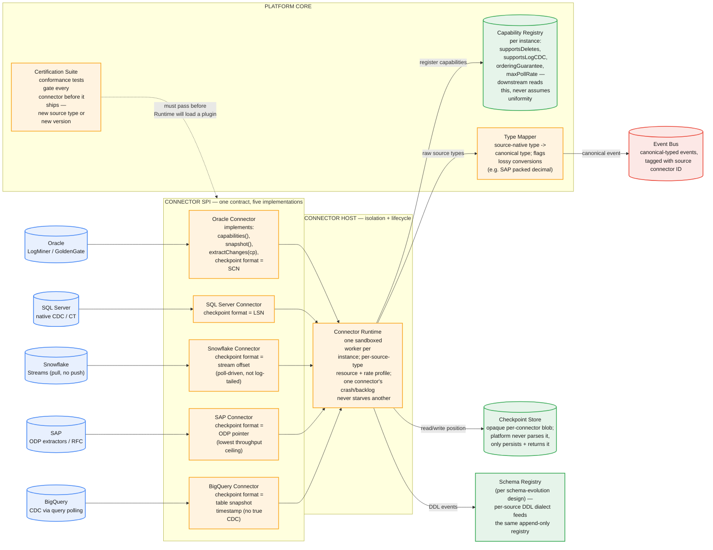

# Connector Framework — System Design

## Pluggable source ingestion behind one contract (Oracle, SQL Server, Snowflake, SAP, BigQuery)

The tension: every source system has a different notion of "give me your changes." SQL Server and Oracle can tail a transaction log — true CDC, low latency, ordered, delete-aware. Snowflake exposes Streams, which you have to *poll*, not tail — there's no log to subscribe to. SAP's ODP extractors are RFC-based batch pulls with the lowest throughput ceiling of the set, and production SAP DBAs will throttle you hard if you push it. BigQuery has no CDC primitive at all — you're diffing query snapshots and inferring changes.

If you design the platform contract around what SQL Server can do, every other connector becomes a pile of hacks pretending to satisfy an interface they can't actually fulfill. If you design it around the *least* capable source (BigQuery), you throw away ordering and delete-detection guarantees that SQL Server and Oracle earn for free. The right design doesn't pick a capability level — it makes capability itself part of the contract, and pushes every downstream decision to read capability flags instead of assuming uniformity. That's Open Mirroring's actual problem, and it's harder than any single connector.

---

## Part 1: Requirements

### Functional Requirements

1. A single connector SPI (service-provider interface) that Oracle, SQL Server, Snowflake, SAP, and BigQuery connectors all implement — same method signatures, same lifecycle, regardless of source capability.
2. Each connector self-reports its capabilities (log-based CDC vs. poll-only, delete detection, ordering guarantee, max sustainable extraction rate) at registration; the platform never hardcodes assumptions about a source type.
3. A canonical type system that every source's native types map into, with explicit flagging when a mapping is lossy (e.g., SAP packed decimal → double, Oracle `NUMBER(38)` → int64 overflow risk).
4. Per-connector checkpointing that survives restarts, using whatever position concept that source natively has (SCN, LSN, stream offset, ODP pointer, snapshot timestamp) — opaque to the platform, meaningful only to that connector.
5. New connector types can be added without redeploying the platform core — a plugin model, not a fork-and-modify model.

### Non-Functional Requirements

1. **Isolation.** One connector instance's crash, backlog, or misbehaving source must not degrade any other connector's throughput or latency — including other instances of the *same* connector type.
2. **No silent capability assumption.** If a consumer asks for delete events from a connector that can't detect deletes, that's a visible, typed error at subscribe time — never a silent gap in the data.
3. **New connector types ship without a core platform change.** Adding "Salesforce" as a seventh source is a new plugin package plus passing certification, not a pull request against the ingestion engine.
4. **Certification before production.** No connector — new type or new version of an existing type — reaches a real customer's data without passing a conformance suite that validates it against the SPI contract.

**Decision stated up front:** the contract is capability-declarative, not capability-uniform. Every connector answers "what can you do" before it does anything, and every downstream component branches on the answer instead of hoping all sources behave the same. This is the one decision the rest of the design serves.

### Capacity Estimation

| Source type | Est. active instances | Per-instance throughput profile | Extraction mode |
|---|---|---|---|
| SQL Server | ~1,800 | Medium-high, log-tailed | Native CDC / Change Tracking |
| Oracle | ~1,200 | High, log-tailed | LogMiner / GoldenGate |
| Snowflake | ~900 | Low-medium, poll-driven | Streams (poll interval, not push) |
| BigQuery | ~700 | Low, poll-driven | Query-diff (no native CDC) |
| SAP | ~400 | Low volume, hard ceiling | ODP extractors / RFC |
| **Total** | **~5,000** | — | — |

**The number that matters:** SAP has the fewest instances (~400) but the tightest per-instance rate ceiling of any source — production SAP systems throttle extraction hard enough that a single misbehaving SAP connector can look, from the outside, like an outage even though it's moving a fraction of the data SQL Server moves. Capacity planning per source type has to be independent; a single "connectors are slow" alarm threshold across all 5,000 instances is useless because "slow" means something completely different for SAP than for SQL Server.


*One SPI, five implementations, each declaring its own checkpoint format and capabilities. The platform core (capability registry, type mapper, certification suite) never special-cases a source type by name — it only ever branches on declared capability.*

### Common First-Draft Mistakes

| Mistake | Why it's wrong |
|---|---|
| Designing the contract around the most capable source (log-based CDC) | Snowflake, BigQuery, and SAP can't implement it — you end up bolting on a second, informal "poll mode" contract that isn't actually part of the SPI, and now you have two systems, not one |
| Designing the contract around the least capable source (poll + diff) | Throws away real ordering and delete guarantees that SQL Server/Oracle provide for free; every consumer gets the weakest possible semantics even when the source could do better |
| Treating checkpoints as a uniform format (e.g., "always a timestamp") | An SCN, an LSN, and a stream offset aren't interchangeable or comparable; forcing a common format either loses precision or is meaningless for some sources |
| Assuming every source can detect deletes | Poll-and-diff sources (BigQuery, sometimes Snowflake depending on retention) can only infer deletes by absence, which is unreliable under concurrent writes and outright wrong under partitioned/sharded tables |
| One resource pool sized for the "average" connector | SAP's throughput ceiling and SQL Server's typical volume are off by 10-50x; average-based sizing starves SAP overhead or wildly over-provisions everything else |
| Skipping certification for "just a minor connector update" | A connector version bump that silently changes checkpoint format or drops a capability flag breaks every downstream consumer relying on the old contract — with no compile-time signal, because it's a plugin boundary |

---

## Part 2: The Connector SPI

This is the actual API of this system — not a REST surface for end users, but the contract every connector implementation must satisfy. It's a service-provider interface, conceptually similar to JDBC drivers or Kafka Connect's `SourceConnector`.

### Core interface (pseudocode, language-agnostic)

```
interface SourceConnector {

  // Called once at registration. Declares what this connector
  // can and cannot do — the platform reads this before doing
  // anything else with the instance.
  Capabilities capabilities();

  // Full initial load. Returns a checkpoint marking the exact
  // position at which the snapshot was consistent, so that
  // extractChanges() can resume from there without gap or overlap.
  SnapshotResult snapshot(SnapshotConfig config);

  // Incremental pull. `checkpoint` is opaque — whatever this
  // connector returned last time. Returns new events plus the
  // next checkpoint. For poll-based sources, this is literally
  // "run the poll now"; for log-based sources, "resume tailing
  // from this LSN/SCN."
  ChangeResult extractChanges(Checkpoint checkpoint);

  // Called by the platform's DDL/schema layer when this connector
  // reports a structural change. Source-specific DDL dialect in,
  // canonical schema-evolution event out (see schema-evolution design).
  SchemaChangeEvent onSchemaChange(RawDDL ddl);

  // Health/backpressure signal — lets the connector tell the
  // runtime "slow down" without the runtime having to guess from
  // error rates alone.
  ThrottleSignal currentLoad();
}
```

### Capabilities object

```json
{
  "connectorType": "sap-odp",
  "connectorVersion": "2.3.1",
  "supportsLogBasedCDC": false,
  "supportsDeleteDetection": false,
  "orderingGuarantee": "per-table-eventual",
  "maxSustainedExtractionRate": "40 MB/s",
  "checkpointFormat": "odp-pointer-v1",
  "snapshotRequired": true,
  "ddlParsingSupported": false
}
```

Contrast with the SQL Server connector's capabilities:

```json
{
  "connectorType": "sqlserver-cdc",
  "connectorVersion": "4.1.0",
  "supportsLogBasedCDC": true,
  "supportsDeleteDetection": true,
  "orderingGuarantee": "per-key-strict",
  "maxSustainedExtractionRate": "800 MB/s",
  "checkpointFormat": "lsn-v1",
  "snapshotRequired": true,
  "ddlParsingSupported": true
}
```

Any consumer-facing API that lets a customer subscribe to a table's changes has to read this object and reject (with a specific, named error — `DELETE_DETECTION_UNSUPPORTED`, not a generic 400) any subscription request the source can't satisfy, before a single byte moves.

### Certification suite (what gates a connector before production)

```
POST /internal/certification/run
{
  "connectorType": "snowflake-streams",
  "connectorVersion": "1.4.0",
  "testSourceEnvironment": "cert-snowflake-instance-03"
}
```

Runs a fixed battery against a real (sandboxed) instance of that source type: snapshot-then-resume with no gap or duplicate, checkpoint round-trip after a forced restart, schema-change detection against every DDL type the source supports, capability object matches observed behavior (if it claims `supportsDeleteDetection: true`, the suite actually deletes a row and confirms the event arrives), and throttle response under injected backpressure. A connector that fails any of these never reaches `Runtime`.

---

## Part 3: Data Model

### Canonical event envelope

Every connector, regardless of source, emits events in this shape after the Type Mapper has processed them:

```json
{
  "connectorId": "sqlserver-cdc-instance-4821",
  "connectorType": "sqlserver-cdc",
  "sourceTable": "dbo.Orders",
  "op": "update",
  "before": { "orderId": 9931, "status": "pending" },
  "after": { "orderId": 9931, "status": "shipped" },
  "canonicalSchemaVersion": 14,
  "sourceNativeCheckpoint": "opaque-blob",
  "lossyConversions": [],
  "ts_ms": 1732642200123
}
```

The `lossyConversions` field is not decorative — it's how a SAP packed-decimal-to-double conversion, or an Oracle `NUMBER(38,0)` that risks int64 overflow, becomes visible to a consumer instead of a silent precision bug discovered six months later in a finance report.

### Checkpoint store entry

```
connectorId (PK)
checkpointBlob (opaque bytes — platform never parses)
checkpointFormat (string — "lsn-v1", "scn-v1", "odp-pointer-v1"...)
lastUpdated
lastKnownGoodSnapshotId
```

**Load-bearing decision:** the checkpoint is opaque to the platform. The temptation is to normalize checkpoints into one comparable format (a timestamp, a monotonic counter) so the platform can reason about "how far behind is this connector." That normalization is *lossy* — an LSN and a wall-clock timestamp aren't fungible, and forcing them into one shape either loses the precision that makes resumption exact or produces comparisons that are meaningful for some sources and nonsense for others. The platform persists and returns the blob; only the connector that wrote it can interpret it.

### Capability registry entry

One row per connector *instance* (not per type) — capabilities can vary at the instance level, since a SQL Server 2016 source and a SQL Server 2022 source behind the same connector type genuinely support different things (later versions add native CT features earlier ones lack).

---

## Part 4: Major Components

**Connector Runtime.** Hosts one sandboxed worker per connector instance. Resource limits (CPU, memory, extraction rate ceiling) are assigned per source-type profile, not a flat default — because "one size" would either starve SAP's already-tight ceiling or waste ten times the necessary allocation on a BigQuery poll job. A crash or infinite-loop in one instance is contained to its own worker; it cannot consume shared resources meant for other instances, including sibling instances of the same connector type.

**Capability Registry.** The single source of truth every downstream component consults before making a decision about a given connector instance — never inferred from connector type name, always read from the declared object.

**Type Mapper.** Converts source-native types into the canonical type system, and is the only place lossy-conversion detection logic lives — so a new connector doesn't have to reimplement "is this a lossy widening/narrowing conversion" from scratch; it declares its native type, and the mapper does the rest.

**Checkpoint Store.** Durable, opaque, keyed by connector instance. The only operations it exposes are `get(connectorId)` and `put(connectorId, blob)`.

**Certification Suite.** The gate. Runs against every new connector type and every version bump of an existing one. This is the component most first drafts skip or treat as an afterthought — and it's the one that prevents a silent contract violation from reaching production data.

**Credential Vault (brief).** Each source type has an entirely different auth model (Oracle wallet files, SAP RFC certificates, Snowflake key-pair auth, BigQuery OAuth service accounts). The vault abstracts storage and rotation but deliberately does *not* try to unify the auth flows themselves — that unification isn't valuable the way the type/checkpoint unification is, since auth is a one-time connection-setup concern, not a per-event one.

---

## Part 5: Hard Problems

### 1. The capability matrix problem — why "one contract" doesn't mean "one behavior"

The naive reading of "pluggable sources behind one contract" is that all five connectors behave the same way from the platform's point of view. They don't, and forcing them to is where every first draft goes wrong. SQL Server and Oracle can tail a transaction log continuously — every committed change appears within seconds, in commit order, with deletes as first-class events. Snowflake Streams require a poll (there's no subscribe-and-tail primitive); you're deciding how often to ask "what changed since my last offset," and the answer to that question is itself subject to Snowflake's stream retention window — if you don't poll often enough, you can lose the ability to answer at all. BigQuery has no CDC primitive whatsoever; you're running a query, diffing it against your last known state, and treating additions/removals as inferred changes — which means a row that was deleted and a row that fell outside a filtered query look identical, and true deletes are only reliable if you control the full unfiltered table scan. SAP sits at the other extreme from SQL Server: RFC-based extraction with a hard-throttled ceiling that production DBAs enforce because SAP systems are often the operational backbone of the business and cannot be destabilized by an ingestion job.

The fix isn't picking a lowest or highest common denominator — it's making capability declaration part of the contract itself, at both design time (the `Capabilities` object every connector must implement) and enforcement time (every consumer-facing subscription check reads that object and fails loudly, with a named error, rather than silently degrading). This is the single decision that makes "pluggable sources, one contract" actually true instead of aspirational.

### 2. Type system normalization — the canonical model, and what gets lost in translation

Five source systems means five type systems: Oracle's `NUMBER` with arbitrary precision/scale, SQL Server's `DECIMAL`, Snowflake's `NUMBER` (different overflow behavior than Oracle's despite the same name), SAP's packed decimals (BCD-encoded, no direct equivalent in most target type systems), and BigQuery's `NUMERIC`/`BIGNUMERIC` split. A canonical type system has to pick a small set of well-defined types (int64, decimal128, string, timestamp-with-timezone, binary) and map every source type into one of them — and the mapping is not always safe.

The concrete failure mode: Oracle's `NUMBER(38,0)` can hold values that overflow int64. SAP's packed decimal fields are BCD-encoded and converting to a floating-point double loses precision that matters in financial contexts. The Type Mapper's job isn't just to convert — it's to *flag* every conversion that isn't provably lossless, and attach that flag to the event (`lossyConversions` in the envelope). This turns a silent, discovered-months-later precision bug into a visible, queryable property of the data from day one. The mapper is also the one place this logic needs to live; without it, every new connector reimplements ad hoc type coercion, and every implementation makes slightly different rounding/truncation choices.

### 3. Checkpoint abstraction — why one opaque format beats five normalized ones

Every source's notion of "position" is different in kind, not just format: Oracle's SCN and SQL Server's LSN are both monotonic log positions but aren't comparable to each other or convertible without replaying through the actual log; Snowflake's stream offset is a cursor into a system-managed change table with its own retention semantics; SAP's ODP pointer is a delta-queue position specific to the extractor; BigQuery's checkpoint is closer to "the timestamp of the query snapshot I last diffed against," which is qualitatively different from a log position — it has no notion of "in-order resumption," only "re-run the comparison from here."

Trying to normalize these into a shared format (say, forcing everything into a timestamp) breaks resumption guarantees for the log-based sources, which can resume with byte-exact precision from a native position — a timestamp is a lossy, ambiguous substitute. The platform therefore treats every checkpoint as an opaque blob: `get`/`put`, no parsing, no comparison, no cross-connector reasoning about "who's further behind" beyond what each connector chooses to self-report via `currentLoad()`. This is a case where resisting the urge to unify is the correct design call — the abstraction boundary belongs at "store and return the blob," not "understand what's inside it."

### 4. Isolation and backpressure — one connector's problem can't become everyone's problem

With ~5,000 connector instances spanning five wildly different throughput profiles, the two isolation failures that matter are: (a) a single misbehaving instance consuming enough Runtime resource to starve its siblings, and (b) a source system itself pushing back (SAP throttling a connector that's extracting too fast, a Snowflake warehouse timing out under load) and that backpressure signal getting lost instead of propagating into the extraction rate.

The Runtime handles (a) with per-instance sandboxing and per-source-type resource profiles — SAP's profile assumes a tight rate ceiling and allocates accordingly; SQL Server's assumes high sustained throughput. It handles (b) via the `currentLoad()` method every connector must implement: a connector experiencing source-side throttling reports it explicitly, and the Runtime backs off that specific instance's poll/extract cadence rather than waiting for a downstream symptom (growing lag, timeouts) to infer the same thing indirectly. The alternative — a single global "connectors healthy" dashboard with one threshold — is actively misleading here, because "healthy" for a 40MB/s-ceiling SAP connector and an 800MB/s SQL Server connector are different numbers by more than an order of magnitude; alerting has to be per-source-type-profile-relative, not absolute.

### 5. Per-source DDL dialects feeding one schema registry

Every source has its own DDL syntax and its own signal for "something structural changed": SQL Server and Oracle emit parseable DDL text through their respective log streams (this connects directly to the schema-evolution design — the DDL Event Detector's text-parsing approach generalizes here, but the *parser* has to be source-specific, since `ALTER TABLE ... MODIFY` means something different across dialects). SAP's ODP extractors don't expose raw DDL at all — structural changes surface as a different extract structure version, which the connector has to translate into an equivalent "this changed" signal without ever seeing a DDL statement. BigQuery schema changes arrive as a difference in query result schema between polls, with no DDL text and no operation type — add/drop/rename all look like "the columns are different now," and disambiguating a rename from a drop+add is *harder* here than in the log-based case, because there's no txn boundary to reason about, only two independent snapshots.

The design keeps the DDL Event Detector's translation responsibility inside each connector (it's the only thing close enough to the source to know its dialect), while the Schema Registry itself — append-only, per-source-type-agnostic, versioned by LSN-equivalent position — stays common across all five. Each connector's job is narrow: turn whatever structural-change signal its source provides into the registry's canonical event shape. That keeps the hard, source-specific parsing logic isolated in the plugin, and the hard, correctness-critical registry logic (never destructively mutating history) shared and audited once.

---

## Part 6: Interview Execution

### Timed run-through (45 min)

| Time | What to cover |
|---|---|
| 0-5 min | State the tension up front: heterogeneous source capability is the actual problem, not "build five integrations." Declare the capability-declarative decision immediately. |
| 5-12 min | Requirements + capacity table. Call out the SAP throughput-ceiling number unprompted — it's the one that breaks naive uniform-resource-pool designs. |
| 12-20 min | Walk the SPI: `capabilities()`, `snapshot()`, `extractChanges(checkpoint)`, `onSchemaChange()`. Show the two contrasting `Capabilities` JSON objects (SAP vs. SQL Server) — this is the fastest way to make the abstraction concrete. |
| 20-30 min | Hard problem #1 (capability matrix) and #3 (opaque checkpoints) in depth — these are the two an interviewer is most likely to push on, because they're the two where "just normalize it" sounds appealing and is wrong. |
| 30-38 min | Isolation/backpressure (#4) and the schema-dialect problem (#5) — explicitly reference back to the schema-evolution and multi-tenant-ingestion designs if this is a follow-up round; reusing your own prior mechanisms (per-source resource profiles, append-only registries) is a strong signal. |
| 38-45 min | Certification suite — this is the component most candidates forget, and naming it unprompted ("how do you know a new connector doesn't violate the contract before it touches real data") is a differentiator. |

### Staff/Principal Signal Checklist

1. Frames the problem as capability heterogeneity, not "five integrations to build" — this reframing is the entire design.
2. States the capability-declarative decision before being asked, and explains *why* both a highest-common-denominator and lowest-common-denominator design fail.
3. Treats checkpoints as opaque by design, and can articulate why normalizing them (e.g., to a timestamp) is a correctness regression, not a simplification.
4. Flags lossy type conversions as a visible, queryable data property rather than letting them fail silently.
5. Separates "resource isolation between connector instances" from "backpressure signal from the source system" as two distinct problems requiring two distinct mechanisms.
6. Introduces a certification/conformance suite unprompted as the mechanism that prevents contract violations from reaching production — and reuses concepts from prior designs (append-only schema registry, per-source resource profiles) explicitly rather than re-deriving them from scratch.

---

## Appendix: Mermaid Source


