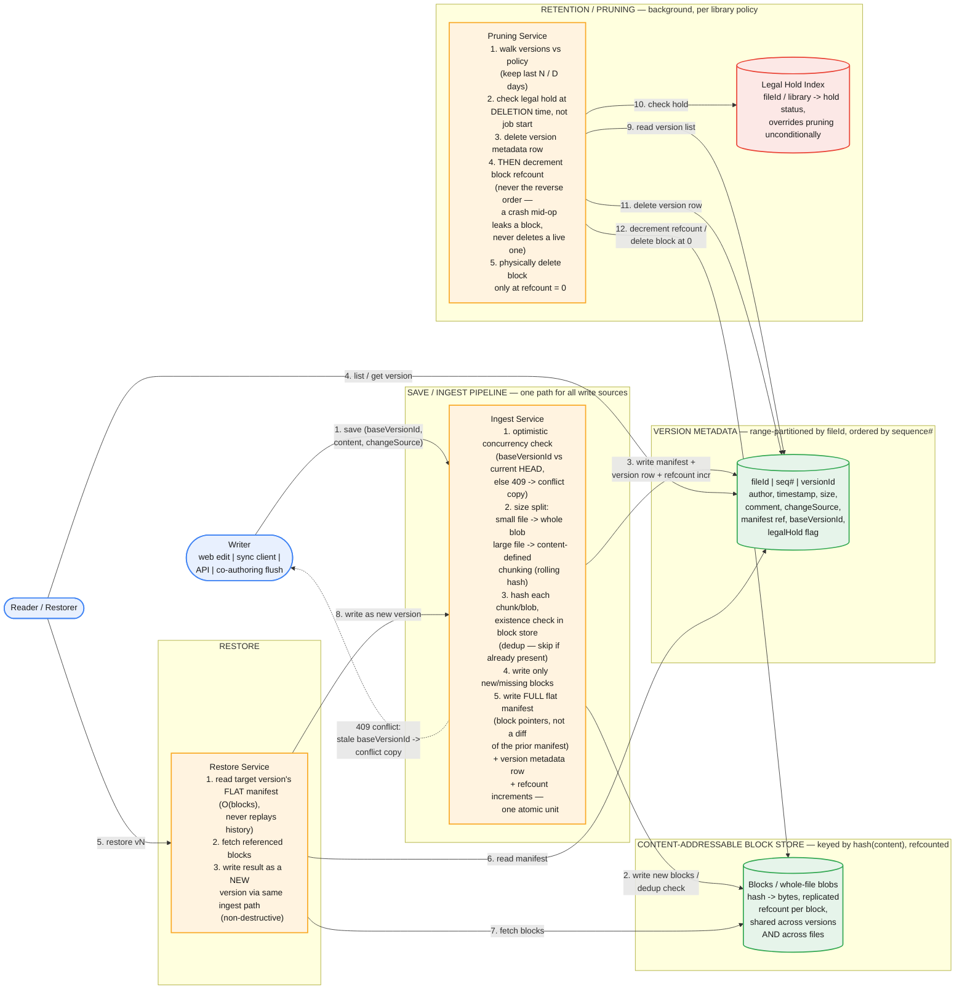

# Document Version History Service — System Design

The central tension: capture every save as a retrievable version, at billions-of-files scale with files up to multi-GB, without paying full-copy storage on every autosave — while still bounding how expensive it is to restore version 1 of a file that has 10,000 versions, and while guaranteeing no write is ever silently lost when two writers land "at the same time." Every hard decision below traces back to one design choice: deduplication happens in the block store, never in the manifest — get that wrong and either storage or restore latency blows up.

## Part 1 — Requirements

### Functional

1. Every write — web edit flush, sync client upload, API `PUT`, or a co-authoring session's periodic flush — creates a new version with metadata: author, timestamp, size, comment, change source, major/minor flag.
2. List version history for a file (paginated — some co-authored files accumulate thousands of versions before pruning).
3. Fetch a specific version's metadata, and separately, its full content (large files need range-resumable downloads — these must not be coupled into one call).
4. Restore a past version as a **new** current version — non-destructive, doesn't delete anything in between — and this must work correctly even while other clients are actively editing.
5. Per-tenant/library retention policy: keep last N versions, or versions within D days. **Legal hold** overrides pruning unconditionally, at the individual-file level, regardless of library policy.
6. Concurrent writes (two clients, or a co-authoring flush landing mid-edit) must never silently lose an update, and the semantics of "what counts as one version" must be explicit under co-authoring, not implied.
7. A sync client that goes offline, edits locally, and uploads later must be handled without corrupting or silently overwriting server-side versions created in the meantime.

### Non-Functional

1. **Storage efficiency at multi-GB scale.** Full copies per version is explicitly ruled out by the prompt — must reason about delta/block-level storage, dedup, and the read-cost tradeoff it creates.
2. **Bounded reconstruction cost.** Opening version 1 of a file with a 10,000-version history must not be dramatically slower than opening the current version.
3. **Pruning at scale without blocking live reads/writes**, and without ever deleting a block another version or file still depends on.
4. **Metadata/content consistency** — no version row without matching content, and no orphaned content without a version row.
5. **Durability** — every version's content, once acknowledged, survives node/disk failure (replicated block storage).

## Part 2 — Capacity Estimation

| Dimension | Value |
|---|---|
| Total files | 5B |
| Avg retained versions/file (post-pruning) | 15 (heavily co-authored files spike into the hundreds before pruning trims them) |
| Total version metadata rows | 5B × 15 ≈ **75B rows** |
| Metadata row size | ~200 bytes |
| Total metadata storage | 75B × 200B ≈ **15TB** |
| File size distribution | ~95% of files < 10MB (avg 500KB); ~5% > 10MB, up to multi-GB |
| Naive full-copy storage (no dedup, rejected) | 5B × 500KB avg × 15 versions ≈ **37.5PB** |
| Assumed inter-version block reuse rate (large files) | ~90% — **this is the design's single biggest unvalidated assumption; state it as an assumption in the interview, not a fact** |
| Effective stored bytes with block-level dedup | order of **4–6PB blended** — a 6–9x reduction, not a precise figure |
| Active files/day (fleet-wide) | 200M |
| Avg versions created per active file/day | 2 |
| Version-creation rate | 400M/day ≈ **4.6K/sec avg**, **~35K/sec peak** (co-authoring flush bursts cluster during business hours across a tenant) |

**Size-tiered storage strategy, stated explicitly:** the 95% of files under ~10MB are stored as a single content-addressed whole-file blob per version — no chunking overhead, and identical content across versions or even across files already dedups for free since it hashes to the same key. Only the ~5% of files above the threshold get content-defined chunking and block-level delta storage. This matters because chunking has real overhead (per-block hashing, more manifest entries, more metadata rows per version) that isn't worth paying below a size where a whole new blob is already cheap — applying block-level delta storage uniformly to every file, including a 40KB Word doc, is itself a common over-engineering mistake in a first draft.


*All four write sources converge on one ingest path. Deduplication happens at the block-store layer (content-addressed, refcounted); every version's manifest is a flat, full list of block pointers — never a diff of the previous manifest — which is what keeps restore cost flat regardless of how deep a file's version history is.*

### Common First-Draft Mistakes

| # | First-draft approach | Why it fails | Fix |
|---|---|---|---|
| 1 | Store a full copy of the file on every version | Naive math: ~37.5PB, cost-prohibitive at this scale | Content-addressed block store + block-level delta storage |
| 2 | Fixed-offset chunking (split into fixed-size blocks by byte position) | An insertion near the start of the file shifts every subsequent chunk boundary — every block after the edit gets a new hash and dedup fails completely, not just partially | Content-defined chunking (rolling-hash boundaries) — an edit only changes the chunks immediately around it |
| 3 | Manifest stores a diff against the previous version's manifest (a chain of diffs) | Reconstructing version N means replaying N diffs — restore cost grows unboundedly with history depth | Each manifest is a full, flat list of block pointers; dedup lives in the block store, not in manifest chaining |
| 4 | No explicit definition of "a version" under co-authoring | Either a version-metadata row per keystroke (blows up the 75B-row estimate) or ambiguous lost-update behavior | The flush interval of the merged co-authoring session **is** the version boundary — defined explicitly, not left implicit |
| 5 | Delete a version's blocks synchronously when the version is deleted, no refcounting | Deletes a block another version — or another file entirely — still depends on | Reference-counted blocks; physically delete only at refcount 0 |
| 6 | Legal hold checked once at the start of a (multi-hour) prune job | A hold applied mid-job doesn't stop deletion of that file later in the same run | Check hold status at time of physical deletion, not at job start |

## Part 3 — API

### `POST /files/{fileId}/versions` (internal save path — invoked by the web editor's flush, the sync client, the API, or a co-authoring session's periodic flush)

```json
// Request
{
  "baseVersionId": "<version this write was based on — optimistic concurrency token>",
  "content": "<blob or chunked upload>",
  "changeSource": "web | sync | api | coauthor",
  "comment": "optional",
  "isMinor": true
}

// Response 200
{
  "versionId": "v_9f21...",
  "sequenceNumber": 42,
  "author": "user@tenant.com",
  "timestamp": "2026-09-06T14:03:11Z",
  "size": 812433
}

// Response 409 — baseVersionId is stale (someone else's write landed first)
{
  "error": "conflict",
  "currentHeadVersionId": "v_a771...",
  "resolution": "conflict_copy_created",
  "conflictCopyFileId": "f_88fa... (Copy)"
}
```

`baseVersionId` is the optimistic-concurrency mechanism, and it's the single field that makes lost-update prevention possible — a first draft that omits it has no way to detect that a write is stale.

### `GET /files/{fileId}/versions?cursor=&limit=`

Cursor-based, not offset-based — a co-authored file can accumulate thousands of versions before pruning catches up, and offset pagination degrades badly at that tail. Returns metadata only, sorted by `sequenceNumber` descending — **never** content, so listing history never becomes a multi-GB-per-page operation.

### `GET /files/{fileId}/versions/{versionId}` — metadata only

### `GET /files/{fileId}/versions/{versionId}/content` — content stream, HTTP range-resumable

Split from metadata deliberately: opening a 2GB version from three years ago must support resuming a partial download, and the metadata call must stay cheap regardless of file size.

### `POST /files/{fileId}/versions/{versionId}/restore`

Creates a **new** version whose content equals the target version's reconstructed content. Goes through the exact same `baseVersionId` path as any other write — a live co-authoring session's next flush will conflict against the restore the same way it would against any other concurrent writer, rather than needing special-cased "restore during active edit" logic.

### `PUT /libraries/{libraryId}/retention-policy`

```json
{ "keepLastN": 25, "keepDays": 90, "legalHold": false }
```

### `POST /files/{fileId}/legal-hold`

```json
{ "hold": true }
```

Overrides the library's retention policy for this file, unconditionally, until cleared.

## Part 4 — Data Model

**Version metadata** — range-partitioned by `fileId`, clustered/ordered by `sequenceNumber` (a wide-column store shape — Bigtable/Cassandra-style, or an equivalently-keyed sharded relational table; the clustering-key structure matters more than the specific engine):

```
fileId          : partition key
sequenceNumber  : clustering key (monotonic per file)
versionId       : unique id
baseVersionId   : the version this write started from (forms the concurrency chain)
author, timestamp, size, comment, changeSource, isMinor
manifestRef     : pointer to this version's block manifest
legalHold       : bool, checked independently of library policy
```

**Content-addressable block store** — keyed by `hash(content)` (e.g., SHA-256), refcounted, replicated for durability:

```
blockHash -> bytes, refcount
```

The same hash resolves to the same stored bytes regardless of which file or version references it — this gives cross-version **and** cross-file dedup for free (an unchanged embedded image, a shared template, an identical small document across two users, all collapse to one stored copy).

**Version manifest** — per version, a **flat, complete** ordered list of block pointers needed to reconstruct that version's content in full:

```
versionId -> [blockHash_1, blockHash_2, ..., blockHash_k]
```

This is the load-bearing decision in the whole design: the manifest is never a diff of the *previous manifest* — it's a full enumeration, reusing hash-pointers to blocks that happen to be unchanged. Reconstruction is always "read k pointers, fetch k blocks, concatenate" — **O(blocks in that version)**, never O(chain depth). Deduplication (not storing the same bytes twice) happens entirely at the block-store layer; it never leaks into the manifest layer as chained diffs. Conflating these two is the single most common way this design goes wrong — "we use diffs" is not, by itself, a complete or correct answer until you say which layer the diffing happens at.

**Chunking strategy (large files only):** content-defined chunking via a rolling hash (Rabin fingerprinting — the same family of technique behind rsync, restic, Borg), target average chunk size ~1MB with 512KB–4MB bounds. Chunk boundaries are determined by content, not byte offset, so an insertion or deletion mid-file only changes the one or two chunks around the edit — everything before and after re-hashes identically and dedups normally. Fixed-offset chunking doesn't have this property (Part 2, mistake #2).

## Part 5 — Major Components

- **Ingest Service** — the single save path for all four write sources. Runs the optimistic-concurrency check, the size-tiered chunk-or-whole-blob decision, the block-store dedup check, and writes the new blocks + manifest + version row + refcount increments as one atomic unit.
- **Content-Addressable Block Store** — durable, replicated object storage keyed by content hash, with per-block reference counts.
- **Version Metadata Store** — range-partitioned by `fileId`, supports efficient ordered scans (list history) and point lookups (get a version) at 75B-row scale.
- **Restore Service** — reads a target version's flat manifest, fetches its blocks, and re-enters the Ingest path to write the result as a new version. Restore is not a special code path with its own consistency rules — it's a write like any other, which is exactly why it composes safely with concurrent edits.
- **Retention / Pruning Service** — background, per-library-policy job that walks version chains, checks legal hold at deletion time, deletes eligible version metadata rows, and decrements block refcounts.
- **Legal Hold Index** — fast `fileId`/library → hold-status lookup, consulted by the pruning service immediately before each physical deletion, not once at job start.
- **Co-authoring / OT-CRDT layer (upstream, out of scope for this service)** — merges concurrent edits within a live session and hands this service one already-merged content stream per flush interval, tagged `changeSource: coauthor`. This service never resolves operational-transform conflicts; it only versions the output. Stating this scope boundary explicitly is important — folding OT/CRDT merge logic into "the versioning service" is a scope mistake that makes the design sprawl into a different, much harder problem.

## Part 6 — Hard Problems

### 1. The delta/dedup strategy and its storage-vs-reconstruction tradeoff

Storing only new/changed blocks minimizes storage, but it means reconstructing a version requires fetching every block in its manifest and reassembling them — more IOPS fan-out than reading one contiguous full copy would need. That's a real cost, not a free lunch, and it's why the block-store design should replicate blocks and allow parallel fetch of a manifest's block list — reconstruction latency is bounded by the slowest block fetch when done in parallel, not the sum of all of them.

### 2. Bounding worst-case reconstruction cost — why manifests must be flat, not chained

If each version's manifest were stored as a diff against the *previous version's manifest* (a natural-seeming shortcut), restoring version 1 of a file currently on version 10,000 would mean replaying 9,999 diffs to reconstruct the manifest before you could even start fetching blocks — a cost that grows without bound as history deepens, which directly violates "restore should be fast." The fix is the one stated in Part 4: every manifest fully enumerates the blocks needed for that version, reusing pointers to old blocks where content is unchanged. Deduplication is a property of the block store (same bytes, stored once); it is never a property of how manifests reference each other. This is the trap most first drafts fall into — "we use diffs to save space" sounds right until someone asks "how do you restore version 1?" and there's no good answer, because the diffing happened at the wrong layer.

### 3. Concurrent writes, no lost update, and defining "a version" under co-authoring

Every write carries `baseVersionId` — the version it was based on. If that's no longer HEAD when the write lands, it's a conflict. For non-co-authoring writers (two sync clients, or web + API racing), the safe default — matching real product behavior — is to never silently overwrite: create a **conflict copy** as a sibling file rather than fabricate a merge of two arbitrary binary documents server-side, which isn't safe to do for opaque content. For co-authoring, the OT/CRDT layer has already merged concurrent edits *before* this service sees anything — so from this service's point of view, a co-authoring session is one producer emitting a sequence of versions, one per flush interval, each with `baseVersionId` pointing at its own previous flush. **"A version," under co-authoring, is explicitly defined as one flush interval's merged snapshot — not one user's keystroke, and not one user's edit.** The flush interval itself (seconds, or every N operations) is a tunable policy knob specifically because versioning every keystroke would both explode the 75B-row metadata estimate and make `isMinor`/retention meaningless.

### 4. Delayed sync-client uploads

A sync client goes offline, edits locally, and reconnects hours later with a `baseVersionId` that's now many versions stale. This is handled by the *same* mechanism as any other conflict, not a special case: the server sees the stale `baseVersionId` against current HEAD and creates a conflict copy rather than attempting a 3-way merge of an opaque binary — the server cannot safely assume it knows how to merge an arbitrary Office binary, video file, or CAD file the way it might text. The uniform rule — one concurrency mechanism, one conflict-resolution behavior, applied identically across all four write sources — is itself the design decision worth stating explicitly, since a first draft often invents different logic per source without realizing they're the same problem.

### 5. Pruning at scale, refcount correctness, and legal hold ordering

Refcounts must be atomic with the writes that change them: increment happens together with the manifest write (Part 3), decrement happens only *after* the corresponding version metadata row is confirmed deleted — never before. That ordering matters specifically for the failure mode it produces: if a crash happens between deleting the metadata row and decrementing the refcount, the count stays too high forever — a storage leak, safe by construction. If the order were reversed, a crash could leave a refcount too low, and a later prune pass could physically delete a block a live version still points to — silent data loss. Bias every failure mode toward leaking, never toward deleting a live block. Legal hold compounds this: a prune job over billions of files can run for hours, and a hold can be applied at any point during that window — so hold status must be checked immediately before each physical deletion, not once when the job starts, or a hold set mid-run fails to protect versions the job reaches later in the same pass.

## Part 7 — How to Run This in the Interview

| Time | Step |
|---|---|
| 0–5 min | Clarify requirements. Confirm the write sources (web/sync/API/co-authoring), retention model, and — critically — get "full copy per version is out" stated as a hard constraint early. |
| 5–10 min | Capacity estimate. Show the naive full-copy number first (37.5PB) so the dedup payoff has something to compare against; name the block-reuse-rate assumption explicitly as an assumption. |
| 10–18 min | API. `baseVersionId` concurrency token; content/metadata split; cursor pagination. |
| 18–28 min | Data model. Content-defined chunking, content-addressable block store, and the flat-manifest decision — this is the section to spend the most time in, since it's the one first drafts get wrong most often. |
| 28–36 min | Concurrency. Define "a version" under co-authoring explicitly; state the uniform conflict-copy behavior across all four write sources. |
| 36–43 min | Pruning & legal hold. Refcount ordering and its failure-mode bias; hold checked at deletion time, not job start. |
| 43–45 min | Wrap-up. What's out of scope (OT/CRDT merge logic lives upstream) and why that scoping is deliberate, not an omission. |

### Staff/Principal Signal Checklist

1. Explicitly separates "delta storage" (block-level, saves space) from "delta manifests" (chained diffs, which would make reconstruction cost grow with history depth) — and states clearly why only the first is used.
2. Names content-defined (rolling-hash) chunking specifically, and explains why fixed-offset chunking breaks dedup on a mid-file insertion, not just why it's slower.
3. Defines what "a version" means under co-authoring as an explicit design decision (merged-flush-interval snapshot), not left implicit.
4. Applies one concurrency and conflict-resolution mechanism uniformly across all four write sources instead of inventing per-source special cases.
5. Treats legal hold as checked at time-of-physical-deletion, not time-of-job-start, given multi-hour prune jobs at billions-of-files scale.
6. Reasons explicitly about which direction of refcount drift is safe (leak) versus unsafe (data loss) under partial failure, and orders operations to bias toward the safe one — not just "we'll use refcounts."

## Appendix — Mermaid Source


