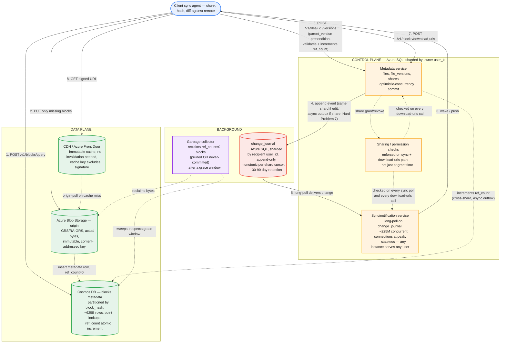

# Cloud File Storage & Sync (Google Drive / Dropbox) — System Design

**Domain:** Cloud file storage with multi-device sync, versioning, and sharing.
**Core tension:** the thing being stored (file bytes) is large and mostly unchanging, while the thing that has to feel instant (knowing something changed, and only moving the part that actually changed) is small and constant — naive designs collapse the two, either re-uploading/re-downloading whole files on every edit (bandwidth and latency blow up) or trying to solve real-time collaborative *editing* of shared byte ranges (a fundamentally harder problem than *sync*, and out of scope here). Get the chunking and change-detection granularity right and almost everything else in this problem falls out of decisions already made in the other designs in this series (content-addressed storage, optimistic concurrency, checkpoint/journal-based sync).

---

## Part 1: Requirements, Scale, and the Corrected Flow

### Functional requirements

1. **Add files** — upload from a client (e.g., drag-and-drop), stored durably.
2. **Download files** — retrieve any file (or a specific past version of it) a user has access to.
3. **Sync across devices** — a change made on one device propagates automatically to a user's other devices, without the user manually re-uploading/downloading.
4. **Revision history** — see (and restore) past versions of a file.
5. **Sharing** — grant other users (friends, family, coworkers) access to a file or folder, with some permission model (at minimum: read vs. write).
6. **Notifications** — a user is notified when a file is edited, deleted, or shared with them.

### Explicitly out of scope, stated up front

- **Real-time collaborative co-editing** (two people typing in the same document simultaneously, character-by-character). That's an operational-transform/CRDT problem — a fundamentally different consistency model (merging concurrent byte-range edits) than *file sync* (propagating whole-file version changes). This design assumes single-writer-per-version semantics: concurrent edits produce a version conflict, not a live merge.
- **Full-text/content search inside files** (OCR, document indexing). Treated as a separate downstream indexing pipeline consuming the same change journal this design produces — not a redesign of the storage/sync core.
- **Fine-grained enterprise ACLs** (org-wide policies, DLP, legal hold). Assume a simple per-file/per-folder read/write grant list; the real complexity there is policy, not the sync mechanism.
- **Folders as first-class, independently-permissioned objects.** `files.path` is treated as a flat string (folders-as-path-prefix, the same simplification object stores like S3 make) rather than a real folder tree with its own IDs and cascading share permissions. Worth naming explicitly as a scope cut: if sharing a *folder* (not just individual files) needs to cascade to everything inside it, `folders` becomes a real table with its own `shares`-equivalent — a meaningfully bigger addition, not something to design live unless asked.

### Non-functional requirements

- **Durability is the dominant constraint, more than any other system in this series.** Losing a user's only copy of a file is unrecoverable and catastrophic — unlike a stale cache or a lagging suggestion index, there's no "eventually corrects itself." This should be stated up front the same way the typeahead design led with latency: it's the one requirement everything else bends around.
- **Availability for reads/writes**, with a looser consistency bar than durability: a device that's been offline is allowed to be behind, as long as it always catches up correctly (no missed or duplicated changes) once it reconnects.
- **Bandwidth efficiency.** A one-line edit to a 500MB file must not cost a 500MB re-upload and re-download to every device.
- **Sync latency is real but coarse** — seconds, not milliseconds. This is a fundamentally different bar than the typeahead design's single-digit-millisecond read path; conflating them leads to over-building the propagation path.
- **Scale is defined by total bytes stored, not by request rate** — the opposite of the typeahead problem, where request rate was the binding constraint and total bytes were secondary.

### Capacity estimation

- **Users (assumption):** ~500M registered users, ~150M daily active.
- **Storage per user (assumption):** ~5GB average actually stored (heavily skewed — many users near-empty, a long tail of heavy users). **Total stored ≈ 500M × 5GB ≈ 2.5 exabytes.** This single number is the one that rules out a general-purpose database for the bytes themselves before any other design decision gets made.
- **Daily mutation events (assumption):** ~5 file add/edit/delete events per DAU per day (photo auto-backup, document saves) → 150M × 5 = **750M mutation events/day ≈ 8,700/sec average**. Peak factor ~4x (a morning burst as phones hit wifi and power) → **~35,000/sec peak.**
- **Bytes actually changed per mutation (assumption, and the number worth deriving out loud):** most edits touch a small fraction of a file, not the whole thing — assume ~500KB of genuinely new/changed bytes per mutation event on average. **New bytes ingested ≈ 750M × 500KB ≈ 375TB/day.** This is the number that motivates chunked, delta-only sync (Part 1 mistakes table, row 1) — re-deriving the whole-file-per-edit alternative (375TB/day × however much larger the average file is) makes the case without needing to assert it.
- **Chunking granularity (assumption):** ~4MB average block size (Dropbox's real-world anchor number) — small enough that a typical edit touches a handful of blocks, large enough that per-block metadata overhead doesn't dominate for the exabyte-scale corpus.
- **Total blocks (derived, not assumed — worth deriving live):** 2.5EB ÷ ~4MB ≈ **~625 billion blocks**, before any dedup. This is two to three orders of magnitude larger than `file_versions`' row count, and it's the number that decides `blocks` needs a fundamentally different storage engine than the rest of the metadata (Part 3) — not a guess, a consequence of the storage and chunking numbers already on the table.
- **Concurrent online devices at peak (the real driver of the sync-notification tier's size, not the metadata writes):** assume ~150M DAU × ~1.5 simultaneously-connected devices ≈ **~225M held connections at peak.** At ~50K held connections per sync-notification server, that's **~4,500 servers** just to hold connections — a presence/long-poll sizing problem structurally identical to the config-distribution design's Leg 2, at a much larger fleet size because every user device, not every host in a datacenter, is a connection.

### The corrected flow

| Common first draft | Why it fails | Fix |
|---|---|---|
| Re-upload/re-download the entire file on every edit | A one-line change to a 500MB file costs 500MB of transfer each way — at 375TB/day of *actual* new bytes, whole-file transfer would cost orders of magnitude more bandwidth for content that didn't change | Chunk files into blocks (~4MB), hash each block, and only transfer blocks whose hash isn't already present at the destination |
| Fixed-size chunking (split every file into 4MB blocks at fixed byte offsets) | Inserting a single byte at the start of a file shifts every subsequent block boundary — the whole file's blocks look "new" even though only one byte changed | Content-defined chunking (rolling hash / Rabin fingerprint, e.g., FastCDC): block boundaries are determined by content, not fixed offsets, so an insertion or deletion only perturbs the blocks immediately around it |
| Store file bytes as BLOBs in a general-purpose relational database | Exabyte-scale binary data destroys backup, replication, and I/O characteristics a relational engine is built around; this is the same category error as putting `query_counts` in an OLTP store, at far larger stakes | Store bytes in content-addressed object storage (block hash → bytes); keep only metadata (file tree, version manifests, shares) in a database sized for that much smaller workload |
| No dedup — every user's upload of the same file (or block) is stored again | Enormously popular files/blocks (common OS files, viral shared documents, stock template attachments) get stored once per uploader for no reason | Content-addressed storage: the block's hash *is* its storage key; two users uploading identical bytes land on the same block, reference-counted |
| Devices poll a "did anything change" endpoint on a fixed short interval | At ~225M devices, frequent polling is enormous wasted request volume for mostly-negative answers, the same problem the config-distribution design solved once already | Long-poll / push-based change notification off a per-user change journal with a cursor — a device is told when something changed, not asked to keep re-checking |
| Keep a full separate copy of the file for every historical version | Version history becomes a storage multiplier proportional to edit frequency × file size, defeating the dedup/chunking work just done | A version is a manifest (ordered list of block hashes), not a copy — an old version's blocks are still just references into the same content-addressed store; restoring a version costs nothing extra in storage |
| Broadcast the changed file's content as part of the "something changed" notification | Notifications fan out to every affected device; broadcasting payload multiplies bytes-in-flight by fan-out for data the recipient may not even want yet (offline, low bandwidth, or just not looking) | Notification carries only the event (which file, what kind of change, by whom) — the recipient's own sync agent pulls content afterward through the normal chunked sync path, on its own schedule |
| Increment a block's `ref_count` inside `PUT /v1/blocks/{hash}` itself | A client retry after a dropped response (bytes were written, ack was lost) re-runs the same `PUT` and double-counts a reference that's logically singular | `ref_count` changes only atomically inside the version-commit transaction, once per manifest reference — `PUT` only ever establishes that bytes exist, never counts |
| Commit a version without checking every hash in its manifest actually exists in `blocks` | A dropped or buggy upload lets a version reference a block that was never written — a permanently dangling reference, discovered only when someone tries to read it | Commit validates (and increments `ref_count` for) every manifest hash inside the same transaction as the `file_versions` insert; if any hash is missing, abort with a 400 before either table changes |
| Trust the client's claimed hash in `PUT /v1/blocks/{hash}` without re-checking it | A buggy or malicious client can poison the content-addressed store — writing arbitrary bytes under a hash other clients will trust as "the real content" for that key | Server independently computes the hash over received bytes and rejects (400) on any mismatch; never publish a block at its final key until the hash is verified over the complete body |
| Route per-user change/notification fan-out through a message-bus topic partitioned by user | Kafka/Event-Hub-style partitioning is built for a bounded partition count (thousands); hundreds of millions of users would mean many users sharing a partition, forcing every consumer to filter out everyone else's events | The durable record is a row in `change_journal`, an indexed table queried per-user (`WHERE user_id=? AND change_id>?`); a pub/sub layer, if used at all, only wakes an already-connected device's held connection sooner — never the source of truth |

---

## Part 2: API

### Creating a file — folded into the first version commit, not a separate call

There is no dedicated "create file" endpoint. The client generates `file_id` locally (a UUID) and includes `path` on its *first* commit, with `parent_version: null` signaling "create":

```http
POST /v1/files/{file_id}/versions
{
  "parent_version": null,
  "path": "/Photos/trip.jpg",
  "block_manifest": ["B1", "B2", "B3"],
  "device_id": "laptop-9f3"
}
```

Seeing no existing `files` row for this id, the server creates it and inserts `version 1` in the same transaction. This keeps the design consistent with everything else being content/client-addressed, and avoids a second endpoint — but it's a deliberate choice, not the only one: a separate `POST /v1/files {path, parent_folder_id}` that returns a server-assigned `file_id` *before* any content upload is the real-world alternative (this is what Google Drive's actual API does), and it has a genuine edge this design gives up — a file can appear in the UI ("uploading…") before content finishes, and it supports empty/native-format files that never need a block manifest at all. Worth naming both and picking one on purpose.

### Block-level upload — query before you push

```http
POST /v1/blocks/query
{ "block_hashes": ["a1b2...", "c3d4...", ...] }

// Response: which of these the server doesn't already have
{ "missing": ["c3d4..."] }
```

This call is read-only and has no side effects — trivially idempotent, callable any number of times with no accounting concerns.

```http
PUT /v1/blocks/{hash}
Authorization: Bearer <token>
Content-Type: application/octet-stream
Content-Length: 4194304

<raw block bytes>
```

Deliberately **no `file_id` in this call** — a block is global, not owned by any file; coupling upload to a file would break cross-file, cross-user dedup, which is the entire point of content addressing. `Authorization` identifies the uploading user/device for auth and abuse control, not for association with any file.

`PUT` is content-addressed and therefore naturally idempotent for the *bytes* (uploading the same content twice is a no-op keyed by the same hash) — but three things have to be handled deliberately, not assumed:

1. **`ref_count` is never touched here** (mistakes table) — only at commit time, so a retried `PUT` can't double-count.
2. **The server independently verifies the hash** over the received bytes and rejects a mismatch — never trust the URL's claim.
3. **A partially-written block must never become visible at its final key.** Write to a temp location, verify the complete body's hash, then atomically publish — so a dropped connection just means the client safely retries the whole `PUT`, no partial-state cleanup needed.

Response: `201` (new block written) or `200`/`204` (hash already existed, no-op) — no body needed.

### Committing a new file version — optimistic concurrency, same pattern as config-distribution

```http
POST /v1/files/{file_id}/versions
{
  "parent_version": 41,
  "block_manifest": ["a1b2...", "c3d4...", "e5f6..."],
  "device_id": "laptop-9f3"
}

// 200 on success: { "version": 42 }
// 409 on conflict: { "current_version": 43, "conflict": true }
```

`parent_version` is the same `expected_version` precondition the config-distribution design used for per-key commits — the client is asserting "I based this edit on version 41"; if the server's current version has already moved past that, the commit is rejected rather than silently overwriting a concurrent edit from another device (Part 5, Hard Problem 2).

Before accepting, the server validates that every hash in `block_manifest` already exists in `blocks` (mistakes table) — a version can never be committed pointing at bytes that were never actually uploaded.

**A related idempotency gap worth naming:** unlike block `PUT`, this endpoint isn't naturally retry-safe. If the commit succeeds but the response is lost, a client retry resubmits the same stale `parent_version` and gets a 409 indistinguishable from a genuine conflict from another device. Fix: an idempotency key (client-generated UUID per attempt) that lets the server recognize "you already succeeded" and return the original result instead of a spurious conflict.

### Reading a file (current or historical)

```http
GET /v1/files/{file_id}?version={n}

// Response: the manifest, not the bytes
{ "version": 41, "blocks": [{"hash": "a1b2...", "offset": 0, "size": 4194304}, ...] }
```

### Getting the bytes — a batch call that mints signed download URLs, mirroring `blocks/query` on the way in

```http
POST /v1/blocks/download-urls
{ "file_id": "F1", "block_hashes": ["B1", "B2'", "B3"] }

// Response
{
  "urls": {
    "B1":  "https://cdn.example.com/blocks/B1?sig=...&exp=1699999999",
    "B2'": "https://cdn.example.com/blocks/B2p?sig=...&exp=1699999999",
    "B3":  "https://cdn.example.com/blocks/B3?sig=...&exp=1699999999"
  }
}
```

`file_id` lets the server do the `shares` permission check (Part 5, Hard Problem 6) once for the whole batch, not per block. The client diffs the manifest's hashes against what it already has locally (usually most of them, given content-defined chunking) and requests URLs for only what's missing — then fetches bytes with a plain `GET` straight against the CDN, never through the API service. This is deliberate, not an oversight: routing the majority of this system's request volume (block downloads) through a per-request authorization check on the metadata tier would reintroduce the "control plane proxies data plane traffic" mistake this design otherwise avoids. The signed URL's short TTL is also the actual share-revocation enforcement point (Part 3, CDN section) — not cache eviction.

### File and folder management

```http
DELETE /v1/files/{file_id}                     -- soft delete: is_deleted=true, starts trash-retention window
PATCH  /v1/files/{file_id} { "path": "..." }    -- rename/move: metadata-only, no new version or block manifest
GET    /v1/files/{file_id}                      -- lightweight metadata (owner, path, current_version, shares) — distinct from the versioned manifest fetch above
GET    /v1/files?parent_folder_id={id}          -- list/browse
```

`PATCH` deliberately never touches `file_versions` or `blocks` — a rename is a pure `files.path` update, but it still appends a `change_journal` event so other devices relocate the file locally instead of treating it as untouched.

### Committing a restore

```http
POST /v1/files/{file_id}/versions/{n}/restore
```

Not a special mutation — it's a normal commit whose `block_manifest` is copied from version `n`'s manifest and whose `parent_version` is the current version. Restoring costs a metadata write, never a data copy (Part 3).

### Sharing

```http
POST /v1/files/{file_id}/share
{ "grantee": "coworker@example.com", "permission": "write" }
```

### Sync — the long-poll change feed

```http
GET /v1/sync?device_id={id}&since_cursor={cursor}

// Long-poll: holds until a change exists past the cursor, or times out
{ "changes": [{"file_id": "...", "version": 42, "type": "edited"}, ...], "cursor": "..." }

// If the cursor is older than the oldest retained change_journal row:
{ "resync_required": true, "reason": "cursor_too_old", "current_cursor": 88 }
```

Notifications are not a separate polled endpoint — they ride this same change feed as an event type (`edited` / `deleted` / `shared`), carrying only metadata, per the mistakes table above; a push channel (WebSocket/APNs/FCM) wakes an online device to call `/v1/sync` sooner rather than waiting out the long-poll timeout, but the change feed itself remains the single source of truth so an offline device catches up correctly regardless of whether a push was delivered. `resync_required` is the fallback for a device offline longer than `change_journal`'s retention window (Part 4) — it falls back to listing everything it owns/has access to and diffing against local state, rather than trying to replay a log that's been pruned out from under it.

---

## Part 3: Data Model

### Hashing — two different hash functions doing two different jobs

**The rolling hash, used only to decide chunk boundaries.** As the content-defined chunker (FastCDC or similar) scans a file, a cheap, incrementally-updatable rolling hash (a gear hash / Rabin fingerprint) over a small sliding window decides where to cut — cut whenever the hash matches a pattern tuned to land boundaries around the target ~4MB average. This hash never leaves the chunker; it has no correctness requirement beyond producing reasonably-sized, content-stable boundaries, so it doesn't need to be cryptographically strong.

**The content hash, used as the block's storage key — SHA-256 (or BLAKE3).** Once a block's bytes are fixed, hashing them identifies the block *and is its address* (`block_hash`, the `PUT`/`download-urls` path segment). This one has to be cryptographically strong, and the reason is structurally different from why the KV-store design's Merkle-tree hash didn't need to be: there, a collision just meant two replicas briefly missed a real difference — a performance hit that self-heals. Here, a collision would mean two different byte sequences alias to the same storage key, and the second upload's bytes would simply never be stored — a correctness and security failure, not a missed optimization. SHA-256's 256-bit space makes this astronomically unlikely even at ~625 billion blocks (Part 1) — a stated assumption, the same discipline as every other assumption in this doc, and the same one Git, Dropbox, and IPFS make in production. MD5/SHA-1 are excluded outright: both are cryptographically broken, meaning an attacker could deliberately construct a collision — intolerable for a hash that *is* a storage address. BLAKE3 is the modern alternative worth naming if hashing throughput comes up: multi-GB/s per core, parallelizable, comparable security margin — relevant because hashing happens **twice** at this data volume (client-side during chunking, and again server-side on every `PUT` to verify the claim), and server-side verification throughput at ~375TB/day (Part 1) is a real capacity line item, not an afterthought.

### Blocks — content-addressed, deduplicated globally, metadata only (the bytes live elsewhere, see below)

```sql
CREATE TABLE blocks (
    block_hash   TEXT PRIMARY KEY,      -- SHA-256 of block content
    storage_key  TEXT NOT NULL,         -- location in Blob Storage
    size_bytes   INT NOT NULL,
    ref_count    BIGINT NOT NULL DEFAULT 0
);
```

`ref_count` is what makes garbage collection safe: a block is only eligible for deletion when nothing — no file version, for any user — still references it (Part 5, Hard Problem 3). It's written in two separate steps at two separate times, and the gap between them is where an orphaned upload comes from:

```sql
-- T0, inside PUT /v1/blocks/{hash}: establish existence, ref_count starts at 0
INSERT INTO blocks (block_hash, storage_key, size_bytes, ref_count)
VALUES ($hash, $storage_key, $size, 0)
ON CONFLICT (block_hash) DO NOTHING;

-- T1, inside the version-commit transaction: claim a reference for every hash in the manifest
UPDATE blocks SET ref_count = ref_count + 1
WHERE block_hash = ANY($manifest_hashes);
-- then verify rows affected == length($manifest_hashes); if fewer, ROLLBACK + 400 (mistakes table)
```

A block that's `PUT` but never committed sits at `ref_count = 0` from the moment it's written, not after some later prune — it's an orphan from birth, and it's reclaimed by the exact same grace-window GC logic as any other zero-referenced block (Hard Problem 3), not a special case.

**Storage engine: not Azure SQL, and not for the same reason `query_counts` in the typeahead design wasn't DynamoDB — the opposite reasoning applies here.** Every access to this table (`blocks/query`, the `PUT` existence check, the `ref_count` increment) is a point read or point write by `block_hash` — no joins, no range scan, no sort order. At ~625 billion rows (Part 1), that's the textbook shape for a globally-distributed wide-column/KV store — **Azure Cosmos DB, partitioned by `block_hash`** — which also gives an atomic increment primitive for `ref_count` natively. `query_counts` needed a full sorted scan and was wrong for a KV store; `blocks` needs pure point lookups and is wrong for a relational engine. Same underlying principle ("match the store to the access pattern, not the schema shape"), opposite conclusion.

### File versions — a manifest is a list of block references, not a copy

```sql
CREATE TABLE file_versions (
    file_id         UUID NOT NULL,
    version         BIGINT NOT NULL,
    parent_version  BIGINT,                 -- optimistic-concurrency precondition at commit time; not a live FK (see pruning below)
    block_manifest  JSONB NOT NULL,         -- ordered [{block_hash, offset, size}, ...]
    created_by_device TEXT NOT NULL,
    created_at      TIMESTAMPTZ NOT NULL DEFAULT now(),
    PRIMARY KEY (file_id, version)
);

CREATE TABLE files (
    file_id         UUID PRIMARY KEY,
    owner_id        UUID NOT NULL,
    path            TEXT NOT NULL,
    current_version BIGINT NOT NULL,
    is_deleted      BOOLEAN NOT NULL DEFAULT false
);
```

Two versions of a mostly-unchanged large file share almost their entire `block_manifest` — restoring version 30 after being on version 42 costs a metadata write, not a data copy.

**Worked example — create, edit, conflict, restore, prune, GC**, tracing one file (`F1`, owner `U1`) through its full lifecycle. Blocks: `B1,B2,B3` initially; an edit replaces `B2` with `B2'`.

| Step | Action | `file_versions` | `blocks.ref_count` |
|---|---|---|---|
| 1. Create | `commit(parent=null, manifest=[B1,B2,B3])` → v1 | v1=[B1,B2,B3] | B1=1, B2=1, B3=1 |
| 2. Edit (Device A) | query→missing=[B2']; upload B2'; `commit(parent=1, manifest=[B1,B2',B3])` → v2 | v1, v2=[B1,B2',B3] | B1=2, B2=1 *(still held by v1)*, B2'=1, B3=2 |
| 3. Conflicting edit (Device B, offline since v1) | `commit(parent=1, ...)` → server's current is 2 → **409**; saved as a new file `F2`, not merged | *(F2, separate file, unaffected here)* | *(F2's own blocks)* |
| 4. Restore v1 | `restore(version=1)` → copies v1's manifest → v3, `parent=2` | v1, v2, v3=[B1,B2,B3] *(copy)* | B1=3, B2=2, B3=3 |
| 5. Prune v1 (retention window passed) | delete `file_versions` row for v1; decrement its blocks | v2, v3 remain | B1=2, B2=1, B3=2 — **nothing hit zero**, since v2/v3 still hold most of them |
| 6. Prune v2 later; GC sweep | B2' was only ever referenced by v2 | v3 remains | B2': 1→0 → sits through the grace window → **reclaimed** |

Two details worth stating explicitly from this table: restoring never uploads new bytes (v3 is a pure reference copy of v1's manifest), and pruning an old version usually reclaims metadata but not bytes — a block only actually frees up once *every* referencing version is gone. Also note `v2.parent_version = 1` after step 5: it now points at a deleted row, and that's fine — `parent_version` only ever needed to exist as a compare-and-swap value at commit time, not as a permanent foreign key, so pruning is never blocked by newer versions citing an older one as their parent.

### Shares and the per-user change journal (what `/v1/sync` reads from)

```sql
CREATE TABLE shares (
    file_id      UUID NOT NULL,
    grantee_id   UUID NOT NULL,
    permission   TEXT NOT NULL,   -- 'read' | 'write'
    shared_at    TIMESTAMPTZ NOT NULL DEFAULT now(),
    PRIMARY KEY (file_id, grantee_id)
);

CREATE TABLE change_journal (
    change_id    BIGSERIAL PRIMARY KEY,   -- monotonic, shard-local — this IS the sync cursor
    user_id      UUID NOT NULL,           -- whose feed this entry belongs to
    file_id      UUID NOT NULL,
    version      BIGINT,
    event_type   TEXT NOT NULL,           -- 'edited' | 'deleted' | 'shared'
    actor_id     UUID NOT NULL,
    created_at   TIMESTAMPTZ NOT NULL DEFAULT now()
);
```

`change_journal` is the same shape of idea as the config-distribution design's `commits` table — an append-only, monotonically-ordered log that a long-poll endpoint watches a checkpoint against — applied here per-user (fan-out on write: a share or edit writes one row per affected user) rather than per-key, because the read side here is "what changed for me," not "what's the current value of this key."

**Storage engine: Azure SQL, sharded by `user_id` — the same tier as `files`/`file_versions`/`shares`, not a message bus.** The access pattern is an indexed range scan (`user_id, change_id > cursor`), the same shape as everything else in this tier, and per-user-partitioned Kafka/Event-Hub topics don't scale to hundreds of millions of partitions (mistakes table). A single Azure SQL instance can't hold this alone at ~35K commit-events/sec peak and billions of accumulating rows, so shard by `user_id` (`shard = hash(user_id) % N`) — every *edit's* commit transaction (insert `file_versions` + append `change_journal`) then stays inside one shard, since an edit's actor and its owner are the same user.

**`change_journal` needs its own, much shorter retention than `file_versions` — they serve different purposes.** `file_versions` is permanent history (its own milestone policy, Hard Problem 4); `change_journal` is a transient catch-up queue with no further purpose once every device has advanced past a row. A reasonable policy: retain 30-90 days regardless of cursor position, then prune — which is exactly what makes `resync_required` (Part 2) a real, designed-for case rather than an edge case: a device offline longer than the retention window has a cursor pointing at rows that no longer exist, and the server has to detect that explicitly and tell it to fall back to a full listing-and-diff instead of trying to serve a gap it can't fill.

### Real bytes: Azure Blob Storage as the origin, Azure Front Door/CDN in front of it for reads

`blocks.storage_key` points into Blob Storage, not Cosmos DB — Cosmos DB holds only the small metadata row. Key naming derives from the hash itself (e.g., `blocks/{hash[0:2]}/{hash[2:4]}/{hash}`); because SHA-256 output is high-entropy and uniformly random, this spreads load across Blob Storage's internal partitioning for free, unlike a sequential key which would concentrate writes on one range.

**Durability tier follows directly from Part 1's stated priority.** Durability was named the dominant NFR — that rules out locally-redundant storage as the default; this needs **GRS or RA-GRS** (geo-redundant, paired-region replication) so a full region loss isn't a data-loss event, a direct consequence of the requirement stated on page one, not a generic "use redundant storage."

**No multipart/resumable-upload protocol needed at this layer, and that's a consequence of the chunking design, not an omission.** Blocks are capped at ~4MB by content-defined chunking — small enough for a single ordinary `PUT`; if it fails partway, the client just retries the whole (small) block, safe because `PUT` is idempotent by construction.

**Read path is three layers, and the write path bypasses the middle one entirely:**

| | Write (`PUT /v1/blocks/{hash}`) | Read (via `download-urls` → CDN) |
|---|---|---|
| Client talks to | Blob Storage directly | CDN edge only |
| Cosmos DB | Metadata row inserted/upserted | Consulted once, when minting the signed URL (permission check + `storage_key` lookup) |
| CDN | Not involved | Cache hit: served from edge, Blob Storage untouched. Cache miss: origin-pull from Blob Storage, cached, served |
| Source of truth | — | Always Blob Storage; a fully-flushed CDN cache is a latency blip (re-populates on next request), never a durability incident |

**Content-addressing makes this an unusually clean CDN case: there's no cache-invalidation problem at all.** A block's URL is derived from its hash, and a block is immutable — an edit produces a *new* hash, never a mutation behind an old one. `Cache-Control: immutable, max-age=<very long>` is simply correct forever; no revalidation round-trip with the origin is ever needed. The **cache key must be derived from the hash in the path, not the full signed URL** — two different users' independently-signed URLs for the same block must map to the same cache entry, or the content most worth caching (highly-deduplicated, high-`ref_count` blocks) never actually gets cache hits.

**Revocation is enforced by signed-URL expiry, not CDN cache eviction — and that's what reconciles CDN caching with Hard Problem 6.** A revoked user simply can't obtain a new valid signed URL, because `download-urls` re-checks `shares` every time. The CDN never needs to evict on revocation: cached bytes are inert without a currently-valid signature, so caching them indefinitely is harmless — "how long do we cache bytes" (forever, they're immutable) and "how long is access authorized" (short TTL, re-checked per request) are two independent lifetimes, and conflating them would be the mistake.

**Tiering, worth naming as a cost lever, not essential to correctness:** blocks belonging only to aged-out, pruned versions can move to Blob Storage's Cool/Archive tiers — the same "not everything needs to be fast to read, only fast to write" idea as the typeahead design's trending-vs-baseline split, applied to storage cost.

---

## Part 4: Major Components

**Client sync agent.** Watches the local filesystem for changes, applies content-defined chunking to modified files, hashes the resulting blocks, calls `POST /v1/blocks/query` to find out what's actually missing remotely, uploads only those blocks, then commits a new version. On the receive side, it long-polls `/v1/sync`, and for each incoming change downloads the version's manifest, calls `download-urls` for whatever it doesn't already have locally, and fetches those blocks from the CDN (the same delta principle applies symmetrically in both directions).

**Upload sequence, concretely — a brand-new file, three blocks, one of which happens to already exist from someone else's earlier upload (dedup in action):**

| # | Call | Notes |
|---|---|---|
| 0 | *(local)* generate `file_id`, chunk, hash → `[B1,B2,B3]` | no network yet |
| 1 | `POST /v1/blocks/query [B1,B2,B3]` | e.g. `missing=[B1,B3]` — `B2` already exists |
| 2 | `PUT /v1/blocks/B1`, `PUT /v1/blocks/B3` | parallel, independently retryable |
| 3 | `POST /v1/files/{file_id}/versions {parent_version:null, path, manifest:[B1,B2,B3]}` | creates `files` row + `version 1` atomically; server validates all three hashes exist first |
| 4 | *(other devices)* pick up the `created` event on their next `/v1/sync` | not part of this device's own flow |

**Edit propagation — single-shard and synchronous, the direct contrast to sharing below.** Alice edits on her laptop; content-defined chunking means only the touched region re-hashes (`B2` → `B2'`). The commit transaction (insert `file_versions` v(n+1), bump `files.current_version`, increment `ref_count` on every manifest block, append a `change_journal` row for Alice) all happens in **one shard, one transaction** — because the editor and the notified party are the same user. Her phone's held long-poll wakes on the new `change_journal` row, pulls the new manifest, and fetches only `B2'` — it already has `B1` and `B3` from syncing the prior version.

**Sharing — cross-shard and asynchronous, and this is the direct contrast worth stating out loud.** `shares` and `files` live in the *owner's* shard; `change_journal` is queried by the *recipient's* `user_id`, almost always a different shard. So a share write is a cross-shard operation: `shares` is committed first (synchronous, in the owner's shard — this is the authoritative access-control record, and it's what every subsequent sync poll and block fetch re-validates against per Hard Problem 6), then the `change_journal` row for the grantee is appended asynchronously (an outbox pattern off that same transaction) into the *grantee's* shard. A brief delay before the grantee is notified is harmless, because access is already correctly gated the moment they do find out — from the notification, or just from opening the app.

**Metadata service.** Owns `files`, `file_versions`, `shares`, `change_journal` on Azure SQL, sharded by `user_id`. Sized for the mutation-event write rate (~35K/sec peak), not for the byte volume — the same throughput-vs-storage split named explicitly in the typeahead design, just with the two numbers decoupled instead of coincidentally similar.

**Block metadata service.** Owns `blocks` on Cosmos DB, partitioned by `block_hash` — a deliberately different partition key and different engine from the metadata service above, because the access pattern (point lookups at ~625B rows) is different in kind, not just in scale (Part 3).

**Block storage + CDN.** Azure Blob Storage (GRS/RA-GRS) holds the actual bytes; Azure Front Door/CDN fronts every read. Writes go straight to Blob Storage and never touch the CDN (Part 3's read/write-path table).

**Sync/notification service.** Holds ~225M concurrent long-poll/WebSocket connections across ~4,500 stateless instances (Part 1) — any instance can serve any user's poll, since all real state (the journal, the cursor) lives in shared storage, not server memory; only an optional "wake this connection sooner" pub/sub signal benefits from knowing which instance holds a given user's connection, and correctness never depends on that signal arriving. A device offline longer than `change_journal`'s retention returns `resync_required` (Part 2/3) rather than attempting an incremental catch-up over a gap that no longer exists.

**Garbage collector.** Periodically finds blocks with `ref_count = 0` — whether from a pruned version (Hard Problem 3) or a `PUT` that was never followed by a successful commit (Part 3, orphaned uploads) — and reclaims their storage after a grace window. Runs as a background sweep, deliberately decoupled from the request path.

**Chunking library (shared by every client).** Implements content-defined chunking (e.g., FastCDC) — this has to be the same algorithm, byte-for-byte, on every platform, or two clients would compute different block boundaries for identical content and defeat cross-device dedup entirely.

---

## Part 5: The Hard Problems

**1. Fixed-size chunking silently breaks the entire delta-sync premise for anything but pure appends.** A naive fixed-4MB-boundary chunker looks correct on the common case (append to end of file, e.g., a growing log) but fails the moment a user inserts or deletes bytes anywhere before the end — every block boundary downstream of that point shifts, so every subsequent block hashes differently even though the actual content mostly didn't change. Content-defined chunking (a rolling hash that places boundaries based on local content patterns) re-synchronizes boundaries after the edited region, so only the blocks actually touched by the edit produce new hashes. This is the single detail that separates "I know Dropbox uses block-level sync" from "I know why it has to be content-defined, not fixed-size."

**2. Concurrent edits from multiple devices need a conflict policy, not a merge algorithm.** Two devices both editing the same file offline, then both reconnecting, will both try to commit a new version with the same `parent_version`. The optimistic-concurrency check (Part 2) means only one wins the commit; the loser doesn't get silently overwritten or blocked forever — its edit is preserved as a conflicted copy (a new file, e.g., `report (conflicted copy, laptop-9f3, 2026-09-08).docx`), and the user resolves it manually. This is a deliberate, honest scope boundary against Part 1's "no real-time co-editing."

**3. Reference counting a globally-shared, deduplicated block store has a real race condition, not just an accounting detail.** Consider: block X has `ref_count=1` (only file A references it). File A is deleted, decrementing to 0 — but concurrently, a new upload from file B computes the same content hash and is about to reference block X. If the GC sweep observes `ref_count=0` and deletes the block between B's hash-check and B's commit, B's commit now points to a block that no longer exists. The fix is ordering, not locking the whole store: increment `ref_count` inside the same transaction as the version commit (Part 3), and have GC only ever act on blocks that have sat at `ref_count=0` continuously through a grace window (not "observed at 0 once") — the same class of fix as debounce-before-delete patterns used elsewhere for distributed cleanup. This also covers the "orphaned upload" case (Part 3) for free: a block that's `PUT` but never committed is just another `ref_count=0` block subject to the same grace window.

**4. Unbounded version history is an unbounded storage-growth policy problem, even with block-level dedup.** Every edit still creates a new manifest row, and a file that's frequently, heavily edited still generates genuinely new blocks over time (dedup helps with duplicate content, not with content that keeps changing). Retention needs an explicit, stated policy — e.g., dense version history for the last 30 days, then collapse to daily or weekly milestones, with anything older pruned unless explicitly pinned — presented as a stated trade-off rather than an unlimited default that quietly becomes an ops problem at scale.

**5. Sync distribution for ~225M concurrent devices is a presence problem wearing a file-sync costume — solve it as one.** The natural instinct is to reach for the config-distribution design's long-poll mechanism wholesale, and structurally that's right (`change_journal` mirrors `commits`) — but the scale driver is different: config-distribution's host count is bounded by infrastructure (thousands of hosts), while device count here is bounded by *user* population (hundreds of millions), two to three orders of magnitude larger. That makes connection-holding (Part 1's ~4,500-server estimate) the dominant cost center of the whole system, more than storage or metadata — a counter-intuitive result worth stating explicitly for a "file storage" system. A related, designed-for edge case: a device offline longer than `change_journal`'s retention window can't be served incrementally at all (its cursor points at rows that no longer exist) — the sync endpoint must detect this and return `resync_required`, falling back to a full list-and-diff, rather than silently serving a gap.

**6. Revoking a share has to take effect on the sync path, not just the UI.** If Alice un-shares a file from Bob, Bob's client must stop being able to pull future versions of it — not just have the file disappear from a file-picker UI while the sync agent, running in the background, keeps quietly syncing changes it already had access to. This means the permission check has to live on the `/v1/sync` and `download-urls` paths themselves (re-validated on every poll and every URL request), not only on the initial share-grant UI action. This is also why signed download URLs are short-lived: revocation is enforced by denying a *new* URL, not by evicting anything already cached at the CDN edge (Part 3) — the two lifetimes (cache duration, authorization duration) are deliberately independent.

**7. This system has three different natural partition keys, and any operation touching more than one of them needs an explicit consistency strategy — not an assumed single transaction.** `files`/`file_versions`/`shares` shard by the *owner's* `user_id`; `change_journal` is read by the *recipient's* `user_id`; `blocks` partitions by `block_hash`. Two operations cross these boundaries: a version commit touches both the owner's shard (`file_versions`) and the hash-partitioned `blocks` store (`ref_count` increments); a share touches both the owner's shard (`shares`) and the grantee's shard (`change_journal`). Neither can be a single ACID transaction once they span different partition keys or different database engines entirely. The resolution is the same in both cases, and it's not a coincidence: commit the operation's *authoritative* record first (the version row; the `shares` row), then apply the second system's update asynchronously and idempotently (an outbox pattern), tolerating a brief lag — which is safe precisely because nothing on the read/authorization path actually depends on that second update being instantaneous: GC's grace window already tolerates a lagging `ref_count`, and permission checks read `shares` directly rather than waiting on `change_journal`. Naming this pattern once, explicitly, and pointing at both instances of it is a stronger signal than solving each in isolation as if they were unrelated.

---

## Part 6: How to Run This in the Interview

1. **(0-5 min) Requirements and the durability-vs-latency framing.** Lead with durability as the dominant constraint (unlike every other design in this series, where latency or freshness led) — this reframes every later trade-off correctly from the start.
2. **(5-12 min) Capacity — derive the "actual new bytes per day" number, not just total storage.** Total storage (2.5EB) shows scale; daily *new* bytes (375TB, from a much smaller per-edit assumption) is what actually motivates chunked delta sync. Deriving the ~625B-block count from the same numbers is what later justifies splitting `blocks` onto a different storage engine than the rest of the metadata.
3. **(12-22 min) API — block-query-then-upload, optimistic concurrency on commit, and the download side (`download-urls`).** Naming the missing-block validation and the ref_count-only-at-commit-time rule heads off "what if an upload is interrupted" before she has to ask.
4. **(22-35 min) Data model, chunking, and hashing — spend the most time here.** Content-defined vs. fixed-size chunking (Hard Problem 1), and the rolling-hash-vs-content-hash distinction (why the content hash has to be cryptographic and the chunking hash doesn't) — this problem's version of the typeahead design's precomputed-top-K decision.
5. **(35-42 min) Storage engine choices and the partition-key mismatch.** Azure SQL (sharded by owner) for metadata, Cosmos DB (partitioned by hash) for blocks, Blob Storage + CDN for bytes — and Hard Problem 7's cross-shard resolution, which is the single most "have you actually built something like this" detail in the whole design.
6. **(42-48 min) Sync/notification distribution, sharing, and revocation.** Name the connection-count scale explicitly (~225M devices), the edit-vs-share single-shard/cross-shard contrast, and the share-revocation-on-the-sync-path point.
7. **(48-50 min) Close.** Name the scope cuts (real-time co-editing, full-text search, enterprise ACLs, folders-as-first-class-objects) and where each would plug in.

### Staff/Principal signal checklist

- Leads with durability, not latency, as the dominant non-functional constraint — and explains why this problem's priority ordering differs from the others in this series.
- Derives the "actual new bytes/day" and "~625B blocks" capacity numbers rather than asserting "obviously we need delta sync and a different store for blocks."
- Chooses content-defined chunking over fixed-size and explains the insertion/deletion boundary-shift failure mode specifically, not just "it's smarter."
- Distinguishes the chunking rolling-hash from the content-identity hash, and explains why only the latter needs to be cryptographically collision-resistant — tying the reason directly to it being used as a storage address, not just a comparison.
- Treats a version as a manifest of block references, not a copy — and connects this directly to why version history doesn't multiply storage cost.
- Matches storage engine to access pattern rather than schema shape in both directions: relational/sharded-by-owner for `files`/`file_versions` (needs transactions, range scans), a point-lookup KV store for `blocks` (625B rows, pure point access) — explicitly contrasting with the opposite (and equally deliberate) call made for `query_counts` in the typeahead design.
- Names the reference-counting/GC race condition unprompted, and fixes it with ordering/grace-window logic rather than a blanket lock — and recognizes it's the same underlying pattern as the sharing cross-shard write (Hard Problem 7), not two unrelated problems.
- Identifies that sync-connection count, not storage or metadata throughput, is this system's actual bottleneck at scale.
- Enforces share revocation on the sync/download path itself via short-lived signed URLs, not by evicting CDN cache — keeping "how long we cache" and "how long access is authorized" as deliberately independent lifetimes.

---

## Part 7: Worked Examples — full table state, checkpoint by checkpoint

The tables below trace three concrete scenarios to the level of "what does every row in every table actually look like" — worth having ready if asked to show mechanics rather than just describe them.

### Example 1 — one file's full lifecycle: create → edit → conflicting edit → restore → prune → GC

File `F1`, owner `U1` (Alice), path `report.docx`. Blocks `B1, B2, B3` initially; an edit later replaces `B2` with `B2'`.

**Checkpoint A — after initial upload (`commit(parent=null, manifest=[B1,B2,B3])` → v1):**

`files`: `file_id=F1, owner_id=U1, path=report.docx, current_version=1, is_deleted=false`

`file_versions`:

| file_id | version | parent_version | block_manifest | created_by_device |
|---|---|---|---|---|
| F1 | 1 | null | [B1, B2, B3] | deviceA |

`blocks`: B1=1, B2=1, B3=1

`change_journal` (U1's feed): `change_id=1, file_id=F1, version=1, event_type=created, actor_id=U1`

---

**Checkpoint B — after editing the middle of the file on Device A (`commit(parent=1, manifest=[B1,B2',B3])` → v2). Content-defined chunking means only `B2` re-hashes.**

| Step | Client sends | Server action |
|---|---|---|
| 2a | `blocks/query([B1,B2',B3])` | server has B1, B3 → `missing=[B2']` |
| 2b | `PUT B2'` | new block stored, `ref_count` untouched by this call |
| 2c | `commit(parent=1, manifest=[B1,B2',B3])` | `current_version`==1 matches → accepted → v2 |

`files`: `current_version=2`

`file_versions`:

| file_id | version | parent_version | block_manifest |
|---|---|---|---|
| F1 | 1 | null | [B1, B2, B3] |
| F1 | 2 | 1 | [B1, B2', B3] |

`blocks`: B1=2 (v1,v2), B2=1 (**still held by v1 only** — not deleted just because v2 stopped using it), B2'=1 (v2 only), B3=2 (v1,v2)

`change_journal`: adds `change_id=2, file_id=F1, version=2, event_type=edited, actor_id=U1`

`shares`: empty — no share exists yet

---

**Checkpoint C — a conflicting edit from Device B, offline since v1, reconnects now:**

| Step | Client sends | Result |
|---|---|---|
| 3 | `commit(parent=1, manifest=[B1,B2,B3'])` | server's `current_version` is 2, not 1 → **409 conflict** |

Device B's edit is not merged or dropped — it becomes a new file `F2`, `v1: manifest=[B1,B2,B3']`, `ref_count` B1=3, B2=2, B3'=1. `F1`'s own tables are unaffected by this branch.

---

**Checkpoint D — restore v1 (`restore(version=1)` → copies v1's manifest → v3, `parent_version=2`):**

`files`: `current_version=3`

`file_versions`:

| file_id | version | parent_version | block_manifest |
|---|---|---|---|
| F1 | 1 | null | [B1, B2, B3] |
| F1 | 2 | 1 | [B1, B2', B3] |
| F1 | **3** | **2** | **[B1, B2, B3]** *(copy of v1 — zero new bytes uploaded)* |

`blocks`: B1=3, B2=2 (v1,v3), B2'=1 (v2 only), B3=3

`change_journal`: adds `change_id=3, version=3, event_type=edited, actor_id=U1`

---

**Checkpoint E — prune v1 once it ages past the retention window (metadata-only delete, decrement its blocks' `ref_count`):**

`file_versions`: row for v1 **deleted**; v2 and v3 remain (`v2.parent_version=1` now points at a deleted row — harmless, since `parent_version` was only ever a compare-and-swap value at commit time, never a live foreign key)

`blocks`: B1=2, B2=1 (still held by v3), B2'=1 (unaffected, wasn't in v1's manifest), B3=2

**Nothing hit zero** — the realistic outcome, since surviving versions still reference most of v1's blocks.

---

**Checkpoint F — later, v2 itself is pruned; GC sweep runs:**

`blocks`: decrementing v2's manifest drops `B2'`: 1→0. It sits through the grace window (Hard Problem 3's race-condition guard), then GC reclaims its bytes from Blob Storage and removes its Cosmos DB row.

---

### Example 2 — sharing across shards: Alice (`U1`) shares `F1` with Bob (`U2`)

Shard assignment (4 shards for illustration, `shard = hash(user_id) % 4`): Alice → **Shard A**, Bob → **Shard B**. `files`/`shares` are sharded by *owner*, so they live in Shard A; `change_journal` is sharded by *feed owner*, so Bob's entries live in Shard B — a different shard than the file itself.

**Step 1 — synchronous write, Shard A only (the authoritative record):**

`files` (Shard A): `F1, owner=U1, path=/Photos/trip.jpg, current_version=3`

`shares` (Shard A):

| file_id | grantee_id | permission | shared_at |
|---|---|---|---|
| F1 | U2 | write | 10:00:00 |

From this instant, Bob's sync polls and block-download requests already pass permission checks (Hard Problem 6) — before he's told anything.

**Step 2 — async outbox write lands in Shard B a few seconds later:**

`change_journal` (Shard B, Bob's feed — he already had 14 prior rows from his own activity):

| change_id | user_id | file_id | version | event_type | actor_id | created_at |
|---|---|---|---|---|---|---|
| 14 | U2 | F7 (Bob's own file) | 2 | edited | U2 | 09:58:10 |
| **15** | **U2** | **F1** | **3** | **shared** | **U1** | **10:00:03** *(3s async lag)* |

**Step 3 — Bob's device long-polls Shard B, cursor was at 14:**

```
GET /v1/sync?device_id=bob-laptop&since_cursor=14
→ { "changes": [{"file_id":"F1","version":3,"type":"shared"}], "cursor": 15 }
```

Device then calls `download-urls` for whatever blocks it's missing and reconstructs the file.

**Retention — 90-day sweep on Shard B, today = Sep 8:**

| Before prune | After prune |
|---|---|
| change_id 1–5 (from March, >90 days old), 6–15 (recent) | 1–5 **deleted**, 6–15 remain |

**The edge case this creates — a device offline since January, cursor stuck at 3:**

```
GET /v1/sync?device_id=bob-old-phone&since_cursor=3
→ { "resync_required": true, "reason": "cursor_too_old", "current_cursor": 15 }
```

Oldest retained `change_id` is now 6 — the requested range (4, 5) no longer exists, so the server must refuse an incremental answer rather than silently skip the gap. Device falls back to listing everything it owns/has access to, diffs against local state, pulls what's missing, then resumes long-polling from cursor 15.

---

### Example 3 — edit sync between two of the same user's devices (single-shard, synchronous — the direct contrast to Example 2)

Alice's Laptop and Phone, both `U1`, both in Shard A, both caught up at `change_id=40` with local blocks `[B1,B2,B3]` for `F1` (`current_version=5`).

**Step 1 — Alice edits on Laptop. Only the touched region re-hashes: `[B1, B2', B3]`.**

| Step | Call | Result |
|---|---|---|
| 1 | `blocks/query [B1,B2',B3]` | `missing=[B2']` |
| 2 | `PUT B2'` | uploaded |
| 3 | `commit(parent=5, manifest=[B1,B2',B3])` | matches `current_version`=5 → accepted → **version=6** |

**Server-side, one transaction, one shard — no async outbox needed here, unlike Example 2:**

| Table | Change |
|---|---|
| `files` | `current_version`: 5 → 6 |
| `file_versions` | new row: v6, manifest=[B1,B2',B3] |
| `blocks` | B1 ref++, B3 ref++, B2'=1 (B2 untouched, still held by v5) |
| `change_journal` | new row: `change_id=41, user_id=U1, file_id=F1, version=6, event_type=edited, actor_id=U1` |

**Step 4 — Phone's held long-poll wakes:**

| Step | Call | Result |
|---|---|---|
| 4 | (long-poll returns) | `{ changes: [{file_id:F1, version:6, type:"edited"}], cursor: 41 }` |
| 5 | `GET /v1/files/F1?version=6` | manifest = [B1, B2', B3] |
| 6 | `download-urls([B2'])` — Phone already has B1, B3 locally | fetches only **B2'** via the CDN (origin-pull from Blob Storage on first fetch, cached after) |
| 7 | Phone reconstructs the file, sets cursor=41 | done — edit visible on Phone |

Laptop will also eventually see `change_id=41` on its own next poll — harmless, since it already has all three blocks and the event is just a no-op cursor advance.

---

## Appendix: Mermaid source


