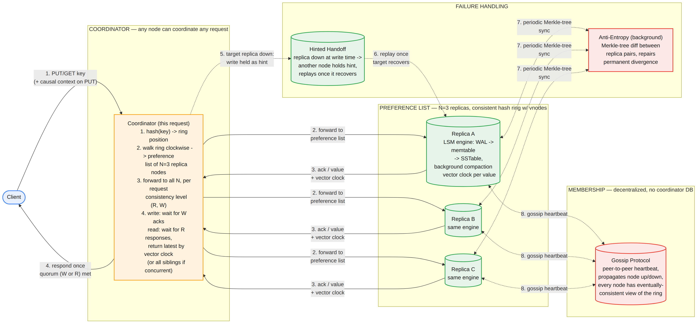
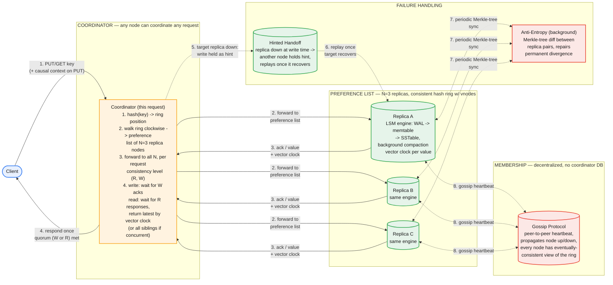

# Distributed Key-Value Store — System Design

The central tension: a key-value store that must keep serving reads and writes even when nodes fail or the network partitions, while still letting an operator reason precisely about how stale a read can be. Every hard decision below — partitioning, replication, the consistency knob, conflict resolution — comes back to where you land on the CAP tradeoff, and whether you can defend that choice with numbers rather than a buzzword.

## Part 1 — Requirements, Capacity, and the CAP Decision

### Functional Requirements

1. `put(key, value)` — write an opaque value (byte blob) for a key.
2. `get(key)` — read the value(s) for a key. May return more than one value if concurrent writes are unresolved (see Part 5).
3. `delete(key)` — logical delete (tombstone), not immediate physical removal.
4. Values are opaque blobs up to 1MB; no server-side schema, no secondary indexes, no range queries, no multi-key transactions. This is explicitly a single-key store — scoping out cross-key atomicity is what makes horizontal partitioning tractable.

### Non-Functional Requirements — and the tradeoff stated up front

1. **Availability over strict consistency (AP, not CP).** Every write and every read must succeed even during a network partition or node failure, at the cost of allowing temporarily stale or conflicting reads. This is the single decision that shapes everything else in this document — a candidate who doesn't say this explicitly in the first five minutes hasn't picked a design yet, they've picked a feature list.
2. **Horizontal, incremental scalability.** Adding or removing a node should move a bounded fraction of the data, not trigger a full reshuffle.
3. **Durability.** A write acknowledged to the client must survive a single-node failure (replication factor N ≥ 3).
4. **Low latency.** p99 read/write latency in single-digit milliseconds under normal operation.
5. **Tunable consistency.** Not every caller wants the same latency/freshness tradeoff — expose it as a per-request knob, not a fixed system-wide setting.

### Capacity Estimation

| Dimension | Value |
|---|---|
| Total keys | 1B |
| Avg value size | 1KB (max 1MB, supported but not the common case) |
| Raw data (before replication) | 1B × 1KB ≈ 1TB |
| Replication factor (N) | 3 |
| Replicated data (before LSM overhead) | ~3TB |
| LSM compaction/WAL overhead (~1.5x) | ~4.5TB, round to **~5TB total stored** |
| Read : write ratio | 10 : 1 |
| Average ops/sec | 500K/sec (450K reads, 50K writes) |
| Peak ops/sec (5x avg) | **2.5M/sec** (2.25M reads, 250K writes) |
| Sustainable ops/sec per node (SSD-backed LSM engine) | ~15K/sec |
| **Nodes needed for peak throughput** | 2.5M / 15K ≈ 167 → **~180 nodes** (headroom) |
| Storage per node at 180 nodes | 5TB / 180 ≈ **28GB/node** |
| Vnodes per physical node | 256 |
| Total ring tokens | 180 × 256 ≈ **46,000 tokens** across the hash space |

**The number that matters here isn't storage — it's throughput.** 28GB/node is trivial; a single node could hold the entire dataset. Node count is driven entirely by sustained ops/sec, not disk capacity. This is worth saying out loud in an interview: sizing a KV store off storage alone (a common first-draft move) understates the cluster you actually need whenever the workload is throughput-heavy relative to dataset size, which is the common case for session stores, feature stores, and caches.


*Any node can coordinate any request. The coordinator hashes the key, resolves the N=3 preference list from the consistent-hash ring, and waits for a quorum (W for writes, R for reads) before responding. Hinted handoff covers transient replica failure; Merkle-tree anti-entropy covers long-term divergence; gossip keeps membership decentralized.*

### Common First-Draft Mistakes

| # | First-draft approach | Why it fails | Fix |
|---|---|---|---|
| 1 | A single primary node handles all writes | Single point of failure and a write bottleneck — directly violates the "highly available" requirement | Any node can coordinate any request; N replicas via a preference list, no primary |
| 2 | Partition with `hash(key) % N` | Adding or removing one node remaps almost 100% of keys | Consistent hashing bounds remapping to ~1/N of the keyspace |
| 3 | No consistency-level knob — either always wait for all replicas, or always return the first response | Forces every caller into the same latency/freshness tradeoff | Per-request tunable R/W; derive and state the N/R/W quorum math |
| 4 | Assume writes are always sequential; no conflict resolution | Concurrent writes silently overwrite each other, or a timestamp-based "latest wins" drops the actually-newer write under clock skew | Vector clocks; return conflicting siblings to the client for app-level merge |
| 5 | "If a replica is down, the request fails" | Fails the availability requirement the moment any single node blips | Hinted handoff (transient) + Merkle-tree anti-entropy (long-term divergence) — two different mechanisms for two different failure durations |
| 6 | "Store it in a database" without naming an engine or access pattern | Ignores that this is a write-heavy workload; B-tree/relational engines suffer write amplification at this shape | LSM-tree: WAL + memtable + SSTable + background compaction |

## Part 2 — API

### `PUT /kv/{key}?consistency={ONE|QUORUM|ALL}`

```json
// Request
{
  "value": "<base64-encoded blob, ≤1MB>",
  "context": "<opaque causal context echoed back from a prior GET; omit for a brand-new key>"
}

// Response 200
{
  "key": "user:8842:session",
  "version": "<opaque vector clock — client must echo this on the next PUT>"
}
```

The `context` field is the single most commonly missing piece in a first-draft KV store API. Without it, the client has no way to tell the server "this write supersedes the value I previously read" versus "this write is unaware of any prior value" — which is exactly the information vector-clock-based conflict detection needs (Part 5). Omitting it doesn't just lose a feature, it makes the conflict-resolution model in the data layer unreachable from the API.

`consistency` maps to the write quorum **W** for this call. `ONE` = fastest, least safe; `QUORUM` = majority of N; `ALL` = slowest, freshest.

### `GET /kv/{key}?consistency={ONE|QUORUM|ALL}`

```json
// Response 200 — no conflict
{
  "key": "user:8842:session",
  "values": [
    { "value": "<blob>", "context": "<vector clock>" }
  ]
}

// Response 200 — concurrent writes detected, unresolved
{
  "key": "user:8842:session",
  "values": [
    { "value": "<blob A>", "context": "<vector clock A>" },
    { "value": "<blob B>", "context": "<vector clock B>" }
  ]
}
```

`consistency` here maps to the read quorum **R**. If `values` has more than one entry, the writes were concurrent (neither vector clock dominates the other) and the client must reconcile them — e.g., union two shopping-cart siblings — then `PUT` the merged result with a context that dominates both.

### Consistency Levels: Why Symbolic, Not Raw R/W

The client sends a named level (`ONE`/`QUORUM`/`ALL`), never a raw integer for R or W. Three reasons this matters:

1. **Decouples the client from N.** N is an internal replication-factor knob that can change during a resharding (3→5, say). A client that sent `R=2` directly bakes in an assumption about N that breaks the moment N changes; `QUORUM` is defined server-side as `⌊N/2⌋+1` and stays a stable contract across N changes.
2. **Lets the server reject nonsense by construction.** A raw `R=7` against N=3 is meaningless. Bounding the input to a symbol removes that whole class of client error.
3. **Lets the API cap what it's willing to offer.** `ALL` requires every one of the N replicas to be reachable — if even one is down, an `ALL` call fails outright, reintroducing the single-node-blip fragility this whole design exists to avoid. A tenant-facing API can choose to expose only `ONE`/`QUORUM` and withhold `ALL` (or gate it behind an explicit opt-in), precisely because letting a caller casually pick the strongest level undermines the availability guarantee for that one call.

**Default when the client sends nothing:** a per-keyspace (or per-table) configured default — typically `QUORUM` — set once at the keyspace level, not hardcoded per call and not left unspecified.

### `DELETE /kv/{key}?consistency={ONE|QUORUM|ALL}`

Writes a tombstone, replicated identically to a normal write. The tombstone itself is subject to the same vector-clock and quorum rules, and is only physically removed after `gc_grace_period` has elapsed and it has been propagated to all replicas — deleting it early risks a replica that missed the tombstone resurrecting the old value via anti-entropy.

**Design choice, stated explicitly:** this API defaults to vector-clock sibling resolution (Dynamo-style) rather than last-write-wins by timestamp (Cassandra-style default). LWW is simpler operationally and fine when the application never needs custom merge logic and can tolerate a rare lost update under clock skew — that's a legitimate alternative to name, but it's a different, weaker guarantee, and a design doc should say which one it picked and why rather than gesturing at "eventual consistency" and moving on.

## Part 3 — Data Model

**Consistent hash ring.** Keys and nodes are both hashed into the same ring space (e.g., a 160-bit space via SHA-1). A key's **preference list** is the first N=3 *distinct physical nodes* encountered walking clockwise from the key's position — "distinct physical," because with vnodes, several ring positions can belong to the same physical machine, and replicas must land on different machines to mean anything for durability.

**Virtual nodes (vnodes).** Each physical node owns ~256 positions on the ring rather than one. This solves two separate problems that are easy to conflate: (1) plain consistent hashing with one token per node produces uneven load when node capacities differ or placement is unlucky — vnodes average this out; (2) when a node fails, its load needs to redistribute across many surviving nodes, not dump entirely onto its single ring neighbor — vnodes spread that redistribution automatically.

**Value envelope**, stored per replica:

```
key            : bytes
value          : bytes (≤1MB)
vector_clock   : [(node_id, counter), ...]
timestamp      : for tie-breaking display / gc, not the source of truth for ordering
tombstone      : bool
```

**Local storage engine — LSM-tree**, not a B-tree or relational engine:

- **Write path:** append to a write-ahead log (durability) → insert into an in-memory sorted memtable → when the memtable fills, flush it as an immutable SSTable to disk → background compaction merges SSTables and drops superseded/tombstoned entries once `gc_grace_period` passes.
- **Read path:** check the memtable → check SSTables newest-first, using a bloom filter per SSTable to skip ones that provably don't contain the key → merge whatever's found by vector clock.
- **Why LSM over B-tree:** this workload is write-heavy (Part 1: 10:1 read:write still means 250K writes/sec at peak). LSM writes are sequential appends — no random-write page splits like a B-tree suffers under this load. The cost is read amplification (may have to check several SSTables) and background compaction CPU — both mitigated by bloom filters and tunable compaction strategy. That's the tradeoff to name, not just the component to draw.

**Per-node memory budget — the memtable, the cache, and the 28GB are three different numbers.** The memtable is a small, fixed-size write buffer (128MB–1GB, configurable), sized independently of total dataset size — it holds minutes of recent writes, not a percentage of the 28GB, and flushes to an SSTable once full. Separately, a read cache (block cache / OS page cache) is sized off available node RAM, not off dataset size. Worked example, stating the node spec as an assumption: a 64GB-RAM node running a JVM-based engine might cap heap at ~8GB (with ~2GB of that as memtable budget across tables), leaving 50GB+ for the OS page cache to hold hot SSTable blocks. Since per-node data (28GB, from the capacity table in Part 1) is smaller than that leftover RAM, the **entire per-node dataset can be page-cache-resident** once warmed up — most reads never touch the SSD after warm-up. This is the mechanism behind the ~15K ops/sec per-node throughput assumption used in the capacity estimate: it's plausible specifically because per-node data is small relative to per-node RAM, so the hot path is cache-served reads and sequential SSTable writes, not random disk I/O — worth stating explicitly if asked to defend that 15K figure.

## Part 4 — Major Components

- **Coordinator (a role, not a dedicated tier)** — any node in the cluster can coordinate any request: hash the key, resolve the preference list, fan out, assemble the quorum, respond. There is no fixed "front door" node and nothing resembling a leader for this role.
- **Consistent hash ring + vnode table** — the partitioning scheme; every node maintains a copy, kept in sync via gossip.
- **Gossip protocol (SWIM-style)** — decentralized, peer-to-peer membership and failure detection. Every node periodically exchanges state with a few random peers drawn from the *global* membership list, so cluster membership converges without a central registry (mechanics and convergence math in Part 5, Hard Problem 4). This is a deliberate departure from the centralized config stores (a Rule DB, a Policy DB) used elsewhere in this series — a KV store is often *infrastructure other systems depend on*, so giving it a single external coordinator would be a circular dependency risk as well as a new SPOF.
- **Per-node storage engine (LSM)** — durability and local persistence, as above.
- **Hinted handoff (sloppy quorum)** — availability mechanism for transient failures (seconds to minutes); mechanics in Part 5, Hard Problem 5.
- **Read repair** — opportunistic, per-key convergence triggered by a read itself: when a quorum read's responses disagree, the coordinator resolves by vector clock (Part 5, Hard Problem 3) and pushes the winning value to whichever queried replicas were behind, without waiting for a background pass.
- **Anti-entropy (Merkle trees)** — background reconciliation mechanism for long-term divergence (a node down for hours, a replaced disk, or a hint that was dropped before replay) — the backstop for whatever hinted handoff and read repair don't catch.

## Part 5 — Hard Problems

### 1. Partitioning without a full remap on every membership change

Naive `hash(key) % N` remaps essentially all keys the moment N changes — every node's ownership boundary shifts. Consistent hashing fixes the *remap-bound* problem: nodes and keys share one ring, and adding or removing a node only moves the keys between its ring position and its immediate predecessor — in expectation, ~1/N of the keyspace. Vnodes then fix the *distribution* problem consistent hashing doesn't solve on its own: with one token per node, load balance depends on random luck of placement and breaks down further under heterogeneous hardware or a node failure dumping its whole range onto one neighbor. These are two separate problems solved by one mechanism, and conflating them (saying "consistent hashing" and stopping) is a common miss.

### 2. Quorum math — deriving N/R/W rather than asserting "use quorum"

With N=3, W=2, R=2: R + W = 4 > N = 3, which guarantees the read quorum and the write quorum share at least one common node — any read is guaranteed to observe the most recently acknowledged write. Drop R to 1: R + W = 3 = N, no overlap is guaranteed, and a read can land entirely on replicas that haven't yet received the latest write — lower latency, weaker freshness. This is a **per-request** knob, not a system-wide constant: a session-token write might use W=ALL (must not lose it) while a low-stakes read might use R=ONE (fast, tolerate staleness). Stating the arithmetic, not just the term "quorum," is the signal an interviewer is listening for.

**Worked example — a stale read is possible even *after* the write is acknowledged, not just mid-flight.** Take R=1, W=2, N=3 (replicas A, B, C), all holding V1. A write for V2 goes out; A and B ack first, satisfying W=2, and the coordinator returns success to the client — C hasn't received V2 yet. R+W = 3, which is *not* greater than N=3, so no overlap is guaranteed. A read with R=1 immediately afterward can land on C alone and return V1 — a stale value returned confidently, after the write already succeeded. Bumping to R=2 (R+W=4>3) closes this specific gap by pigeonholing any 2-of-3 read set against any 2-of-3 write set into sharing a node. The distinction to make explicit: "the write succeeded" and "every future read will see it" are only the same statement when R+W>N is deliberately chosen for that keyspace.

### 3. Conflict resolution and read repair — returning "the latest" without full replication

Two clients write the same key with neither having seen the other's write. A timestamp-based "last write wins" silently drops one — and clock skew across nodes can make it drop the *actually later* one, which is worse than dropping randomly. Vector clocks `[(node_id, counter), ...]` capture happened-before relationships: if clock A dominates clock B (every component ≥, at least one strictly >), A causally follows B and safely supersedes it; if neither dominates, the writes are concurrent, and both are kept as **siblings** and returned to the client on the next read (Part 2) for application-level merge. This is exactly why the API's causal-context round-trip isn't optional — it's the wire representation of this mechanism.

**This same dominance comparison is what lets a read serve an "updated" value without requiring all N replicas to be synced — it only needs the R replicas actually queried.** Worked example: N=3, a write reaches A and B (`{A:1,B:1}`, V2) but not C (still `{A:1}`, V1). A quorum read with R=2 happens to query B and C: B returns V2/`{A:1,B:1}`, C returns V1/`{A:1}`. Comparing the two clocks, `{A:1,B:1}` dominates `{A:1}` (equal on A, strictly greater on B) — so the coordinator confidently returns V2, even though C, one-third of the replica set, has never received it. The caveat: this only reflects the true global latest if R+W>N (Hard Problem 2) — otherwise you can correctly rank what you queried while still missing a newer value that exists elsewhere. Having found C behind during this comparison, the coordinator can **read-repair** it on the spot — push V2 to C immediately, synchronously or right after responding — which is faster, incremental convergence than waiting on the background Merkle-tree pass (Part 4).

### 4. Membership and failure detection — gossip mechanics, in detail

Every node needs an eventually-consistent view of who's alive to compute preference lists correctly, without a central registry. Mechanically: each node maintains a local table of `{nodeId: (incarnation number, status, heartbeat)}`. On a fixed interval (e.g., 1s), it picks a small random peer set — fanout, typically 3 — **drawn from the full known membership list**, and does a push-pull exchange: send what it knows, ask what the peer knows, merge by keeping whichever entry has the higher incarnation number per node (the same dominance rule as vector clocks, applied to membership instead of data).

**Failure detection is a separate two-phase mechanism layered on top (SWIM):** a direct ping timing out doesn't immediately mean "dead" — the prober asks k other random members to **indirectly** ping the target first, which specifically catches the case where the direct path is broken but the target is actually fine (asymmetric network issues, not a real failure). Only if indirect probes also fail does the target get marked **suspect**, with a timeout attached, and that suspicion — not a certainty — is what gets gossiped. If the suspected node is actually alive, it can **refute** the suspicion by bumping its own incarnation number and re-gossiping "alive, incarnation N+1" — since higher incarnation wins in the merge rule, this overrides the suspicion cluster-wide as it spreads. Only if the timeout expires with no refutation does the node get marked dead. This two-phase design is what prevents one flaky link from triggering a costly, wrong cluster-wide failure event.

**Convergence math, using our own cluster size:** for cluster size N_nodes and fanout f, convergence takes roughly O(log_f N_nodes) rounds. At 180 nodes (Part 1) with fanout=3: log₃(180) ≈ 4.7 → ~5 rounds. At a 1-second round interval, a membership change propagates cluster-wide in **roughly 5 seconds**.

**Overhead, and why this beats a centralized heartbeat:** each node sends a fixed number of messages per round regardless of cluster size — O(1) per-node load, O(N_nodes) total per round. A centralized "everyone heartbeats to one coordinator" design puts O(N_nodes) load on a single node — the same SPOF/bottleneck pattern this design avoids everywhere else (no central Rule DB, no central Policy DB).

**A real network partition vs. a peer-selection bug — worth distinguishing explicitly.** If a genuine network split separates {A,B,C} from {D}, no gossip scheme fixes that — both sides correctly continue operating independently (the "P" in this design's AP choice), and once physical connectivity restores, D's refutation with a higher incarnation number reconciles both sides' views automatically. That's different from an *implementation* bug where peer selection is drawn from a fixed neighbor set (e.g., always your ring neighbors) rather than the global membership list — a disconnected or weakly-connected fixed topology really could produce a durable island. Uniform random selection over the full member list, plus the fact that D is independently gossiping outward too (not a passive target), makes sustained mutual exclusion a compounding, exponentially unlikely coincidence rather than a real risk. Production implementations (SWIM) remove even that residual risk with a randomized round-robin sweep of the full member list — guaranteeing every member is contacted at least once per sweep — rather than relying purely on independent random draws.

### 5. Hinted handoff — the mechanics of who tracks what, and how it syncs back

**Creation — "sloppy quorum."** When the coordinator's preference list includes a node the gossip layer currently shows as down (say D), it doesn't just accept a smaller replica set — it walks further around the ring to the next healthy node (say E) and sends the write there, tagged "this is a hint, real owner is D." This is what lets W acks still be reached with a replica down.

**Storage — a separate, per-target log.** E doesn't merge the hint into its own data; it appends to a distinct local log keyed by intended owner: `hints_for[D] -> [(key, value, vector_clock, created_at), ...]`, structurally similar to the WAL already in the LSM engine, segmented so D's backlog can be streamed on its own once D returns. Hints carry a TTL (matched to the `gc_grace_period` used elsewhere) — past that, E drops the hint, and only Merkle-tree anti-entropy will ever notice D is missing that key.

**Sync trigger — gossip, not polling.** E isn't watching D directly; when D restarts and gossips itself alive with a bumped incarnation number, that propagates through the mechanism above, and every node holding a hint for D independently observes it and starts replaying its D-segment.

**Replay — direct, idempotent.** E streams its stored `(key, value, vector_clock)` entries to D via an internal replica-sync path, not a fresh client-path write — D applies them using the same dominance rule as everywhere else (keep whichever clock dominates), which makes replay safe even if two different stand-ins both held a hint for the same key during D's downtime.

**D does not wait to finish replay before rejoining the pool.** It resumes taking reads/writes as soon as gossip marks it alive; gating cluster membership on hint-replay completion would keep a node with a large backlog out of rotation, fighting the exact availability goal hinted handoff exists to serve. In the interim, D may serve stale reads for keys it missed — read repair (Hard Problem 3) and the bulk hint replay both independently close that gap, whichever gets there first.

**The gap that closes the loop to anti-entropy:** if E itself fails before replaying to D, those hints are gone with no record anywhere that they existed — D has no way to know it's missing them. Only a Merkle-tree comparison against a replica that received the write directly (one of the original W acks, which never needed D) will eventually surface and repair that gap. Hinted handoff and anti-entropy are named together, not as alternatives, precisely because of this failure mode: one handles the common case efficiently, the other guarantees correctness even when the first one fails.

## Part 6 — How to Run This in the Interview

| Time | Step |
|---|---|
| 0–5 min | Clarify requirements. State the CAP tradeoff explicitly (AP, tunable consistency) — don't let it stay implicit. Confirm value size limits, read:write ratio. |
| 5–10 min | Capacity estimate. Compute node count from **throughput**, not storage alone — call this out if the numbers make storage the non-binding constraint. |
| 10–15 min | API. PUT/GET/DELETE with mandatory causal context and a per-request consistency-level parameter. State why context isn't optional. |
| 15–25 min | Partitioning & replication. Consistent hash ring, vnodes, preference list. Derive the N/R/W quorum math on the whiteboard, don't just name it. |
| 25–35 min | Conflict resolution. Vector clocks vs. LWW — pick one, state the tradeoff of the one you didn't pick. |
| 35–42 min | Failure handling. Gossip/SWIM mechanics and convergence math; hinted handoff's sloppy-quorum mechanics and non-blocking rejoin; anti-entropy as the backstop for both. |
| 42–45 min | Wrap-up. What you'd cut for an MVP (e.g., single default consistency level instead of per-request tuning); what's explicitly out of scope (secondary indexes, range queries, multi-key transactions) and why that's what makes horizontal partitioning tractable in the first place. |

### Staff/Principal Signal Checklist

1. States the CAP tradeoff explicitly and early — not something that surfaces only when asked "what if a node goes down?"
2. Derives the quorum math (R + W > N) instead of asserting "we'll use quorum reads" as a buzzword.
3. Names vector clocks and siblings, or explicitly chooses LWW and states what it costs — doesn't hand-wave conflict resolution as "eventual consistency."
4. Separates what consistent hashing solves (remap bound) from what vnodes solve (load distribution) instead of treating them as one idea.
5. Separates transient-failure handling (hinted handoff) from permanent-divergence repair (anti-entropy) instead of one undifferentiated "failure handling" bucket.
6. Identifies which dimension — throughput or storage — actually drives node count for the stated numbers, instead of reflexively sizing off storage.
7. Distinguishes a genuine network partition (unfixable by protocol, resolved via incarnation-number refutation once connectivity restores) from a gossip implementation bug (peer selection drawn from a fixed neighbor set instead of the global membership list) — most candidates only know the word "gossip," not this distinction.
8. Reasons about the per-node memory budget (memtable vs. block/page cache vs. SSTable-on-disk) and connects the dataset-size-vs-RAM ratio to why the per-node throughput assumption in the capacity estimate is achievable, rather than treating cache sizing as unrelated to the numbers already on the board.

## Appendix — Mermaid Source


