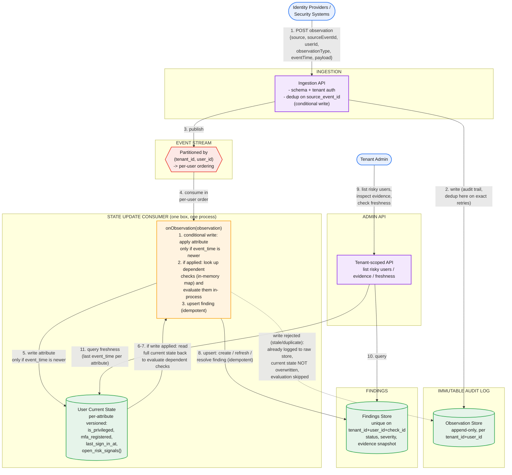

# Multi-Tenant User Risk Assessment System — Design + Interview Approach

## Part 1: Requirements, Scale, and Flow

```
Requirements
1. Ingest observations from multiple identity providers/security systems about users
   (role assignments, auth methods, sign-in activity, risk signals) — multi-tenant.
2. Evaluate each observation against a small, versioned set of deterministic checks:
     - Privileged users must have MFA registered
     - Privileged accounts inactive >30 days are risky
     - Users with an unresolved high-risk identity signal are risky
3. On check failure -> create/update a finding. On newer evidence showing pass -> resolve it.
4. Tenant admin APIs: list risky users, inspect evidence behind a finding, check data freshness.
5. Correctness under duplicate and delayed/out-of-order observations (non-functional,
   but stated explicitly in the prompt — treat as first-class).

Scale assumptions (state these out loud, unprompted):
  - 10K tenants, ~5K users/tenant average (long tail) -> ~50M users total
  - Observations are event-driven (on change), not polled at fixed cadence
  - ~10 observations/user/day -> ~500M observations/day -> ~5,800/sec avg, bursty
    around business-hours sign-in waves across time zones
  - Justifies an async, queue-backed ingestion path over synchronous processing
```


*Numbered steps: (1) an identity provider or security system posts an observation. (2) the Ingestion API writes it to the immutable Observation Store, deduplicating on `source_event_id` — exact retries die here. (3-4) the observation is published to a stream partitioned by `(tenant_id, user_id)`, guaranteeing per-user processing order. (5) the State Update Consumer's `onObservation` handler applies a conditional write to User Current State — only if the observation's `event_time` is newer than what's already stored for that specific attribute. (6-8) if that write actually took effect (not a stale/duplicate write), the same function looks up which checks depend on the changed attribute via an in-memory map, reads the full current state back, and idempotently creates, refreshes, or resolves a Finding — all in the same process, no separate service hop. A rejected write (stale/delayed observation) is already logged to the audit trail and simply skips evaluation. (9-11) the tenant admin API reads Findings for the risky-user list and evidence, and reads User Current State for the freshness endpoint.*

**Design note — one box, not two.** An earlier version of this diagram split "apply the state update" and "evaluate the rules" into separate boxes connected by an arrow, implying a network hop between them. That's only accurate if you deliberately choose to decouple them (e.g., publishing a "state changed" event to a second internal topic so rule evaluation can scale independently of ingestion). For this problem's scale — checks are cheap, local, deterministic boolean logic against a row you already have in memory, not calls to external services — that decoupling isn't justified. The simpler and more accurate picture is one box: the State Update Consumer's per-message handler does the conditional write *and* the evaluation *and* the finding upsert, synchronously, in the same function call, before moving on to the next message. This also makes the crash-recovery story trivial: if the process dies mid-handler, the stream offset was never committed, so the whole handler reruns from scratch on redelivery — safe, because every step in it is independently idempotent.

## Part 2: APIs

`POST /v1/tenants/{tenantId}/observations`
- body (batch-capable): `[{ source, sourceEventId, userId, observationType, eventTime, payload }]`
- `sourceEventId` is the idempotency key the identity provider supplies — without one, dedup falls back to content hashing, which is weaker
- resp: `202 Accepted`

`GET /v1/tenants/{tenantId}/users?risky=true&checkId=&severity=&cursor=&limit=`
- paginated risky-user list, filterable by check and severity

`GET /v1/tenants/{tenantId}/users/{userId}/findings`
- a user's findings, open and resolved (history)

`GET /v1/tenants/{tenantId}/findings/{findingId}`
- finding detail: check definition, evidence (attribute values + source observation IDs), timestamps

`GET /v1/tenants/{tenantId}/users/{userId}/freshness`
- per-attribute last `eventTime` and last `ingestedAt`, plus a staleness flag against an expected sync interval

## Part 3: Data Model

Keep three layers distinct — this separation is what makes duplicate/delay handling tractable.

**Observation** (immutable, append-only — the audit trail)
`observation_id, tenant_id, user_id, source, source_event_id, observation_type, event_time, ingested_at, payload`
`event_time` = when the fact was true per the source. `ingested_at` = when you received it. Never conflate these.

**User current state** (materialized, mutable, one row per `tenant_id+user_id`, versioned *per attribute*, not per record)
- `is_privileged { value, event_time, source, observation_id }`
- `mfa_registered { value, event_time, source, observation_id }`
- `last_sign_in_at { value, event_time, source, observation_id }`
- `open_risk_signals: [{ risk_id, level, event_time, source, observation_id }]` — a set keyed by `risk_id`, not a scalar, so resolving one signal doesn't touch the others

Per-attribute versioning is the key design choice: it's what lets one stale field not block updates to a fresher one.

**Finding**
`finding_id`, unique on `(tenant_id, user_id, check_id)` for the current record, `status (open|resolved)`, `severity`, `first_detected_at`, `last_updated_at`, `resolved_at`, `evidence` (a snapshot of the attribute values + observation IDs at evaluation time — not a live pointer, so evidence stays accurate even after current state moves on)

**Check definition** (versioned config, not hardcoded)
`check_id`, `name`, `applicable_observation_types` (which attribute changes trigger re-eval), `logic`, `version`

## Part 4: Major Components

- **Ingestion API** — schema + tenant-auth validation, conditional write on `(tenant_id, source, source_event_id)` for exact-duplicate rejection, publishes to the stream.
- **Observation Store** — immutable, append-only, tenant-partitioned. This is the audit trail and the source for retroactive re-evaluation.
- **Event stream** (Kafka-style) — partitioned by `(tenant_id, user_id)` so one consumer processes a given user's events in strict arrival order. Note: arrival order ≠ event-time order — that's handled explicitly downstream, not assumed away by the partitioning.
- **State Update Consumer** — one component, not two. Its per-message handler (1) applies the per-attribute event-time comparison rule to User Current State, (2) if that write actually took effect, looks up dependent checks via an in-memory `attribute → [check_ids]` map built from versioned check config and evaluates only those, and (3) performs an idempotent upsert against Findings. All three happen synchronously in the same function call — no separate "Rule Evaluation Engine" service or queue hop, since check logic here is cheap and local. Split this into a decoupled service only if check logic later needs to call out to something external and you want to isolate that latency from ingestion throughput.
- **Findings Store** — tenant-partitioned, indexed for `list risky users filtered by severity/check` query patterns (a DynamoDB-with-GSIs or Elasticsearch-style store fits better here than plain relational).
- **Admin API layer** — tenant-scoped, reads Findings Store and User Current State.

## Part 5: Duplicates and Delayed Observations

**Duplicates** are handled at the edge, not in the rule engine: the `source_event_id` uniqueness constraint on write to the raw store means an identical redelivered webhook never reaches the consumer twice. Downstream, the Rule Evaluation upsert is a pure function of current state — replaying the same event twice produces the same result, which is the safety net against at-least-once stream delivery. This means you don't need exactly-once stream semantics, which is operationally simpler.

**Delayed/out-of-order observations** are the harder problem, and the one worth spending the most interview time on. Stream partition ordering guarantees *arrival* order, not *event-time* order — a slow connector can deliver an `event_time`-old observation after a newer one already landed. The per-attribute `event_time` comparison handles the common case: if incoming `event_time` is older than the stored value for that attribute, don't overwrite current state, but still write it to the immutable log (audit completeness) and increment a "late arrival" metric.

The harder case, worth raising unprompted: strict last-write-wins by event time can miss a transient risk window — e.g., a late "MFA deregistered" event whose `event_time` falls *between* two already-processed events. Resolve this by explicitly splitting the correctness guarantee in two: real-time risk evaluation optimizes for "is the user risky right now" using latest-known state (cheap, sufficient for the stated checks), while the immutable observation log preserves everything needed to reconstruct historical state and re-run evaluation retroactively for forensic or compliance purposes. State this as a deliberate tradeoff, not an oversight.

## Part 6: Multi-Tenancy and Extensibility

Every store is partitioned by `tenant_id`; API auth tokens are scoped to a single tenant; no query path exists that doesn't filter by `tenant_id` by construction. Add per-tenant ingestion rate limits so one noisy tenant's burst doesn't starve others sharing the stream.

Checks are described as "a small set" but will grow. Versioned check definitions plus the ability to replay the immutable observation log let you backfill findings under a new or changed check without touching the ingestion path — mention this unprompted; it's the kind of forward-looking detail that reads as staff-level.

---

## Part 7: How to Run This in the Interview

**1. Clarify requirements (2-3 min).** Confirm the three checks and the finding lifecycle, then explicitly surface the non-functional requirements the prompt buried in one sentence: multi-tenant isolation, and correctness under duplicate/delayed observations. Naming these unprompted signals you read the prompt carefully.

**2. Scale numbers (3 min).** Tenant count, users/tenant, observation rate. This justifies async ingestion and a stream-based architecture before you've drawn a single box.

**3. API design (3-5 min).** The four endpoints above — ingestion plus the three read APIs the prompt explicitly asks for (list, evidence, freshness). Define request/response shapes, not just paths.

**4. Data model (5 min).** This is the section to slow down on. Explicitly separate the three layers — immutable log, materialized current state, findings — and state why: it's what makes idempotency and out-of-order handling tractable rather than bolted on.

**5. High-level architecture (5 min).** Draw the flow above. Move fast; it should feel like confirming a plan.

**6. Deep dive — duplicates and ordering (8-10 min, the differentiator).** This is the single most-probed area on this problem. Lead with: stream partition order ≠ event-time order. Present the per-attribute event-time comparison, then proactively raise the "late arrival that should have mattered" edge case and resolve it with the split real-time-vs-audit correctness model. Don't wait to be asked — this is what separates a staff-level answer from a senior one here.

**7. Deep dive — rule evaluation efficiency (3-5 min).** Why checks are triggered per-changed-attribute rather than re-evaluating everything on every observation, and why check definitions are versioned config rather than hardcoded logic.

**8. Failure modes and tradeoffs (5-8 min).** What happens if the Rule Evaluation Engine falls behind (findings go stale, but no data loss — observations still land in the immutable log; expose a lag/freshness signal rather than hiding it). Consistency model: eventually consistent overall, but per-user ordered processing avoids most races. State an explicit SLA, e.g., "findings reflect observations within 60 seconds p99."

**9. Close (1-2 min).** Summarize the two or three deliberate tradeoffs: per-attribute versioning over per-record, real-time state vs. audit log as two separate correctness models, and idempotent upserts over exactly-once delivery.

### Staff/Principal signal checklist — say these unprompted
- Multi-tenant isolation and duplicate/delay handling as explicit non-functional requirements, not afterthoughts
- Stream partitioning guarantees arrival order, not event-time order — say this explicitly
- Per-attribute (not per-record) event-time versioning, and why
- The real-time-state vs. audit-log split as a deliberate correctness tradeoff, not a gap
- Idempotent upsert as the reason exactly-once delivery isn't needed
- Extensibility via versioned checks + log replay, mentioned before being asked

---

## Appendix: Mermaid source for the diagram above

Editable at [mermaid.live](https://mermaid.live) or with the `mmdc` CLI.


