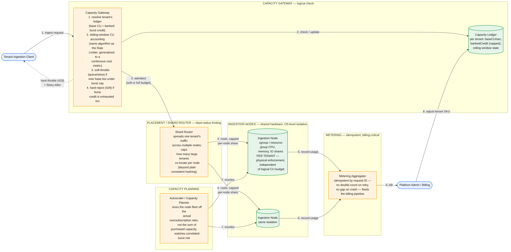
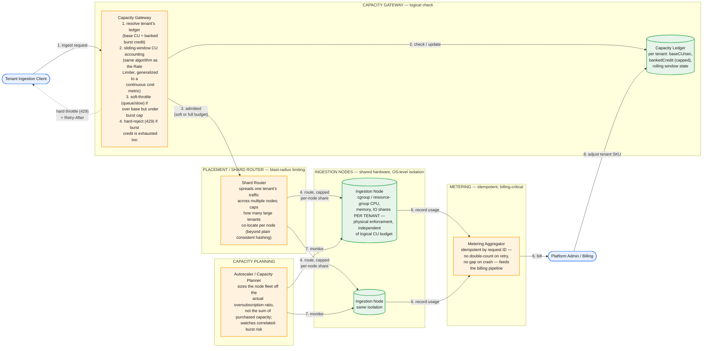

# Multi-Tenant Ingestion Service — System Design

The central tension: run many tenants' ingestion workloads on genuinely shared hardware — the entire economic point of selling "capacity" instead of dedicated infrastructure — while guaranteeing that no tenant's burst, however large or misbehaved, degrades another tenant's ingestion latency or throughput. The trap this problem is built to catch: a rate limiter alone does not solve this. A tenant can stay perfectly within their purchased capacity budget on paper and still starve a neighbor if both land on the same physical node and the actual hardware — CPU, disk IOPS, network — becomes the real bottleneck first. Logical throttling and physical isolation are two different problems, and this design treats them as two separate, independently-enforced layers.

Since capacity is the literal unit of billing here, this also isn't just an availability problem — metering correctness is a revenue-and-trust problem with its own rigor requirement, not a logging afterthought.

## Part 1 — Requirements

### Functional Requirements

1. Ingest data from many tenants concurrently into the platform.
2. Each tenant has a purchased capacity (a blended compute/throughput budget, denominated in Capacity Units) — not a raw fixed request-rate cap.
3. Allow temporary bursting above the purchased base rate, drawing down banked credit accumulated during quieter periods, before real throttling kicks in.
4. Throttle gracefully once a tenant exhausts base *and* burst budget: queue/slow first, hard-reject only past that.
5. Meter actual consumption per tenant continuously and accurately — this feeds billing directly.
6. Give tenants and admins visibility into consumption vs. purchased capacity, and let admins change a tenant's SKU.

### Non-Functional Requirements — and the crux distinction stated up front

1. **Physical isolation, not just logical throttling.** This is the decision that shapes the whole design, the same way "log-based capture" shaped the CDC pipeline. A tenant's Capacity Unit accounting is a *billing abstraction* — it says nothing about which physical resource is actually contended at a given instant on a shared node. True noisy-neighbor isolation requires a second, independent enforcement layer at the OS/runtime level (cgroups, IO scheduling classes, network QoS) that caps how much of a shared node's real resources any one tenant can consume, regardless of whether they're "within budget" on paper. A design that stops at "we rate-limit each tenant's CU consumption" has solved billing fairness, not isolation.
2. **Smoothed, bursty capacity, not a rigid per-second cap.** A capacity SKU is sold as an aggregate entitlement over a period with burst tolerance, not an instantaneous ceiling — a legitimate hourly batch load (quiet 55 minutes, intense 5) must not be constantly throttled just because its instantaneous rate exceeds its average.
3. **Accurate, auditable, idempotent metering.** A metering bug either overcharges customers (trust and legal exposure) or undercharges (revenue leak) — both are business-critical, not engineering nice-to-haves.
4. **Fair, low-latency ingestion for well-behaved tenants regardless of what noisy tenants are doing concurrently.**
5. **Elastic, genuinely shared infrastructure.** The fairness mechanism must work *without* reverting to one-tenant-per-machine dedicated provisioning — that would defeat the entire economic premise of selling capacity units.

### Capacity Estimation

| Dimension | Value |
|---|---|
| Active tenant capacities | 20,000 |
| Capacity Unit (CU) definition (stated assumption) | 1 CU ≈ sustained ~1MB/sec of ingestion throughput |
| Small tenants (majority) | ~19,800 tenants × ~50 CU purchased each |
| Large tenants (top tier) | ~200 tenants × ~2,000 CU purchased each |
| **Total purchased capacity, fleet-wide** | 19,800×50 + 200×2,000 ≈ 990,000 + 400,000 ≈ **~1.39M CU** (~1.39TB/sec if every tenant maxed out simultaneously) |
| Realistic average utilization vs. purchased | ~5–8% (most tenants sit well under their ceiling most of the time — this is *why* overselling capacity is economically viable) |
| **Actual average fleet ingestion throughput** | 1.39M CU × ~6% ≈ ~83,000 CU ≈ **~83GB/sec** |
| Peak (correlated bursts — e.g., overlapping nightly batch loads) | 3–5x average ≈ **~250–400GB/sec** |
| Per-node sustained throughput (modern hardware/network) | ~2GB/sec |
| **Ingestion nodes needed for peak** | 400GB/s / 2GB/s ≈ 200 → **~250 nodes** with redundancy headroom |

**The oversubscription ratio is the actual engineering problem, not an incidental business detail.** Purchased capacity (~1.39M CU) vastly exceeds provisioned peak throughput (~250–400GB/sec) — the platform is deliberately sized for something far below the sum of every promise made, exactly like airline overbooking or cloud VM oversubscription. That gap is *necessary* for the economics to work, and it's precisely *why* fair, real-time arbitration under contention has to be actively engineered rather than assumed away by "just provision for the worst case" — provisioning for the sum of all purchased capacity would be enormously uneconomical and defeats the point of selling shared capacity at all. The genuine risk this creates is **correlated bursts**: many tenants' scheduled jobs firing at the same wall-clock time push real simultaneous demand closer to the oversubscribed ceiling than an independence assumption would predict — a risk to name explicitly, not a footnote.


*The Capacity Gateway is a logical, billing-aware check (sliding-window CU accounting against a base+burst ledger). The Shard Router and per-node OS-level resource isolation are a separate, physical enforcement layer — a tenant admitted by the gateway can still be capped at the node if the node's real hardware is under contention. Metering is idempotent by request ID, feeding billing directly.*

### Common First-Draft Mistakes

| # | First-draft approach | Why it fails | Fix |
|---|---|---|---|
| 1 | Build a per-tenant rate limiter and call noisy-neighbor solved | A tenant within their CU budget can still contend for the same physical CPU/disk/network as another tenant on the same node — CU accounting says nothing about real resource contention | A second, independent physical isolation layer (cgroups/resource groups) enforced at the OS/runtime level on shared nodes |
| 2 | Enforce a rigid per-second rate cap | Throttles legitimate bursty workloads (e.g., hourly batch loads) even when their *average* usage is well within the purchased tier | Model capacity as a rolling base+burst ledger — banked credit from quiet periods absorbs legitimate bursts before real throttling begins |
| 3 | Consistent-hash tenants onto nodes for load balancing and stop there | Optimizes for even key distribution, not for capping how much of one node's finite capacity a single large tenant can claim, or limiting blast radius | Layer an explicit placement policy on top: cap large-tenant co-location per node, spread one large tenant's load across multiple nodes |
| 4 | Provision the node fleet to the sum of all purchased capacity | Enormously uneconomical — defeats the entire point of selling shared capacity instead of dedicated hardware | Provision off the realistic oversubscription ratio, monitor correlated-burst risk explicitly rather than assuming independence |
| 5 | Log metering events best-effort, reconcile later if numbers look off | A crash or retry can double-count (overcharge) or drop (undercharge) usage — a revenue and trust problem, not just a data-quality one | Idempotent metering by request ID, with checkpointing that never advances past unconfirmed writes — the same discipline as effectively-once CDC delivery |
| 6 | Binary allow/reject on capacity, no soft-throttle tier | Doesn't reflect a graceful-degradation requirement; legitimate temporary overage gets treated the same as abuse | Two-tier response: soft-throttle (queue/slow) once base is exceeded but burst credit remains, hard-reject only once burst credit is also exhausted |

## Part 2 — API

### `POST /ingest/{tenantId}/{stream}`

Each request (or batch) is metered in CU-equivalent terms — a cost function of bytes ingested and compute required, not a flat per-request count.

```
Response 200
X-Capacity-Used: 42.3
X-Capacity-Available: 57.7     (base + banked burst remaining)
X-Capacity-Reset: 2026-09-14T00:00:00Z

Response 429 (soft throttle — queued, will still be accepted)
Retry-After: 2
X-Throttle-Tier: soft

Response 429 (hard reject — burst credit exhausted)
Retry-After: 30
X-Throttle-Tier: hard
```

The header convention deliberately extends the earlier Rate Limiter design's `X-RateLimit-*`/`Retry-After` pattern — same idea, generalized from a discrete request count to a continuous capacity-unit metric, and split into two throttle tiers instead of one binary allow/reject, since graceful degradation is a stated requirement here that the basic rate limiter didn't need to carry.

### `GET /tenants/{tenantId}/capacity`

```json
{
  "baseCU": 50,
  "bankedCredit": 18.4,
  "bankedCreditCap": 200,
  "currentUtilizationCU": 61.2,
  "windowHours": 24
}
```

Tenant-facing consumption visibility — the mechanism customers use to decide whether to upgrade their SKU before they start hitting hard throttles.

### `PUT /tenants/{tenantId}/capacity` (admin)

Changes a tenant's purchased SKU; the response states whether the change is effective immediately or at the next billing period.

## Part 3 — Data Model

**Capacity ledger, per tenant** — a rolling debit/credit account, not a simple counter:

```
baseCU_per_sec     : purchased rate
bankedCredit       : accumulated burst headroom, capped at a max
                     (grows when usage < base, shrinks when usage > base)
windowState        : rolling accounting window (hours, not seconds)
```

**CU accounting mechanism** — the same sliding-window-counter algorithm from the Rate Limiter design (two adjacent window counts plus a window-start timestamp, avoiding both fixed-window boundary bursts and unbounded sliding-log storage), generalized from counting discrete requests to accumulating a continuous resource-cost metric derived from bytes and compute. Explicitly reusing this mechanism rather than inventing a new one is the right move — the algorithm doesn't care whether the thing being counted is "requests" or "capacity units," only that increments must be atomic with the read that decides admission (the same check-then-act race from the Rate Limiter design applies identically here).

**Placement metadata** — which physical ingestion nodes a tenant's traffic is routed to. A large tenant's load is deliberately spread across multiple nodes (not owned by one node the way a KV store's consistent-hash ring assigns ownership) specifically to limit blast radius: no single node's contention event or failure should take down that tenant's entire ingestion pipeline, and no single large tenant should be able to dominate one node's entire physical capacity.

**Node-level physical resource accounting** — this is the layer a CU-only design is missing. Each ingestion node tracks *actual* CPU, memory, and disk/network IO consumed per tenant currently active on it, enforced via cgroups/resource-group shares at the OS or runtime level — a genuinely separate gate from the logical ledger check. A tenant can pass the Capacity Gateway's logical check and still be throttled at the node if their real resource footprint is crowding out co-located tenants.

## Part 4 — Major Components

- **Capacity Gateway** — the logical front door: resolves a tenant's ledger, runs sliding-window CU accounting, applies the two-tier soft/hard throttle response.
- **Capacity Ledger Service** — maintains the rolling base/burst/banked-credit state per tenant; the "billing meets rate-limiting" component.
- **Shard/Placement Router** — spreads a tenant's traffic across multiple physical nodes and caps large-tenant co-location per node — a blast-radius-limiting policy layered on top of, not replacing, load-distribution hashing.
- **Ingestion Nodes with OS-level resource isolation** — cgroup/resource-group CPU, memory, and IO shares per tenant on shared hardware; the physical enforcement layer, independent of and complementary to the logical ledger.
- **Metering Aggregator** — idempotent-by-request-ID usage recording feeding the billing pipeline; correctness here is a revenue and trust requirement, not an availability nicety.
- **Autoscaler / Capacity Planner** — sizes the node fleet off the realistic oversubscription ratio and monitors correlated-burst risk, rather than provisioning to the sum of all purchased capacity.

## Part 5 — Hard Problems

### 1. Logical throttling vs. physical isolation — the crux of this problem

A tenant staying within their purchased CU budget can still degrade a neighbor if both land on the same physical node and the node's real hardware — CPU, disk IOPS, network — becomes the bottleneck before either tenant's *logical* ceiling is reached. CU accounting is a billing abstraction; it says nothing about which physical resource is contended at a given instant. True isolation requires a second, independent enforcement layer at the OS/runtime level (cgroups, IO scheduling classes, network QoS) capping how much of a shared node's actual resources any one tenant's workload can consume, regardless of budget status. A design that stops at "we rate-limit CU consumption per tenant" has solved billing fairness, not noisy-neighbor isolation — these are different problems, easy to conflate, and exactly the gap an interviewer at a capacity-billing company will probe for directly.

### 2. The smoothing/bursting/banked-credit model, and why a rigid per-second cap is the wrong shape for this business

A capacity SKU is sold as an aggregate entitlement over a period, with burst tolerance implied — not an instantaneous ceiling. A tenant running a legitimate hourly batch load (quiet 55 minutes, intense for 5) would be constantly throttled under a naive fixed-rate cap even though their *average* usage sits comfortably within their tier, which is bad for the business (customers churn over what feels like arbitrary throttling) and doesn't match what "capacity" billing actually promises. The fix generalizes the Rate Limiter's sliding-window-counter into a rolling ledger: usage above the base rate draws down banked burst-credit accumulated during quiet periods (capped at a maximum), and only once that credit is exhausted does real throttling begin. This is the same underlying counting mechanism, extended from a hard reset-every-window counter into a continuous credit/debit account — worth naming explicitly as the generalization it is, not a new algorithm invented from scratch.

### 3. Placement and blast-radius limiting — why consistent hashing alone doesn't solve this

Plain consistent hashing (as used for data ownership in the KV store design) optimizes for even key distribution across nodes — a different goal from limiting how much of any single node's finite physical capacity one large tenant can claim. This requires an explicit placement policy layered on top: cap how many large tenants co-locate heavily on the same node, and spread a single very-large tenant's traffic across multiple nodes/shards specifically so that no one node's contention event or outage takes down that tenant's entire ingestion pipeline, and no single tenant can dominate a node's capacity and starve everyone else sharing it. This is a deliberate additional constraint beyond what pure load-balancing or pure consistent hashing produces on its own.

### 4. Oversubscription as deliberate strategy, and what happens when correlated bursts break the independence assumption

The business model depends on selling more aggregate purchased capacity than the infrastructure could support if every tenant maxed out simultaneously — necessary and standard, exactly like airline overbooking or cloud VM oversubscription, and directly reflected in the ~1.39M CU purchased vs. ~250–400GB/sec provisioned peak from Part 1. The real engineering risk is *correlated* bursts: many tenants' scheduled jobs firing at the same wall-clock time (midnight batch loads across customers sharing a timezone, say) push actual simultaneous demand closer to the oversubscribed ceiling than an independence assumption predicts. Mitigations worth naming: system-wide back-pressure/degradation policies for a genuine capacity crunch (not only per-tenant throttling), staggering or jittering scheduled-job start times where the platform controls them, and monitoring the *actual* correlation of tenant demand patterns rather than assuming independence when setting the oversubscription ratio in the first place.

### 5. Metering accuracy under partial failure — a billing correctness problem, not an availability one

If an ingestion node crashes mid-request, or a request is retried after a timeout, the metering pipeline must neither double-count (overcharge) nor lose the record of what actually happened (undercharge). This needs the same idempotent, position-tracked discipline as the CDC pipeline's effectively-once delivery, applied here to billing events instead of replication events: every metering event carries a unique request/operation ID so a retried write doesn't double-apply, and the aggregation pipeline's checkpoint never advances past unconfirmed writes. Getting this wrong isn't a minor engineering bug — it's a customer-trust and revenue-integrity failure, and it deserves the same rigor as the ingestion path itself, not treatment as a logging afterthought bolted on at the end.

## Part 6 — How to Run This in the Interview

| Time | Step |
|---|---|
| 0–5 min | Clarify requirements. State the crux distinction immediately: logical CU throttling and physical resource isolation are two separate problems — don't let this stay implicit. |
| 5–12 min | Capacity estimate. Derive the oversubscription ratio explicitly (purchased capacity vs. provisioned peak) and name correlated-burst risk as the reason it's a real engineering concern, not just a sales number. |
| 12–20 min | API and the capacity ledger. Base+burst rolling model, generalized from the Rate Limiter's sliding-window counter — name the reuse explicitly. |
| 20–30 min | Placement and physical isolation. Why consistent hashing alone doesn't cap blast radius; cgroups/resource-groups as the second enforcement layer independent of CU budget. |
| 30–38 min | Oversubscription and correlated bursts. What happens when the independence assumption breaks, and what system-wide (not just per-tenant) mitigations look like. |
| 38–44 min | Metering correctness. Idempotent-by-request-ID accounting, and why this is a revenue/trust problem deserving CDC-grade rigor. |
| 44–45 min | Wrap-up. What's out of scope for v1 (e.g., cross-region capacity pooling, spot/preemptible tenant tiers) and why bounding scope here is itself a signal. |

### Staff/Principal Signal Checklist

1. States the logical-throttling-vs-physical-isolation distinction explicitly and early — doesn't let "we rate-limit per tenant" stand in as the whole answer.
2. Models capacity as a rolling base+burst ledger, explicitly generalizing the sliding-window-counter mechanism rather than inventing an unrelated new algorithm.
3. Designs placement/blast-radius limiting as a policy layered on top of hashing, not something consistent hashing alone provides.
4. Names oversubscription as a deliberate, necessary economic strategy and reasons concretely about correlated-burst risk, rather than treating "just add more hardware" as the answer.
5. Treats metering as an idempotent, revenue-critical pipeline requiring the same rigor as data-replication correctness — not a logging afterthought.
6. Cross-references prior mechanisms (sliding-window counters, per-key atomic checks, effectively-once delivery) explicitly rather than re-deriving equivalent machinery from scratch under a new name.

## Appendix — Mermaid Source


