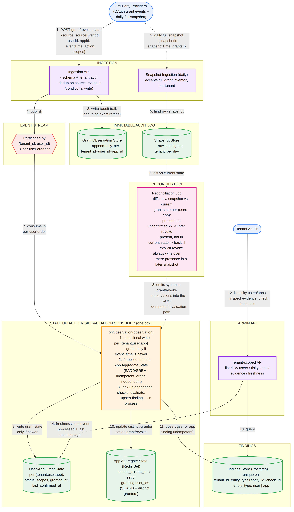
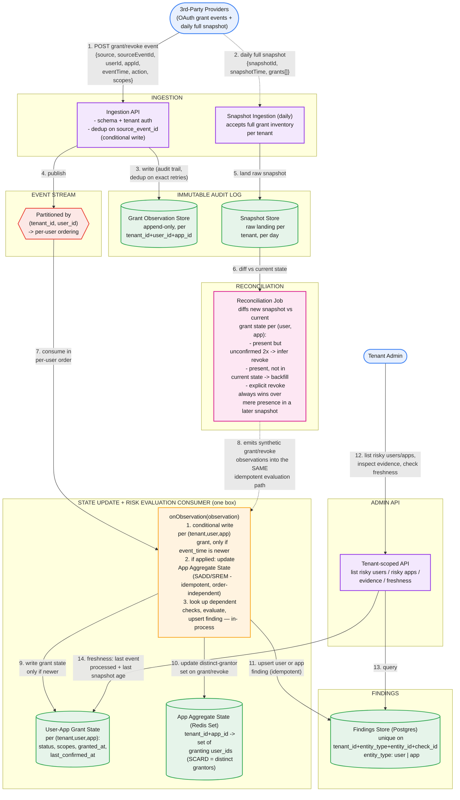

# Third-Party App Risk Assessment System — Design + Interview Approach

## Part 1: Requirements, Scale, and Flow

```
Requirements
1. Ingest OAuth grant/revoke events from multiple 3rd-party providers, multi-tenant.
2. Ingest a periodic (daily) full snapshot of active grants per tenant, and reconcile
   it against the incremental event stream.
3. Evaluate deterministic checks:
     - An app requesting a high-risk scope granted by a privileged user is risky.
     - An app not on the allowlist, granted by >N distinct users tenant-wide, is risky
       (flagged against the APP, not any one user — an aggregate check).
     - An app with an active grant and no API activity for 90+ days is risky.
4. On check failure -> create/update a finding. On newer evidence showing pass -> resolve it.
5. Tenant admin APIs: list risky users, list risky apps, inspect evidence, check freshness.
6. Correctness under duplicate/out-of-order events AND under snapshot-vs-event disagreement
   (a grant present in a snapshot with no matching event, or vice versa).

Scale assumptions (state these out loud, unprompted):
  - 10K tenants, ~5K users/tenant average -> ~50M users
  - ~5 app grants/user on average -> ~250M active grants tenant-wide, order of magnitude
  - ~500M grant/revoke events/day -> ~5,800/sec avg, bursty around new-app rollouts
  - Daily snapshot per tenant is a BATCH spike, not steady-state — a tenant with 5K users
    x 5 apps is ~25K rows/day; across 10K tenants, ~250M snapshot rows/day, arriving in
    a burst per tenant, not spread evenly — plan ingestion capacity for that shape,
    not the daily average
```



*Numbered steps: (1) a provider posts a grant/revoke event. (2) separately, once a day, a provider pushes a full inventory of currently active grants for a tenant. (3-4) the event is written to the immutable Grant Observation Store (deduped on `source_event_id`) and published to a stream partitioned by `(tenant_id, user_id)`. (5-6) the snapshot lands in its own raw store and is diffed against current grant state by the Reconciliation Job. (7) the stream consumer processes events in per-user order. (8) the Reconciliation Job emits synthetic grant/revoke observations — inferred from the diff — into the exact same evaluation path real events use, so there is only one code path for "a grant's state changed," not two. (9-11) the consumer conditionally writes per-grant state, updates the App Aggregate State (a set of distinct granting users per app) when a grant or revoke actually takes effect, and upserts a user- or app-level finding. (12-14) the admin API reads findings and freshness, including how stale the last snapshot is.*

## Part 2: APIs

`POST /v1/tenants/{tenantId}/events`
- body (batch-capable): `[{ source, sourceEventId, userId, appId, eventTime, action: "grant"|"revoke", scopes[] }]`
- `sourceEventId` is the provider's idempotency key; `eventTime` is mandatory — without it, per-attribute newer-wins logic and out-of-order handling are both impossible
- resp: `202 Accepted`

`POST /v1/tenants/{tenantId}/snapshots`
- body: `{ snapshotId, snapshotTime, grants: [{ userId, appId, scopes[] }] }` — for large tenants, deliver as a reference to an object-storage file rather than inline JSON, and have the Reconciliation Job stream-diff it rather than loading the whole thing into memory
- resp: `202 Accepted`

`GET /v1/tenants/{tenantId}/users?risky=true&checkId=&severity=&cursor=&limit=`
`GET /v1/tenants/{tenantId}/apps?risky=true&checkId=&severity=&cursor=&limit=`
- paginated risky-user and risky-app lists — two separate list endpoints since they're two different entity types with different evidence shapes

`GET /v1/tenants/{tenantId}/users/{userId}/findings`
`GET /v1/tenants/{tenantId}/apps/{appId}/findings`
`GET /v1/tenants/{tenantId}/findings/{findingId}`
- finding detail: check definition, evidence, timestamps

`GET /v1/tenants/{tenantId}/freshness`
- last event processed timestamp, last snapshot timestamp and its age, staleness flag — snapshot age matters here in a way it didn't in a pure-event design, since a stuck snapshot connector silently degrades the aggregate/reconciliation checks without any single event ever failing

## Part 3: Data Model

Four stores, not three this time — the aggregate check is what forces the fourth.

**Grant Observation** (immutable, append-only — the audit trail)
`observation_id, tenant_id, user_id, app_id, source, source_event_id, event_time, ingested_at, action, scopes, payload`

**User-App Grant State** (materialized, one row per `tenant_id+user_id+app_id`)
`status (active|revoked), scopes, granted_at (event_time), last_confirmed_at, source, observation_id`
`last_confirmed_at` is the field that makes reconciliation possible — it's bumped every time a snapshot re-confirms the grant's presence, even if nothing else about it changed. A grant whose `last_confirmed_at` predates the *previous* snapshot (i.e., it went unconfirmed across two consecutive snapshots) is a much safer signal for "this was actually revoked" than a single missed snapshot, which could just be a partial provider outage.

**App Aggregate State** (Redis Set, one per `tenant_id+app_id`)
A set of the distinct user IDs currently granting that app. `SADD` on grant, `SREM` on revoke, `SCARD` for the distinct-grantor count the allowlist check needs. This is the store that was missing from the first draft — without it, "more than N distinct users tenant-wide" has nothing to evaluate against except a full rescan per event. Set operations are idempotent and commutative, which matters because events for the same app but different users can arrive through different stream partitions (partitioning is by `tenant_id+user_id`, not `tenant_id+app_id`) — `SADD`/`SREM` don't care what order they arrive in across users, only that each user's own grant/revoke is itself applied in the right order, which the per-user partition already guarantees.

**Finding**
`finding_id`, unique on `(tenant_id, entity_type, entity_id, check_id)` where `entity_type` is `user` or `app`, `status`, `severity`, `first_detected_at`, `last_updated_at`, `resolved_at`, `evidence`

## Part 4: Major Components

- **Ingestion API** — same shape as prior designs: schema/tenant-auth validation, conditional write for exact-duplicate rejection, publish to the stream.
- **Snapshot Ingestion** — a separate path, not folded into the event API, because its shape is fundamentally different (one large batch per tenant per day vs. a steady trickle of small events).
- **Reconciliation Job** — runs per tenant after each snapshot lands. Diffs the snapshot against current `User-App Grant State`. Three outcomes: a grant present in current state but absent from two consecutive snapshots gets marked revoked-by-inference; a grant present in the snapshot but missing from current state (e.g., the original grant event was lost to an ingestion outage) gets backfilled as a new observation; and critically, an explicit revoke event always wins over a later snapshot's mere presence of that grant — a bulk snapshot's "this looks active" is a weaker signal than a specific, timestamped revoke event, so a disagreement here is logged as a provider-inconsistency metric for investigation, not silently resolved by resurrecting the grant.
- **State Update + Risk Evaluation Consumer** — one box, following the same reasoning as the identity risk system: check logic here is cheap and local, so the conditional grant-state write, the App Aggregate State update, and the finding upsert all happen synchronously in one function per message. The Reconciliation Job's inferred observations feed into this exact same function — there's one code path for "a grant's state changed," regardless of whether that change came from a real-time event or an inferred revoke.
- **Findings Store** — Postgres, same reasoning as before: findings volume is far lower than raw event volume, and the "list risky users/apps filtered by severity/check" query pattern needs relational filtering, not key-value lookups.
- **Rule/Tenant/User reference data** — same control-plane components as the identity risk system (versioned check config, tenant metadata, external-id-to-canonical-user mapping); not re-drawn here since the pattern is identical, but worth naming if asked.
- **Admin API** — tenant-scoped, reads Findings and both grant-state and snapshot-age for the freshness endpoint.

## Part 5: The Two Hard Problems

**Aggregate check freshness without full-tenant rescans.** The naive approach — count distinct grantors by querying all grants for an app on every single event — doesn't scale past a trivial tenant size. The App Aggregate State set makes this an O(1) update (`SADD`/`SREM`) and an O(1) read (`SCARD`) instead of an O(grants-for-this-app) scan. The design choice worth stating explicitly: this is the same "materialize a per-entity current view instead of replaying history" principle as `User Current State` in the identity risk system, just keyed by app instead of by user, and backed by a set instead of a map of scalar attributes because the thing being tracked (distinct grantors) is itself a set-cardinality question.

**Snapshot-vs-event reconciliation.** This is the harder of the two because it requires an explicit policy for disagreement, not just a mechanism. Three rules make it tractable: (1) an event with a specific `eventTime` is always more authoritative than a snapshot's implicit "as of snapshot time" signal, so a later snapshot showing a grant as present never overrides an earlier explicit revoke — it's flagged as a disagreement instead. (2) absence from a single snapshot is not enough evidence to infer revocation — a provider's snapshot pipeline can have a partial outage — so the design requires two consecutive missed confirmations before inferring a revoke. (3) whatever inference the reconciliation job draws gets pushed through the identical evaluation path a real event would use, so there's no special-cased "snapshot-triggered finding" logic to maintain separately.

## Part 6: How to Run This in the Interview

**1. Clarify requirements (2-3 min).** Confirm the three checks, then explicitly name the two non-functional problems buried in the prompt: aggregate correctness at scale, and snapshot/event reconciliation. Both are easy to miss on a first read — call them out before diagramming, not after being asked.

**2. Scale numbers (3 min).** Note explicitly that the daily snapshot is a batch spike, not part of the steady QPS average — sizing ingestion capacity off the daily average alone would under-provision for the actual traffic shape.

**3. API and data model (8-10 min).** Four stores, not three — introduce the App Aggregate State as soon as the allowlist check comes up, and justify it as the same "materialized view over raw events" principle, applied per-app instead of per-user.

**4. Deep dive — the aggregate check (5-8 min).** Walk through why a set (not a counter) is the right structure — a plain counter can't handle revokes correctly (you'd need to know whether the specific user had already been counted), while a set naturally supports both `SADD` and `SREM` as idempotent operations regardless of delivery order.

**5. Deep dive — reconciliation (8-10 min, the differentiator on this problem).** This is where most candidates will hand-wave. Present the three explicit rules above, and don't stop at "diff the snapshot" — an interviewer will immediately ask "what if they disagree," and having a stated policy (explicit event wins, two-miss confirmation before inferring revoke) rather than improvising in the moment is the signal that separates a staff-level answer here.

**6. Failure modes (5 min).** What happens if the Reconciliation Job falls behind (grant state degrades gracefully toward relying on the last real-time picture; the freshness API should surface a growing snapshot-age rather than hiding it). What happens if the App Aggregate State store (Redis) is unavailable (the allowlist check can't evaluate — decide explicitly whether to fail open or closed, and say why: fail open, since blocking all app-related risk evaluation over a cache outage is worse than a brief gap in one specific check).

**7. Close (1-2 min).** Summarize the tradeoffs: a set-based aggregate over a counter, and an explicit disagreement policy over an implicit "last write wins" for snapshot reconciliation.

### Staff/Principal signal checklist — say these unprompted
- The daily snapshot is a batch spike, not part of the average QPS — say this before being asked to estimate ingestion capacity
- Aggregate checks need their own materialized view (a set), not a scan — same principle as per-user current state, generalized
- A stated, explicit policy for snapshot/event disagreement, not an implicit assumption
- Two-miss confirmation before inferring revocation, to tolerate a partial snapshot-pipeline outage
- Reconciliation-inferred changes reuse the same evaluation path as real-time events — no parallel logic to maintain
- Explicit fail-open/fail-closed decision for each store's outage mode, and the reasoning behind it

---

## Appendix: Mermaid source for the diagram above

Editable at [mermaid.live](https://mermaid.live) or with the `mmdc` CLI.


