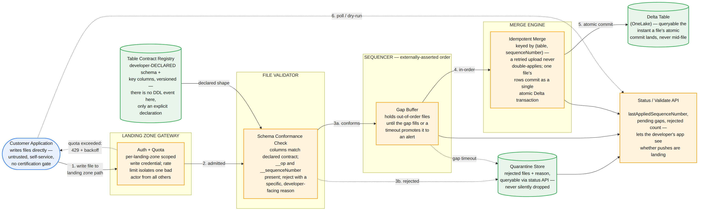
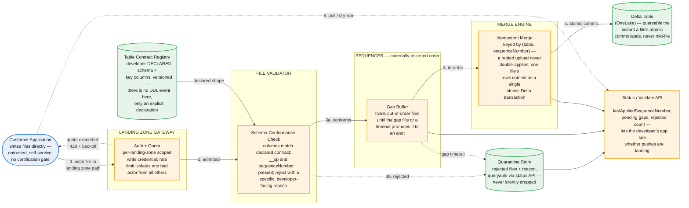

# Open Mirroring — System Design

## A public write API for change data, where the writer isn't yours to trust

Every prior design in this series — CDC pipeline, bulk migration, connector framework — shares one property: the platform controls the read path. A connector you wrote and certified reads a source database you have credentials for, on a schedule you control. Open Mirroring inverts that completely. The "source" is a customer's own application, running code you've never seen, pushing files into a landing zone URL whenever it wants, in whatever order its retries and worker races happen to produce. There is no certification gate you can put in front of arbitrary customer code the way the connector framework certifies its own five plugins — every single file that lands has to be validated on arrival, because the thing you're defending against isn't a rare bug in one of five vetted implementations, it's the ordinary bugs of thousands of independent developers integrating against a spec for the first time.

That's the actual design problem: build a merge pipeline where correctness (ordering, idempotency, schema conformance, atomic visibility) has to hold up against an untrusted, self-service, potentially chaotic writer — and where the developer experience of finding out *why* a file was rejected matters as much as the merge logic itself, because a bad DX here means developers give up or work around the spec in ways that corrupt their own data.

---

## Part 1: Requirements

### Functional Requirements

1. A published, versioned file-drop specification (folder convention, file format, required columns) simple enough for a developer to implement without an SDK.
2. Developers declare a table's schema and key columns explicitly, in advance — there's no DDL event to detect, because there's no database issuing DDL.
3. Files may arrive out of order (retries, concurrent writers) and the merge must still apply changes in the developer-asserted sequence, not arrival order.
4. A retried or duplicated file upload must never double-apply its changes.
5. A malformed or non-conforming file is rejected with a specific, actionable reason — visible to the developer via an API, not just dropped.
6. A validate/dry-run path lets a developer test a file against the declared contract without committing it to the live table.

### Non-Functional Requirements

1. **One bad actor can't degrade another's mirroring.** A landing zone with a buggy or bursty application must be rate-limited and isolated at the gateway, before it reaches shared merge infrastructure.
2. **A landed file's changes are atomically visible.** A consumer never sees a partially-merged file — either all of its rows are visible in the Delta table or none are.
3. **Rejections are loud, not silent.** A file that fails validation is quarantined with a reason a developer can retrieve; it is never simply discarded with no trace.
4. **No SDK required, but one should make the common path safer.** The raw spec must be independently implementable; an optional client library exists to remove the most common integration mistakes, not to gate access to the feature.

**Decision stated up front:** schema is developer-declared, not platform-detected. Every other design in this series (schema evolution, connector framework, catalog sync) infers structural change from a DDL event or a catalog diff. Open Mirroring has neither — there's no source database, only files a developer's code produces — so the contract has to be established explicitly, in advance, and every file checked against it. This single difference is why Open Mirroring can't just reuse the schema-evolution design's detection mechanism, only its append-only version-history principle.

### Capacity Estimation

| Dimension | Estimate |
|---|---|
| Active landing zones (customer integrations) | ~10,000 |
| Tables across all landing zones | ~50,000 |
| Peak platform-wide file arrival rate | ~200 files/sec |
| Avg file size / row count | ~5MB / ~50,000 rows |
| Out-of-order file rate (retries, concurrent writers) | ~0.1% of files |
| Rejected-file rate (malformed/non-conforming) | ~2-5% early in an integration's life, trending toward near-zero as developers stabilize their client code |

**The number that matters:** a 2-5% early-integration rejection rate isn't a bug to drive to zero — it's an expected, permanent feature of a self-service, spec-conforming write path with no certification gate. The design goal isn't "reject nothing," it's "make every rejection specific and actionable enough that a developer fixes their integration in one iteration instead of five." A platform that treats a non-trivial steady-state rejection rate as a failure will over-invest in loosening validation (accepting garbage) instead of investing in the one thing that actually helps: precise error messages.



*A customer application writes directly into a landing zone with no certification gate — every file is validated, sequenced, and idempotently merged on arrival. Rejections and out-of-order gaps go to a quarantine/status surface the developer can query, never silently.*

### Common First-Draft Mistakes

| Mistake | Why it's wrong |
|---|---|
| Assuming files arrive in the order the developer intended | Retries and concurrent writers reorder arrivals routinely; a merge pipeline with no gap/out-of-order handling applies changes in the wrong order and corrupts state silently |
| No idempotency key on merge | A retried upload (the common recovery path after any network blip) double-applies its rows unless merge is keyed by an identifier that makes reapplication a no-op |
| Treating schema like it can be inferred from the data | There's no DDL event and no reliable way to infer intent from a file's shape alone — a column that's merely absent from one file (vs. genuinely dropped) looks identical without an explicit declaration |
| Partial-file visibility on merge failure | A file with 50,000 rows that fails halfway through a naive row-by-row apply leaves the table in a state no developer intended and no consumer expects; commits must be file-atomic |
| Silently dropping rejected files | A developer with a schema mismatch and no error surface has no way to discover or fix the problem — they'll either give up on the integration or, worse, work around it by disabling validation client-side |
| One shared write quota across all landing zones | A single misbehaving or malicious self-service integration can starve every other tenant's merge pipeline if isolation happens anywhere other than at the gateway, per landing zone |

---

## Part 2: The File-Drop Specification and API

### Folder convention

```
<landingZoneRoot>/<tableName>/metadata.json
<landingZoneRoot>/<tableName>/<sequenceNumber>_<uuid>.parquet
```

### Table contract declaration (`metadata.json`)

```json
{
  "schemaVersion": 3,
  "keyColumns": ["orderId"],
  "columns": [
    { "name": "orderId", "type": "int64", "nullable": false },
    { "name": "status", "type": "string", "nullable": true },
    { "name": "updatedAt", "type": "timestamp", "nullable": false }
  ]
}
```

This has to be written and versioned *before* any data file referencing it — there is no path where the merge engine infers a table's shape from a data file it hasn't seen a contract for.

### Data file row shape

Every row in a landed Parquet file carries two reserved columns alongside the declared schema:

```
__op            : "I" | "U" | "D"
__sequenceNumber: int64, monotonic per table, assigned by the developer's application
```

The developer, not the platform, asserts ordering — which is exactly why the platform can't trust that assertion blindly and has to detect gaps and duplicates rather than applying files in arrival order.

### Validate (dry-run) endpoint

```
POST /openmirroring/{landingZoneId}/{table}/validate
```

```json
{
  "valid": false,
  "errors": [
    { "row": 4821, "column": "status", "reason": "value exceeds declared max length" },
    { "reason": "missing required column __sequenceNumber" }
  ]
}
```

Runs the identical schema-conformance check the real ingestion path runs, without writing anything — the mechanism that turns "5% rejection rate" from a support burden into a self-service debugging loop.

### Status endpoint

```
GET /openmirroring/{landingZoneId}/{table}/status
```

```json
{
  "lastAppliedSequenceNumber": 48213,
  "pendingGaps": [{ "expectedSequenceNumber": 48214, "waitingSince": "2026-09-13T10:14:00Z" }],
  "recentRejections": 3,
  "quarantineUrl": "/openmirroring/lz-4821/orders/quarantine"
}
```

This is the developer's only window into whether their integration is actually working — without it, a stuck gap or a string of rejections is invisible until a customer notices their analytics are stale.

---

## Part 3: Data Model

### Table contract (append-only, versioned — same principle as the schema registry)

```
tableId (PK)
schemaVersion
keyColumns[]
columns[]
declaredAt
```

A new schema version is a new row; a file that references an old `schemaVersion` in its metadata is validated against the version it declared, not silently upgraded — an explicit, developer-initiated version bump is required to move forward, the same append-only discipline used everywhere else in this series, applied here to a developer-declared contract instead of a detected one.

### Sequence tracker (per table)

```
tableId (PK)
lastAppliedSequenceNumber
pendingBuffer[] (sequenceNumber -> fileRef, held pending gap resolution)
gapDetectedAt (nullable)
```

### Quarantine entry

```
fileId (PK)
tableId
reason
rejectedAt
rawFileRef (retained briefly for developer debugging, then purged)
```

### Merge idempotency ledger

```
(tableId, sequenceNumber) (PK)
appliedAt
deltaCommitId
```

**Load-bearing decision:** merge idempotency keys on `(tableId, sequenceNumber)`, not on file identity or upload timestamp. A retried upload of the exact same logical change produces a new file with a new name but the same sequence number — and the ledger makes reapplication a guaranteed no-op regardless of how many times or under what filename that sequence number's content shows up.

---

## Part 4: Major Components

**Landing Zone Gateway.** The only component with a trust boundary in front of it. Issues per-landing-zone scoped write credentials, enforces a rate limit per landing zone, and rejects over-quota writers with a `429` before they touch shared infrastructure downstream — the same isolation principle as the multi-tenant ingestion design's capacity gateway, except the "tenant" here is a self-service integration rather than a known enterprise customer, which is exactly why the limits have to be conservative by default rather than negotiated.

**Table Contract Registry.** Holds the developer-declared schema and key columns, versioned, append-only. The single source of truth the File Validator checks every incoming file against.

**File Validator.** Checks column presence and types against the declared contract, confirms `__op` and `__sequenceNumber` are present and well-formed, and produces a specific, structured rejection reason for anything that fails — the component that determines whether a 2-5% rejection rate is a minor developer friction or a support ticket.

**Sequencer / Gap Buffer.** Holds files that arrive with a sequence number ahead of the last applied one, waiting for the gap to fill. Promotes a stuck gap to a quarantine alert after a bounded timeout, rather than either blocking merge indefinitely or silently skipping ahead and losing an in-between change.

**Merge Engine.** Applies a file's rows as one atomic Delta Lake transaction — Delta's transaction log makes "all of this file's rows or none" close to free to guarantee, which is why the atomicity requirement (NFR #2) doesn't need bespoke machinery on top of the storage format already in use. Idempotency is enforced via the `(tableId, sequenceNumber)` ledger before any write is attempted.

**Quarantine Store + Status API.** Rejected files and stuck gaps are retained and queryable, not discarded — the mechanism that makes NFR #3 ("rejections are loud, not silent") actually true for a developer debugging their integration from the outside.

---

## Part 5: Hard Problems

### 1. There is no certification gate for the actual source of risk

The connector framework design gates risk once, at the plugin level — five connector implementations, each certified before they ever touch production data. Open Mirroring can't do that, because the thing that could be wrong isn't a connector implementation the platform owns, it's an arbitrary customer's application code, and there's no practical way to certify code you'll never see before it starts writing. The design has to shift the entire trust model from "certify once, trust after" to "validate every single file, every single time" — every file that lands is treated as a first-time submission from an untrusted writer, regardless of how many files that same landing zone has successfully submitted before. This isn't paranoia for its own sake; it's the direct consequence of not controlling the write path the way every other design in this series does.

### 2. Ordering without a log, asserted by the party you don't trust

Every prior replication design in this series gets ordering for free from a source log (an LSN, an SCN) that the platform reads but doesn't create. Open Mirroring has no such log — the only ordering signal is a sequence number the developer's own application assigns and writes into each file, which means the platform is trusting an untrusted party's claim about ordering while still needing correctness guarantees that assume ordering is right. The resolution isn't to validate the sequence number is "correct" (there's no independent truth to check it against) — it's to make the system's behavior well-defined under the sequence numbers *as given*: apply strictly in sequence order, buffer anything that arrives ahead of the last applied number, and surface a stuck gap as a visible, actionable signal rather than either blocking forever or skipping past it. The correctness guarantee isn't "the data arrives in true order" — it's "the system faithfully applies whatever order was asserted, and never fabricates an order when the asserted one has a hole in it."

### 3. Idempotency has to survive a retry with a different filename

A network failure after a successful write but before a successful acknowledgment is the single most common failure mode in any write path, and the standard client response — retry — produces a new file (different name, possibly different byte-for-byte content if the client re-serializes) carrying the same logical change. If merge idempotency were keyed on file identity, this retry would double-apply. Keying instead on `(tableId, sequenceNumber)` — a value the developer's own client is required to keep stable across a retry of the same logical write — makes the retry a guaranteed no-op at the merge layer, regardless of what the file is named or how many times it's resubmitted. This is the same idempotent-replay principle as the CDC pipeline's "effectively-once" delivery, but the deduplication key here has to be something the *untrusted* writer supplies correctly, which is a meaningfully harder trust assumption than deduplicating against a platform-controlled offset.

### 4. Schema is declared, not detected — and that changes what "schema evolution" even means here

Every other schema-handling design in this series (schema evolution, connector framework, catalog sync) starts from a detection problem: a DDL event fires, or a catalog API returns a different shape than last time, and the system's job is to notice and classify the change. Open Mirroring has no DDL and no catalog to diff — the developer's application is the only source of schema truth, and it states that truth explicitly via `metadata.json`, in advance of any data. This means "schema evolution" here isn't a detection-and-classification problem at all, it's a versioning-and-enforcement problem: a new schema version is only ever the result of an explicit developer action, and any data file referencing an old version continues to be validated against that old version's contract rather than being silently reinterpreted under a newer one. The append-only, never-mutated version-history principle carries over from the schema-evolution design, but the trigger mechanism underneath it is completely different — there's nothing to "detect," only something to enforce.

### 5. Atomic visibility, made nearly free by the storage format

A 50,000-row file failing partway through a naive row-by-row apply would leave a table in a state that matches neither the pre-file nor the post-file intent — exactly the kind of half-applied state the schema-evolution and catalog-sync designs go to real structural lengths (version chains, atomic pointer swaps) to prevent. Open Mirroring gets this almost for free because it's built on Delta Lake: a file's entire set of row-level changes is applied as one Delta transaction, and Delta's transaction log guarantees that transaction is atomically visible or not visible at all. The interesting design insight isn't a novel mechanism here — it's recognizing that the underlying storage format already solves a problem other designs in this series had to solve by hand, and building the merge engine to lean on that guarantee rather than reimplementing it.

### 6. Isolating a self-service, unvetted writer at the gateway, not downstream

With ~10,000 landing zones and no certification step, the platform has to assume some fraction of integrations are actively buggy at any given time — retry storms, malformed clients hammering the validate endpoint, or a genuinely malicious actor probing the write path. The multi-tenant ingestion design solves an analogous isolation problem for known, provisioned enterprise tenants with negotiated capacity; here the equivalent has to work for anonymous-until-proven-well-behaved self-service integrations, which means the default posture is conservative fixed quotas per landing zone rather than negotiated capacity, enforced at the gateway before a bad actor's traffic reaches the File Validator, Sequencer, or Merge Engine at all. Isolation that happens downstream of validation is isolation that's already too late — the shared validation infrastructure itself becomes the blast radius.

---

## Part 6: Interview Execution

### Timed run-through (40 min)

| Time | What to cover |
|---|---|
| 0-5 min | Lead with the trust-boundary inversion: every prior design in this series controls the read path; this one doesn't control the write path at all. State that as the actual problem before touching requirements. |
| 5-12 min | Requirements + capacity table. Land the 2-5% steady-state rejection rate as an intentional framing, not a bug to eliminate — this reframes the whole validation discussion. |
| 12-20 min | Walk the file-drop spec: `metadata.json` contract, `__op`/`__sequenceNumber` columns, and why schema here is declared, not detected — contrast directly with the schema-evolution design if this is a follow-up round. |
| 20-30 min | Hard problems #2 (ordering without a log) and #3 (idempotency keyed on an untrusted sequence number) — these are the two where the "you don't control the source" framing has to do real work, and where an interviewer is most likely to probe. |
| 30-36 min | Gateway-level isolation (#6) — explain why quota enforcement has to happen before validation, not after, given no certification step exists to reduce the a priori risk of any given landing zone. |
| 36-40 min | Atomicity via Delta's transaction log (#5) — a good place to show you recognize when the storage layer already solves part of the problem, rather than inventing new machinery reflexively. |

### Staff/Principal Signal Checklist

1. Opens by naming the trust-boundary inversion (platform doesn't control the write path) as the defining difference from every other design in this series — not just "another CDC variant."
2. Reframes a non-zero rejection rate as an intentional design target (make errors actionable) rather than a defect to drive to zero.
3. Explains why sequence-number-based ordering here is a fundamentally different trust problem than log-based ordering elsewhere — validating behavior under an asserted order, not verifying the order is true.
4. Distinguishes "schema evolution as detection" (every other design) from "schema evolution as enforcement of a prior declaration" (this one) — and can articulate why the mechanism underneath had to change even though the append-only principle didn't.
5. Recognizes atomic commit as something Delta Lake already provides, rather than proposing new transactional machinery from scratch.
6. Places isolation enforcement at the gateway, before validation — and explains why that ordering matters specifically in a no-certification, self-service trust model.

---

## Appendix: Mermaid Source


