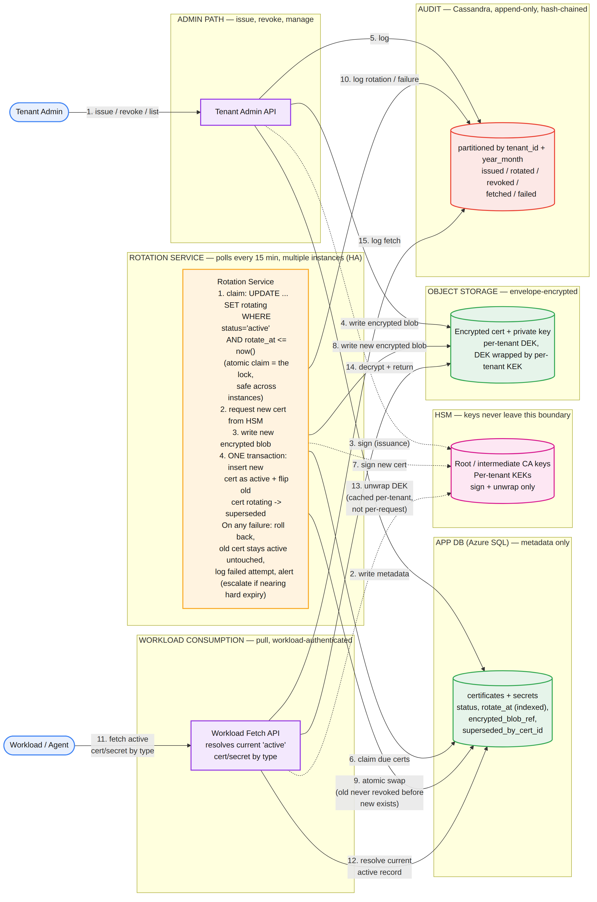
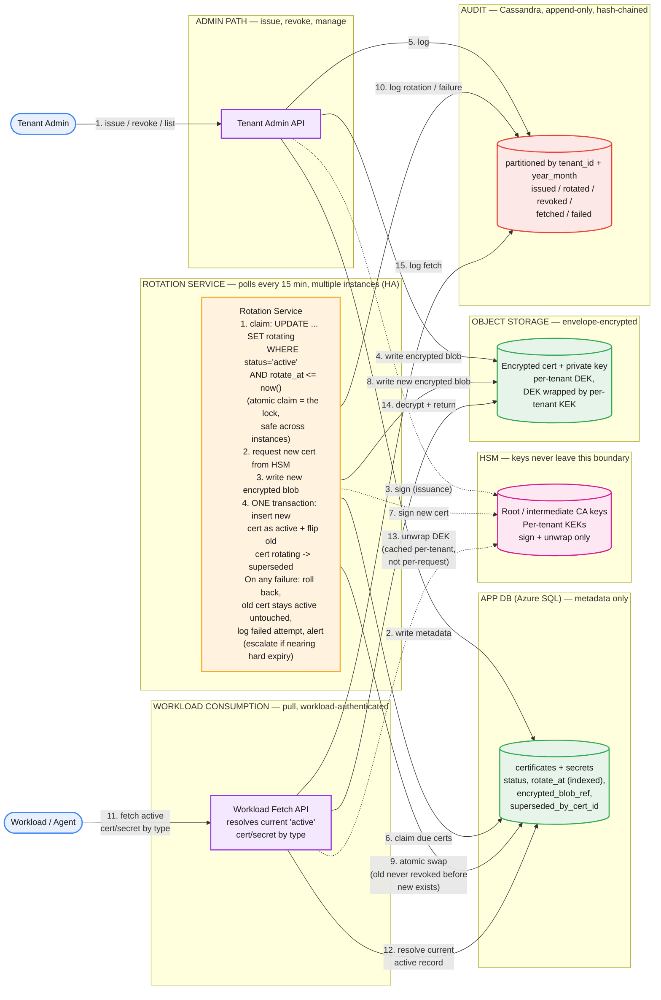

# Multi-Tenant Secrets & Certificate Lifecycle (PKI) — System Design

**Domain:** Security infrastructure, multi-tenant, HSM-backed PKI
**Core tension:** unlike the last two designs, this one isn't a scale problem — throughput on every path is trivial. The hard part is *correctness under failure*: a rotation that fails must never be allowed to take down a workload that was relying on its current, still-valid credential.

---

## Part 1: Requirements, Scale, and the Corrected Flow

### Functional requirements

1. Issue X.509 certificates for tenant apps/workloads — CSR-based or platform-managed key generation, signed by a tenant-scoped CA, with the signing operation performed inside an HSM.
2. Issue and store generic secrets (API keys, DB credentials, tokens) — a related but structurally distinct object from certificates: no CA, no signature, just an encrypted value plus a rotation policy.
3. **Workloads can retrieve their current active secret/certificate at runtime** — the consumption path everything else exists to serve.
4. Auto-rotate certificates and secrets before expiry, on a schedule, with no manual intervention required.
5. Alert on a credential approaching expiry without a successful rotation, and immediately on outright rotation failure — two different severities.
6. Explicit, on-demand revocation, enforced without delay.
7. A full, tamper-evident audit trail — every issuance, rotation, revocation, and retrieval, attributable to a specific principal.
8. Admin visibility: list/query active, expiring, and revoked credentials per tenant; query audit history.

### Non-functional requirements

- **Tenant isolation at two granularities**: cryptographic/data separation between tenants (per-tenant CA hierarchy, per-tenant encryption keys), and least-privilege separation between workloads within the same tenant — a workload can only ever fetch its own credentials.
- **HSM-backed signing** — CA private keys (root and intermediate) never leave the HSM boundary, ever.
- **Make-before-break**: a rotation failure must never invalidate a currently-valid credential before its replacement exists. Precisely stated: a credential's real cryptographic validity is never revoked or allowed to lapse before a valid replacement has been successfully issued — this is a guarantee about ordering of state transitions, not about waiting for any specific workload to confirm it received the new one (the old credential remains genuinely valid and servable the whole time regardless).
- **Tamper-evident audit trail** — append-only alone doesn't prove nothing was retroactively altered; the log is hash-chained so any tampering is detectable on verification.
- **HSM/CA key availability is the single most critical failure point in the entire system** — needs its own HA/backup story (HSM clustering or multi-region replication), independent of the rest of the system's durability model.

### Capacity estimation

- 10,000 tenants, 50 apps/tenant → 500,000 apps, up to 3 certs/app → **1.5M certificates**.
- Assume ~5 secrets/app on average → **2.5M secrets**.
- 90-day cert validity, proactive rotation triggered at ~60 days (a 30-day buffer before hard expiry) → 1.5M / 90 days ≈ 16,700 rotations/day → **~0.2/sec average**, ~2/sec peak even with 10x renewal clustering (a real, well-known hazard — many certs issued in the same batch/migration renewing the same week — mitigated with rotation jitter).
- Secrets on a 60-day rotation policy → ~41,700/day → **~0.5/sec average**.
- HSM signing load: only certs need it (secrets aren't CA-signed) → ~0.2/sec average, far under any HSM's real throughput ceiling (hundreds to low thousands of ops/sec) — a checked, not assumed, non-bottleneck.
- Read/fetch (workload consumption): each workload's agent fetches once at startup, then polls every 5 minutes as a freshness safety net → 500K / 300s ≈ **~1,700 req/sec average**.
- Storage: 1.5M certs + 2.5M secrets, a few KB each with metadata → low tens of GB total.

**What this tells you before drawing anything**: every throughput number here is trivial. This is not a scale problem the way the last two designs were — it's a reliability problem. The design effort belongs in the rotation state machine and failure handling, not in squeezing latency or fanning out to a huge fleet.

### The corrected flow



*Three independent paths sharing the same underlying stores: the **admin path** (issue/revoke/manage), the **rotation service** (the scheduler that finds and executes due rotations), and **workload consumption** (the pull-based fetch path) — all backed by the App DB (metadata), an HSM (keys that never leave it), envelope-encrypted object storage, and a hash-chained audit log.*

**What corrects the common first-draft mistakes on this problem:**

| Common first draft | Why it's wrong | Fix |
|---|---|---|
| Requirements list that just restates the prompt's own bullets | Misses the actual functional requirement everything else serves — how a workload *gets* its credential — and misses that "prevent an outage on rotation failure" is a concrete design constraint (make-before-break), not just a hard problem to solve later | Add the consumption path explicitly; state make-before-break as its own non-functional requirement |
| Treating secrets and certificates as one interchangeable object type | A certificate is a signed X.509 artifact requiring a CA and an HSM; a generic secret is just an opaque encrypted value with a rotation policy — very different issuance mechanics | Model them as related but distinct object types, sharing a lifecycle shape but not a signing step |
| A cert-check/fetch API addressed by `certId`, mirrored from the admin API | A workload doesn't know its own certId in advance, and rotation issues a *new* certId every time (certs are immutable once signed) — addressing by ID would force the workload to track ID churn across every rotation | Workload fetch is addressed by `certType`/`secretType`, resolved server-side to whichever record is currently active — rotation becomes transparent to the consumer |
| Redis TTL/expiration events as the rotation trigger | Redis key-expiration notifications are best-effort, not guaranteed — a silently dropped trigger is exactly the outage this design exists to prevent, and the actual event rate (~0.2-2/sec) doesn't justify the added infrastructure and failure surface | A low-frequency poller (every 15 minutes) against an indexed `rotate_at` column in the durable source of truth — simple, and nothing can be silently lost the way an expiration event can |
| No claiming/locking mechanism for a horizontally-scaled rotation service | Multiple scheduler instances could pick up and rotate the same due credential twice | An atomic conditional update (`UPDATE ... SET status='rotating' WHERE status='active' AND rotate_at <= now()`) — the row-level atomicity of the update *is* the distributed lock; an instance whose update affects zero rows simply moves on |
| No HSM step shown in the rotation flow | Rotation *is* issuing a new certificate — omitting the HSM from the diagram means the actual mechanism of "how a rotation happens" was never drawn, only "how you notice one is due" | Rotation service explicitly calls the HSM to sign the new cert as step 2 of the rotation sequence |
| Private key delivered once and never retained, or stored as an unencrypted blob | Never-retained forces a full re-issuance every time a workload restarts and needs to re-fetch its *existing* identity — wasteful and changes the workload's identity unnecessarily; unencrypted storage defeats the point of HSM-backed key protection | Retain the private key for the credential's full active lifetime, envelope-encrypted: object encrypted with a per-tenant DEK, the DEK wrapped by a per-tenant KEK that only exists inside the HSM |

---

## Part 2: API

**Admin API (tenant-admin authenticated) — Certificates:**

```
GET    /v1/tenants/{tenantId}/apps/{appId}/certs?status=&certType=&cursor=
GET    /v1/tenants/{tenantId}/apps/{appId}/certs/{certId}
POST   /v1/tenants/{tenantId}/apps/{appId}/certs
POST   /v1/tenants/{tenantId}/apps/{appId}/certs/{certId}/rotate
POST   /v1/tenants/{tenantId}/apps/{appId}/certs/{certId}/revoke
GET    /v1/tenants/{tenantId}/apps/{appId}/certs/{certId}/audit-log
```

`rotate` and `revoke` are explicit actions, not `PUT`/`DELETE` — a signed cert's content can't be edited, and revocation is a status transition that must remain visible in the audit trail, never a row deletion.

**Issuance:**

```json
{
  "requestId": "uuid",
  "certType": "tls_server",
  "commonName": "payments.tenantX.internal",
  "subjectAltNames": ["payments.tenantX.internal", "10.0.1.4"],
  "keyGeneration": "platform_managed",
  "csr": null,
  "validityDays": 90
}
```

```json
{
  "requestId": "uuid",
  "certId": "cert_88",
  "certType": "tls_server",
  "status": "active",
  "issuedAt": "...",
  "expiresAt": "...",
  "rotateAt": "...",
  "certificatePem": "-----BEGIN CERTIFICATE-----..."
}
```

`requestId` is a genuine idempotency key here — issuance is a real mutation (generates a key, calls the HSM, persists a record), so a client retry after a timeout must not create a duplicate cert. No private key in this response, regardless of `keyGeneration` mode — for `platform_managed`, the key is only ever delivered through the workload-authenticated fetch endpoint.

**Status lifecycle:** `active | rotating | superseded | revoked | expired | failed`. `rotating` marks a replacement in flight (the current cert stays fully valid). `superseded` is a successful, proactive rotation. `expired` specifically means the proactive rotation *didn't* happen in time — the signal that make-before-break failed and needs a postmortem. `failed` is a failed issuance/rotation attempt requiring alerting.

**Rotate / revoke:**

```
POST .../certs/{certId}/rotate  { "requestId" }
→ { "requestId", "oldCertId", "newCertId", "status": "rotating" }

POST .../certs/{certId}/revoke  { "requestId", "reason" }
→ { "requestId", "certId", "status": "revoked", "revokedAt": "..." }
```

**Workload-facing consumption API — separate auth boundary:**

```
GET /v1/workloads/{workloadId}/certs/{certType}/active
```

Authenticated by the workload's own bootstrap identity (mTLS or platform attestation), scoped only to that workload. Returns exactly one resolved record, not an array to filter client-side:

```json
{
  "certId": "cert_88",
  "certType": "tls_server",
  "status": "active",
  "certificatePem": "...",
  "privateKeyPem": "...",
  "expiresAt": "..."
}
```

The private key appears here — and only here — because this is the one channel that's both workload-authenticated and TLS-encrypted end to end.

**Secrets** mirror this exactly: admin CRUD exposes metadata only; the actual secret value is delivered exclusively through `GET /v1/workloads/{workloadId}/secrets/{secretType}/active`.

---

## Part 3: Data Model

**App DB — Azure SQL, metadata only, no key material:**

```
tenants (tenant_id PK, name, tenant_kek_id, created_at)
apps (app_id PK, tenant_id FK indexed, name, created_at)
workloads (workload_id PK, app_id FK, tenant_id FK indexed,
           bootstrap_identity_ref, created_at)

certificates (
  cert_id PK, tenant_id indexed, app_id indexed, workload_id,
  cert_type enum(tls_server|mtls_client|code_signing),
  status enum(active|rotating|superseded|revoked|expired|failed),
  key_generation_mode enum(platform_managed|client_csr),
  issued_at, expires_at, rotate_at indexed,
  revoked_at, revoked_reason,
  superseded_by_cert_id nullable,
  encrypted_blob_ref, request_id, created_by
)

secrets ( -- same shape
  secret_id PK, tenant_id indexed, app_id, workload_id,
  secret_type, status, issued_at, rotate_at indexed,
  revoked_at, encrypted_blob_ref, request_id, created_by
)
```

`rotate_at`, indexed on both tables, is what makes the rotation scheduler a cheap, targeted query rather than a full scan.

**Private key / secret-value retention**: kept, encrypted, for the full active lifetime of that credential version — not delivered-once-and-forgotten. Reasoning: workloads restart and redeploy far more often than credentials rotate; forcing a full re-issuance on every restart would multiply HSM operations for no benefit and would mean a restarting workload's identity changes when it shouldn't.

**Object storage**: one envelope-encrypted object per credential version — the object is encrypted with a per-tenant Data Encryption Key (DEK); the DEK itself is wrapped by a per-tenant Key Encryption Key (KEK) that exists only inside the HSM. Reading it means: fetch the wrapped DEK, ask the HSM to unwrap it, decrypt the object with the unwrapped DEK. HSMs protect the key that protects the data, not the bulk data itself.

**A real number worth checking here**: if every one of the ~1,700 fetches/sec triggered an HSM unwrap call, that's a new load on the HSM separate from its ~0.2/sec signing load. Fix: cache the unwrapped per-tenant DEK in memory on the fetch-serving service with a short TTL, so the HSM is invoked once per tenant per cache window, not on every single fetch.

**CA and key hierarchy — HSM only, nothing here ever touches Azure SQL or object storage:**
- Root CA private key — generated in, never exported from, the HSM.
- Per-tenant intermediate CA private keys (the mechanism for tenant-isolated signing) — HSM only.
- Per-tenant KEKs — HSM only.

**Audit log — Cassandra, append-only:**

```
Partition key: (tenant_id, year_month)   -- bucketed; unbounded per-tenant
                                          -- partition growth is the anti-pattern
Clustering key: event_time, event_id
Columns: event_type (issued|rotated|revoked|fetched|failed),
         actor (admin_id | workload_id | system:scheduler),
         cert_id/secret_id, request_id, result, details (json)
```

Hash-chained: each entry includes a hash of the previous entry's content, so any retroactive deletion or alteration — even by someone with direct database access — breaks the chain and is detectable on verification. Append-only alone doesn't prove that; the chain does.

---

## Part 4: Major Components

**Rotation Service.** Runs as multiple instances for availability — not a single point of failure. Every 15 minutes (rotation has a large buffer before hard expiry, so this cadence costs nothing in safety while keeping the query load negligible): claim due credentials with an atomic conditional update (`WHERE status='active' AND rotate_at <= now()`), where the update's own atomicity is the cross-instance lock. For each claimed credential: request a new key/signature from the HSM, write the new encrypted blob, then in **one transaction** insert the new credential record as `active` and flip the old one from `rotating` to `superseded`. On any failure at any step, the transaction never commits — the old credential simply remains `active`, untouched, fully valid; the attempt is logged as `failed` and alerted, with escalating severity as the actual hard-expiry deadline approaches.

**Workload Fetch API.** Workload-identity-authenticated, resolves "the current active credential of this type for this workload," decrypts it (via the cached-unwrapped-DEK path), and returns it. This is the endpoint that makes rotation transparent to the consumer — a workload never needs to track credential IDs across rotations.

**HSM.** Holds the root and intermediate CA private keys and per-tenant KEKs. Performs exactly two kinds of operations: signing (issuance/rotation) and unwrapping (read path, cached). Never receives or returns bulk data — only keys and signatures.

---

## Part 5: The Hard Problem — Preventing an Outage on Rotation Failure

This is the prompt's explicit closing question, and it's really three mechanisms working together, not one:

**1. Ordering guarantee (make-before-break), enforced atomically.** The old credential is never marked anything other than `active` until the new one has been fully issued, signed, and durably stored — the state flip happens in the same transaction as the new credential's creation. If any step before that fails, the transaction simply never happens, and the old credential — which was never touched — remains exactly as valid as it was before the attempt started.

**2. Retry with escalating urgency, not silent retry-forever.** A failed rotation logs a `failed` attempt and retries on the next 15-minute cycle. As the actual hard expiry approaches with repeated failures, alert severity escalates — a routine ticket at 30 days out, a paged on-call at 48 hours out with no successful rotation yet. Tenants or workloads flagged `critical` can carry a tighter escalation threshold than the default.

**3. A manual break-glass path.** If automated rotation keeps failing close to expiry (HSM unreachable, a persistent bug), an admin can trigger `POST .../rotate` manually through the same API the scheduler uses — the escalation path of last resort is the same mechanism, not a separate one that's never been exercised until the day it's needed.

The failure mode this design explicitly avoids: a rotation attempt that partially completes and leaves the old credential revoked or expired with no valid replacement in place. Every step here is structured so that never happens — failure means "try again," never "the workload is now broken."

---

## Part 6: How to Run This in the Interview

1. **(0-4 min) Requirements.** State all eight functional points, explicitly including the consumption path (easy to omit since the prompt phrases everything from the admin's perspective). Name make-before-break as its own non-functional requirement, not just a "hard problem for later."
2. **(4-8 min) Capacity.** Do the math, and say out loud that every number here is trivial — this is not a scale problem, and naming that early tells the interviewer where you're about to spend your time.
3. **(8-13 min) API.** Cover both the admin CRUD and the workload-fetch path, and explain why the workload side is addressed by type, not ID — ties rotation transparency directly to the API shape.
4. **(13-19 min) Data model.** The retention decision (encrypted, full lifetime, not delivered-once) and the envelope-encryption hierarchy are the two things worth slowing down for.
5. **(19-24 min) Rotation scheduler.** Walk the poll → atomic claim → HSM sign → atomic commit sequence. Explicitly name why Redis TTL-based triggering was rejected (best-effort delivery is unacceptable for this specific trigger) — a good moment to show you considered and ruled out a plausible alternative, not just landed on the first idea.
6. **(24-38 min) The hard problem — spend the most time here.** The three-part failure-handling story (atomic ordering, escalating retry, manual break-glass) is what this entire prompt is testing.
7. **(38-43 min) Failure modes beyond rotation.** What happens if the HSM itself is unreachable platform-wide (no new issuance or rotation succeeds anywhere — this is why HSM HA is its own named non-functional requirement); what tenant isolation actually prevents (a compromised tenant's intermediate CA key can't be used to forge another tenant's certs).
8. **(43-45 min) Close.** Name the three decisions you'd defend hardest: make-before-break as an atomic state transition, not a best-effort timing hope; a low-frequency durable poll over a TTL/expiration-event trigger, specifically because guaranteed delivery matters more than low latency here; and envelope encryption with the HSM protecting only the key hierarchy, never the bulk data.

### Staff/Principal signal checklist

- Identified the consumption path as the central requirement the prompt only implied, not stated outright.
- Recognized this as a reliability problem rather than a scale problem, and said so explicitly rather than defaulting to the heavier architecture from a prior, genuinely high-QPS design.
- Rejected a plausible-sounding mechanism (Redis TTL triggering) with a specific, correct reason (best-effort delivery), not just "let's use a database instead."
- Solved the "prevent an outage" ask as an atomic ordering guarantee, not a vague "we'll be careful" gesture.
- Distinguished what the HSM actually protects (keys) from what it doesn't (bulk data), and designed envelope encryption accordingly.
- Named the single largest platform-wide failure point (HSM/CA key availability) unprompted, rather than waiting to be asked "what if this one thing goes down."

---

## Appendix: Mermaid source


