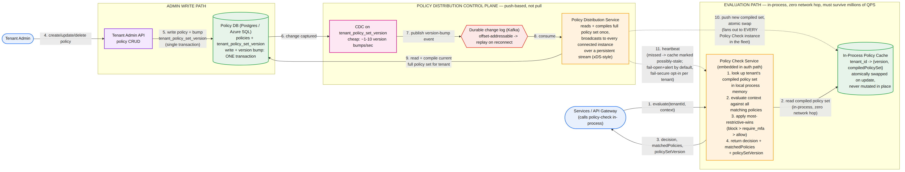

# Real-Time Multi-Tenant Policy Evaluation Engine — System Design

**Domain:** Security/authorization infrastructure, multi-tenant
**Core tension:** millions of QPS on the evaluation path demands everything be local and in-memory; near-instant, no-stale-gap propagation after an admin edit demands the opposite instinct (go check the source of truth). The whole design is reconciling those two pulls without compromising either.

---

## Part 1: Requirements, Scale, and the Corrected Flow

### Functional requirements

1. Tenants define policies as `condition → action` (e.g. `role IN privileged_roles AND device.managed == false → require_mfa`).
2. Every authentication is evaluated against all applicable policies for its tenant.
3. Admins can create, read, update, delete, and list their tenant's policies.
4. A policy edit must be enforced within seconds of being saved — no meaningful window where the old behavior still applies.

### Non-functional requirements / scale

- **Millions of QPS** on the evaluation path — stated directly in the prompt, and the number that drives every downstream decision.
- **Tenant-isolated policy sets** — structurally, not just via a `WHERE tenant_id = ?` filter that could be gotten wrong.
- **No stale-cache security gap** — specifically, a *tightening* edit (adding an MFA requirement, adding a block) must take effect fast and reliably; the failure mode that matters is "we let something through that should have been stopped," not the reverse.

### Capacity estimation

- 10,000 tenants, ~5,000 users/tenant → 50M users.
- The bottom-up math only works if "authentication" means every authorization check on every request through the platform — token/session validation at the gateway, service-to-service calls — not just login events. At ~2,000 authenticated requests/user/day, that's **100B requests/day → ~1.15M req/sec average, ~3.5-6M req/sec peak** (business-hours concentration across time zones). This is the reading that actually produces "millions of QPS"; a login-only interpretation undershoots the stated scale by roughly two orders of magnitude, and it's worth naming that reconciliation explicitly rather than silently picking whichever number is convenient.
- 20 policies/tenant × 10,000 tenants = **200,000 policies total** — small enough (a few hundred MB compiled) that "replicate the entire policy corpus into every evaluation node's memory" is a trivial cost, not a scaling concession.
- Policy edits: ~100,000/day across all tenants → ~1.2/sec average, ~10/sec peak. Low-volume — the propagation design needs to be **fast per change**, not high-throughput.

The QPS number is what rules out every "obvious" first design: a live DB read per request, or even a per-request call to a shared cache, both add a network hop that cannot survive being multiplied by millions every second. The one architecture that survives is: **the evaluation decision is a pure, local, in-memory function call**, and everything about propagation exists to keep that local memory correct without ever putting a network call back in the request path.

### The corrected flow



*Three structurally separate concerns, left to right: the **admin write path** (a policy edit, durably committed), the **distribution control plane** (push-based propagation to the whole fleet), and the **evaluation path** (in-process, zero network hop, where the millions of QPS actually live).*

**What corrects the common first-draft mistakes on this problem:**

| Common first draft | Why it's wrong | Fix |
|---|---|---|
| Evaluate by reading policies from the DB per request | A live database read on every one of millions of requests/sec turns the DB into a bottleneck the entire platform depends on | Each evaluation node holds the full compiled policy set for every tenant **in local process memory**; the DB is never touched on the request path |
| A shared Redis cache, read per request (cache-aside) | Still a network hop on every request — better than a raw DB read, but at millions of QPS it's a single shared dependency that adds tail latency everywhere and takes down every tenant's auth at once if it blips | In-process memory per node, kept in sync by a **push** from a control plane — zero network calls on the hot path, and a node survives a control-plane outage on its last-known-good state |
| Cache-aside with a TTL for freshness | TTL only bounds staleness to a fixed time window — it reacts to nothing, it just expires. Short TTL wastes work re-fetching unchanged data at scale; long TTL reopens the exact stale-cache security gap the prompt asks you to close | **Push-based propagation**: a control plane watches for changes and broadcasts them the moment they happen, so freshness isn't bounded by a timer, it's driven by the actual edit |
| Policy conflict resolution left implicit, or "first matching policy in priority order" | An admin who misorders two policies can silently let a `block` condition get shadowed by an earlier, unrelated `allow` — a security hole caused by a UI ordering mistake, not a design flaw anyone would catch in review | Evaluate **all** matching policies and return the **most restrictive** action (`block > require_mfa > allow`) — no policy can ever be silently weakened by the mere existence of another one |
| Binary pass/fail decision | The example policy's outcome is "require MFA" — a third state, not pass/fail | Multi-value `decision` enum (`allow \| require_mfa \| block`), extensible if tenants need custom actions later |
| `requestId` treated as an idempotency key | Evaluation is a pure read with no state mutation — replaying it twice is redundant, not unsafe. Framing it as an idempotency key copies a pattern from mutation-heavy designs where it doesn't apply | `requestId` is a trace/correlation ID for the audit log, not a dedup mechanism |

---

## Part 2: API

**Evaluation (called in-process by the auth path, not a typical external REST call at this QPS — expressed here as an interface contract):**

```
POST /v1/tenants/{tenantId}/policy-check
```

```json
{
  "requestId": "uuid",
  "requestTime": "2026-09-05T14:02:11Z",
  "userId": "u_123",
  "context": {
    "role": "finance_admin",
    "device": { "deviceId": "d_1", "managed": false, "trusted": false },
    "ip": "...",
    "geo": { "country": "CA" },
    "authMethod": "password"
  }
}
```

```json
{
  "requestId": "uuid",
  "decision": "require_mfa",
  "matchedPolicies": ["pol_88"],
  "policySetVersion": "v482"
}
```

`context` is an open attribute bag, not a fixed field list — tenants define arbitrary conditions, so the evaluator can't assume in advance which attributes any given policy references. `policySetVersion` isn't decorative: it's what lets you debug propagation lag after the fact ("this decision used v482; the edit landed at v483; the gap was 400ms").

**Admin CRUD:**

```
GET    /v1/tenants/{tenantId}/policies?enabled=&cursor=
POST   /v1/tenants/{tenantId}/policies
GET    /v1/tenants/{tenantId}/policies/{policyId}
PUT    /v1/tenants/{tenantId}/policies/{policyId}
DELETE /v1/tenants/{tenantId}/policies/{policyId}
GET    /v1/tenants/{tenantId}/policy-set/version
```

```json
{
  "name": "privileged-role-unmanaged-device",
  "condition": {
    "all": [
      { "attr": "role", "op": "in", "value": ["admin", "finance_admin"] },
      { "attr": "device.managed", "op": "eq", "value": false }
    ]
  },
  "action": "require_mfa",
  "enabled": true
}
```

`condition` is a structured predicate tree, not a free-text DSL — parseable without a custom grammar, and it's exactly what gets compiled into the in-memory evaluation structure. Every mutation returns `{ policyId, policyVersion, tenantPolicySetVersion }`; the bumped tenant-wide version is what the distribution control plane fans out.

**Conflict resolution, decided explicitly:** evaluate every matching policy and return the most restrictive matched action (`block > require_mfa > allow`), not first-match-by-priority. This makes "a misconfigured policy order silently weakens security" structurally impossible — no policy can ever be overridden by the mere existence of a laxer one.

---

## Part 3: Data Model

**`policies` table (Postgres or Azure SQL):**

| column | notes |
|---|---|
| `policy_id` (PK) | stable identity, independent of `name` |
| `tenant_id`, indexed | not a physical shard key — 200K rows total is trivial for one indexed table |
| `name` | label only, never used as a key |
| `condition` (JSONB) | the structured predicate tree |
| `action` | enum(`allow`, `require_mfa`, `block`) |
| `enabled` | |
| `policy_version` | bumped per edit, used for optimistic concurrency |
| `created_at`, `updated_at`, `updated_by` | audit fields |

**`tenant_policy_set_version` table:** one row per tenant — `tenant_id (PK), current_version (bigint, monotonic), updated_at`. This is the value returned by `GET /policy-set/version` and embedded in every evaluation response.

**The decision that makes propagation trustworthy:** every policy mutation and its `tenant_policy_set_version` bump commit in **one database transaction**. Without that guarantee, you can end up with a committed policy change whose version bump was lost (propagation never fires — silent stale cache) or a version bump with no committed change behind it (propagation ships garbage). The version number is only useful as a trigger because it's transactionally tied to the write it represents.

**Size:** ~200K policy rows, roughly 700 bytes–1KB each (UUIDs, JSONB condition, timestamps, row overhead) → **~150-250MB**, plus indexes → **~300-400MB total**. Trivial — this is exactly why replicating the full corpus into every node's memory is cheap, not a scaling compromise. A separate append-only `policy_change_log` for compliance/audit history is a different concern with different retention needs (~70GB over two years at the calculated edit rate) and shouldn't live in the same table as current state.

---

## Part 4: Major Components

**Policy Check Service (evaluation path).** Embedded in whatever service already handles the request (gateway, auth service) — not a standalone network hop. Holds a local, in-process map `tenant_id → {version, compiledPolicySet}`. On each request: look up the tenant's compiled policy set in memory, evaluate the request context against every matching policy, apply most-restrictive-wins, return the decision. Zero database reads, zero cache network calls, on the hot path — the only thing this service does per request is a local memory lookup and a predicate evaluation.

**Policy Distribution Service (control plane).** Watches `tenant_policy_set_version` via CDC — cheap, since that table changes only ~1-10 times/sec across all tenants combined. On a version bump, reads the tenant's current full policy set from the Policy DB, compiles it once (predicate tree → evaluatable structure), and pushes `{tenant_id, version, compiledPolicySet}` to every connected Policy Check Service instance over a **persistent stream** — the same pattern Envoy's xDS protocol and OPA's bundle-server use to push config to a large fleet of local evaluators.

**Durable change log (Kafka).** Sits between CDC and the broadcast layer so that a reconnecting Policy Check Service instance — or a Distribution Service instance that was briefly down — can replay events from a known offset instead of permanently missing a change that happened during a gap.

**Atomic swap on update.** When a Policy Check Service instance receives a new compiled policy set for a tenant, it builds the new object first, then swaps the reference for that tenant atomically — it never mutates the existing structure in place, which would risk a concurrently-running evaluation reading a half-updated policy set.

---

## Part 5: The Three Hard Problems

**1. Millions of QPS with zero network hop.** This is the load-bearing constraint of the whole design, and it's why a cache-aside pattern against even a fast shared store (Redis) isn't the final answer — any per-request network call, however fast, becomes a shared bottleneck and a single point of failure once multiplied by millions/sec. The fix is holding the entire (small — ~300-400MB) policy corpus in every evaluation node's own process memory, so the request path never leaves the process.

**2. Near-instant propagation without a stale-cache security gap.** Solved by three pieces working together, not one: (a) the transactional version bump, which guarantees a propagated version number always corresponds to a durably committed change; (b) push-based distribution over persistent streams, so freshness is driven by the actual edit rather than bounded by a polling/TTL timer; (c) heartbeat-based staleness detection — if a node's stream goes quiet past a bounded window, its cache is marked `possibly-stale`, and the node either fails open with an alert (default) or fails secure to the most restrictive action for tenants that opt into that stricter guarantee, rather than silently trusting a cache it can no longer prove is current.

**3. Safe conflict resolution at scale.** With potentially many policies matching one request, letting policy *order* determine the outcome creates a real security risk: an admin reordering or adding an unrelated policy can silently change what a completely different policy enforces. Evaluating all matching policies and returning the most restrictive action removes ordering as a variable — a policy's effect can never be weakened by another policy's mere existence, which is a much stronger, easier-to-reason-about guarantee than "the rules are evaluated top to bottom, so be careful with priority."

---

## Part 6: How to Run This in the Interview

1. **(0-3 min) Requirements.** State all four functional points, then flag the two non-functional ones that actually shape the architecture: millions of QPS, and "no stale-cache security gap" specifically on tightening edits. Say explicitly that these two pull in opposite directions and that reconciling them is the point of the exercise.
2. **(3-7 min) Capacity, and the QPS reconciliation.** Do the bottom-up math, notice it undershoots "millions," and resolve it out loud by reframing "authentication" as every authorized request, not just login. This is a good moment to show you don't just accept a stated constraint passively — you check your own numbers against it and explain the gap.
3. **(7-12 min) API.** Present the request/response shape, call out the open attribute bag in `context` (not fixed fields) and the `policySetVersion` field as deliberate choices tied to problems you'll solve later in the design.
4. **(12-17 min) Data model.** The transactional version-bump guarantee is the one sentence worth slowing down for here — it's the fact that makes the whole propagation story trustworthy rather than "probably fine."
5. **(17-22 min) Evaluation path.** State the zero-network-hop requirement as a hard constraint before drawing anything, then show the in-process cache.
6. **(22-38 min) Propagation — spend the most time here.** This is what the prompt is actually testing. Walk CDC → durable log → distribution service → push → atomic swap → heartbeat/staleness-detection in that order, and be ready to defend why a shared Redis cache-aside design (a very natural first instinct) falls short of "near-instant" and "no stale-cache gap" even though it looks like a reasonable answer at first glance.
7. **(38-43 min) Failure modes.** What happens if the Distribution Service itself is down (nodes serve last-known-good, alarms fire, replay from the durable log on recovery); what a tenant that opts into fail-secure mode experiences during a disconnect (more conservative default decisions, not an outage); how you'd monitor this (per-node acked-version lag, `possibly-stale` rate, propagation p99 from commit to fleet-wide application).
8. **(43-45 min) Close.** Name the three decisions you'd defend hardest: in-process memory as the only way to survive millions of QPS; push-based propagation over persistent streams instead of any pull/TTL pattern, because freshness needs to be event-driven, not time-bounded; and most-restrictive-wins conflict resolution as what makes the system safe against admin misconfiguration, not just fast.

### Staff/Principal signal checklist

- Noticed the bottom-up capacity math didn't match the prompt's stated "millions of QPS," and resolved the discrepancy explicitly rather than picking whichever number was convenient.
- Ruled out cache-aside/shared-cache designs with a specific, stated reason (still a per-request network hop; still a single point of failure) rather than jumping straight to the most sophisticated answer without showing the reasoning that got there.
- Made the conflict-resolution rule an explicit, defended design decision instead of leaving policy ordering implicit.
- Treated "near-instant propagation" as requiring push, not a faster pull — and could explain why a TTL, however short, doesn't structurally satisfy "no stale-cache gap."
- Tied the propagation guarantee back to a specific data-model decision (the single-transaction version bump) rather than treating propagation as a purely infrastructure concern.
- Named a concrete, opt-in behavior (fail-secure for a subset of tenants) for what happens when the freshness guarantee itself can't be verified, instead of assuming propagation "just works."

---

## Appendix: Mermaid source

```mermaid
flowchart LR
    Callers(["Services / API Gateway
    (calls policy-check in-process)"])
    Admin(["Tenant Admin"])

    subgraph EVAL["EVALUATION PATH — in-process, zero network hop, must survive millions of QPS"]
        direction TB
        PolicyCheck["Policy Check Service (embedded in auth path)
        1. look up tenant's compiled policy set
           in local process memory
        2. evaluate context against all
           matching policies
        3. apply most-restrictive-wins
           (block > require_mfa > allow)
        4. return decision + matchedPolicies
           + policySetVersion"]
        LocalCache[("In-Process Policy Cache
        tenant_id -> {version, compiledPolicySet}
        atomically swapped on update,
        never mutated in place")]
    end

    subgraph ADMINPATH["ADMIN WRITE PATH"]
        direction TB
        AdminAPI["Tenant Admin API
        policy CRUD"]
        PolicyDB[("Policy DB (Postgres / Azure SQL)
        policies + tenant_policy_set_version
        write + version bump: ONE transaction")]
    end

    subgraph CONTROL["POLICY DISTRIBUTION CONTROL PLANE — push-based, not pull"]
        direction TB
        CDCNode["CDC on tenant_policy_set_version
        cheap: ~1-10 version bumps/sec"]
        Log{{"Durable change log (Kafka)
        offset-addressable -> replay on reconnect"}}
        DistSvc["Policy Distribution Service
        reads + compiles full policy set once,
        broadcasts to every connected instance
        over a persistent stream (xDS-style)"]
    end

    Callers -- "1. evaluate(tenantId, context)" --> PolicyCheck
    PolicyCheck -- "2. read compiled policy set
    (in-process, zero network hop)" --> LocalCache
    PolicyCheck -- "3. decision, matchedPolicies,
    policySetVersion" --> Callers

    Admin -- "4. create/update/delete policy" --> AdminAPI
    AdminAPI -- "5. write policy + bump
    tenant_policy_set_version
    (single transaction)" --> PolicyDB
    PolicyDB -- "6. change captured" --> CDCNode
    CDCNode -- "7. publish version-bump event" --> Log
    Log -- "8. consume" --> DistSvc
    DistSvc -- "9. read + compile current
    full policy set for tenant" --> PolicyDB
    DistSvc -. "10. push new compiled set,
    atomic swap
    (fans out to EVERY
    Policy Check instance
    in the fleet)" .-> LocalCache
    DistSvc -. "11. heartbeat
    (missed -> cache marked
    possibly-stale;
    fail-open+alert by default,
    fail-secure opt-in per tenant)" .-> PolicyCheck

    classDef source fill:#e8f0fe,stroke:#4285f4,stroke-width:2px,color:#1a1a1a;
    classDef edge fill:#f3e8fd,stroke:#9334e6,stroke-width:2px,color:#1a1a1a;
    classDef service fill:#fff3e0,stroke:#f9a825,stroke-width:2px,color:#1a1a1a;
    classDef store fill:#e6f4ea,stroke:#34a853,stroke-width:2px,color:#1a1a1a;
    classDef stream fill:#fce8e6,stroke:#ea4335,stroke-width:2px,color:#1a1a1a;
    classDef control fill:#fde7f3,stroke:#d81b8f,stroke-width:2px,color:#1a1a1a;

    class Callers,Admin source;
    class AdminAPI edge;
    class PolicyCheck,DistSvc service;
    class LocalCache,PolicyDB store;
    class Log stream;
    class CDCNode control;
```


