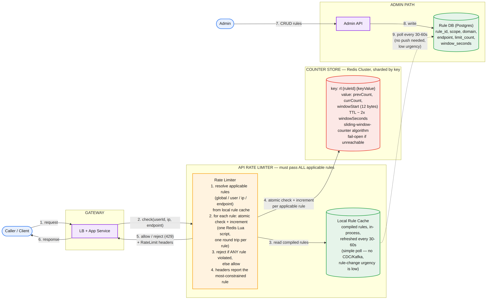
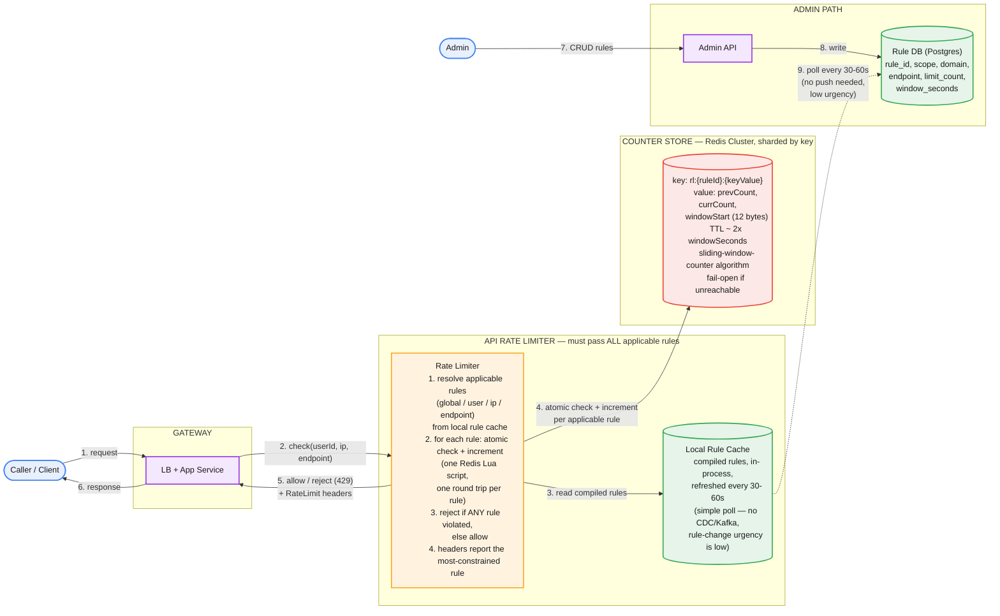

# API Rate Limiter — System Design

**Domain:** Traffic-shaping / protective infrastructure, high QPS, distributed correctness
**Core tension:** the limiter has to enforce a *shared, correct* count across an entire fleet of backend instances, at a throughput higher than most of the services it protects — without becoming the bottleneck or single point of failure itself.

---

## Part 1: Requirements, Scale, and the Corrected Flow

### Functional requirements

1. Evaluate every incoming request against all applicable configured rules and return a single allow/reject decision.
2. On rejection, tell the caller how much quota remains and when the limit resets — not just a bare reject.
3. Rules are configurable per user, per IP, and per endpoint/action, and **multiple rules can apply to a single request simultaneously** (a per-user limit, a per-IP limit, and a global endpoint limit, all at once). Conflict resolution, decided: the request must pass **every** applicable rule — any one violation rejects it, mirroring the most-restrictive-wins principle from the policy engine design.
4. Admin CRUD for rule definitions.
5. Visibility: query current usage/remaining quota for a given key, for debugging and for well-behaved clients checking proactively.

### Non-functional requirements

- **Correct enforcement across a distributed fleet** — the central constraint. A user's requests can land on any backend instance; per-instance local counters would let a user blow past their real limit just by spreading across enough nodes.
- **Low latency** — the check sits on or near the hot path of everything it protects.
- **Reusable across many services** — one shared capability, not rebuilt per service.
- **Explicit fail-open/fail-closed decision for when the counter store itself is unreachable** — decided: **fail open**. A broken rate limiter taking down every protected service is a worse outcome than temporarily under-enforcing a limit; the failure is logged and alerted, not silent.

### Capacity estimation

- 100M active users, ~1,000 calls/user/day → 100B calls/day → **~1.16M req/sec average**.
- Peak: **~10-12M req/sec**, justified by something specific to this problem rather than generic time-zone spread — a rate limiter's peak load correlates with the exact scenario it exists to protect against: when a downstream dependency struggles, clients retry aggressively, spiking traffic right when the system is under the most stress.
- **Full key-space accounting** (not just the simplest dimension): ~100M per-user keys, **~2B per-(user, endpoint) keys** (100M users × ~20 rate-limited endpoints — this dimension dominates), ~200M per-IP keys, ~20 global keys → **~2.3B keys total**.
- At 12 bytes/key (a compact sliding-window-counter record) → **~28GB** total — still trivial for a sharded in-memory store, and likely lower in steady state since inactive keys expire via TTL rather than persisting forever.
- Algorithm, chosen deliberately rather than assumed: **sliding window counter**, not fixed window (which has a real boundary-burst bug — a user can send up to 2x their limit by clustering requests at the edge of two adjacent windows) and not sliding window log (perfectly accurate, but storage grows with request volume per key rather than staying fixed). The sliding window counter keeps two adjacent fixed-window counts and a window-start timestamp — `previousWindowCount` (4B) + `currentWindowCount` (4B) + `windowStart` (4B) = 12 bytes exactly, matching the capacity estimate.

### The corrected flow



*The request path (bottom left) never leaves in-process memory for rule lookups and only touches the network once, for an atomic check-and-increment against the sharded counter store. Rule administration (top) is a separate, much lower-volume path that only needs a periodic poll to stay in sync — not the heavier push-based propagation used in problems with a real security freshness requirement.*

**What corrects the common first-draft mistakes on this problem:**

| Common first draft | Why it's wrong | Fix |
|---|---|---|
| One evaluation call per rule dimension (a call for the global rule, another for per-user, another for per-IP) | Multiplies the limiter's own load by however many dimensions apply — directly undermines the capacity plan, since the limiter's real QPS becomes 3x+ the protected traffic | One call carries every identifying attribute (userId, ip, endpoint); the limiter resolves and checks all applicable rules internally in that single call |
| Sizing storage only for the per-user dimension | The requirements explicitly allow rules scoped to (user, endpoint) and per-IP — these have much larger key spaces than raw user count and dominate the real footprint | Account for every (rule × key-space) combination the rule model actually allows, not just the simplest one |
| Checking the counter and incrementing it as two separate operations | Classic check-then-act race: two concurrent requests can both read "under limit" before either's increment lands, and both proceed — the real count ends up over the limit | Run the entire read-decide-increment sequence as a single atomic operation (a Redis Lua script via `EVAL`) — nothing can interleave in the middle of it |
| A shared cache reached over the network for rule lookups on every request | Reintroduces a network hop into a path that has to survive 10M+/sec peak | Rules are compiled and held in the rate limiter's own process memory, refreshed on a periodic poll — zero network calls for rule lookups on the request path |
| Reusing the policy engine's full CDC → Kafka → push-based propagation pipeline for rule changes | Rule-change urgency here is low (rare admin edits, no security consequence to a minute of staleness) — importing the heavier mechanism because it worked in a different problem, not because this one's numbers call for it | A simple periodic poll (every 30-60 seconds) against the Rule DB is sufficient and far cheaper to build and run |
| No stated behavior for when the counter store itself is down | Silently either fails closed (outage of everything the limiter protects) or fails open (undocumented, inconsistent) | Explicit decision: fail open, logged and alerted — availability of the protected services wins over strict enforcement during a limiter-infrastructure incident |

---

## Part 2: API

**Evaluation — one call, all applicable rules:**

```
POST /v1/rate-limit/check
```

```json
{
  "requestId": "uuid",
  "requestTime": "2026-09-05T14:00:00Z",
  "userId": "u_123",
  "ip": "203.0.113.5",
  "endpoint": "auth.login"
}
```

`requestId` is a genuine idempotency key here — unlike a pure-read check, an *allowed* evaluation also consumes a unit of quota (increments a counter). A client retry after a timeout must not double-decrement that quota for what was really one request.

**Responses — every response carries rate-limit metadata, not just rejections:**

```
200 OK
X-RateLimit-Limit: 100
X-RateLimit-Remaining: 42
X-RateLimit-Reset: 1725552060
{ "requestId": "uuid", "allowed": true }
```

```
429 Too Many Requests
Retry-After: 12
X-RateLimit-Limit: 100
X-RateLimit-Remaining: 0
X-RateLimit-Reset: 1725552060
{ "requestId": "uuid", "allowed": false, "violatedRule": "per_user_endpoint" }
```

`Retry-After` is the standard HTTP header — no custom `X-` prefix needed. `violatedRule` matters for debuggability: with several rules potentially in play, knowing *which one* fired turns "user X got rate limited" into an actionable signal. When multiple rules apply on an allowed request, headers report whichever rule is currently **most constrained** — the one the client actually needs to respect next.

**Admin CRUD — plain REST, deliberately unlike the PKI design's action-based endpoints.** A rate-limit rule is ordinary mutable configuration, not a security-sensitive immutable artifact — no reason to avoid `PUT`/`DELETE` here the way certificates required `rotate`/`revoke`.

```
GET    /v1/rules?scope=&endpoint=&cursor=
POST   /v1/rules
GET    /v1/rules/{ruleId}
PUT    /v1/rules/{ruleId}
DELETE /v1/rules/{ruleId}
```

```json
{
  "name": "login-per-user",
  "scope": "user",
  "endpoint": "auth.login",
  "limit": 10,
  "windowSeconds": 60
}
```

---

## Part 3: Data Model

**Rule DB — Postgres / Azure SQL, not Cassandra.** Same reasoning applied consistently across these designs: rule definitions are low-volume, admin-managed, need relational filtering and strong consistency — not the high-throughput append-only shape Cassandra is for.

```
rules (
  rule_id PK, name,
  scope enum(user | ip | endpoint_global),
  domain, endpoint,
  limit_count, window_seconds,
  enabled, created_at, updated_at, updated_by
)
UNIQUE (scope, domain, endpoint)
```

**Counter store — Redis Cluster, sharded.** This is the hot-path state: ~2.3B keys, ~28GB, needs sub-millisecond access at up to 10-12M/sec peak, and must be genuinely shared (not per-instance local) for correctness.

- **Key:** `rl:{ruleId}:{keyValue}` — e.g. `rl:rule_42:u_123` (per-user), `rl:rule_43:203.0.113.5` (per-IP), `rl:rule_44:GLOBAL`. Encoding `ruleId` into the key is what lets one endpoint carry several independent counters at once, one per applicable rule.
- **Value (12 bytes):** `{ previousWindowCount, currentWindowCount, windowStart }`.
- **TTL:** ~2× `windowSeconds`, so an inactive user's or IP's counter expires naturally rather than persisting forever — this is what keeps real memory usage below the theoretical 28GB ceiling.
- **Atomicity:** the full check-decide-increment sequence runs as one Lua script via Redis `EVAL` — the same "make the check and the state change one atomic operation" principle used for the policy engine's cache swap and the PKI design's rotation claim.
- **Sharding** (Redis Cluster, keys hashed across nodes) solves scale — no single node absorbs the full peak load; using Redis as the **shared** store in the first place (rather than per-instance local memory) solves correctness — every backend instance checks the same central counter regardless of which one handled the request. These are two distinct benefits of the same design choice, worth stating separately.

---

## Part 4: Major Components

**Rate Limiter.** Called once per real incoming request (not once per rule dimension) with the request's identifying attributes. Resolves every applicable rule from its own **local, in-process rule cache** — zero network calls for rule lookups. For each applicable rule, issues one atomic check-and-increment against the sharded Redis counter store. Rejects if any rule is violated; otherwise allows. Populates rate-limit headers from whichever applicable rule is currently most constrained.

**Local Rule Cache.** Compiled rule set held in the Rate Limiter's own process memory, refreshed via a periodic poll (every 30-60 seconds) directly against the Rule DB — deliberately not the CDC/Kafka push pipeline used in the policy engine, because rule-change urgency here doesn't justify that cost.

**Counter Store (Redis Cluster).** Holds the actual rolling counters. Fails open: if unreachable, the Rate Limiter allows requests through by default (logged and alerted as a degraded mode) rather than rejecting everything, per the explicit non-functional requirement.

---

## Part 5: The Three Hard Problems

**1. Correct, shared state at a throughput higher than the traffic it protects, without becoming the bottleneck.** Solved by two distinct mechanisms working together: using a genuinely shared store (Redis, not per-instance memory) for correctness — every node sees the same count regardless of which one handled a given request — and sharding that store by key hash for scale, so no single node absorbs the full peak. Neither alone is sufficient; a single unsharded Redis node would be correct but couldn't take the load, and per-instance local counters would scale trivially but be wrong.

**2. The check-then-act race.** Checking a counter and incrementing it as two separate steps lets concurrent requests both slip through past the real limit. The fix is architectural, not "be careful": collapse the entire decision into one atomic server-side operation (a Lua script), so there is no window in which two requests can both observe "under limit" before either's effect is recorded.

**3. Choosing the counter algorithm as a deliberate storage/accuracy tradeoff, not a default.** Fixed window is cheap but has a real correctness bug at window boundaries. Sliding window log is perfectly accurate but its storage isn't fixed — it grows with traffic per key, incompatible with a flat per-key size budget. The sliding window counter is the deliberate middle point: bounded, fixed-size storage that closely approximates the log's accuracy by weighting two adjacent window counts — chosen because it's the one that actually matches both the correctness bar and the capacity budget calculated earlier.

---

## Part 6: How to Run This in the Interview

1. **(0-4 min) Requirements.** State all five functional points, and make the distributed-correctness requirement explicit up front — it's what the entire rest of the design serves, and naming it early tells the interviewer you know where the real difficulty is.
2. **(4-9 min) Capacity.** Do the full key-space accounting (not just per-user), and state the algorithm choice — sliding window counter — as a deliberate decision tied to the storage number, not an assumption made in passing.
3. **(9-13 min) API.** One call evaluating all applicable rules, rate-limit headers on every response, `requestId` as a genuine idempotency key protecting against double-consumed quota.
4. **(13-18 min) Data model.** Rule DB vs counter store as two different problems with two different right answers — a good moment to show you don't default to one storage technology for everything.
5. **(18-28 min) Architecture and the check-then-act race — spend real time here.** This is the correctness core of the whole design. Walk through why two separate operations are unsafe and how the atomic Lua script fixes it.
6. **(28-36 min) Distributed correctness and scale.** Sharding vs. shared state as two separate benefits of the same design choice — worth explicitly separating these, since conflating them is an easy way to under-explain the design.
7. **(36-42 min) Failure modes.** What happens when Redis is unreachable (fail open, explicitly, with the tradeoff named); what happens if rule propagation lags (bounded by the poll interval, and — unlike the policy engine — that's fine here, worth saying why).
8. **(42-45 min) Close.** Name the three decisions you'd defend hardest: one call evaluating every applicable rule rather than one call per dimension; the atomic Lua script as the actual fix for the check-then-act race, not just "we use Redis"; and the deliberate choice not to reuse the policy engine's heavier propagation machinery here, because this problem's numbers don't call for it.

### Staff/Principal signal checklist

- Did the full key-space accounting across every rule dimension the requirements actually allowed, not just the simplest one.
- Chose the rate-limiting algorithm as an explicit tradeoff tied to the storage budget, rather than picking one without connecting it to the numbers.
- Identified and fixed the check-then-act race with a specific mechanism (atomic Lua script), not a vague "we'll handle concurrency."
- Separated what sharding solves (scale) from what a shared store solves (correctness) instead of treating "put it in Redis" as one undifferentiated fix.
- Made the fail-open/fail-closed decision for the counter store explicit and defended it, rather than leaving it implicit.
- Recognized when **not** to reuse a heavier mechanism from a previous design — deliberately chose a simple poll over the policy engine's push pipeline because this problem's actual freshness requirement didn't justify the heavier one.

---

## Appendix: Mermaid source


