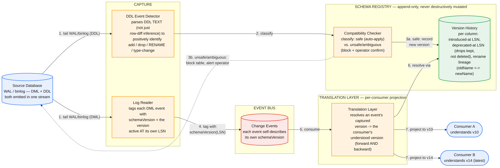
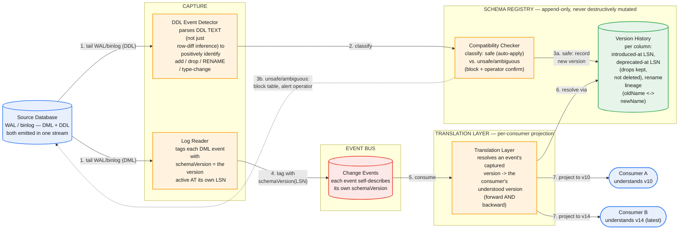

# Schema-Evolution-Tolerant Replication — System Design

The central tension: the source schema will change mid-stream — a column added, dropped, renamed, or retyped — while the pipeline keeps flowing, the retained log keeps accumulating history spanning many schema versions, and multiple downstream consumers keep consuming at different points, potentially built to understand different versions. Every event in a durable, replayable log was captured under *some* schema version, and it must remain correctly interpretable under that version forever, even after the schema has moved a dozen versions further. This is fundamentally a problem of preserving semantic meaning across time, not just handling "the next" DDL statement.

This builds directly on the CDC pipeline design (log-based capture, the change-event envelope, a schema registry mentioned there only in passing) — the new problem is making that registry actually correct under the four canonical DDL operations, and reasoning precisely about what happens to in-flight and already-replayed events at the exact moment the schema moves.

## Part 1 — Requirements

### Functional Requirements

1. Detect schema changes (DDL) in-band, from the same log stream already being tailed for data changes — not out-of-band polling of `information_schema`.
2. Support the four canonical operations distinctly: ADD COLUMN, DROP COLUMN, RENAME COLUMN, TYPE CHANGE — each has different downstream implications and cannot share one generic handler.
3. Every change event remains correctly interpretable using the schema version active *at the moment it was captured*, regardless of how many schema versions have elapsed by the time it's actually consumed or replayed.
4. Multiple downstream consumers, each potentially lagging at a different point and built to understand a different schema version, must all consume correctly without being forced to upgrade in lockstep with the source or each other.
5. Replay from an arbitrarily old point in the retained log must work correctly across every schema version boundary crossed during that replay.

### Non-Functional Requirements — and the exception stated up front

1. **No pipeline stall on a schema change — with one deliberate, narrow exception.** This mirrors "log-based capture, not polling" from the base CDC design as the shaping decision here, with one addition: the exception is *unsafe* type changes (Part 5, Hard Problem 4), where continuing to flow would mean flowing silently-corrupted data. Stating this exception explicitly, rather than pretending "never stall" is absolute, is itself the correct answer — not a contradiction of it.
2. **Backward *and* forward compatibility.** Backward compatibility (new schema can read old data) is necessary but not sufficient — consumers deploy independently and lag behind the registry's latest version, so an old consumer must also be able to correctly read data produced under a newer schema.
3. **No silent corruption at a schema boundary.** A rename misclassified as drop-then-add silently severs a column's history — this must be actively prevented, not left to "usually works."
4. **Explicit handling for changes that can't be safely automated.** A lossy type narrowing must never be silently coerced — it needs detection and an explicit gate, not a best-effort guess.

### Capacity Estimation

Building on the base CDC pipeline's fleet numbers (5,000 source databases, ~500K changes/sec fleet-wide):

| Dimension | Value |
|---|---|
| Schema-change (DDL) frequency per source DB | ~1/week (a reasonable rate for an actively-developed application) |
| Fleet-wide DDL events | 5,000 × 1/week ≈ **~30/hour fleet-wide** |
| Historical schema versions per table over a multi-year lifetime | ~50 (illustrative) |
| Schema definition size | ~2KB (column list + types + rename lineage) |
| **Total schema registry storage, fleet-wide** | 5,000 tables × 50 versions × 2KB ≈ **~500MB** |

**DDL frequency is low, but that's not the same as low importance — blast radius is what matters.** A single schema change is rare relative to the ~500K/sec data-change rate, but every event downstream of that change point, for the entire retention window (days in the event bus, potentially years in the lake per the CDC doc's raw-log layer), must be interpreted correctly relative to it. A design that reasons about DDL handling by frequency alone underrates the problem; the right lens is "how much history does one misclassified change potentially corrupt," which is unbounded, not "how often does this happen," which is small.

**Schema history storage is a genuine "aha" — it's cheap enough to keep forever, unlike the data it describes.** ~500MB fleet-wide for full historical schema lineage is trivial next to the petabytes of actual change data this pipeline moves. There's no good reason to ever prune schema history the way the raw change log needs a TTL — the registry should be designed as an unbounded, append-only, versioned log from the start, not something that inherits a retention/pruning story it doesn't actually need.


*DDL is detected in-band from the same log stream as data changes, classified as safe or unsafe, and recorded as an append-only version — drops are marked deprecated, never deleted; renames are recorded with explicit lineage, never as drop+add. Every data event is tagged with the schema version active at its own LSN, which is what lets the translation layer correctly serve consumers on different versions without any ordering coordination between the two streams.*

### Common First-Draft Mistakes

| # | First-draft approach | Why it fails | Fix |
|---|---|---|---|
| 1 | Poll `information_schema` periodically to detect schema drift | Adds a second, out-of-band mechanism with its own lag and race potential against the data stream | Detect DDL in-band from the same WAL/binlog already being tailed — both Postgres and MySQL emit DDL into that stream |
| 2 | Physically delete a dropped column's definition immediately | Any replay of pre-drop events, potentially years later, can no longer interpret that column's historical values | Mark the column deprecated as of a specific LSN; keep its definition in the registry forever |
| 3 | Infer a rename from row-level before/after diffs alone | A drop-then-add observed at the row level is ambiguous with a genuine rename — misclassifying it silently severs the column's history with no error raised | Parse the actual DDL statement text to positively detect `RENAME COLUMN`; route ambiguous cases to operator confirmation rather than guessing |
| 4 | Auto-coerce every type change to keep the pipeline flowing | A lossy narrowing (e.g., `DECIMAL(10,2)` → `INT`) silently corrupts data in flight, which is worse than stopping | Classify type changes into a safe-widening allowlist (auto-apply) vs. everything else (block + require explicit operator-confirmed coercion policy) |
| 5 | Assume every consumer upgrades to the latest schema version immediately | Consumers deploy independently and lag differently; forcing lockstep upgrades isn't realistic and isn't required | An explicit translation/projection layer that resolves any captured version into whatever version a given consumer understands |
| 6 | Tag events with "whatever schema is current when the event is consumed" | A lagging or replaying consumer can receive events tagged with the *wrong* schema relative to their actual content | Tag each event with the schema version active at its own capture LSN — resolved once, at capture time, never reinterpreted later |

## Part 2 — API

### Change-event envelope (extends the base CDC design)

```json
{
  "op": "u",
  "before": { "id": 42, "status": "pending" },
  "after":  { "id": 42, "status": "shipped" },
  "source": { "db": "orders", "table": "orders", "lsn": "0/1A2B3C4" },
  "schemaVersion": "orders.v14"
}
```

`schemaVersion` is a pointer, not an inline schema definition — every event carries a small, stable reference rather than a multi-KB schema blob, keeping the envelope cheap at the ~500K/sec fleet-wide rate from the base design.

### `GET /schemas/{table}/versions/{version}`

```json
{
  "version": "orders.v14",
  "effectiveLsnRange": ["0/1A00000", "0/1B00000"],
  "columns": [{ "name": "status", "type": "varchar(20)" }, ...],
  "deprecatedColumns": [{ "name": "legacy_flag", "deprecatedAtLsn": "0/19FFFFF" }],
  "renameLineage": { "shipping_status": "status" }
}
```

### `GET /schemas/{table}/versions`

Lists every historical version for a table with its defining DDL operation and effective LSN — the full, permanent lineage (Part 1's "cheap to keep forever" point made concrete).

### `POST /schemas/{table}/compatibility-check`

Given a proposed schema change, returns whether it's safely automatable or requires explicit confirmation — a proactive gate exposed to catch a breaking change *before* it reaches the live stream, not only react to one after the fact.

### Consumer contract

Each consumer declares the schema version it understands (e.g., "v12"). The system is responsible for either delivering events already projected to that version via the translation layer, or explicitly flagging that the consumer has fallen dangerously far behind the registry's current version and needs to upgrade — this is what actually operationalizes forward compatibility as a mechanism, not a hope.

## Part 3 — Data Model

**The schema registry is append-only and never destructively mutated — this is the single load-bearing decision in the whole design**, the direct analog of the document-version-history design's "manifests must be flat, never chained diffs" and the KV store's "dedup lives in the block store, never the manifest." Every version entry:

```
versionId          : e.g. "orders.v14"
tableId
effectiveLsnRange  : the LSN window this version was active for
ddlOperation       : add | drop | rename | type_change
columns            : the live column set as of this version
deprecatedColumns  : dropped columns, RETAINED with their deprecation LSN — never deleted
renameLineage      : { newName -> oldName } — explicit, not inferred at read time
```

**A DROP does not delete a column's definition — it marks it deprecated as of an LSN.** Pre-drop events remain fully interpretable forever using the historical version they're tagged with; only the live/current schema (and new events) correctly omit the column.

**A RENAME is recorded as a rename, never as a drop-then-add.** This is the correctness-critical distinction covered in depth in Part 5 — the registry's data model has an explicit `renameLineage` field specifically so that a rename never has to be reconstructed or guessed at read time; it's captured once, correctly, at detection time.

**Every data event is tagged with the schema version active at its own capture LSN.** Since schema versions are indexed by effective LSN range, resolving "which schema version does this event belong to" is a single deterministic lookup by the event's own LSN — never a function of when the event happens to be consumed, replayed, or how far the registry has moved on since.

**The translation/projection layer** uses the registry's rename lineage and deprecated-column metadata to project an event captured under version N into the shape a specific consumer understands at version M, in either direction — a consumer behind the source's current version (the common case) or, less commonly, a consumer that already understands a version ahead of what an old replayed event was captured under.

## Part 4 — Major Components

- **DDL Event Detector** — parses DDL statements directly out of the same WAL/binlog stream already tailed for DML; positively identifies add/drop/rename/type-change from the statement text itself, not inferred from row-level effects.
- **Compatibility Checker** — classifies a detected DDL operation as safely automatable or as requiring explicit operator confirmation, before it's committed to the registry.
- **Schema Registry** — append-only, versioned, per-table schema history with retained deprecated columns and explicit rename lineage.
- **Log Reader (extended from the base CDC design)** — additionally stamps every DML event with the schema version active at its own LSN.
- **Translation / Projection Layer** — resolves any event's captured version into any consumer's understood version, both directions.
- **Consumer Version Tracker** — tracks each downstream consumer's understood schema version and flags dangerous lag.

## Part 5 — Hard Problems

### 1. ADD COLUMN — the easy case, and precisely why it's easy

A new column appearing mid-stream is close to free: old events simply have no value for it, and the registry marks the column "introduced at LSN X." A consumer reading a pre-X event correctly treats the column as absent — this is semantically correct (the column genuinely didn't exist for that data at that time), not a null standing in for an error. The only real decision is a consistent default-value convention (NULL vs. a specified default) applied identically by the projection layer for old events and by the target schema itself — worth naming as the one design choice hiding inside an otherwise trivial case.

### 2. DROP COLUMN — why deleting the definition corrupts history, and the fix

If a dropped column's definition is removed from the registry the moment it's dropped, any replay of pre-drop events — from a raw log that might retain years of history in the lake layer — loses the ability to interpret that column's now-orphaned data, and any consumer still catching up to the drop point can't correctly receive it either. The fix: mark the column deprecated as of the drop's LSN rather than deleting its definition. Pre-drop events stay interpretable forever via their tagged historical version; only the live schema and new events correctly omit it. This is the schema-evolution instance of a pattern that recurs across this whole series: never mutate the historical record, only append a state transition.

### 3. RENAME COLUMN — the subtle one: detecting it at all, and preserving lineage

A rename is semantically "the same column, new name," so history must stay attached — but at the WAL/binlog level, some databases and drivers can only observe a rename as an ambiguous drop-then-add pair, with no explicit marker, unless the actual DDL statement text is parsed rather than inferred from row-level before/after diffs. Treat an observed drop+add as two independent operations and the column's history is silently severed: old values become orphaned under a "dead" name, and the "new" column starts with zero history even though nothing was actually lost on the source. **This is the single highest-value correctness fix in the whole problem, because a misclassified rename doesn't degrade gracefully — it silently destroys queryable history with no error raised anywhere**, the same "silent corruption, no error" failure shape as the document-version-history design's manifest-chaining trap. The fix: parse the DDL statement text directly to positively detect `RENAME COLUMN` and record explicit old-name→new-name lineage in the registry; where DDL text is unavailable or ambiguous, apply a heuristic (same ordinal position, same type, adjacent timestamp ⇒ likely rename) but attach a low-confidence flag that routes to operator confirmation rather than silently guessing.

### 4. TYPE CHANGE — when automation must refuse, not guess

Some type changes are safe widenings — `INT` → `BIGINT`, `VARCHAR(50)` → `VARCHAR(100)` — where old events' values remain valid under the new type and can be auto-reconciled. Others are lossy narrowings — `DECIMAL(10,2)` → `INT` truncates fractional data, `VARCHAR(100)` → `VARCHAR(20)` can truncate existing strings — where automatic coercion would silently corrupt data flowing through the pipeline. The design classifies type changes into a safe-widening allowlist (auto-apply) versus everything else (block replication for that table, or route to a quarantine path, and require an operator-confirmed coercion policy). This is the deliberate, narrow exception to "never stall" named in Part 1 — for a genuinely unsafe or ambiguous type change, continuing to flow means flowing *wrong* data, not just delayed data, and stopping is the correct behavior, not a failure of the design.

### 5. In-flight events at the exact moment of a schema change — why this isn't actually a race

It looks like a hard ordering problem: events captured under the old schema may still be in transit on the event bus when the registry publishes a new version, and a lagging consumer could receive old- and new-schema-tagged events interleaved depending on partition and consumer-lag timing. It resolves cleanly because of a decision already made in Part 3: every event is tagged with the schema version active at *its own* capture LSN, not "whatever's current when the schema-change notification arrives" — and the registry indexes versions by effective LSN range, so the translation layer can resolve any event to its correct schema version regardless of arrival order or how far behind the consumer is. There is no race to coordinate, because correctness never depended on the data stream and the schema-change notification arriving in some synchronized order in the first place — it depends only on each event self-describing which version it belongs to. Recognizing that this apparent race is actually a non-issue, given the tagging mechanism designed up front, is worth stating explicitly rather than proposing an unnecessary coordination protocol to solve a problem that's already solved.

## Part 6 — How to Run This in the Interview

| Time | Step |
|---|---|
| 0–5 min | Clarify requirements. State the foundational decision immediately: the schema registry is append-only and never destructively mutated — everything else follows from this. |
| 5–10 min | Capacity estimate. Make the "low frequency, unbounded blast radius" and "cheap enough to retain forever" points explicitly — both are non-obvious. |
| 10–20 min | Walk the four operations in order of increasing difficulty: ADD (near-free) → DROP (deprecate, don't delete) → RENAME (the correctness-critical one — DDL-text parsing, not row-diff inference) → TYPE CHANGE (safe-widening allowlist, deliberate stall otherwise). |
| 20–28 min | State the "never stall" exception precisely for unsafe type changes, and explain why that's good judgment, not a contradiction of the general principle. |
| 28–36 min | Resolve the in-flight/ordering question by pointing to per-event, LSN-indexed schema tagging — show it's a non-issue given the tagging design, not a race requiring new coordination. |
| 36–43 min | Multiple consumers on different versions — the translation/projection layer as the concrete mechanism for forward compatibility, not an assumption that everyone upgrades together. |
| 43–45 min | Wrap-up. What's out of scope (e.g., cross-table schema changes, multi-column composite renames) and why bounding scope here is itself a signal. |

### Staff/Principal Signal Checklist

1. States "schema registry is append-only, never destructively mutated" as the foundational decision, immediately — not something that surfaces only when asked about replay.
2. Handles the four DDL operations distinctly rather than one generic "schema change" handler — especially getting DROP (deprecate, don't delete) and RENAME (explicit lineage, not inferred) right.
3. Identifies rename misclassification as a silent-corruption risk with no raised error, and proposes DDL-text parsing over row-diff inference as the actual fix, not a workaround.
4. States the "never stall" exception for unsafe type changes explicitly and precisely, framing it as deliberate judgment rather than an inconsistency in the design.
5. Resolves the in-flight/schema-boundary question via per-event LSN-indexed tagging, recognizing it as a non-issue given that design, rather than inventing unnecessary stream-coordination machinery.
6. Designs an explicit translation/projection layer for consumers on different schema versions, rather than assuming lockstep upgrades across the fleet.

## Appendix — Mermaid Source


