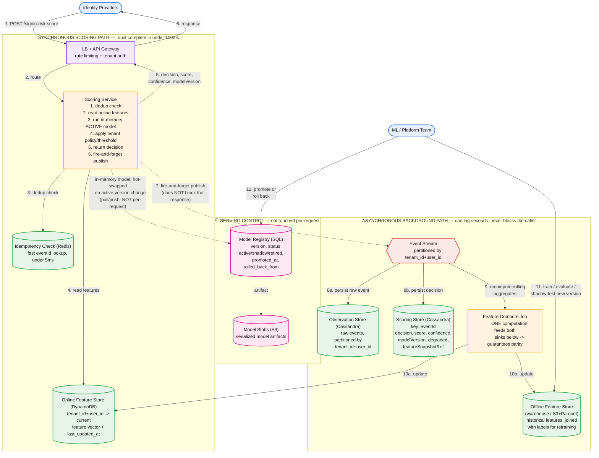

# Real-Time Sign-In Risk Scoring Service — System Design

**Domain:** AI/ML-backed real-time decisioning, multi-tenant
**Core tension:** a hard <100ms synchronous SLA on top of an ML model that needs continuous retraining, safe rollout, and rollback — this is the same multi-tenant/duplicate-event family as the other three designs, but the sync latency budget and the online/offline model-serving split are new constraints this problem is actually testing.

---

## Part 1: Requirements, Scale, and the Corrected Flow

### Functional requirements

1. Ingest sign-in events from multiple identity providers, multi-tenant.
2. Compute a risk score for the user on each sign-in event, using an ML model.
3. Return a decision — `allow | challenge | block` — synchronously, **in under 100ms**.
4. Support multiple model versions concurrently (active, shadow, retired) with safe promotion and instant rollback.
5. Keep the online (serving) and offline (training) feature computations consistent with each other — a model must see the same feature values in production that it saw in training.
6. Degrade gracefully under load or missing data rather than timing out or erroring — a slow feature read or a cold-start user should still return a decision inside the SLA.
7. Log every decision durably enough to support retraining, auditing "why was this user blocked," and reconstructing training labels later.
8. Handle duplicate and out-of-order events without corrupting feature state (same non-functional requirement as the other two risk-assessment designs, applied here to feature aggregation instead of rule evaluation).

What's easy to miss on first pass, and worth surfacing proactively: this prompt reads like the other two ("ingest events, evaluate, expose a decision"), which tempts you to reuse the deterministic-rule-engine architecture wholesale. The <100ms number is the tell that this is a different shape of problem — it forces a hard split between a synchronous request path and an asynchronous learning path, which the multi-tenant risk design and the OAuth design didn't need at all (both were pure async pipelines, no caller ever blocked on them).

### Non-functional requirements / scale

- 10,000 tenants, ~5,000 users/tenant average → **~50M users**.
- ~10 sign-in events/user/day → **~500M events/day → ~5,800 events/sec average**, bursty around regional business-hours sign-in waves (peak likely 3-5x average).
- **Hard latency budget: under 100ms end-to-end**, which has to be split explicitly, not left as one number:
  - Network + gateway: ~10ms
  - Idempotency/dedup check: ~5ms
  - Online feature read: ~15ms
  - Model inference (in-memory): ~20ms
  - Policy/threshold application: ~5ms
  - Network out + buffer: ~15ms
  - That's ~70ms committed, leaving ~30ms of margin — tight enough that **nothing in the synchronous path can involve a queue, a durable multi-row write, or a network call to a service that isn't already warm in memory.**
- This latency budget is the single most important number in the whole design — it's *why* the architecture below looks the way it does.

### The corrected flow


*Two structurally separate paths, explicitly labeled to keep them from bleeding into each other during the interview: a **synchronous scoring path** (top-left, must finish in <100ms) and an **asynchronous background path** (bottom-right, allowed to lag seconds) — with a **model serving control plane** in between that neither path touches per-request.*

**What corrects the common first-draft mistakes on this problem** (including the ones that came up while working through it):

| Common first draft | Why it's wrong | Fix |
|---|---|---|
| "Async ingestion" for the whole pipeline | Directly contradicts the <100ms requirement — you cannot queue a request the caller is blocking on | Split into a synchronous scoring path (no queue, ever) and a separate async path for everything that doesn't need to be in the response |
| Dedup by writing to the full Observation Store before scoring | A durable Cassandra write in the hot path blows the latency budget by itself | Fast Redis-based idempotency check (`eventId` lookup, <5ms) in the sync path; the durable observation write happens async, after the response is already sent |
| One combined "Feature Store: SQL" | Doesn't distinguish "the value I need to read in 15ms right now" from "years of historical data I'll join with labels for retraining" — these have completely different access patterns and completely different technology needs | Two feature stores: an **Online Feature Store** (DynamoDB, point-lookup, always current) and an **Offline Feature Store** (warehouse/S3+Parquet, historical, joined with labels) |
| Two feature stores populated by two separate pipelines | If the online path and offline path compute features differently, you get train/serve skew — the model was trained on features it will never see in production | **One** Feature Compute Job whose output feeds both sinks — this is the mechanism that guarantees online/offline parity |
| `{score: "challenge\|block\|allow"}` | Conflates a numeric risk score with a categorical decision — you can't threshold, audit, or tune policy against a string enum | Separate fields: `score` (numeric, model output), `decision` (enum, policy applied to the score), `confidence` |
| No Scoring Store | Without a durable record of *what was actually decided and on what model version*, you can't debug a bad decision after the fact or build clean training labels | **Scoring Store**, keyed by `eventId`, holding decision/score/confidence/modelVersion/degraded/featureSnapshotRef |
| Loading the model file per-request, or as part of the request path at all | A network or disk read on every request destroys the latency budget | Model is loaded **in-memory** in the Scoring Service process; hot-swapped on a poll/push signal when the registry's active version changes — never touched per-request |

---

## Part 2: API

```
POST /v1/tenants/{tenantId}/signin-risk-score
```

Request:

```json
{
  "eventId": "uuid",            // idempotency key — provider or client-generated
  "eventTime": "2026-09-04T14:02:11Z",
  "source": "okta",
  "userId": "u_123",
  "device": { "deviceId": "...", "trusted": false },
  "geo": { "ip": "...", "country": "CA", "asn": "..." },
  "context": { "authMethod": "password", "attemptCount": 1 }
}
```

Response (200, must return within 100ms):

```json
{
  "eventId": "uuid",
  "decision": "allow",          // allow | challenge | block — policy output, not the raw model score
  "score": 0.13,                // raw model output, 0-1
  "confidence": "high",         // high | medium | low — low when features are stale or user is cold-start
  "modelVersion": "v47",
  "degraded": false             // true if a fallback path was used (stale features, model unavailable, timeout risk)
}
```

Two deliberate choices worth naming out loud: `decision` and `score` are separate fields, not one conflated string — `score` is what the model produced, `decision` is tenant policy applied to that score (different tenants can set different thresholds against the same score without touching the model). And `degraded` is a first-class field, not an afterthought — a caller (and your own dashboards) need to be able to tell "we said allow because the model was confident" apart from "we said allow because we fell back to a conservative default under load."

`eventId` is mandatory and is the idempotency key — a provider retry with the same `eventId` returns the previously computed decision from the Scoring Store rather than re-scoring, guaranteeing a stable answer if the client retries after a timeout.

---

## Part 3: Data Model

Six stores, each chosen for a specific access pattern — resist the urge to collapse any two of these, since each one exists because the others can't serve its access pattern without a real cost.

**1. Idempotency Check — Redis.** `eventId → decision-in-progress-or-complete`, short TTL. Exists purely to make the dedup check fast (<5ms) in the synchronous path; it is a cache, not a system of record — the Scoring Store is the durable copy.

**2. Online Feature Store — DynamoDB.** Key: `tenant_id + user_id`. Value: current feature vector (rolling counts, velocity features, device/geo history summaries) + `last_updated_at`. Point-lookup only, always-current, is what the Scoring Service reads on the hot path. `last_updated_at` is what lets the Scoring Service detect staleness and set `degraded`/`confidence: low` rather than silently scoring on stale data.

**3. Observation Store — Cassandra.** Partitioned by `tenant_id + user_id`. Append-only raw events, written async after the response is already sent. This is the audit trail and the raw material the Feature Compute Job reads to build rolling features.

**4. Offline Feature Store — warehouse / S3+Parquet.** Historical feature snapshots joined with eventual labels (was this sign-in actually fraudulent, confirmed later) for retraining. Fed by the *same* Feature Compute Job that feeds the Online Feature Store — this shared-pipeline requirement is the answer to the train/serve skew problem, and it's worth stating as a design decision rather than an implementation detail.

**5. Model Registry — SQL (Postgres).** One row per model version: `version, status (active | shadow | retired), promoted_at, rolled_back_from`. Small, low-write-volume, needs simple relational queries ("what's currently active") — no reason to reach for anything heavier.

**6. Model Blobs — S3.** Serialized model artifacts, referenced by the registry. Loaded into the Scoring Service's memory on startup and on a hot-swap signal, never read per-request.

**7. Scoring Store — Cassandra.** Key: `eventId`. `decision, score, confidence, modelVersion, degraded, featureSnapshotRef`. This is what makes a decision explainable after the fact ("why did we block this user at 2pm") and what supplies clean, versioned training data — `featureSnapshotRef` points at the exact feature values used, not a live reference that would drift if you looked it up later.

---

## Part 4: Major Components

**Scoring Service (synchronous path).** The only service in the hot path. On each request: (1) idempotency check against Redis, (2) point-read from the Online Feature Store, (3) run inference against the in-memory active model, (4) apply tenant-specific policy/threshold to the raw score to get a decision, (5) return the response, (6) fire-and-forget publish the event to the stream — step 6 happens *after* the response is already on the wire, so it cannot add latency to the caller.

**Model hot-swap mechanism.** The Scoring Service holds the active model in memory and polls (or subscribes to a push signal from) the Model Registry for active-version changes on a short interval (e.g., every few seconds) — completely decoupled from the request path. When the active version changes, the new blob is pulled from S3 and swapped into memory atomically. This is what makes rollback fast: flipping the registry's `status` field takes effect within one poll interval, with no redeploy and no per-request penalty.

**Feature Compute Job (asynchronous).** Consumes the event stream (partitioned by `tenant_id + user_id`, same per-user-ordering reasoning as the other two designs), recomputes rolling aggregate features, and writes to *both* the Online and Offline Feature Stores from the same computation. This single-writer-feeds-both-sinks pattern is the whole train/serve-parity story in one sentence.

**Event Stream.** Partitioned by `tenant_id + user_id` for per-user ordering of feature updates, same rationale as the multi-tenant risk design's stream. Consumed by the Feature Compute Job and by whatever writes to the Observation and Scoring Stores.

---

## Part 5: The Three Hard Problems

These are the parts of this prompt that are actually being tested — the happy-path flow is table stakes; how you handle these three is what separates a working prototype from a design a Staff engineer would sign off on running in production.

**1. Cold start.** A new user, or a user with too little history for the feature vector to be meaningful, will get an unreliable score no matter how good the model is. Fix: the Online Feature Store's `last_updated_at`/history-length signal feeds directly into the response — cold-start users get `confidence: low` and the policy layer applies a more conservative threshold (favor `challenge` over `allow`) rather than trusting a low-confidence `allow`. This is a policy decision, not a modeling one — it belongs in the tenant-configurable threshold layer, not hardcoded into the model.

**2. Feature staleness and train/serve parity.** Two failure modes, same root cause. (a) At request time, if the Online Feature Store's `last_updated_at` is too old — say the Feature Compute Job has fallen behind — the Scoring Service should not silently score on stale data; it sets `degraded: true` and either falls back to a more conservative default policy or widens the decision band, and this is visible to the caller. (b) At training time, if the offline features were computed by different code than the online features, the model learns patterns that don't exist in production. The single Feature Compute Job feeding both stores from one computation is the structural fix — this is worth stating as *the* reason that job exists, not just an efficiency optimization.

**3. Safe model rollout and rollback.** New model versions need to be validated against real traffic without being allowed to affect real decisions, and a bad promotion needs to be reversible in seconds, not a redeploy. Fix: the registry supports a `shadow` status — a shadow model scores every request in parallel (or on a sampled basis) purely for comparison logging, but its output never reaches the `decision` field or the caller. Promotion is a registry status flip from `shadow`/`retired` to `active`, picked up by the poll/push hot-swap on the next interval. Rollback is the same mechanism in reverse — flip `active` back to a prior version, with `rolled_back_from` recorded for postmortem. Because the swap is in-memory and decoupled from the request path, neither promotion nor rollback ever touches the latency budget.

---

## Part 6: How to Run This in the Interview

Timed for a ~45-minute session:

1. **(0-3 min) Requirements + the one number that matters.** State the 8 functional/non-functional requirements, then say explicitly: "the <100ms SLA is the constraint that shapes everything else here — I'm going to design the synchronous and asynchronous paths as two separate systems that happen to share storage, not one pipeline." Saying this before drawing anything is the single highest-leverage sentence in this interview.
2. **(3-7 min) Capacity + the latency budget.** Do the 50M users / ~5,800 events/sec math, then immediately decompose the 100ms budget line-by-line (network/dedup/feature-read/inference/policy/network-out). The budget breakdown is what justifies "no queues, no durable writes, no cross-service calls" in the sync path before you've drawn a single box.
3. **(7-11 min) API.** Present the request/response shape, and name the `score`-vs-`decision` separation and the `degraded` field explicitly as deliberate choices, not incidental fields.
4. **(11-16 min) Data model.** Walk the six stores (plus the Redis idempotency cache) grouped by *which path reads/writes them* — sync path touches only Redis and the Online Feature Store; everything else is async. This grouping is more informative than listing them in isolation.
5. **(16-24 min) Architecture walkthrough.** Draw the diagram in the same grouped order: sync path first, model control plane second, async path third. Narrate the fire-and-forget publish explicitly — "step 6 happens after the response is already sent, so it cannot cost the caller anything."
6. **(24-38 min) The three hard problems.** This is where the interview is actually won — spend more than half your remaining time here. Lead with feature staleness/train-serve-parity since it's the most structurally important; cold start and model rollback both build on the same registry/hot-swap mechanism, so they go faster once that's established.
7. **(38-43 min) Failure modes and tradeoffs.** What happens if the Feature Compute Job falls behind (features go stale, `degraded` flag catches it, nothing blocks); what happens if a model version is bad in production (rollback via registry flip, seconds not minutes); what you'd monitor (p99 latency budget adherence per stage, `degraded` rate, feature freshness lag, model version distribution of live traffic).
8. **(43-45 min) Close.** Name the three decisions you'd defend hardest: the hard sync/async split driven by the 100ms budget; one Feature Compute Job feeding both online and offline stores as the train/serve-parity mechanism; and in-memory model hot-swap via registry poll/push as what makes rollback safe and fast without ever touching the request path.

### Staff/Principal signal checklist

- Named the <100ms SLA as the constraint that determines the architecture, before being asked, rather than discovering the sync/async split reactively.
- Explicitly separated `score` from `decision` in the API and explained why that separation matters for tenant-configurable policy.
- Identified train/serve parity as a risk and proposed the single-pipeline fix rather than two independently-maintained feature computations.
- Treated graceful degradation (`degraded` field, confidence banding, cold-start policy) as a designed behavior, not an unhandled edge case.
- Designed model rollback as an in-memory, sub-second registry operation rather than a redeploy — and explained *why* that had to be true given the latency budget.
- Kept a clean audit trail (Scoring Store with `featureSnapshotRef`) for both explainability and clean retraining labels, without conflating it with the live serving store.

---

## Appendix: Mermaid source


