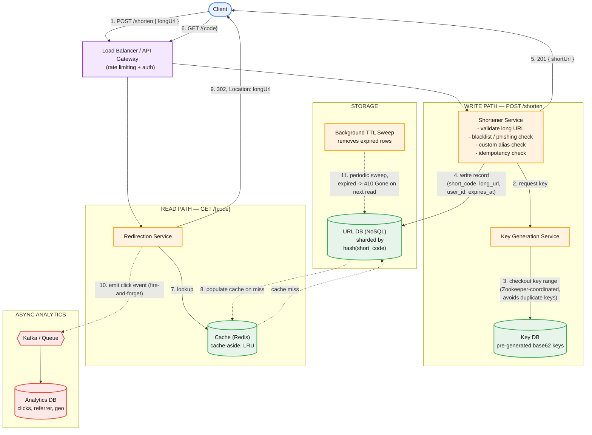

# TinyURL System Design — Revised Architecture + Interview Approach

## Part 1: Revised Flow (incorporates the gaps flagged earlier)

```
Requirements
1. Convert long URL -> short URL (optional custom alias)
2. Redirect short URL -> long URL (302, to preserve click analytics)
3. Store long URL with expiry; support user-owned + anonymous links
4. Rate-limit abusive clients; block malicious/blacklisted long URLs
5. Track click analytics asynchronously (does not block the redirect path)

Scale assumptions (state these out loud, unprompted):
  - 100M new URLs/day written  ->  ~1,160 writes/sec avg
  - Read:write ratio ~100:1    ->  ~10B redirects/day -> ~115K reads/sec avg (higher at peak)
  - ~500M-1B active URLs stored, ~500 bytes/record -> low hundreds of GB total
  - base62, 7-char code -> 62^7 ~= 3.5 trillion combinations -> decades of headroom
```


*Numbered steps: (1) client submits long URL, (2-3) Shortener Service checks out a key range from the Key DB via the Key Generation Service, (4) the record is written to the sharded URL DB, (5) short URL returned. (6-9) client requests the short code, Redirection Service checks the cache first, falls back to the URL DB on a miss, returns a 302. (10) a click event is fired asynchronously to a queue for the analytics DB. (11) a background job periodically sweeps expired rows out of the URL DB.*

Entities
- User: `user_id` (PK), name, email, auth_token
- URL: `short_code` (PK), long_url, user_id (nullable, from auth), is_custom_alias, created_at, expires_at, status (active/expired)

APIs

`POST /api/v1/shorten`
- headers: `Authorization: Bearer <token>` (optional -> anonymous; required for custom alias)
- body: `{ longUrl, customAlias?: string, expirationDate?: date }`
- resp: `201 { shortUrl, shortCode, expiresAt }` · `400` invalid/malicious URL · `409` alias taken · `429` rate limited

`GET /{shortCode}`
- resp: `302` redirect, `Location: <longUrl>` · `404` not found · `410` gone (expired)

**What changed vs. the original diagram, and why:**

| Original | Revised | Why |
|---|---|---|
| No capacity numbers | Explicit QPS/storage estimate up front | Justifies every downstream choice (cache, sharding, DB type) |
| Key Generation Service, mechanism unstated | Range-based key checkout, Zookeeper-coordinated | Answers "how do concurrent instances avoid duplicate keys?" before it's asked |
| Redirect type unspecified | 302 explicitly, with tradeoff noted | 301 gets browser-cached and kills click analytics |
| "DB" unlabeled | NoSQL, sharded by hash(short_code) | Access pattern is pure key-value; justify the choice |
| `user_id` in schema but not in API | Auth token in header, optional | Fixes the API/schema mismatch from the original |
| No rate limiting | Added at LB/API GW | Prevents `/shorten` abuse |
| No malicious-URL handling | Blacklist/phishing check in Shortener Service | Prevents becoming an open redirector |
| No custom alias | Added to API + 409 conflict response | Near-universal follow-up question |
| No expiry enforcement mechanism | Background TTL sweep or lazy delete + 410 response | "Store for an expiry time" was a stated requirement but never implemented |
| No analytics path | Async click event -> queue -> analytics DB | Keeps the analytics feature from blocking the hot redirect path |
| No idempotency | Idempotency check on `/shorten` | Handles duplicate submissions of the same long URL |

---

## Part 2: How to Run This in the Interview

Treat this as a 45-minute clock. The failure mode at Staff/Principal level isn't missing a box — it's spending 20 minutes drawing before saying a single tradeoff out loud. Sequence matters more than completeness.

**1. Clarify requirements (2-3 min).**
Confirm functional scope (shorten, redirect, expiry) and explicitly ask about non-functional ones the prompt didn't state: expected scale, custom aliases, analytics, and whether links can be user-owned. Asking these unprompted is itself a seniority signal.

**2. Capacity estimation (3-5 min).**
Do the math out loud before drawing anything: writes/sec, reads/sec, storage growth, and the read:write skew. This number set is what justifies caching and NoSQL later — do it now so those choices don't look arbitrary when you introduce them.

**3. API design (3 min).**
Define `POST /shorten` and `GET /{code}` with request/response shapes and error codes (400/404/409/410/429), not just happy path. This is where the auth-vs-anonymous and custom-alias decisions surface.

**4. Data model (3-5 min).**
URL and User entities, and state explicitly which field is the primary/partition key and why (short_code, since all reads key off it).

**5. High-level architecture (5 min).**
Draw the boxes — this is the diagram above. Move fast here; it should feel like confirming a plan, not discovering one.

**6. Deep dive #1 — key generation (5-8 min, the differentiator).**
This is the single question that separates senior from staff candidates on this problem. Present base62 pre-generation over on-the-fly hashing, and proactively raise and resolve the concurrency problem: how multiple Shortener Service instances avoid handing out the same key. Range-based checkout coordinated via Zookeeper (or an equivalent leader-election/lease mechanism) is the expected answer.

**7. Deep dive #2 — caching (3-5 min).**
Cache-aside pattern, LRU eviction, and justify it with the Pareto assumption (a small fraction of links account for most traffic) rather than asserting it needs a cache.

**8. Deep dive #3 — storage & scaling (5 min).**
Justify NoSQL over relational for this access pattern, sharding by hash(short_code), and how you'd add read replicas or a second region as load grows.

**9. Failure modes & tradeoffs (5-8 min).**
This is where "Staff" gets demonstrated, not "Senior": what happens if the Key DB is down (writes degrade gracefully vs. fail), what happens on cache miss storms, CAP stance for this system (favor availability — a stale redirect is far less costly than a rejected one), and how the design changes at 10x/100x scale.

**10. Extensions, time permitting.**
Rate limiting specifics, malicious-URL detection, analytics pipeline, custom alias conflict handling.

**11. Close (1-2 min).**
Summarize the two or three tradeoffs you made and why — interviewers weight a candidate who can articulate *why not X* as highly as one who drew X correctly.

### Staff/Principal signal checklist — say these unprompted, don't wait to be asked
- Capacity numbers before the diagram
- Why 302 not 301
- How you prevent duplicate key issuance under concurrency
- Why NoSQL, not "we'll use a database"
- What breaks first at 10x scale, and what you'd change
- Availability-over-consistency stance and why it's the right one for this system specifically


---

## Appendix: Mermaid source for the diagram above

Editable at [mermaid.live](https://mermaid.live) or with the `mmdc` CLI.


