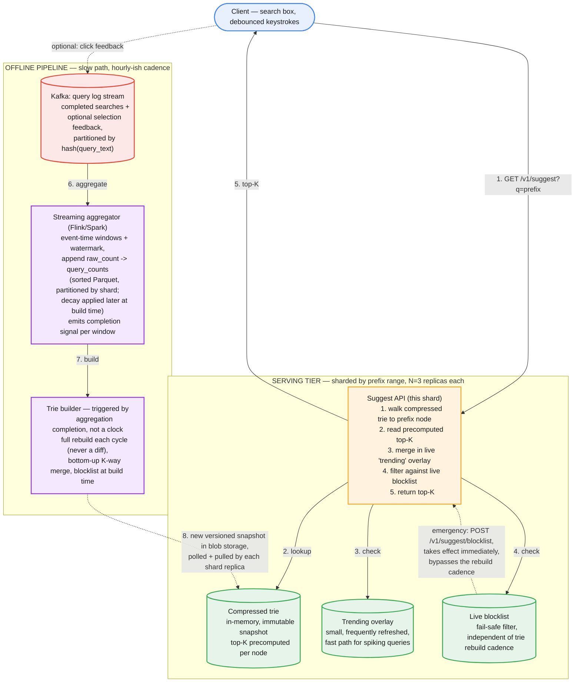

# Typeahead / Autocomplete Suggestion Service — System Design

**Domain:** Search-as-you-type suggestions (search engine query box, e-commerce site search, any "did you mean" completion surface).
**Core tension:** every keystroke is a request, so the read path has to answer in single-digit milliseconds server-side — but the thing being served (which completions are "popular" right now) is constantly shifting underneath, and naive designs either recompute too much on the read path (blowing the latency budget) or update too eagerly on the write path (fighting for the same resource the reads need, for freshness nobody asked for at that granularity).

---

## Part 1: Requirements, Scale, and the Corrected Flow

### Functional requirements

1. Given a prefix a user has typed so far (e.g., `"sea"`), return the top-K (typically 5-10) most relevant completions, ranked.
2. The corpus of completions and their ranking reflects real query popularity, and adapts as query patterns shift (yesterday's trending topic fades, today's breaking-news query rises).
3. Offensive, policy-violating, or brand-damaging completions never surface, regardless of how often they were searched.
4. New, previously-unseen queries eventually become suggestible once they cross a popularity threshold — the corpus isn't static.

### Explicitly out of scope, stated up front

- **Per-user personalization.** A global, non-personalized ranking is the v1 scope. Personalization (weighting toward a user's own history) is a re-ranking layer that could sit *on top of* the global top-K this design returns, not a redesign of the core data structure — worth saying this explicitly rather than either ignoring personalization or trying to design it inline.
- **Multi-language / script-specific tokenization.** Assume a single language/normalization scheme for this design; real systems run one pipeline per language, not one pipeline handling all of them.

### Non-functional requirements

- **Latency is the dominant constraint, more so than almost any other system in this series.** A typeahead request fires on every keystroke pause — p99 server-side latency needs to be single-digit milliseconds, because the client-perceived budget (network round trip + render) is only double-digit milliseconds total before typing feels laggy.
- **Freshness is real but coarse, not real-time.** Suggestions should reflect popularity within roughly the last few minutes to hours, not the last few milliseconds — a fundamentally different freshness bar than, say, a config kill-switch. Conflating "must be fast to serve" with "must be instantly fresh" is the single most common framing mistake on this problem.
- **Graceful degradation.** If the suggestion service is unavailable, the search box must still work — it just shows no suggestions. This is a non-critical-path enhancement to a critical-path feature (search itself), and the architecture should make that failure mode trivial, not an afterthought.
- **Fail-safe filtering.** A blocked phrase must never be servable, even mid-rollout of a data refresh — this is a correctness requirement, not a nice-to-have.

### Capacity estimation

- **Underlying search volume (assumption):** ~5B completed searches/day ≈ 58K/sec average, ~290K/sec peak (5x).
- **Typeahead requests per completed search — the number that actually drives load, and it isn't 1:1 with search volume.** Assume client-side debounce (fires ~150ms after the user pauses typing, not on every keystroke) yields roughly 4 typeahead requests per completed search on average. **Typeahead QPS ≈ 4x search QPS: ~230K/sec average, ~1.15M/sec peak.** This is the number worth deriving out loud — a candidate who silently assumes "typeahead QPS = search QPS" has understated the actual read load by 4x before writing a single line of design.
- **Suggestion corpus size:** of a much larger raw query log, only queries crossing a minimum frequency threshold are worth a trie entry — assume this prunes down to **~200M distinct suggestible queries**, average length ~25 characters.
- **Trie size, stated as an assumption worth flagging explicitly:** a naive one-node-per-character trie over 200M queries × 25 chars is on the order of 5B nodes — clearly untenable. Real query traffic shares enormous prefix overlap (`"how to"`, `"best"`, `"weather in"`, ...); assuming a compressed (radix) trie collapses this by roughly 5-10x, call it **~600M compressed nodes** as a working estimate — this ratio is genuinely data-dependent and should be named as an assumption, not a fact, exactly the way the doc-version-history design names its block-reuse-rate assumption.
- **Per-node footprint:** compressed edge label (a short substring) + a precomputed top-K list (K=10) of `(completion, score)` pairs ≈ ~300 bytes/node. **Total ≈ 600M × 300B ≈ 180GB** — too large for one machine's comfortable working set alongside OS overhead and replica headroom, which is what motivates sharding (Part 1's mistakes table, row 3), not just "scale is scale."
- **Throughput vs. storage — check both, state which binds.** At an assumed ~80K in-memory trie lookups/sec/server (dominated by network and serialization overhead more than the trie walk itself, since depth is bounded by query length, ~25), peak 1.15M/sec needs **~15 servers for throughput**. Sizing 180GB across shards of ~35-40GB each also lands around **~5 logical shards**, replicated 3x for availability ≈ **~15 servers for storage**. Here, unlike a typical KV store, the two roughly coincide — worth stating explicitly rather than assuming one always dominates by default.

### The corrected flow

| Common first draft | Why it fails | Fix |
|---|---|---|
| Compute top-K completions by walking the whole subtree under a prefix node at request time | A popular prefix's subtree can hold millions of leaf queries; sorting that per keystroke blows the single-digit-millisecond budget by orders of magnitude | Precompute and cache the top-K directly at each trie node ahead of time; a request is a trie walk to the node plus a cache read, never a subtree scan |
| Mutate the live serving trie synchronously on every search query as it happens | Real-time mutation under extreme concurrent read QPS forces locking or copy-on-write churn on the exact path serving 1M+ req/sec, for a freshness granularity (milliseconds) nobody actually needs | Batch/streaming aggregation of the query log rebuilds top-K periodically (minutes to hours), fully decoupled from the read-serving trie, which only ever receives an atomic swap to a new immutable version |
| One giant trie in a single server's memory | ~180GB doesn't fit comfortably on one box with replica and OS headroom; also a single read bottleneck and single point of failure for all suggestion traffic | Shard by prefix range across many servers, replicate each shard for availability and read fan-out |
| Naive one-node-per-character trie | Most nodes have exactly one child — long unbranching chains waste memory on structure, not content, inflating the ~5B raw estimate | Compressed (radix/PATRICIA) trie: collapse single-child chains into one edge labeled with a substring |
| Rank purely by cumulative historical frequency, never decayed | A once-popular query (an old meme, a discontinued product) stays top forever even after it stops being relevant — this is a freshness problem the data structure alone can't fix | Time-decayed scoring (recent counts weighted higher than old ones) recomputed on each periodic rebuild |
| Trust raw popularity blindly, no filtering | Surfaces offensive, policy-violating, or brand-damaging completions verbatim, just because they were searched often | Blocklist filtering applied at aggregation time *and* as a final serve-time check (Part 5) — never rely on only one layer |
| Hash-based sharding of the trie by query string | Scatters a prefix and its own longer prefixes across unrelated shards by hash, breaking the property that resolving `"sea"` needs to reach one coherent place, not a fan-out across the whole cluster | Range-based sharding on the prefix itself (e.g., `a-c`, `d-f`, ...), non-uniform boundaries sized by actual traffic, not alphabet count |
| Store the compiled trie itself in a database | The only "query" against a built trie is an in-process prefix walk in the same request handler — there's no concurrent mutation to arbitrate and no ad-hoc query need, so fronting it with a query engine only adds latency | Treat the trie as a compiled artifact, same relationship a search index has to its source documents: versioned snapshot files in blob storage (durable copy) + fully loaded or memory-mapped copy in each shard replica's process (served copy) — never a live database |
| Trigger the periodic trie rebuild off a fixed wall-clock schedule | A blind timer can fire before that window's aggregation has fully landed, silently building the next snapshot from a partial `query_counts` window | Trie builder is triggered by the aggregation job's completion signal (a `_SUCCESS` marker or a "bucket N done" event) — a batch-pipeline dependency, not a clock |
| Put `query_counts` in a KV/OLTP store (e.g., DynamoDB) because its columns look key-value shaped | The only real reader is the trie builder doing a full scan sorted by `query_text` once a cycle — DynamoDB has no global sort order across partition keys and a full `Scan` is its most expensive, discouraged operation; you'd end up exporting to S3 anyway, just with an extra costly hop | Write directly to partitioned, sorted Parquet/ORC in blob storage — schema shape is not the same question as access pattern |

---

## Part 2: API

### `GET /v1/suggest?q={prefix}&limit={k}`

```json
// Response 200
{
  "prefix": "sea",
  "suggestions": [
    { "text": "seattle weather",     "score": 0.98 },
    { "text": "search engine",       "score": 0.91 },
    { "text": "seagate external drive", "score": 0.77 }
  ]
}
```

Deliberately **no request body, no auth-heavy path, no server-side session state** — this endpoint fires on every keystroke pause from effectively every user, so anything added to it multiplies by the ~1.15M/sec peak figure from Part 1. `limit` is capped server-side (e.g., max 10) regardless of what a caller requests, for the same reason `ALL` consistency gets gated in the KV store design — a caller casually asking for more work than the budget allows shouldn't be able to degrade the shared path for everyone else.

### `POST /v1/suggest/feedback` (optional, logs a selection — not on the critical read path)

```json
{ "prefix": "sea", "selected": "seattle weather", "position": 0 }
```

Fire-and-forget, asynchronous, feeds the offline aggregation pipeline (Part 4) as an additional signal (click-through, not just raw search frequency) — never blocks or is awaited by the suggestion response itself.

### `POST /v1/suggest/blocklist` — the fail-safe path

```json
{ "phrase": "<offensive completion>", "invoked_by": "trust-safety-oncall", "reason": "policy violation, ticket #4471" }
```

Applied immediately at the serving layer (Part 5), independent of and faster than the next scheduled trie rebuild — structurally the same idea as the emergency kill-switch in the config-distribution design: a normal update path that can wait, and a separate, faster path for the case that can't.

---

## Part 3: Data Model

**The serving structure: a compressed (radix) trie, in-memory, sharded by prefix range.** Each node holds:

```
edge_label      : string (the compressed substring this edge represents)
children        : map<char, node>
top_k           : [(completion_text, score), ...]   -- precomputed, sorted, length ≤ K
is_terminal     : bool  -- true if a real query ends exactly here
```

**Precomputing `top_k` at every node is the single most important design decision in this problem — worth building bottom-up, and worth naming the algorithm.** A leaf query's own `top_k` is itself, score 1. An internal node's `top_k` is the merge of its children's already-computed `top_k` lists, keeping the highest-scoring K overall — which is exactly a K-way merge of K already-sorted lists, the same primitive as merging sorted output streams from independent sources (the identical shape of problem shows up anywhere a fan-in needs one ranked result from several pre-ranked ones). Building bottom-up means every node's `top_k` is computed once, from its children's results, never by re-scanning raw leaves — an internal node deep in the tree never re-touches the millions of leaves under it, it just merges a handful of already-small K-length lists from its immediate children.

**Offline aggregation pipeline (feeds the trie builder, does not touch the serving trie directly).** `query_counts` is pipeline output, not a live serving table — nothing queries it except the next stage of the same pipeline, so it doesn't need OLTP machinery (this is *not* the CockroachDB/Azure SQL choice made for the config-distribution and KV-store designs; that choice solves point-read/point-write + multi-key transactions, a problem this table doesn't have):

```sql
-- append-only: one row per (query_text, time_bucket), written exactly once when that
-- window's watermark passes, and never revised again
CREATE TABLE query_counts (
    query_text     TEXT NOT NULL,
    time_bucket    TIMESTAMPTZ NOT NULL,   -- e.g., hourly buckets
    raw_count      BIGINT NOT NULL,
    PRIMARY KEY (query_text, time_bucket)
);
```

**Deliberately no `decayed_score` column.** Decay is relative to "now," so a value computed and stored at write time is stale the moment the next cycle ticks over — keeping it correct would mean overwriting every retained bucket's score on every rebuild, which defeats append-only for no reason. Instead, only the immutable `raw_count` is stored, and decay is applied at **read time**: the trie builder computes `f(raw_count, now - time_bucket)` as part of the same per-query merge-across-buckets pass it already does (Part 3 above), so "what does decay mean right now" is answered fresh on every rebuild instead of baked into a value that ages badly. This is what makes the table genuinely append-only end to end — no row is ever touched twice. The one explicit design choice worth naming out loud: events arriving after a window's watermark has passed are dropped, not merged back in as a correction — simpler, and consistent with append-only; the alternative (a rare idempotent upsert for stragglers) is a real option but trades away that guarantee for a small accuracy gain on late data.

In practice this is best realized as **partitioned, sorted Parquet/ORC files in blob storage** — the streaming aggregator writes them directly, partitioned by shard boundary and sorted by `query_text`, so the trie builder's later sort/partition step is free. If ad-hoc queryability is genuinely needed (debugging "why isn't X suggested," threshold tuning), a columnar engine built for partial-count merging (ClickHouse `AggregatingMergeTree`, Druid, Kusto) fits the write pattern; a relational OLTP store does not.

**Every rebuild is a full recompute from the current `query_counts`, never a diff or patch against the previous trie.** The previous snapshot plays no algorithmic role in building the next one — it's just what's still being served until the swap. The build reads `query_counts` sorted by `query_text`, merges each query's per-bucket `raw_count`s with decay applied at merge time (a K-way merge across time buckets, decay-weighted rather than a stored value), then applies the bottom-up K-way-merge construction above to produce one **immutable, versioned trie snapshot** per shard. Diffing against the prior trie to patch only changed nodes was considered and rejected: at this data volume (180GB, rebuilt hourly) a full rebuild on a distributed batch framework is cheap and self-healing, while incremental patching only adds a class of bugs (a missed dependency between a leaf score and an ancestor's top-K silently going stale) for a payoff that doesn't matter here. The one legitimate previous-version lookup is a transport optimization, not a structural one: hash each shard's output and skip re-shipping it if unchanged from last cycle.

**Serving-side storage: the trie is a compiled artifact, not a database.** It exists in exactly two forms — the durable copy (versioned snapshot files in blob storage, the system of record if a rebuild from `query_counts` were ever needed) and the served copy (each shard replica loads or memory-maps that snapshot fully into its own process memory). Sizing this against Part 1's numbers: ~5 logical shards × ~35-40GB each means every replica holds ~35-40GB fully resident — comfortable on a 64-128GB+ RAM box, but not trivial the way a smaller shard count would be, so plan headroom explicitly. The one real memory nuance is the atomic swap: holding old and new snapshots simultaneously briefly doubles the footprint (~70-80GB) unless the load strategy avoids it (memory-map the new file and release the old mapping rather than materializing both as heap structures, or size hosts for 2x from the start). There's no memtable/SSTable split here at all — that machinery in the KV store design exists to bound unflushed writes before compaction; this trie takes zero writes on the serving path, so there's nothing to flush or compact.

---

## Part 4: Major Components

**Query log ingestion.** The search service emits a lightweight event per completed query (and optionally per suggestion click, via the feedback endpoint) to a Kafka topic, partitioned by `hash(query_text)` — fire-and-forget, off the search request's own critical path. At ~58K/sec average (290K/sec peak) a handful of extremely popular queries will dominate individual partitions; worth naming the mitigation (pre-aggregate or salt the hottest keys at the producer) even if not implemented, since the skew is bounded, not unbounded, and this is a throughput-tolerant batch consumer, not a latency-critical one.

**Offline aggregation & scoring (streaming, e.g., Flink or Spark Structured Streaming, hourly tumbling windows).** Consumes the Kafka topic with **event-time windowing and a watermark**, summing `raw_count` per `(query_text, time_bucket)`. Writes are batched per-window, one append per bucket on window close — never a per-event write, and never a revision of an already-closed bucket (Part 3's append-only rationale); events arriving after the watermark are dropped by design. On closing a window, it emits an explicit **completion signal** (a `_SUCCESS` marker or a "bucket N done" event) — this, not a wall-clock schedule, is what the trie builder waits on (mistakes table). Decay weighting is deliberately *not* computed here — it's applied later, at trie-build read time, against whichever buckets are still in the lookback window (Part 3).

**Trie builder.** Triggered by the aggregation job's completion signal. Reads the current `query_counts` output sorted by `query_text` (co-partitioned by shard boundary so no second shuffle is needed), builds a new compressed trie bottom-up via the K-way-merge construction (Part 3), applies the blocklist as a filter *at build time* (first layer of defense), and produces one new immutable, versioned snapshot per shard — a full rebuild every cycle, never a patch of the previous version (Part 3).

**Snapshot distribution.** Structurally the same problem this project has already solved once: get a new immutable artifact from where it's built to many serving replicas, without putting per-replica load on whatever built it. A new trie snapshot is small relative to a live config push (megabytes, not bytes) and infrequent (hourly-ish, not per-second) — so a simple pull-based model is proportionate here: each serving replica periodically polls a small version-pointer file for its shard and downloads the new snapshot from blob storage only when the version changes. The long-poll/push machinery built for the config-distribution system would be over-engineering for an update cadence this coarse — tailoring the mechanism to the freshness SLA, not reusing a pattern by default, is the signal worth stating explicitly if asked.

**Serving shards.** Each shard holds one prefix range's compressed trie, fully in memory (Part 3 has the exact sizing), replicated N=3 for availability and read fan-out. A request is routed to the correct shard by prefix (a small, static, operator-maintained routing table — prefix ranges change only when re-sharding, not per request). A replica is stateless in the durability sense: if it crashes, it reloads the last-known-good snapshot from blob storage and rejoins — no WAL or recovery log needed, because it never took a write.

**Blocklist / filter service.** The second, faster layer of defense: every response is checked against a live, small, frequently-refreshed blocklist *after* the trie lookup, before the response leaves the server — this is what makes an emergency `POST /v1/suggest/blocklist` call take effect immediately, without waiting for the next hourly trie rebuild.

---

## Part 5: The Hard Problems

**1. Precompute vs. request-time computation is the whole game, and the fix is a specific algorithm, not just "cache it."** Naively, a prefix node's top completions require ranking its entire subtree — a genuinely expensive operation if done per request. The fix (Part 3) is bottom-up K-way-merge construction at build time: every node's top-K is a merge of its children's already-small top-K lists, so a request-time lookup is just "walk to the node, read the precomputed list" — O(prefix length), never O(subtree size).

**2. Sharding a trie can't use hash-based partitioning, and the reason is structural, not just "it's slower."** Hashing a query string to pick a shard scatters `"s"`, `"se"`, and `"sea"` across unrelated machines, even though resolving `"sea"` conceptually depends on that whole prefix chain being coherent. Prefix-range sharding (e.g., `a-c` on shard 1) keeps a full prefix subtree together. The follow-on problem: query volume isn't remotely uniform across the alphabet (`s`- and `c`-prefixed queries dwarf `x`- and `z`-prefixed ones), so range boundaries must be sized by actual traffic distribution, not by dividing 26 letters evenly — the naive "one shard per few letters" split reproduces the exact hot-shard problem consistent hashing was invented to solve in the KV store design, just in a different guise.

**3. Freshness has two genuinely different speeds, and conflating them either wastes resources or misses trending queries.** The baseline hourly rebuild is fine for the long tail, but a suddenly-viral topic (breaking news, a live event) needs to surface faster than that cadence allows. The fix is a two-speed system: the slow path (hourly batch rebuild, full corpus) stays as designed, and a separate fast path — a small, frequently-refreshed "trending" overlay, keyed by prefix, holding only the handful of queries spiking right now — is checked and merged in at request time alongside the slow-path trie's precomputed top-K. This is a small, bounded amount of extra per-request work (merging a tiny trending list into an already-small top-K), not a wholesale abandonment of precomputation.

**4. Filtering has to be fail-safe under the same rebuild-timing race that Hard Problem 3 names.** A blocklist entry added between rebuilds must never be bypassable by simply waiting for the current (stale) trie snapshot to keep serving. Applying the blocklist only at build time (aggregation) is necessary but not sufficient — it protects future rebuilds, not the currently-live snapshot. The serve-time filter (Part 4) is what closes this: every response is checked against a live, independently-and-rapidly-updated blocklist immediately before leaving the server, regardless of how stale the underlying trie snapshot is. Two layers, not one, for the same reason the config-distribution design never relied on a single mechanism to contain a bad rollout.

**5. Zero- or thin-result prefixes are a real edge case, not just "return an empty list."** A brand-new or genuinely rare prefix may have no precomputed top-K, or fewer than K entries. Falling back to the nearest ancestor prefix's list and filtering for actual matches (rather than returning nothing, or blocking on an expensive live search) keeps the UI from going blank on legitimate but unpopular input — worth naming as a deliberate fallback rather than an unhandled corner case.

**6. Personalization, scoped out in Part 1, still needs a stated integration point or the scoping decision looks like an oversight rather than a choice.** The honest answer: personalization would be a re-ranking pass over the global top-K this design already returns (boost a user's own history within those K candidates), not a per-user trie — naming this explicitly is what turns "out of scope" into a scoping *decision* rather than a gap she has to surface herself.

---

## Part 6: How to Run This in the Interview

1. **(0-5 min) Requirements and the latency framing.** State the core tension up front: this is a request-rate problem before it's a data problem, and freshness is coarse (minutes-hours), not real-time — get this distinction stated early, it shapes everything downstream.
2. **(5-10 min) Capacity — derive typeahead QPS from debounced keystrokes, not from search QPS directly.** The 4x multiplier (Part 1) is the single number most likely to be silently assumed away; deriving it out loud is a cheap, high-value signal.
3. **(10-15 min) API.** Minimal, no-state, capped `limit`, and the separate fail-safe blocklist path.
4. **(15-30 min) Data model and precomputation — spend the most time here.** The compressed trie, the precomputed top-K per node, and the bottom-up K-way-merge construction are the parts of this problem that separate "I know what a trie is" from "I know why this one is shaped this way."
5. **(30-38 min) Sharding.** Prefix-range over hash-based, and why — plus the non-uniform-boundary follow-up before she has to ask for it.
6. **(38-43 min) Freshness and filtering.** The two-speed trending overlay, and the two-layer (build-time + serve-time) filtering — name both as intentional redundancy, not duplication.
7. **(43-45 min) Close.** What's explicitly out of scope (personalization, multi-language) and how each would layer on later without a redesign — naming your own scope cuts is a stronger signal than letting her find them.

### Staff/Principal signal checklist

- States the precompute-vs-request-time tension explicitly and picks precomputed, bottom-up top-K as the mechanism — not just "we'll use a trie and cache it."
- Derives typeahead QPS from debounced keystroke behavior rather than assuming it equals underlying search QPS.
- Chooses prefix-range sharding over hash-based and explains the structural reason (prefix coherence), not just a performance intuition.
- Separates the slow, full-corpus rebuild from a fast, small trending overlay instead of one undifferentiated "keep it fresh" bucket.
- Treats blocklist filtering as fail-safe and layered (build-time and serve-time), not a single checkpoint that a timing race could slip past.
- Names personalization and multi-language as deliberate scope cuts with a stated integration point, rather than leaving them as unaddressed gaps.
- Treats the compiled trie as a blob-storage artifact plus an in-memory/mmap'd served copy, never a live database — and rebuilds it wholesale from `query_counts` each cycle rather than diffing against the previous version, naming why that trade-off is correct at this data volume.

---

## Appendix: Mermaid source


